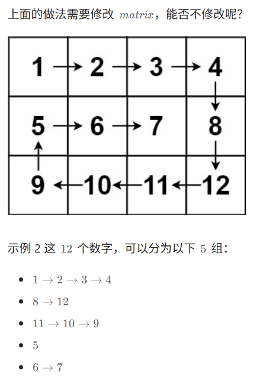
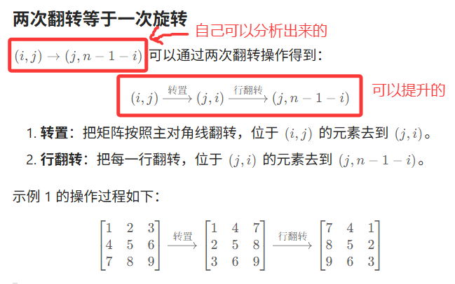
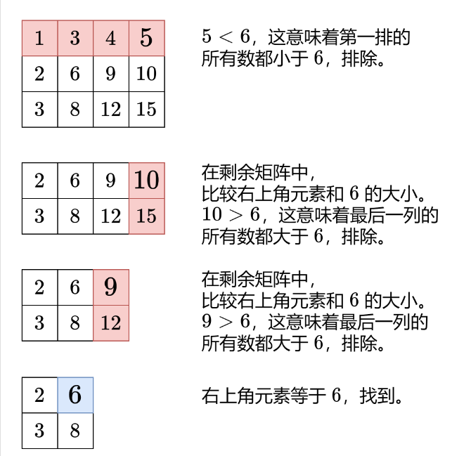
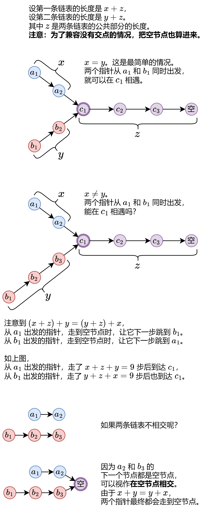
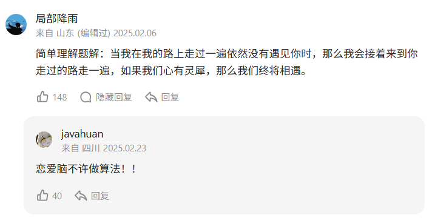
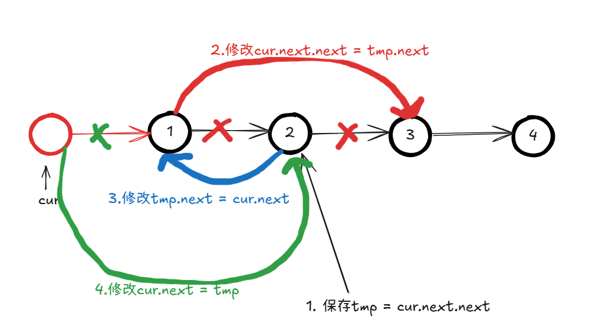
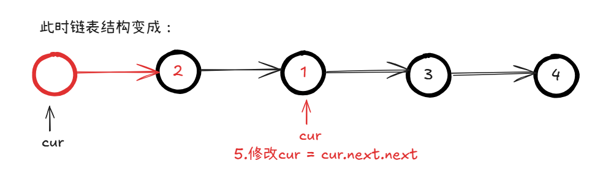

# 	HOT 100 INDEX

> 二轮 ing
>
> 【建议强化】>【小有坎坷】>【无标签】

## day1

- [x] [1. 两数之和](https://leetcode.cn/problems/two-sum/)
- [x] [49. 字母异位词分组](https://leetcode.cn/problems/group-anagrams/)【建议强化】
- [x] [128. 最长连续序列](https://leetcode.cn/problems/longest-consecutive-sequence/)
- [x] [283. 移动零](https://leetcode.cn/problems/move-zeroes/)
- [x] [11. 盛最多水的容器](https://leetcode.cn/problems/container-with-most-water/)【建议强化】
- [x] [15. 三数之和](https://leetcode.cn/problems/3sum/)
- [x] [42. 接雨水](https://leetcode.cn/problems/trapping-rain-water/)
- [x] [3. 无重复字符的最长子串](https://leetcode.cn/problems/longest-substring-without-repeating-characters/)【建议强化】

## day2

- [x] [438. 找到字符串中所有字母异位词](https://leetcode.cn/problems/find-all-anagrams-in-a-string/)【建议强化】
- [x] [560. 和为 K 的子数组](https://leetcode.cn/problems/subarray-sum-equals-k/)【建议强化】
- [x] [239. 滑动窗口最大值](https://leetcode.cn/problems/sliding-window-maximum/)【建议强化】
- [x] [76. 最小覆盖子串](https://leetcode.cn/problems/minimum-window-substring/)【建议强化】
- [x] [53. 最大子数组和](https://leetcode.cn/problems/maximum-subarray/)
- [x] [56. 合并区间](https://leetcode.cn/problems/merge-intervals/)
- [x] [189. 轮转数组](https://leetcode.cn/problems/rotate-array/)【建议强化】
- [x] [238. 除自身以外数组的乘积](https://leetcode.cn/problems/product-of-array-except-self/)【建议强化】

## day3

- [x] [41. 缺失的第一个正数](https://leetcode.cn/problems/first-missing-positive/)【小有坎坷】
- [x] [73. 矩阵置零](https://leetcode.cn/problems/set-matrix-zeroes/)【建议强化】
- [x] [54. 螺旋矩阵](https://leetcode.cn/problems/spiral-matrix/)【小有坎坷】
- [x] [48. 旋转图像](https://leetcode.cn/problems/rotate-image/)
- [x] [240. 搜索二维矩阵 II](https://leetcode.cn/problems/search-a-2d-matrix-ii/)
- [x] [160. 相交链表](https://leetcode.cn/problems/intersection-of-two-linked-lists/)
- [x] [206. 反转链表](https://leetcode.cn/problems/reverse-linked-list/)
- [x] [234. 回文链表](https://leetcode.cn/problems/palindrome-linked-list/)

## day4

- [x] [141. 环形链表](https://leetcode.cn/problems/linked-list-cycle/)
- [x] [142. 环形链表 II](https://leetcode.cn/problems/linked-list-cycle-ii/)
- [x] [21. 合并两个有序链表](https://leetcode.cn/problems/merge-two-sorted-lists/)
- [x] [2. 两数相加](https://leetcode.cn/problems/add-two-numbers/)
- [x] [19. 删除链表的倒数第 N 个结点](https://leetcode.cn/problems/remove-nth-node-from-end-of-list/)【建议强化】
- [x] [24. 两两交换链表中的节点](https://leetcode.cn/problems/swap-nodes-in-pairs/)【小有坎坷】
- [x] [25. K 个一组翻转链表](https://leetcode.cn/problems/reverse-nodes-in-k-group/)【建议强化】
- [x] [138. 随机链表的复制](https://leetcode.cn/problems/copy-list-with-random-pointer/)

## day5

- [x] [148. 排序链表](https://leetcode.cn/problems/sort-list/)【建议强化】
- [x] [23. 合并 K 个升序链表](https://leetcode.cn/problems/merge-k-sorted-lists/)
- [x] [146. LRU 缓存](https://leetcode.cn/problems/lru-cache/)<span style="color:#FF0000;">【建议强化】</span>
- [x] [94. 二叉树的中序遍历](https://leetcode.cn/problems/binary-tree-inorder-traversal/)
- [x] [104. 二叉树的最大深度](https://leetcode.cn/problems/maximum-depth-of-binary-tree/)
- [x] [226. 翻转二叉树](https://leetcode.cn/problems/invert-binary-tree/)【小有坎坷】
- [x] [101. 对称二叉树](https://leetcode.cn/problems/symmetric-tree/)
- [x] [543. 二叉树的直径](https://leetcode.cn/problems/diameter-of-binary-tree/)【建议强化】

## day6

- [x] [102. 二叉树的层序遍历](https://leetcode.cn/problems/binary-tree-level-order-traversal/)
- [x] [108. 将有序数组转换为二叉搜索树](https://leetcode.cn/problems/convert-sorted-array-to-binary-search-tree/)
- [x] [98. 验证二叉搜索树](https://leetcode.cn/problems/validate-binary-search-tree/)【建议强化】
- [x] [230. 二叉搜索树中第 K 小的元素](https://leetcode.cn/problems/kth-smallest-element-in-a-bst/)【小有坎坷】
- [x] [199. 二叉树的右视图](https://leetcode.cn/problems/binary-tree-right-side-view/)
- [x] [114. 二叉树展开为链表](https://leetcode.cn/problems/flatten-binary-tree-to-linked-list/)【小有坎坷】
- [x] [105. 从前序与中序遍历序列构造二叉树](https://leetcode.cn/problems/construct-binary-tree-from-preorder-and-inorder-traversal/)
- [x] [437. 路径总和 III](https://leetcode.cn/problems/path-sum-iii/)<span style="color:#FF0000;">【建议强化】</span>

## day7

- [x] [236. 二叉树的最近公共祖先](https://leetcode.cn/problems/lowest-common-ancestor-of-a-binary-tree/)<span style="color:#FF0000;">【建议强化】</span>
- [x] [124. 二叉树中的最大路径和](https://leetcode.cn/problems/binary-tree-maximum-path-sum/)<span style="color:#FF0000;">【建议强化】</span>
- [x] [200. 岛屿数量](https://leetcode.cn/problems/number-of-islands/)
- [x] [994. 腐烂的橘子](https://leetcode.cn/problems/rotting-oranges/)【小有坎坷】
- [x] [207. 课程表](https://leetcode.cn/problems/course-schedule/)
- [x] [208. 实现 Trie (前缀树)](https://leetcode.cn/problems/implement-trie-prefix-tree/)
- [x] [46. 全排列](https://leetcode.cn/problems/permutations/)
- [x] [78. 子集](https://leetcode.cn/problems/subsets/)

## day8

- [x] [17. 电话号码的字母组合](https://leetcode.cn/problems/letter-combinations-of-a-phone-number/)
- [x] [39. 组合总和](https://leetcode.cn/problems/combination-sum/)
- [x] [22. 括号生成](https://leetcode.cn/problems/generate-parentheses/)
- [x] [79. 单词搜索](https://leetcode.cn/problems/word-search/)
- [x] [131. 分割回文串](https://leetcode.cn/problems/palindrome-partitioning/)
- [x] [51. N 皇后](https://leetcode.cn/problems/n-queens/)
- [x] [35. 搜索插入位置](https://leetcode.cn/problems/search-insert-position/)
- [x] [74. 搜索二维矩阵](https://leetcode.cn/problems/search-a-2d-matrix/)

## day9

- [x] [34. 在排序数组中查找元素的第一个和最后一个位置](https://leetcode.cn/problems/find-first-and-last-position-of-element-in-sorted-array/)

- [x] [33. 搜索旋转排序数组](https://leetcode.cn/problems/search-in-rotated-sorted-array/)
- [x] [153. 寻找旋转排序数组中的最小值](https://leetcode.cn/problems/find-minimum-in-rotated-sorted-array/)
- [x] [4. 寻找两个正序数组的中位数](https://leetcode.cn/problems/median-of-two-sorted-arrays/)
- [x] [20. 有效的括号](https://leetcode.cn/problems/valid-parentheses/)
- [x] [155. 最小栈](https://leetcode.cn/problems/min-stack/)
- [x] [394. 字符串解码](https://leetcode.cn/problems/decode-string/)
- [x] [739. 每日温度](https://leetcode.cn/problems/daily-temperatures/)

## day10

- [x] [84. 柱状图中最大的矩形](https://leetcode.cn/problems/largest-rectangle-in-histogram/)

- [x] [215. 数组中的第 K 个最大元素](https://leetcode.cn/problems/kth-largest-element-in-an-array/)
- [x] [347. 前 K 个高频元素](https://leetcode.cn/problems/top-k-frequent-elements/)
- [x] [295. 数据流的中位数](https://leetcode.cn/problems/find-median-from-data-stream/)
- [x] [121. 买卖股票的最佳时机](https://leetcode.cn/problems/best-time-to-buy-and-sell-stock/)
- [x] [55. 跳跃游戏](https://leetcode.cn/problems/jump-game/)
- [x] [45. 跳跃游戏 II](https://leetcode.cn/problems/jump-game-ii/)
- [x] [763. 划分字母区间](https://leetcode.cn/problems/partition-labels/)

## day11

- [x] [70. 爬楼梯](https://leetcode.cn/problems/climbing-stairs/)

- [x] [118. 杨辉三角](https://leetcode.cn/problems/pascals-triangle/)
- [x] [198. 打家劫舍](https://leetcode.cn/problems/house-robber/)
- [x] [279. 完全平方数](https://leetcode.cn/problems/perfect-squares/)
- [x] [322. 零钱兑换](https://leetcode.cn/problems/coin-change/)
- [x] [139. 单词拆分](https://leetcode.cn/problems/word-break/)
- [x] [300. 最长递增子序列](https://leetcode.cn/problems/longest-increasing-subsequence/)
- [x] [152. 乘积最大子数组](https://leetcode.cn/problems/maximum-product-subarray/)

## day12

- [x] [416. 分割等和子集](https://leetcode.cn/problems/partition-equal-subset-sum/)
- [x] [32. 最长有效括号](https://leetcode.cn/problems/longest-valid-parentheses/)
- [ ] [62. 不同路径](https://leetcode.cn/problems/unique-paths/)
- [ ] [64. 最小路径和](https://leetcode.cn/problems/minimum-path-sum/)
- [ ] [5. 最长回文子串](https://leetcode.cn/problems/longest-palindromic-substring/)
- [ ] [1143. 最长公共子序列](https://leetcode.cn/problems/longest-common-subsequence/)
- [ ] [72. 编辑距离](https://leetcode.cn/problems/edit-distance/)
- [ ] [136. 只出现一次的数字](https://leetcode.cn/problems/single-number/)

## day13

- [ ] [169. 多数元素](https://leetcode.cn/problems/majority-element/)
- [ ] [75. 颜色分类](https://leetcode.cn/problems/sort-colors/)
- [ ] [31. 下一个排列](https://leetcode.cn/problems/next-permutation/)
- [ ] [287. 寻找重复数](https://leetcode.cn/problems/find-the-duplicate-number/)


# HOT 100

## [1. 两数之和](https://leetcode.cn/problems/two-sum/)

```java
public class Solution {
    public int[] twoSum(int[] nums, int target) {
        HashMap<Integer,Integer> map = new HashMap<>();
        for(int i=0;i<nums.length;i++){
            if(map.containsKey(target - nums[i])) return new int[]{i,map.get(target-nums[i])};
            else map.put(nums[i],i);
        }
        return new int[0];
    }
}
```

## [49. 字母异位词分组](https://leetcode.cn/problems/group-anagrams/)

```java
class Solution {
    public List<List<String>> groupAnagrams(String[] strs) {
        HashMap<String,List<String>> map = new HashMap<>();
        for(int i=0;i<strs.length;i++){
            String oldStr = strs[i];
            map.computeIfAbsent(sortString(oldStr),k->new LinkedList<String>()).add(oldStr);
        }
        List<List<String>> res = new LinkedList<>();
        for(Map.Entry<String,List<String>> entry : map.entrySet()){
            List<String> tmp = entry.getValue();
            res.add(tmp);
        }
        return res;
    }

    private String sortString(String s){
        char[] chars = s.toCharArray();
        Arrays.sort(chars);
        return new String(chars);
    }
}
```

## [128. 最长连续序列](https://leetcode.cn/problems/longest-consecutive-sequence/)

```java
class Solution {
    public int longestConsecutive(int[] nums) {
        
        int res = 0;
        Set<Integer> set = new HashSet<>();
        for(int num : nums){
            set.add(num);
        }
        
        for(int num : set){
            if(!set.contains(num-1)){
                int cnt = 1;
                int curNum = num;
                while(set.contains(curNum+1)){
                    cnt++;
                    curNum++;
                }
                res = Math.max(res,cnt);
            }
        }
        return res;
    }
}
```

## [283. 移动零](https://leetcode.cn/problems/move-zeroes/)

> 是我脑子抽了才写出下面的代码……（想复杂了）
>
> 我定义的 l 是“指向零”、r 是指向“非零”……

```java
class Solution {
    public void moveZeroes(int[] nums) {
        int l=0,r=0;
        while(r<nums.length && l<nums.length){
            while(r<nums.length && nums[r] == 0) r++;
            while(l<nums.length && nums[l] != 0) l++;
            if(l == nums.length || r == nums.length) break;
            if(r > l){
                nums[l] = nums[r];
                nums[r] = 0;
            }
            r++;
        }
    }
}
```

直接这样定义：

left 为已处理好的数组的下一位（填非零用的）、right 指向下一个非零数

```java
class Solution {
    public void moveZeroes(int[] nums) {
        int left = 0,right = 0;
        int n =nums.length;
        while(right < n){
            if(nums[right] != 0){
                int tmp = nums[left];
                nums[left] = nums[right];
                nums[right] = tmp;
                left++;
            }
            right++;
        }
    }
}
```

## [11. 盛最多水的容器](https://leetcode.cn/problems/container-with-most-water/)

```java
class Solution {
    public int maxArea(int[] height) {
        int l = 0,r = height.length-1;
        int res = 0;
        while(l < r){
            int area = (r-l) * Math.min(height[l],height[r]);
            res = Math.max(res,area);
            if(height[l] < height[r]) l++;
            else r--;
        }
        return res;
    }
}
```

## [15. 三数之和](https://leetcode.cn/problems/3sum/)

```java
class Solution {
    public List<List<Integer>> threeSum(int[] nums) {
        List<List<Integer>> res = new LinkedList<>();

        Arrays.sort(nums);
        int n = nums.length;
        for(int i=0;i<n-2;i++){
            int x = nums[i];
            if(i>0 && nums[i] == nums[i-1]) continue;//跳过重复数字
            if(x + nums[i+1] + nums[i+2] > 0) break;//优化1
            if(x + nums[n-2] + nums[n-1] < 0) continue;//优化2
            int j = i+1;
            int k=n-1;
            while(j < k){
                int sum = x + nums[j] + nums[k];
                if(sum < 0) j++;
                else if(sum > 0) k--;
                else{
                    res.add(List.of(x,nums[j],nums[k]));
                    for(j++;j<k && nums[j] == nums[j-1];j++);
                    for(k--;k>j && nums[k] == nums[k+1];k--);
                }
            }
        }
        return res;
    }
}
```

## [42. 接雨水](https://leetcode.cn/problems/trapping-rain-water/)

双指针秒了

```java
class Solution {
    public int trap(int[] height) {
        int res = 0;
        int[] maxLeftIndex = new int[height.length];//左边最高的下标
        int[] maxRightIndex = new int[height.length];//右边最高的下标
        maxLeftIndex[0] = -1;
        int leftIndex = 0;
        for(int i=1;i<height.length;i++){
            maxLeftIndex[i] = leftIndex;
            if(height[i] > height[leftIndex]) leftIndex = i;
        }
        maxRightIndex[height.length-1] = height.length;
        int rightIndex = height.length-1;
        for(int i=height.length-2;i>=0;i--){
            maxRightIndex[i] = rightIndex;
            if(height[i] > height[rightIndex]) rightIndex = i;
        }
        for(int i=1;i<=height.length-2;i++){
            int rain = Math.min(height[maxLeftIndex[i]],height[maxRightIndex[i]]) - height[i];
            if(rain > 0) res += rain;
        }
        return res;
    }
}
```

## [3. 无重复字符的最长子串](https://leetcode.cn/problems/longest-substring-without-repeating-characters/)

经典的滑动窗口题（使用了 Set 的数据结构辅助）

```java
class Solution {
    public int lengthOfLongestSubstring(String s) {
        int res = 0;
        Set<Character> set = new HashSet<>();
        char[] chars = s.toCharArray();
        int l=0,r=0;
        int len = 0;
        while(r < chars.length){
            if(!set.contains(chars[r])){
                set.add(chars[r]);
                len++;
                r++;
            }else{
                res = Math.max(res,len);
                set.remove(chars[l]);
                len--;
                l++;
            }
        }
        res = Math.max(res,len);
        return res;
    }
}
```

## [438. 找到字符串中所有字母异位词](https://leetcode.cn/problems/find-all-anagrams-in-a-string/)

由于是要找异位词，先用 pChars 记录 p 中所有出现字母的个数（题目所说是 26 个小写字母）

之后用滑动窗口思想——l 是子串的起始下标、r 是子串的结尾下标，闭区间 `[l,r]`。

每次滑动 r，并且加入到当前子串已有的字符 sChars 中，若当前字母小于 pChars 字符数，则继续比对。

若当前字母等于了（那么加入当前 s [i] 后就是大于），则要开始滑动 l，直到 sChars 小于等于 pChars 为止。

```java
class Solution {
    public List<Integer> findAnagrams(String s, String p) {
        List<Integer> res = new LinkedList<>();

        int[] pChars = new int[26];
        for(int i=0;i<p.length();i++){
            pChars[p.charAt(i) - 'a']++;
        }
        int targetLen = p.length();
        int len = 0;
        int l=0,r=0;
        int[] sChars = new int[26];
        while(r<s.length()){
            int cur = s.charAt(r) - 'a';
            if(sChars[cur] < pChars[cur]) {
                sChars[cur]++;
                len++;
                if(len == targetLen){
                    res.add(l);
                    sChars[s.charAt(l)-'a']--;
                    l++;
                    len--;
                }
            }else{
                sChars[cur]++;
                len++;
                while(sChars[cur] > pChars[cur]){
                    sChars[s.charAt(l)-'a']--;
                    l++;
                    len--;
                }
            }
            r++;
        }
        return res;
    }
}
```

### 法 2

利用 cnt 和 less 变量来解：

cnt：定义为 p 中各个字母的出现次数 - 遍历的 s 中字母出现次数

less：定义为 p 中还有多少个字母还“不够”

```java
class Solution {
    public List<Integer> findAnagrams(String s, String p) {
        List<Integer> res = new LinkedList<>();
        int[] cnt = new int[26]; //定义为pch - sch
        int less = 0;//pch还剩几个字母没被sch“覆盖”
        char[] sch = s.toCharArray();
        char[] pch = p.toCharArray();
        for (int i = 0; i < pch.length; i++) {
            if (cnt[pch[i] - 'a'] == 0) {
                less++;
            }
            cnt[pch[i] - 'a']++;
        }
        int l = 0;
        for (int r = 0; r < sch.length; r++) {
            cnt[sch[r] - 'a']--;
            int k = cnt[sch[r] - 'a'];
            if(k == 0){
                less--;
            }else if(k < 0){
                //说明此时l开始必定没有异位词
                while(cnt[sch[r] - 'a'] < 0){
                    if(cnt[sch[l] - 'a'] == 0){
                        less++;
                    }
                    cnt[sch[l] - 'a']++;
                    l++;
                }
            }
            if(less == 0){
                res.add(l);
                cnt[sch[l] - 'a']++;
                l++;
                less++;
            }
        }
        return res;
    }
}
```


## [560. 和为 K 的子数组](https://leetcode.cn/problems/subarray-sum-equals-k/)

前缀和+哈希表（两数之和的思想应用）

```java
class Solution {
    public int subarraySum(int[] nums, int k) {
        int ans = 0;
        int[] prefix = new int[nums.length+1];
        for(int i=0;i<nums.length;i++) prefix[i+1] = prefix[i] + nums[i];

        HashMap<Integer,Integer> cnt = new HashMap<>();
        for(int prefixj : prefix){
            ans += cnt.getOrDefault(prefixj-k,0);
            //相当于cnt.put(prefixj,cnt.getOrDefault(prefixj,0)+1);去增加这个出现次数
            cnt.merge(prefixj,1,Integer::sum);
        }
        return ans;
    }
}
```

## [239. 滑动窗口最大值](https://leetcode.cn/problems/sliding-window-maximum/)

哈希表+优先队列惰性删除

- 哈希表用于记录当前窗口内出现数字次数
- 优先队列为大根堆
- 每次滑动——添新值、删无效值（惰性的，因为我们只关心最大值是否改变）
- 取优先队列.peek()作为当前答案

```java
class Solution {
    public int[] maxSlidingWindow(int[] nums, int k) {
        int[] ans = new int[nums.length-k+1];
        HashMap<Integer,Integer> numToCnt = new HashMap<>();
        PriorityQueue<Integer> maxNums = new PriorityQueue<>((a,b)->b-a);
        for(int i=0;i<k;i++){
            numToCnt.merge(nums[i],1,Integer::sum);
            maxNums.add(nums[i]);
        }
        ans[0] = maxNums.peek();
        for(int i=k;i<nums.length;i++){
            //窗口滑动、添新值
            numToCnt.merge(nums[i],1,Integer::sum);
            maxNums.add(nums[i]);
            //窗口滑动、删无效值
            numToCnt.merge(nums[i-k],-1,Integer::sum);
            while(numToCnt.get(maxNums.peek()) == 0) maxNums.poll();//惰性删除无效数据
            ans[i-k+1] = maxNums.peek();
        }
        return ans;
    }
}

```

### 法 2：单调队列

**单调队列套路**

1. 右边入（元素进入 **队尾**，同时维护队列 **单调性**）
2. 左边出（元素离开 **队首**）
3. 记录/维护答案（根据 **队首**）

```java
class Solution {
    public int[] maxSlidingWindow(int[] nums, int k) {
        int[] ans = new int[nums.length - k + 1];
        Deque<Integer> q = new ArrayDeque<>();//递减
        for(int i=0;i<nums.length;i++){
            //1.右边入
            while(!q.isEmpty() && nums[q.getLast()] <= nums[i]){
                q.removeLast();
            }
            q.addLast(i);
			//2.左边出
            int left = i-k+1;
            if(q.getFirst() < left) q.removeFirst();
            //3.记录答案
            if(left >= 0){
                ans[left] = nums[q.getFirst()];
            }
        }
        
        return ans;
    }
}

```

## [76. 最小覆盖子串](https://leetcode.cn/problems/minimum-window-substring/)

思路是 **滑动窗口**，[l, r] 区间

想清楚要记什么数据比较重要——比如 subLen（s 中子串长度）、matchLen（匹配长度）、tCharsToCnt（t 中每个字符数量）、sCharsToCnt（s 子串中匹配的字符数量、代码中没匹配的就没记）

用于记录答案——startIndex、minLen

```java
class Solution {
    public String minWindow(String s, String t) {
        HashMap<Character,Integer> tCharsToCnt = new HashMap<>();
        int subLen = 0;//s的子串长度
        int matchLen = 0;//匹配长度
        int targetLen = t.length();
        HashMap<Character,Integer> sCharsToCnt = new HashMap<>();//记录s子串匹配字符的个数
        for(char c : t.toCharArray()){
            tCharsToCnt.merge(c,1,Integer::sum);
        }
        int l=0,r=0;
        int n = s.length();
        char[] sChars = s.toCharArray();
        int minLen = Integer.MAX_VALUE;
        int startIndex = -1;
        while(r<n && matchLen < targetLen){
            subLen++;
            char chr = sChars[r];
            if(tCharsToCnt.containsKey(chr)){
                if(sCharsToCnt.getOrDefault(chr,0) < tCharsToCnt.get(chr)){
                    matchLen++;
                }
                sCharsToCnt.merge(chr,1,Integer::sum);
            }
            
            while(matchLen == targetLen){
                char chl = sChars[l];
                if(!tCharsToCnt.containsKey(chl)){
                    subLen--;
                }else if(sCharsToCnt.getOrDefault(chl,0) > tCharsToCnt.get(chl)){
                    subLen--;
                    sCharsToCnt.merge(chl,-1,Integer::sum);
                }else{ //sCharsToCnt.get(chl) == tCharsToCnt.get(chl)
                    if(subLen < minLen){
                        startIndex = l;
                        minLen = subLen;
                    }
                    sCharsToCnt.merge(chl,-1,Integer::sum);
                    subLen--;
                    matchLen--;
                }
                l++;
            }
            r++;
        }
        return startIndex == -1 ? "" : s.substring(startIndex,startIndex+minLen);
    }
}
```

极致优化写法（灵神思路）：

```java
class Solution {
    public String minWindow(String s, String t) {
        int[] cnt = new int[128];//定义为sCnt[x] - tCnt[x]（x为s和t中存在的字符）
        int less = 0;//t中不同字符个数
        char[] tChars = t.toCharArray();
        for(char ch : tChars){
            if(cnt[ch] == 0) less++;
            cnt[ch]++;
        }

        char[] sChar = s.toCharArray();
        int m = s.length();
        int ansLeft = -1,ansRight = m;
        int l = 0,r = 0;
        while(r<m){
            char ch = sChar[r];
            cnt[ch]--;//右端点字母入子串
            if(cnt[ch] == 0){
                less--;
            }
            while(less == 0){ //涵盖：所有字母的出现次数都是>=
                if(r - l < ansRight - ansLeft){
                    ansLeft = l;
                    ansRight = r;
                }
                char x = sChar[l];
                if(cnt[x] == 0){
                    less++;
                }
                cnt[x]++;
                l++;
            }
            r++;
        }
        return ansLeft < 0 ? "" : s.substring(ansLeft,ansRight+1);
    }
}
```

## [53. 最大子数组和](https://leetcode.cn/problems/maximum-subarray/)

贪心，只要目前子数组之和大于（等于）零，就尝试不断加入下一个。一旦小于零（则 sum 重新开始计算）

```java
class Solution {
    public int maxSubArray(int[] nums) {
        int res = Integer.MIN_VALUE;
        int sum = 0;
        for(int num:nums){
            sum += num;
            if(res < sum) res = sum;
            if(sum < 0) sum = 0;
        }
        return res;
    }
}
```

## [56. 合并区间](https://leetcode.cn/problems/merge-intervals/)

```java
class Solution {
    public int[][] merge(int[][] intervals) {
        Arrays.sort(intervals,(a,b)->a[0]==b[0] ? a[1]-b[1] : a[0]-b[0]);
        List<int[]> res = new LinkedList<>();
        int start = intervals[0][0],end = intervals[0][1];
        for(int[] interval : intervals){
            if(end >= interval[0]){
                end = Math.max(end,interval[1]);
            }else{
                res.add(new int[]{start,end});
                start = interval[0];
                end = interval[1];
            }
        }
        res.add(new int[]{start,end});
        return res.toArray(new int[res.size()][]);
    }
}
```

## [189. 轮转数组](https://leetcode.cn/problems/rotate-array/)

### 法 1：使用额外空间

```java
class Solution {
    public void rotate(int[] nums, int k) {
        int n = nums.length;
        int[] ans = new int[n];
        k = k % n;
        if(k == 0)  return;
        for(int i=0;i<n;i++){
            ans[(i+k)%n] = nums[i];
        }
        for(int i=0;i<n;i++) nums[i] = ans[i];
    }
}
```

### 法 2：三次反转

> 只用到 1 个额外空间

证明：

假设原数组 = A + B，A 就是 [1,2,3,4]，B 就是 [5,6,7]（k = 3）

那么将整个数组反转，变为 rev(B)+rev(A)，再对 rev(B)、rev(A)反转，也就是——rev(rev(B))= B、rev(rev(A))= A。得到最终答案 B + A。

```java
class Solution {
    public void rotate(int[] nums, int k) {
        int n = nums.length;
        k %= n; // 轮转 k 次等于轮转 k % n 次
        reverse(nums, 0, n - 1);
        reverse(nums, 0, k - 1);
        reverse(nums, k, n - 1);
    }

    private void reverse(int[] nums, int i, int j) {
        while (i < j) {
            int temp = nums[i];
            nums[i++] = nums[j];
            nums[j--] = temp;
        }
    }
}
```

### 法 3：环状替换

- 可以证明环的个数为 gcd(n, k)
- 只用到了 1 个额外空间

```java
class Solution {
    public void rotate(int[] nums, int k) {
        int n = nums.length;
        k = k % n;
        int count = gcd(k, n);
        for (int start = 0; start < count; ++start) {
            int current = start;
            int prev = nums[start];
            do {
                int next = (current + k) % n;
                int temp = nums[next];
                nums[next] = prev;
                prev = temp;
                current = next;
            } while (start != current);
        }
    }

    public int gcd(int x, int y) {
        return y > 0 ? gcd(y, x % y) : x;
    }
}

```

## [238. 除自身以外数组的乘积](https://leetcode.cn/problems/product-of-array-except-self/)

### 法 1：前缀后缀数组

```java
class Solution {
    public int[] productExceptSelf(int[] nums) {
        int n = nums.length;
        int[] pre = new int[n];
        
        pre[0] = 1;
        for(int i=1;i<n;i++){
            pre[i] = pre[i-1] * nums[i-1];
        }
        int[] suf = new int[n];
        suf[n-1] = 1;
        for(int i=n-2;i>=0;i--){
            suf[i] = suf[i+1] * nums[i+1];
        }
        int[] ans = new int[n];
        for(int i=0;i<n;i++){
            ans[i] = pre[i] * suf[i];
        }
        return ans;
    }
}
```

### 优化

先 suf 后缀，前缀可以在遍历时计算

```java
class Solution {
    public int[] productExceptSelf(int[] nums) {
        int n = nums.length;
        int[] suf = new int[n];
        suf[n-1] = 1;
        for(int i=n-2;i>=0;i--){
            suf[i] = suf[i+1] * nums[i+1];
        }
        int pre = 1;
        for(int i=0;i<n;i++){
            suf[i] *= pre;
            pre *= nums[i];
        }
        return suf;
    }
}
```

## [41. 缺失的第一个正数](https://leetcode.cn/problems/first-missing-positive/)

### 自写

```java
class Solution {
    public int firstMissingPositive(int[] nums) {
        int min = Integer.MAX_VALUE;
        int max = 0;
        HashSet<Integer> set = new HashSet<>();
        for(int num : nums){
            if(num <= 0) continue;
            if(min > num) min = num;
            if(max < num) max = num;
            set.add(num);
        }
        if(min > 1) return 1;
        for(int i=min+1;i<=max;i++){
            if(!set.contains(i)) return i;
        }
        return max+1;
    }
}
```

### 换座位思想

```java
class Solution {
    public int firstMissingPositive(int[] nums) {
        int n = nums.length;
        for (int i = 0; i < n; i++) {
            // 如果当前学生的学号在 [1,n] 中，但（真身）没有坐在正确的座位上
            while (1 <= nums[i] && nums[i] <= n && nums[i] != nums[nums[i] - 1]) {
                // 那么就交换 nums[i] 和 nums[j]，其中 j 是 i 的学号
                int j = nums[i] - 1; // 减一是因为数组下标从 0 开始
                int tmp = nums[i];
                nums[i] = nums[j];
                nums[j] = tmp;
            }
        }

        // 找第一个学号与座位编号不匹配的学生
        for (int i = 0; i < n; i++) {
            if (nums[i] != i + 1) {
                return i + 1;
            }
        }

        // 所有学生都坐在正确的座位上
        return n + 1;
    }
}
```

## [73. 矩阵置零](https://leetcode.cn/problems/set-matrix-zeroes/)

使用两个一维数组，用来记录某行或某列是否要被设置为 0

```java
class Solution {
    public void setZeroes(int[][] matrix) {
        int m = matrix.length;
        int n =matrix[0].length;
        boolean[] rows = new boolean[m];
        boolean[] cows = new boolean[n];
        for(int i=0;i<m;i++){
            for(int j=0;j<n;j++){
                if(matrix[i][j] == 0){
                    rows[i] = true;
                    cows[j] = true;
                }
            }
        }
        for(int i=0;i<m;i++){
            for(int j=0;j<n;j++){
                if(rows[i] || cows[j]) matrix[i][j] = 0;
            }
        }
    }
}
```

空间上的优化：使用原数组的第 0 列（记录某行应该被设置为 0）和第 0 行（记录某列是否要被设置为 0）作为标记

```java
class Solution {
    public void setZeroes(int[][] matrix) {
        int m = matrix.length, n = matrix[0].length;
        boolean flagCol0 = false, flagRow0 = false;
        for(int i=0;i<m;i++){
            if(matrix[i][0] == 0) flagCol0 = true;
        }
        for(int j=0;j<n;j++){
            if(matrix[0][j] == 0) flagRow0 = true;
        }
        for(int i=1;i<m;i++){
            for(int j=1;j<n;j++){
                if(matrix[i][j] == 0){
                    matrix[i][0] = matrix[0][j] = 0;
                }
            }
        }
        for(int i=1;i<m;i++){
            for(int j=1;j<n;j++){
                if(matrix[i][0] == 0 || matrix[0][j] == 0){
                    matrix[i][j] = 0;
                }
            }
        }
        if(flagCol0){
            for(int i=0;i<m;i++) matrix[i][0] = 0;
        }
        if(flagRow0){
            for(int j=0;j<n;j++) matrix[0][j] = 0;
        }
    }
}
```

## [54. 螺旋矩阵](https://leetcode.cn/problems/spiral-matrix/)

### 法 1：标记法

用 DIRS 作为下一次的行进方向、用 Integer.MAX_VALUE 作为标志位（已访问）

```java
class Solution {
    private static final int[][] DIRS = {{0,1},{1,0},{0,-1},{-1,0}};
    public List<Integer> spiralOrder(int[][] matrix) {
        int i=0,j=0;
        int m=matrix.length,n=matrix[0].length;
        int di = 0;
        List<Integer> ans = new LinkedList<Integer>();
        for(int k=0;k<m*n;k++){
            ans.add(matrix[i][j]);
            matrix[i][j] = Integer.MAX_VALUE;
            int x = i+DIRS[di][0];
            int y = j+DIRS[di][1];
            if(x >= m || x<0 || y>=n || y<0 || matrix[x][y] == Integer.MAX_VALUE){
                di = (di+1)%4;//右转90°
                x = i+DIRS[di][0];
                y = j+DIRS[di][1];
            }
            i = x;
            j = y;
        }
        return ans;
    }
}
```

### 法 2：不标记

> 但要精准控制每次的步数

> 以下摘自灵神题解



第一组、第三组、第五组分别走 4、3、2 步；第二组、第四组分别走 2、1 步。总共走了 m*n 步。

一般化就是——右走 n 步、下走 m-1 步、左走 n-1 步、上走 m-2 步

最后右走 n-2 步（结束，至此总共走了 m*n 步）

其中的这几步写法有点巧……

```java
int tmp = n;
n = m - 1;//下一次走m-1步
m = tmp;
```

解法：

```java
class Solution {
    private static final int[][] DIRS = {{0,1},{1,0},{0,-1},{-1,0}};
    public List<Integer> spiralOrder(int[][] matrix) {
        int m=matrix.length,n=matrix[0].length;
        List<Integer> ans = new LinkedList<Integer>();
        int size = m*n;
        int i=0,j=-1;//从（0，-1开始）
        for(int di=0;ans.size()<size;di = (di+1)%4){
            for(int k=0;k<n;k++){//走n步
                i += DIRS[di][0];
                j += DIRS[di][1];
                ans.add(matrix[i][j]);
            }
            int tmp = n;
            n = m - 1;//下一次走m-1步
            m = tmp;
        }
        return ans;
    }
}
```

## [48. 旋转图像](https://leetcode.cn/problems/rotate-image/)

### 法 1：使用辅助空间

```java
class Solution {
    public void rotate(int[][] matrix) {
        int n = matrix.length;
        int[][] ans = new int[n][n];
        for(int i=0;i<n;i++){
            for(int j=0;j<n;j++){
                ans[j][n-1-i] = matrix[i][j];
            }
        }
        for(int i=0;i<n;i++){
            for(int j=0;j<n;j++){
                matrix[i][j] = ans[i][j];
            }
        }
    }
}
```

### 法 2：旋转

```java
class Solution {
    public void rotate(int[][] matrix) {
        int n = matrix.length;
        //始终根据公式 [i][j] -> [j][n-1-i]（每四个组成一组循环）
        for (int i = 0; i < n / 2; ++i) {
            for (int j = 0; j < (n + 1) / 2; ++j) {
                int temp = matrix[i][j];
                matrix[i][j] = matrix[n-1-j][i];
                matrix[n-1-j][i] = matrix[n-1-i][n-1-j];
                matrix[n-1-i][n-1-j] = matrix[j][n-1-i];
                matrix[j][n-1-i] = temp;
            }
        }
    }
}
```

### 法 3：翻转

>  来自灵神题解——数学本质：两次翻转等于一次旋转



```java
class Solution {
    public void rotate(int[][] matrix) {
        int n = matrix.length;
        //1.转置
        for(int i=0;i<n;i++){
            for(int j=0;j<i;j++){
                int temp = matrix[i][j];
                matrix[i][j] = matrix[j][i];
                matrix[j][i] = temp;
            }
        }
        //2.行翻转
        for(int i=0;i<n;i++){
           for(int j=0;j<n/2;j++){
            int tmp = matrix[i][j];
            matrix[i][j] = matrix[i][n-1-j];
            matrix[i][n-1-j] = tmp;
           }
        }
    }
}
```

## [240. 搜索二维矩阵 II](https://leetcode.cn/problems/search-a-2d-matrix-ii/)

### 自写：记忆化搜索

```java
class Solution {
    int m = 0;
    int n = 0;
    boolean[][] dp;
    boolean[][] vis;
    public boolean searchMatrix(int[][] matrix, int target) {
        m = matrix.length;
        n = matrix[0].length;
        dp = new boolean[m][n];
        vis = new boolean[m][n];
        return backtracking(matrix,0,0,target);
    }

    private boolean backtracking(int[][] matrix,int x,int y,int target){
        if(matrix[x][y] == target) return true;
        if(vis[x][y]) return dp[x][y];
        int nx = x + 1;
        int ny = y + 1;
        if(nx < m && matrix[nx][y] <= target) {
            if(backtracking(matrix,nx,y,target)) return true;
        }
        if(ny < n && matrix[x][ny] <= target) {
            if(backtracking(matrix,x,ny,target)) return true;
        }
        vis[x][y] = true;
        return dp[x][y] = false;
    }
}
```

### 多次二分

```java
class Solution {
    public boolean searchMatrix(int[][] matrix, int target) {
        int m = matrix.length,n = matrix[0].length;
        for(int i=0;i<m;i++){
            if(matrix[i][0] > target) return false;//优化
            int l=0,r=n-1;
            while(l<=r){
                int mid = l + (r - l) / 2;
                if(matrix[i][mid] == target) return true;
                else if(matrix[i][mid] > target) r = mid - 1;
                else l = mid + 1;
            }
        }
        return false;
    }
}
```

### 贪心（排除法）

> 来自灵神题解



口诀就是——小于删行、大于删列

```java
class Solution {
    public boolean searchMatrix(int[][] matrix, int target) {
        int r = 0;
        int c = matrix[0].length-1;
        while(r < matrix.length && c >= 0){
            if(matrix[r][c] < target) {
                r++;
            }
            else if(matrix[r][c] > target) {
                c--;
            }else return true;
        }
        return false;
    }
}
```

## [160. 相交链表](https://leetcode.cn/problems/intersection-of-two-linked-lists/)

### 法 1：利用 HashSet，分别遍历链表

```java
public class Solution {
    public ListNode getIntersectionNode(ListNode headA, ListNode headB) {
        HashSet<ListNode> set = new HashSet<>();
        while(headA != null){
            set.add(headA);
            headA = headA.next;
        }
        while(headB != null){
            if(set.contains(headB)) return headB;
            headB = headB.next;
        }
        return null;
    }
}
```

### 互走他路、分分合合、自有定数

> 来自灵神题解





```java
public class Solution {
    public ListNode getIntersectionNode(ListNode headA, ListNode headB) {
        ListNode p = headA;
        ListNode q = headB;
        while(p != q){
            p = p != null ? p.next : headB;
            q = q != null ? q.next : headA;
        }
        return p;
    }
}
```

## [206. 反转链表](https://leetcode.cn/problems/reverse-linked-list/)

### 头插法

```java
class Solution {
    public ListNode reverseList(ListNode head) {
        return reverse(null,head);
    }

    public ListNode reverse(ListNode prev, ListNode cur) {
        if(cur == null) return prev;
        ListNode next = cur.next;
        cur.next = prev;
        return reverse(cur,next);
    }
}
```

```java
class Solution {
    public ListNode reverseList(ListNode head) {

        ListNode next;
        ListNode prev = null;
        ListNode cur = head;
        while(cur != null) {
            next = cur.next;
            cur.next = prev; //把cur插在prev的前面（头插法）
            prev = cur;
            cur = next;
        }
        return prev;
    }
}
```

### 尾插法

```java
class Solution {
    // 首先「递」到链表末尾，把末尾节点作为新链表的头节点 revHead
    // 然后在「归」的过程中，把经过的节点依次插在新链表的末尾（尾插法）
    public ListNode reverseList(ListNode head) {
        // 判断 head == null 是为了兼容一开始链表就是空的情况
        if (head == null || head.next == null) {
            return head; // 链表末尾，即下面的 revHead
        }
        ListNode revHead = reverseList(head.next); // 「递」到链表末尾，拿到新链表的头节点
        ListNode tail = head.next; // 在「归」的过程中，head.next 就是新链表的末尾
        tail.next = head; // 把 head 插在新链表的末尾
        head.next = null; // 如果不写这行，新链表的末尾两个节点成环，这俩节点互相指向对方
        return revHead;
    }
}
```

## [234. 回文链表](https://leetcode.cn/problems/palindrome-linked-list/)

### 法 1：当成回文数组来做

```java
class Solution {
    public boolean isPalindrome(ListNode head) {
        ArrayList<Integer> arr = new ArrayList<>();
        while(head != null){
            arr.add(head.val);
            head = head.next;
        }
        int l =0,r=arr.size()-1;
        while(l < r){
            if(arr.get(l) != arr.get(r)) return false;
            l++;
            r--;
        }
        return true;
    }
}
```

### 法 2：寻找中间结点+链表反转+判断回文

```java
class Solution {
    public boolean isPalindrome(ListNode head) {
        ListNode mid = middleNode(head);
        ListNode tail = reverseList(mid);
        while(tail != null){
            if(head.val != tail.val) return false;
            head = head.next;
            tail = tail.next;
        }
        return true;
    }
    //中间节点
    private ListNode middleNode(ListNode head){
        ListNode slow = head;
        ListNode fast = head;
        while(fast != null && fast.next != null){
            slow = slow.next;
            fast = fast.next.next;
        }
        return slow;
    }
    //反转链表
    private ListNode reverseList(ListNode head){
        ListNode pre = null;
        ListNode cur = head;
        while(cur != null){
            ListNode next = cur.next;
            cur.next = pre;
            pre = cur;
            cur = next;
        }
        return pre;
    }
}
```

## [141. 环形链表](https://leetcode.cn/problems/linked-list-cycle/)

### 快慢指针

```java
public class Solution {
    public boolean hasCycle(ListNode head) {
        ListNode fast = head;
        ListNode slow = head;
        while(fast != null && fast.next != null){
            slow = slow.next;
            fast = fast.next.next;
            if(slow == fast) return true;
        }
        return false;
    }
}
```

## [142. 环形链表 II](https://leetcode.cn/problems/linked-list-cycle-ii/)

数学推导：

假设进环前的路程为 a，环长为 b。设慢指针走了 x 步时，快慢指针相遇，此时快指针走了 2x 步。显然 2x-x = nb（快指针比慢指针多走了 n 圈），即 x = nb。也就是说慢指针总共走过的路程是 nb，但这 nb 当中，实际上包含了进环前的一个小 a，因此慢指针在环中只走了 nb-a 步，它还得再往前走 a 步，才是完整的 n 圈。所以，我们让头节点和慢指针同时往前走，当他俩相遇时，就走过了最后这 a 步。

```java
public class Solution {
    public ListNode detectCycle(ListNode head) {
        ListNode fast = head,slow = head;
        while(fast != null && fast.next != null){
            slow = slow.next;
            fast = fast.next.next;
            if(slow == fast){
                while(head != slow){
                    head = head.next;
                    slow = slow.next;
                }
                return head;
            }
        }
        return null;
    }
}
```

## [21. 合并两个有序链表](https://leetcode.cn/problems/merge-two-sorted-lists/)

一看就懂、一写就废

```java
class Solution {
    public ListNode mergeTwoLists(ListNode list1, ListNode list2) {
        ListNode dummy = new ListNode();//哨兵节点作为头节点（简化逻辑）
        ListNode cur = dummy;
        while(list1 != null && list2 != null){
            if(list1.val < list2.val){
                cur.next = list1;
                list1 = list1.next;
            }else{
                cur.next = list2;
                list2 = list2.next;
            }
            cur = cur.next;
        }
        cur.next = list1 == null ? list2 : list1;//剩余的接入
        return dummy.next;
    }
}
```

## [2. 两数相加](https://leetcode.cn/problems/add-two-numbers/)

一看就懂、一写就废+1

```java
class Solution {
    public ListNode addTwoNumbers(ListNode l1, ListNode l2) {
        ListNode dummy = new ListNode();//哨兵节点作为头节点（简化逻辑）
        ListNode cur = dummy;
        int sum = 0;
        while(l1 != null && l2 != null){
            sum += l1.val + l2.val;
            l1.val = sum % 10;
            sum /= 10;
            cur.next = l1;
            l1 = l1.next;
            l2 = l2.next;
            cur = cur.next;
        }
        cur.next = l1 == null ? l2 : l1;
        while(sum != 0){
            if(cur.next != null){
                cur = cur.next;
                sum += cur.val;
                cur.val = sum % 10;
                sum /= 10;
            }else{
                cur.next = new ListNode(sum);
                sum = 0;
            }
        }
        return dummy.next;
    }
}
```

## [19. 删除链表的倒数第 N 个结点](https://leetcode.cn/problems/remove-nth-node-from-end-of-list/)

一看就懂、一写又废+1

```java
class Solution {
    public ListNode removeNthFromEnd(ListNode head, int n) {
        // 由于可能会删除链表头部，用哨兵节点简化代码
        ListNode dummy = new ListNode(0, head);
        ListNode left = dummy;
        ListNode right = dummy;
        while (n-- > 0) {
            right = right.next; // 右指针先向右走 n 步
        }
        while (right.next != null) {
            left = left.next;
            right = right.next; // 左右指针一起走
        }
        left.next = left.next.next; // 左指针的下一个节点就是倒数第 n 个节点
        return dummy.next;
    }
}
```

## [24. 两两交换链表中的节点](https://leetcode.cn/problems/swap-nodes-in-pairs/)





```java
class Solution {
    public ListNode swapPairs(ListNode head) {
        ListNode dummy = new ListNode(0,head);
        ListNode cur = dummy;
        while(cur != null && cur.next != null && cur.next.next != null){
            ListNode tmp = cur.next.next;
            cur.next.next = tmp.next;
            tmp.next = cur.next;
            cur.next = tmp;
            cur = cur.next.next;
        }
        return dummy.next;
    }
}
```

## [25. K 个一组翻转链表](https://leetcode.cn/problems/reverse-nodes-in-k-group/)

绕晕

```java
class Solution {
    public ListNode reverseKGroup(ListNode head, int k) {
        int n = 0;
        for(ListNode cur = head;cur!=null;cur=cur.next){
            n++;
        }

        ListNode dummy = new ListNode(0,head);
        ListNode p0 = dummy;//p0表示待反转那组的前一个结点
        ListNode pre = null;//pre的含义是反转过程中，cur.next应该指向的结点，一开始初始化null，因为待反转组的第一个结点cur没有“前一个结点”，反转后应该指向null
        ListNode cur = head;//cur表示待反转组的第一个结点

        for(;n>=k;n-=k){
            //对k个节点进行反转（模板）
            for(int i=0;i<k;i++){
                ListNode nxt = cur.next;//模板①：记录当前节点的nxt
                cur.next = pre;//模板②：当前节点的下一个指向前一个
                pre = cur;//模板③：前一个结点更新为当前节点（为下一次反转做准备）
                cur = nxt;//模板④：当前节点更新为nxt（为下一次反转做准备）
            }
            /**
                上述一组反转结束后，准备继续处理下一组。
                那么需要对p0、以及反转前的该组的第一个节点的指向进行修正：
                首先记录反转前该组的第一个节点（nxt = p0.next，以便后续p0更新）
                反转前该组的第一个节点（p0.next.next）要指向下一组第一个节点（cur）
                p0节点要指向 反转前 该组节点的最后一个节点（pre）
                最后维护p0含义——即，待反转组节点的前一个节点（nxt）
             */
            ListNode nxt = p0.next;
            p0.next.next = cur;
            p0.next = pre;
            p0 = nxt;
        }
        return dummy.next;
    }
}
```

## [138. 随机链表的复制](https://leetcode.cn/problems/copy-list-with-random-pointer/)

> 灵神思路：如果没有 random 属性，那么只要正常遍历就能复制成功，但目前有 random，原链表的指向关系也要同样拷贝到新链表中，那么是否需要一个哈希表记录 **新-旧链表结点的一一映射关系** 呢？
>
> 其实可以不用——可以将将新结点直接插入到原结点后面，形成 $1->1'->2->2'->3->3'$ 的交错链表结构。这样一来，**原链表结点的下一个节点，就是对应新链表的节点了**。
>
> 所以第一次遍历先插入新节点（val，next）。第二次遍历维护好新节点的 random 关系。最后将新旧节点分离。

```java
/*
// Definition for a Node.
class Node {
    int val;
    Node next;
    Node random;

    public Node(int val) {
        this.val = val;
        this.next = null;
        this.random = null;
    }
}
*/

class Solution {
    public Node copyRandomList(Node head) {
        if(head == null) return null;
        Node cur = head;
        while(cur != null){
            Node newNode = new Node(cur.val);
            newNode.next = cur.next;
            cur.next = newNode;
            cur = newNode.next;
        }
        cur = head;
        while(cur != null){
            Node rd = cur.random;
            if(rd != null){
                cur.next.random = rd.next;
            }else{
                cur.next.random = null;
            }
            cur = cur.next.next;
        }
        
        //类似分离奇偶链表做法
        cur = head;
        Node ans = cur.next;
        while(cur != null){
            Node nxt = cur.next.next;
            if(cur.next.next != null){
                cur.next.next = cur.next.next.next;
            }else{
                cur.next.next = null;
            }
            cur.next = nxt;
            cur = nxt;
        }
        return ans;
    }
}
```

优雅的写法

```java
class Solution {
    public Node copyRandomList(Node head) {
        if (head == null) {
            return null;
        }

        // 复制每个节点，把新节点直接插到原节点的后面
        for (Node cur = head; cur != null; cur = cur.next.next) {
            cur.next = new Node(cur.val, cur.next);
        }

        // 遍历交错链表中的原链表节点
        for (Node cur = head; cur != null; cur = cur.next.next) {
            if (cur.random != null) {
                // 要复制的 random 是 cur.random 的下一个节点
                cur.next.random = cur.random.next;
            }
        }

        // 把交错链表分离成两个链表
        Node newHead = head.next;
        Node cur = head;
        for (; cur.next.next != null; cur = cur.next) {
            Node copy = cur.next;
            cur.next = copy.next; // 恢复原节点的 next
            copy.next = copy.next.next; // 设置新节点的 next
        }
        cur.next = null; // 恢复原节点的 next
        return newHead;
    }
}

作者：灵茶山艾府
链接：https://leetcode.cn/problems/copy-list-with-random-pointer/solutions/2993775/bu-yong-ha-xi-biao-de-zuo-fa-pythonjavac-nzdo/
来源：力扣（LeetCode）
著作权归作者所有。商业转载请联系作者获得授权，非商业转载请注明出处。
```

## [148. 排序链表](https://leetcode.cn/problems/sort-list/)

### 归并排序（分治）

```java
class Solution {
    public ListNode sortList(ListNode head) {
        if(head == null || head.next == null) return head;
        ListNode head2 = middleNode(head);
        //分治
        head = sortList(head);
        head2 = sortList(head2);
        //合并
        return mergeTwoLists(head,head2);
    }

    //寻找链表的中间节点（快慢指针）
    private ListNode middleNode(ListNode head){
        ListNode pre = head;
        ListNode slow = head;
        ListNode fast = head;
        while(fast != null && fast.next != null){
            pre = slow;//记录slow的前一个节点
            slow = slow.next;
            fast = fast.next.next;
        }
        pre.next = null;//断开一条链表为两条
        return slow;
    }

    //合并两个有序链表
    private ListNode mergeTwoLists(ListNode list1,ListNode list2){
        ListNode dummy = new ListNode();
        ListNode cur = dummy;
        while(list1 != null && list2 != null){
            if(list1.val < list2.val){
                cur.next = list1;
                list1 = list1.next;
            }else{
                cur.next = list2;
                list2 = list2.next;
            }
            cur = cur.next;
        }
        cur.next = list1 == null ? list2 : list1;
        return dummy.next;
    }
}
```

### 归并排序（迭代）

> 难……

```java
/**
 * Definition for singly-linked list.
 * public class ListNode {
 *     int val;
 *     ListNode next;
 *     ListNode() {}
 *     ListNode(int val) { this.val = val; }
 *     ListNode(int val, ListNode next) { this.val = val; this.next = next; }
 * }
 */
class Solution {
    public ListNode sortList(ListNode head) {
        int length = getListLength(head);
        ListNode dummy = new ListNode(0,head);
        for(int step = 1;step < length;step *=2){
            ListNode newListTail = dummy;//新链表的末尾
            ListNode cur = dummy.next;//每轮循环的起始节点
            while(cur != null){
                ListNode head1 = cur;
                ListNode head2 = splitList(head1,step);
                cur = splitList(head2,step);//下一轮循环的起始节点
                //合并两端长为step的有序链表
                ListNode[] merged = mergeTwoLists(head1,head2);
                newListTail.next = merged[0];
                newListTail = merged[1];
            }
        }
        return dummy.next;
    }

    // 获取链表长度
    private int getListLength(ListNode head){
        int length = 0;
        while(head != null){
            length++;
            head = head.next;
        }
        return length;
    }

    //分割链表
    private ListNode splitList(ListNode head,int size){
        ListNode cur = head;
        for(int i=0;i<size-1 && cur != null;i++){
            cur = cur.next;
        }
        if(cur == null || cur.next == null){
            return null;
        }

        ListNode nextHead = cur.next;
        cur.next = null;
        return nextHead;
    }

    //合并两个有序链表（双指针）
    private ListNode[] mergeTwoLists(ListNode list1,ListNode list2){
        ListNode dummy = new ListNode();
        ListNode cur = dummy;
        while(list1 != null && list2 != null){
            if(list1.val < list2.val){
                cur.next = list1;
                list1 = list1.next;
            }else{
                cur.next = list2;
                list2 = list2.next;
            }
            cur = cur.next;
        }
        cur.next = list1 == null ? list2 : list1;
       while(cur.next != null){
        cur = cur.next;
       }
       return new ListNode[]{dummy.next,cur};
    }
}
```

## [23. 合并 K 个升序链表](https://leetcode.cn/problems/merge-k-sorted-lists/)

### 笨蛋写法：两两合并

```java
class Solution {
    public ListNode mergeKLists(ListNode[] lists) {
        if(lists == null || lists.length == 0) return null;
        ListNode ans = lists[0];
        for(int i=1;i<lists.length;i++){
            ans = mergeTwoList(ans,lists[i]);
        }
        return ans;
    }

    private ListNode mergeTwoList(ListNode list1,ListNode list2){
        ListNode dummy = new ListNode();
        ListNode cur = dummy;
        while(list1 != null && list2 != null){
            if(list1.val < list2.val){
                cur.next = list1;
                list1 = list1.next;
            }else{
                cur.next = list2;
                list2 = list2.next;
            }
            cur = cur.next;
        }
        cur.next = list1 == null ? list2 : list1;
        return dummy.next;
    }
}
```

### 优化成迭代

解释：

step 为 1 时，表示两两合并，也就是 lists [0] 与 list [1] 合并到 lists [0]、lists [2] 与 lists [3] 合并到 lists [2] 中……依次类推

step 为 2 时，表示四四合并，把 lists [0] 与 lists [2] 合并，相当于合并前 4 条链表。

step 为 4 时，表示八八合并，把 lists [0] 与 lists [4] 合并，相当于合并前 8 条链表。

```java
class Solution {
    public ListNode mergeKLists(ListNode[] lists) {
        int m =lists.length;
        if(m == 0) return null;
        for(int step = 1;step < m;step *= 2){
            for(int i=0;i<m-step;i+=step*2){
                lists[i] = mergeTwoList(lists[i],lists[i+step]);
            }
        }
        return lists[0];
    }

    private ListNode mergeTwoList(ListNode list1,ListNode list2){
        ListNode dummy = new ListNode();
        ListNode cur = dummy;
        while(list1 != null && list2 != null){
            if(list1.val < list2.val){
                cur.next = list1;
                list1 = list1.next;
            }else{
                cur.next = list2;
                list2 = list2.next;
            }
            cur = cur.next;
        }
        cur.next = list1 == null ? list2 : list1;
        return dummy.next;
    }
}
```

### 递归写法

```java
class Solution {
    public ListNode mergeKLists(ListNode[] lists) {
        return mergeKLists(lists,0,lists.length);
    }

    //合并从lists[i]到lists[j-1]的链表
    private ListNode mergeKLists(ListNode[] lists,int i,int j){
        int m = j-i;
        if(m == 0) return null;
        if(m == 1) return lists[i];
        ListNode left = mergeKLists(lists,i,i+m/2);//合并左半部分
        ListNode right = mergeKLists(lists,i+m/2,j);//合并右半部分
        return mergeTwoList(left,right);//最后把左半和右半合并
    }

    private ListNode mergeTwoList(ListNode list1,ListNode list2){
        ListNode dummy = new ListNode();
        ListNode cur = dummy;
        while(list1 != null && list2 != null){
            if(list1.val < list2.val){
                cur.next = list1;
                list1 = list1.next;
            }else{
                cur.next = list2;
                list2 = list2.next;
            }
            cur = cur.next;
        }
        cur.next = list1 == null ? list2 : list1;
        return dummy.next;
    }
}
```

## [146. LRU 缓存](https://leetcode.cn/problems/lru-cache/)

> 解析见灵神题解（双向链表+哈希表）
>
> 双向链表用于保存插入顺序，也可以在 get 调用时将最近使用的 key 放到最后位置。
>
> 哈希表提供了 $O(1)$ 的 k-v 查找方式

### 写法 1：库函数

```java
class LRUCache {
    private final int capacity;
    private final Map<Integer,Integer> cache = new LinkedHashMap<>();
    
    public LRUCache(int capacity) {
        this.capacity  =capacity;    
    }
    
    public int get(int key) {
        Integer value = cache.remove(key);
        if(value != null){ // 说明key在cache中
            cache.put(key,value);
            return value;
        }
        return -1;
    }
    
    public void put(int key, int value) {
        //如果key在cache中，则删除后重新放到最新位置
        if(cache.remove(key) != null){
            cache.put(key,value);
            return;
        }
        //如果key不在cache中，则插入新的(k,v)。插入前先判断size是否已满（满的话删除最旧的）
        if(cache.size() == capacity){
            //注意：LinkedHashMap的实现就是——双向链表+哈希表（能保持插入顺序，所以第一个就是最旧的）
            Integer eldestKey = cache.keySet().iterator().next();
            cache.remove(eldestKey);//移除最久未使用的
        }
        cache.put(key,value);
    }
}

```

### 写法 2：手写双向链表

相当于手动实现了 **LinkedHashMap** 的逻辑（最先加入的就在双向链表的最前面位置、最后加入的就在双向链表的末尾位置）。

但是与 LinkedHashMap 不同的是，我们使用了 get 方法后，要根据 LRU 把最新使用的更新到末尾位置。

```java
class LRUCache {
    private static class Node{
        int key,value;
        Node prev,next;
        Node(int k,int v){
            this.key = k;
            this.value = v;
        }
    }

    private final int capacity;
    private final Node dummy = new Node(0,0);
    private final Map<Integer,Node> keyToNode = new HashMap<>();

    public LRUCache(int capacity) {
        this.capacity = capacity;
        dummy.prev = dummy;
        dummy.next = dummy;
    }
    
    public int get(int key) {
        Node node = getNode(key);
        return node == null ? -1 : node.value;
    }
    
    public void put(int key, int value) {
        Node node = getNode(key);
        if(node != null){
            node.value = value;
            return;
        }
        node = new Node(key,value);
        keyToNode.put(key,node);
        pushLast(node);
        if(keyToNode.size() > capacity){
            Node eldestNode = dummy.next;
            keyToNode.remove(eldestNode.key);
            removeNode(eldestNode);
        }
    }

    //获取key对应的节点，同时把该节点移到双向链表尾部（表示最新）
    //若找不到节点则返回null
    private Node getNode(int key){
        if(!keyToNode.containsKey(key)) return null;
        Node node = keyToNode.get(key);
        removeNode(node);//在双向链表中删除这个节点
        pushLast(node);
        return node;
    }

    private void removeNode(Node node){
        node.prev.next = node.next;
        node.next.prev = node.prev;
    }

    private void pushLast(Node node){
        node.prev = dummy.prev;
        node.next = dummy;
        node.prev.next = node;
        node.next.prev = node;
    }
}
```

## [94. 二叉树的中序遍历](https://leetcode.cn/problems/binary-tree-inorder-traversal/)

```java
class Solution {
    public List<Integer> inorderTraversal(TreeNode root) {
        List<Integer> res = new LinkedList<>();
        inorderTraverse(root,res);
        return res;
    }
    private void inorderTraverse(TreeNode node,List<Integer> res){
        if(node == null) return;
        inorderTraverse(node.left,res);
        res.add(node.val);
        inorderTraverse(node.right,res);
    }
}
```

## [104. 二叉树的最大深度](https://leetcode.cn/problems/maximum-depth-of-binary-tree/)

### 自底向上

```java
class Solution {
    public int maxDepth(TreeNode root) {
        if(root == null) return 0;
        int depth = Math.max(maxDepth(root.left),maxDepth(root.right))+1;
        return depth;
    }
}
```

### 自顶向下

```java
class Solution {
    int ans = 0;
    public int maxDepth(TreeNode root) {
        dfs(root,0);
        return ans;
    }

    private void dfs(TreeNode root,int depth){
        if(root == null) return;
        depth++;
        ans = Math.max(ans,depth);
        dfs(root.left,depth);
        dfs(root.right,depth);
    }
}
```

## [226. 翻转二叉树](https://leetcode.cn/problems/invert-binary-tree/)

### 自顶向下

```java
class Solution {
    public TreeNode invertTree(TreeNode root) {
        if(root == null) return null;
        TreeNode tmp = root.left;
        root.left = root.right;
        root.right = tmp;
        invertTree(root.left);
        invertTree(root.right);
        return root;
    }
}
```

### 自底向上

```java
class Solution {
    public TreeNode invertTree(TreeNode root) {
        if(root == null) return null;
        invertTree(root.left);
        invertTree(root.right);
        TreeNode tmp = root.left;
        root.left = root.right;
        root.right = tmp;
        return root;
    }
}
```

## [101. 对称二叉树](https://leetcode.cn/problems/symmetric-tree/)

### 递归

```java
class Solution {
    public boolean isSymmetric(TreeNode root) {
        return isSameTree(root.left,root.right);
    }
    // 在【100. 相同的树】的基础上稍加改动
    private boolean isSameTree(TreeNode node1,TreeNode node2){
        if(node1 == null || node2 == null){
            return node1 == node2;
        }
        return node1.val == node2.val && isSameTree(node1.left,node2.right) && isSameTree(node1.right,node2.left);
    }
}
```

### 迭代

```java
class Solution {
    public boolean isSymmetric(TreeNode root) {
        Queue<TreeNode> q = new LinkedList<>();
        q.offer(root);
        q.offer(root);
        while(!q.isEmpty()){
            TreeNode u = q.poll();
            TreeNode v = q.poll();
            if(u == null && v == null) continue;
            if((u == null || v == null) || u.val != v.val) return false;
            q.offer(u.left);
            q.offer(v.right);

            q.offer(u.right);
            q.offer(v.left);
        }
        return true;     
    }
}
```

## [543. 二叉树的直径](https://leetcode.cn/problems/diameter-of-binary-tree/)

>  树形 DP。以下摘录自 [灵茶山艾府题解](https://leetcode.cn/problems/diameter-of-binary-tree/solutions/2227017/shi-pin-che-di-zhang-wo-zhi-jing-dpcong-taqma/)

两个关键概念（第一次了解：）

**链**：从子树中的叶子节点到当前节点的路径。把最长链的长度，作为 dfs 的返回值。根据这一定义，空节点的链长是 −1，叶子节点的链长是 0。
**直径**：等价于由两条（或者一条）链拼成的路径。我们枚举每个 node，假设直径在这里「拐弯」，也就是计算由左右两条从下面的叶子节点到 node 的链的节点值之和，去更新答案的最大值。

```java
class Solution {
    int ans = 0;
    public int diameterOfBinaryTree(TreeNode root) {
        dfs(root);
        return ans;
    }
    private int dfs(TreeNode root){
        if(root == null) return -1;
        int lLen = dfs(root.left) + 1;
        int rLen = dfs(root.right) + 1;
        ans = Math.max(ans,lLen+rLen);
        return Math.max(lLen,rLen);
    }
}
```

## [102. 二叉树的层序遍历](https://leetcode.cn/problems/binary-tree-level-order-traversal/)

BFS 秒了

```java
class Solution {
    public List<List<Integer>> levelOrder(TreeNode root) {
        List<List<Integer>> res = new LinkedList<>();
        if(root == null) return res;
        Queue<TreeNode> q = new LinkedList<>();
        q.offer(root);
        while(!q.isEmpty()){
            int cnt = q.size();
            List<Integer> subRes = new LinkedList<>();
            while(cnt-- > 0){
                TreeNode node = q.poll();
                subRes.add(node.val);
                if(node.left != null) q.offer(node.left);
                if(node.right != null) q.offer(node.right);
            }
            res.add(subRes);
        }
        return res;
    }
}
```

## [108. 将有序数组转换为二叉搜索树](https://leetcode.cn/problems/convert-sorted-array-to-binary-search-tree/)

因为是有序数组，每次找中间值转换为根节点秒了

> 左闭右闭区间写法

```java
class Solution {
    public TreeNode sortedArrayToBST(int[] nums) {
        return convertToBST(nums,0,nums.length-1);
    }
    //左闭右闭区间
    private TreeNode convertToBST(int[] nums,int left,int right){
        if(left > right) return null;
        int mid = (left + right) / 2;
        TreeNode root = new TreeNode(nums[mid]);
        root.left = convertToBST(nums,left,mid-1);
        root.right = convertToBST(nums,mid+1,right);
        return root;
    }
}
```

> 左闭右开区间写法

```java
class Solution {
    public TreeNode sortedArrayToBST(int[] nums) {
        return convertToBST(nums,0,nums.length);//左闭右开区间传入的right是length
    }
    //左闭右开区间
    private TreeNode convertToBST(int[] nums,int left,int right){
        if(left >= right) return null;
        int mid = (left + right) / 2;
        TreeNode root = new TreeNode(nums[mid]);
        root.left = convertToBST(nums,left,mid);
        root.right = convertToBST(nums,mid+1,right);
        return root;
    }
}
```

## [98. 验证二叉搜索树](https://leetcode.cn/problems/validate-binary-search-tree/)

### 法 1：中序遍历时有序 <=> 是 BST

```java
class Solution {
    public boolean isValidBST(TreeNode root) {
        return inorderBST(root);
    }
    long preVal = Long.MAX_VALUE;
    private boolean inorderBST(TreeNode root){
        if(root == null) return true;
        if(root.left != null){
            if(!inorderBST(root.left)) return false;
        }
        if(preVal != Long.MAX_VALUE && preVal >= root.val) return false;
        preVal = (long)root.val;
        if(root.right != null) {
            if(!inorderBST(root.right)) return false;
        }
        return true;
    }
}
```

优化写法

```java
class Solution {
    long preVal = Long.MIN_VALUE;
    public boolean isValidBST(TreeNode root) {
        if(root == null) return true;
        if(!isValidBST(root.left)) { //左
            return false;
        }
        if(preVal >= root.val) { //中
            return false;
        }
        preVal = root.val;
        return isValidBST(root.right); //右
    }
}
```

### 法 2：先序遍历

```java
class Solution {
    long preVal = Long.MIN_VALUE;
    public boolean isValidBST(TreeNode root) {
        return isValidBST(root,Long.MIN_VALUE,Long.MAX_VALUE);
    }
    private boolean isValidBST(TreeNode root,long left,long right){
        if(root == null) return true;
        long x = root.val;
        return x > left && x < right &&
            isValidBST(root.left,left,x) && isValidBST(root.right,x,right);
    }
}
```

### 法 3：后续遍历

```java
class Solution {
    long preVal = Long.MIN_VALUE;
    public boolean isValidBST(TreeNode root) {
        return dfs(root)[0] != Long.MIN_VALUE;
    }
    
    //返回root节点左子树的最小值、右子树的最大值（供上层判断）
    private long[] dfs(TreeNode root){
        if(root == null) return new long[]{Long.MAX_VALUE,Long.MIN_VALUE};
        long[] left = dfs(root.left);
        long[] right = dfs(root.right);
        long x = root.val;
        if(x <= left[1] || x >= right[0]){
            return new long[]{Long.MIN_VALUE,Long.MAX_VALUE};
        }
        return new long[]{Math.min(left[0],x), Math.max(right[1],x)};
    }
}
```

## [230. 二叉搜索树中第 K 小的元素](https://leetcode.cn/problems/kth-smallest-element-in-a-bst/)

中序遍历

```java
class Solution {
    int cnt = 0;
    public int kthSmallest(TreeNode root, int k) {
        if(root.left != null) {
            int left = kthSmallest(root.left,k);
            if(left != Integer.MAX_VALUE) return left;
        }
        cnt++;
        if(cnt == k) return root.val;
        if(root.right != null){
            int right = kthSmallest(root.right,k);
            if(right != Integer.MAX_VALUE) return right;
        }
        return Integer.MAX_VALUE;
    }
}
```

## [199. 二叉树的右视图](https://leetcode.cn/problems/binary-tree-right-side-view/)

中-右-左遍历顺序，秒了

```java
class Solution {
    boolean[] depths = new boolean[101];
    public List<Integer> rightSideView(TreeNode root) {
        List<Integer> res = new LinkedList<>();
        dfs(root,0,res);
        return res;
    }

    //中-右-左
    private void dfs(TreeNode node,int curDepth,List<Integer> res){
        if(node == null) return;
        if(!depths[curDepth]) {
            res.add(node.val);//中
            depths[curDepth] = true;
        }
        dfs(node.right,curDepth+1,res);//右
        dfs(node.left,curDepth+1,res);//左
    }
}
```

## [114. 二叉树展开为链表](https://leetcode.cn/problems/flatten-binary-tree-to-linked-list/)

先序遍历+prev 记录上一个访问点

```java
class Solution {
    TreeNode prev = null;
    public void flatten(TreeNode cur) {
        if(cur == null) return;
        if(prev != null){
            prev.left = null;
            prev.right = cur;
        }
        prev = cur;
        TreeNode right = cur.right;
        flatten(cur.left);
        flatten(right);
    }
}
```

## [105. 从前序与中序遍历序列构造二叉树](https://leetcode.cn/problems/construct-binary-tree-from-preorder-and-inorder-traversal/)

```java
class Solution {
    public TreeNode buildTree(int[] preorder, int[] inorder) {
        int n = preorder.length;
        if (n == 0) { // 空节点
            return null;
        }
        int leftSize = indexOf(inorder, preorder[0]); // 左子树的大小
        int[] pre1 = Arrays.copyOfRange(preorder, 1, 1 + leftSize);
        int[] pre2 = Arrays.copyOfRange(preorder, 1 + leftSize, n);
        int[] in1 = Arrays.copyOfRange(inorder, 0, leftSize);
        int[] in2 = Arrays.copyOfRange(inorder, 1 + leftSize, n);
        TreeNode left = buildTree(pre1, in1);
        TreeNode right = buildTree(pre2, in2);
        return new TreeNode(preorder[0], left, right);
    }

    // 返回 x 在 a 中的下标，保证 x 一定在 a 中
    private int indexOf(int[] a, int x) {
        for (int i = 0; ; i++) {
            if (a[i] == x) {
                return i;
            }
        }
    }
}
```

## [437. 路径总和 III](https://leetcode.cn/problems/path-sum-iii/)

注意测试用例数据范围，用 long 就不会出问题

以及题目要求是——前一个节点如果加了，那么后续的只能跟着加（或不加），但不能出现“隔一个节点”再加的情况。

```java
class Solution {
    int ans = 0;
    public int pathSum(TreeNode root, int targetSum) {
        pSum(root,targetSum,false);
        return ans;
    }

    //flag表示前一个节点有没有加入
    private void pSum(TreeNode root,long targetSum,boolean flag){
        if(root == null) return;
        if(targetSum - root.val == 0) ans++;
        if(!flag){
            pSum(root.left,targetSum,false);
            pSum(root.right,targetSum,false);
        }
        pSum(root.left,targetSum-root.val,true);
        pSum(root.right,targetSum-root.val,true);
    }
}
```

## [236. 二叉树的最近公共祖先](https://leetcode.cn/problems/lowest-common-ancestor-of-a-binary-tree/)

自底向上

```java
class Solution {
    TreeNode ans = null;
    //自底向上，设置一个int flag，当flag为2时则说明当前节点是公共祖先
    public TreeNode lowestCommonAncestor(TreeNode root, TreeNode p, TreeNode q) {
        commonAncestor(root,p,q);
        return ans;
    }
    
    private int commonAncestor(TreeNode node,TreeNode p,TreeNode q){
        if(node == null) return 0;
        int flag = 0;
        flag += commonAncestor(node.left,p,q);
        flag += commonAncestor(node.right,p,q);
        if(node == p || node == q) flag++;
        
        if(flag== 2) {
            ans = node;
            flag++;//只要找最近即可，后续返回不重复计算
        }
        return flag; 
    }
}
```

## [124. 二叉树中的最大路径和](https://leetcode.cn/problems/binary-tree-maximum-path-sum/)

```java
class Solution {
    int ans = Integer.MIN_VALUE;
    public int maxPathSum(TreeNode root) {
        maxPath(root);
        return ans;
    }

    private int maxPath(TreeNode root){
        if(root == null) return -1;//返回负数
        int sum = 0;
        int left = maxPath(root.left);
        int right = maxPath(root.right);
        //贪心地加入左、右
        sum += left > 0 ? left : 0;
        sum += right > 0 ? right : 0;
        sum += root.val;
        ans = Math.max(ans,sum);//更新答案
        //返回时，要么返回当前节点值、要么返回当前节点+左、要么返回当前节点+右
        return Math.max(root.val,Math.max(root.val+left,root.val+right));
    }
}
```

## [200. 岛屿数量](https://leetcode.cn/problems/number-of-islands/)

```java
class Solution {
    int sum = 0;
    int m,n;
    public int numIslands(char[][] grid) {
        m = grid.length;
        n = grid[0].length;
        for(int i=0;i<m;i++){
            for(int j=0;j<n;j++){
                sum += dfs(grid,i,j);
            }
        }
        return sum;
    }
    private int dfs(char[][] grid,int i,int j){
        if(i<0 || i>=m || j<0 || j>=n) return 0;
        if(grid[i][j] == '0' || grid[i][j] == '#') return 0;
        grid[i][j] = '#';
        dfs(grid,i,j+1);
        dfs(grid,i,j-1);
        dfs(grid,i+1,j);
        dfs(grid,i-1,j);
        return 1;//说明多了一座岛屿
    }
}
```

```java
class Solution {
    public int numIslands(char[][] grid) {
        int ans = 0;
        for (int i = 0; i < grid.length; i++) {
            for (int j = 0; j < grid[i].length; j++) {
                if (grid[i][j] == '1') { // 找到了一个新的岛（优化的判断）
                    dfs(grid, i, j);
                    ans++;
                }
            }
        }
        return ans;
    }

    private void dfs(char[][] grid, int i, int j) {
        if (i < 0 || i >= grid.length || j < 0 || j >= grid[0].length || grid[i][j] != '1') {
            return;
        }
        grid[i][j] = '2';
        dfs(grid, i, j - 1);
        dfs(grid, i, j + 1);
        dfs(grid, i - 1, j);
        dfs(grid, i + 1, j);
    }
}
```

## [994. 腐烂的橘子](https://leetcode.cn/problems/rotting-oranges/)

BFS

```java
class Solution {
    //使用bfs来做
    public int orangesRotting(int[][] grid) {
        Queue<int[]> q = new LinkedList<>();
        int[][] dt = {{0,1},{0,-1},{1,0},{-1,0}};
        int fresh = 0;
        int m = grid.length,n=grid[0].length;
        for(int i=0;i<m;i++){
            for(int j=0;j<n;j++){
                if(grid[i][j] == 1) fresh++;
                else if(grid[i][j] == 2) q.offer(new int[]{i,j});
            }
        }
        int ans = 0;
        while(!q.isEmpty()){
            if(fresh == 0) break;//如果已经全部污染，则没必要进行下一轮
            int sum = q.size();//本轮所有能污染周边橘子的橘子
            ans++;//第ans分钟能污染的橘子
            while(sum-- > 0){
                int[] site = q.poll();
                for(int k=0;k<4;k++){
                    int nx = site[0] + dt[k][0];
                    int ny = site[1] + dt[k][1];
                    if(nx < 0 || nx >= m || ny < 0 || ny >= n || grid[nx][ny] == 0 || grid[nx][ny] == 2) 
                        continue;
                    if(grid[nx][ny] == 1){
                        grid[nx][ny] = 2;
                        fresh--;
                        q.offer(new int[]{nx,ny});
                    }
                }
            }
        }
        return fresh > 0 ? -1 : ans;
    }
}
```

## [207. 课程表](https://leetcode.cn/problems/course-schedule/)

```java
class Solution {
    public boolean canFinish(int numCourses, int[][] prerequisites) {
        List<Integer>[] g = new ArrayList[numCourses];
        Arrays.setAll(g,i->new ArrayList<>());
        for(int[] p : prerequisites){
            g[p[0]].add(p[1]);
        }
        int[] colors = new int[numCourses];
        for(int i=0;i<numCourses;i++){
            if(colors[i] == 0 && dfs(i,g,colors)){
                return false;
            }
        }
        return true;
    }

    //colors[x] = 0未访问、 = 1dfs正在访问 、=2访问过
    private boolean dfs(int x,List<Integer>[] g,int[] colors){
        colors[x] = 1;
        for(int y : g[x]){
            if(colors[y] == 1 || colors[y] == 0 && dfs(y,g,colors)){
                return true;//找到环
            }
        }
        colors[x] = 2;
        return false;
    }
}
```

## [208. 实现 Trie (前缀树)](https://leetcode.cn/problems/implement-trie-prefix-tree/)

```java
class Trie {

    private class Node {
        Node[] son = new Node[26];
        boolean end = false;
    }

    private Node root;

    public Trie() {
        root = new Node();
    }
    
    public void insert(String word) {
        Node cur = root;
        for(char c : word.toCharArray()){
            c -= 'a';
            if(cur.son[c] == null){
                cur.son[c] = new Node();
            }
            cur = cur.son[c];
        }
        cur.end = true;
    }
    
    public boolean search(String word) {
        return find(word) == 2;
    }
    
    public boolean startsWith(String prefix) {
        return find(prefix) != 0;
    }

    private int find(String word){
        Node cur = root;
        for(char c : word.toCharArray()){
            c -= 'a';
            if(cur.son[c] == null) return 0;
            cur = cur.son[c];
        }
        return cur.end ? 2 : 1;//(2完全匹配，1前缀匹配)
    }
}

/**
 * Your Trie object will be instantiated and called as such:
 * Trie obj = new Trie();
 * obj.insert(word);
 * boolean param_2 = obj.search(word);
 * boolean param_3 = obj.startsWith(prefix);
 */
```

## [46. 全排列](https://leetcode.cn/problems/permutations/)

```java
class Solution {
    public List<List<Integer>> permute(int[] nums) {
        List<List<Integer>> res = new LinkedList<>();
        List<Integer> subRes = new LinkedList<>();
        dfs(res,subRes,nums,new boolean[nums.length]);    
        return res;
    }
    private void dfs(List<List<Integer>> res,List<Integer> subRes,int[] nums,boolean[] used){
        if(subRes.size() == nums.length) {
            res.add(new ArrayList(subRes));
            return;
        }
        for(int i=0;i<nums.length;i++){
            if(used[i]) continue;
            subRes.add(nums[i]);
            used[i] = true;
            dfs(res,subRes,nums,used);
            used[i] = false;
            subRes.remove(subRes.size()-1);
        }
    }
}
```

## [78. 子集](https://leetcode.cn/problems/subsets/)

### 法 1：每个元素选 or 不选

```java
class Solution {
    public List<List<Integer>> subsets(int[] nums) {
        List<List<Integer>> res = new LinkedList<>();
        List<Integer> subRes = new LinkedList<>();
        dfs(res,subRes,nums,0);
        return res;
    }

    private void dfs(List<List<Integer>> res,List<Integer> subRes,int[] nums,int x){
        if(x == nums.length){
            res.add(new LinkedList<>(subRes));
            return;
        }
        dfs(res,subRes,nums,x+1);//不选

        subRes.add(nums[x]);//选
        dfs(res,subRes,nums,x+1);
        subRes.remove(subRes.size()-1);
    }
}
```


### 法 2：从某个元素开始选

```java
class Solution {
    public List<List<Integer>> subsets(int[] nums) {
        List<List<Integer>> res = new LinkedList<>();
        List<Integer> subRes = new LinkedList<>();
        dfs(res,subRes,nums,0);
        return res;
    }

    private void dfs(List<List<Integer>> res,List<Integer> subRes,int[] nums,int x){
        res.add(new LinkedList<>(subRes));
        for(int j=x;j<nums.length;j++){
            subRes.add(nums[j]);
            dfs(res,subRes,nums,j+1);
            subRes.remove(subRes.size()-1);
        }
    }
}
```

## [17. 电话号码的字母组合](https://leetcode.cn/problems/letter-combinations-of-a-phone-number/)

```java
class Solution {
    private final String[] ch = new String[]{"abc","def","ghi","jkl","mno","pqrs","tuv","wxyz"};
    public List<String> letterCombinations(String digits) {
        List<String> res = new LinkedList<>();
        if(digits.length() == 0) return res;
        dfs(res,digits.toCharArray(),0,new StringBuilder());
        return res;
    }

    private void dfs(List<String> res,char[] digits,int x,StringBuilder sb){
        if(sb.length() == digits.length){
            res.add(sb.toString());
            return;
        }
        String str = ch[digits[x]-'2'];
        for(int i=0;i<str.length();i++){
            sb.append(str.charAt(i));
            dfs(res,digits,x+1,sb);
            sb.deleteCharAt(sb.length()-1);
        }
    }
}
```

## [39. 组合总和](https://leetcode.cn/problems/combination-sum/)

```java
class Solution {
    public List<List<Integer>> combinationSum(int[] candidates, int target) {
        List<List<Integer>> res = new LinkedList<>();
        List<Integer> subRes = new LinkedList<>();
        Arrays.sort(candidates);
        dfs(res,subRes,candidates,target,0);
        return res;
    }

    private void dfs(List<List<Integer>> res,List<Integer> subRes,int[] candidates,int target,int start){
        if(target == 0){
            res.add(new LinkedList<>(subRes));
            return;
        }
        if(candidates[start] > target) return;//优化（前提是candidates有序）
        for(int i=start;i<candidates.length;i++){
            subRes.add(candidates[i]);
            dfs(res,subRes,candidates,target-candidates[i],i);
            subRes.remove(subRes.size()-1);
        }
    }
}
```

## [22. 括号生成](https://leetcode.cn/problems/generate-parentheses/)

```java
class Solution {
    public List<String> generateParenthesis(int n) {
        List<String> res = new LinkedList<>();
        if(n == 0) return res;
        dfs(res,n,0,0,new StringBuilder());
        return res;
    }

    private void dfs(List<String> res,int n,int left,int right,StringBuilder sb){
        if(sb.length() == 2*n){
            res.add(sb.toString());
            return;
        }
        if(left <= right){
            sb.append("(");//本层只能选左
            dfs(res,n,left+1,right,sb);//左
            sb.deleteCharAt(sb.length()-1);
        }else{
            if(left < n){
                sb.append("(");
                dfs(res,n,left+1,right,sb);//左
                sb.deleteCharAt(sb.length()-1);
            }
            sb.append(")");
            dfs(res,n,left,right+1,sb);//右
            sb.deleteCharAt(sb.length()-1);
        }
    }
}
```

## [79. 单词搜索](https://leetcode.cn/problems/word-search/)

### 法 1：普通解法

```java
class Solution {
    int m;
    int n;
    public boolean exist(char[][] board, String word) {
        m = board.length;
        n = board[0].length;
        for(int i=0;i<m;i++){
            for(int j=0;j<n;j++){
                if(board[i][j] != word.charAt(0)) continue;
                if(dfs(board,i,j,word,0,new boolean[m][n])) return true;
            }
        }
        return false;
    }
    private int[][] dt = {{0,1},{0,-1},{1,0},{-1,0}};
    private boolean dfs(char[][] board,int x,int y,String word,int idx,boolean[][] vis){
        if(word.charAt(idx) != board[x][y]) return false;
        if(idx == word.length()-1) return true;
        vis[x][y] = true;
        for(int k=0;k<4;k++){
            int nx = x + dt[k][0];
            int ny = y + dt[k][1];
            if(nx < 0 || nx >= m || ny < 0 || ny >= n || vis[nx][ny]) continue;
            if(dfs(board,nx,ny,word,idx+1,vis)) return true;
        }
        vis[x][y] = false;
        return false;
    }
}
```

### 优化

1. **优化 1**：若 word 中某个字母出现次数比 board 中多，则一定找不到（返回 false）
2. **优化 2——启发**：比较 word 的开头和结尾字母出现次数，从（board 中）出现次数比较少的开始找，能更快找到答案（比如 word = "abcd"，而在 board 中 a 出现次数多，d 出现次数少，那么从 d 开始找比较快）（方法是将 word 反转）

```java
class Solution {
    private static final int[][] DIRS = {{0, -1}, {0, 1}, {-1, 0}, {1, 0}};

    public boolean exist(char[][] board, String word) {
        // 为了方便，直接用数组代替哈希表
        int[] cnt = new int[128];
        for (char[] row : board) {
            for (char c : row) {
                cnt[c]++;
            }
        }

        // 优化一
        char[] w = word.toCharArray();
        int[] wordCnt = new int[128];
        for (char c : w) {
            if (++wordCnt[c] > cnt[c]) {
                return false;
            }
        }

        // 优化二
        if (cnt[w[w.length - 1]] < cnt[w[0]]) {
            w = new StringBuilder(word).reverse().toString().toCharArray();
        }

        for (int i = 0; i < board.length; i++) {
            for (int j = 0; j < board[i].length; j++) {
                if (dfs(i, j, 0, board, w)) {
                    return true; // 搜到了！
                }
            }
        }
        return false; // 没搜到
    }

    private boolean dfs(int i, int j, int k, char[][] board, char[] word) {
        if (board[i][j] != word[k]) { // 匹配失败
            return false;
        }
        if (k == word.length - 1) { // 匹配成功！
            return true;
        }
        board[i][j] = 0; // 标记访问过
        for (int[] d : DIRS) {
            int x = i + d[0];
            int y = j + d[1]; // 相邻格子
            if (0 <= x && x < board.length && 0 <= y && y < board[x].length && dfs(x, y, k + 1, board, word)) {
                return true; // 搜到了！
            }
        }
        board[i][j] = word[k]; // 恢复现场
        return false; // 没搜到
    }
}

```

## [131. 分割回文串](https://leetcode.cn/problems/palindrome-partitioning/)

```java
class Solution {
    public List<List<String>> partition(String s) {
        List<List<String>> res = new LinkedList<>();
        List<String> subRes = new LinkedList<>();
        dfs(res,subRes,s,0);
        return res;
    }

    private void dfs(List<List<String>> res,List<String> subRes,String s,int start){
        if(start == s.length()){
            res.add(new LinkedList<>(subRes));
            return;
        }
        for(int i=start;i<s.length();i++){
            String subStr = s.substring(start,i+1);
            if(isValid(subStr)) {
                subRes.add(subStr);//加入一个回文串
                dfs(res,subRes,s,i+1);
                subRes.remove(subRes.size()-1);
            }
        }
    }

    private boolean isValid(String s){
        for(int l=0,r=s.length()-1;l<=r;l++,r--){
            if(s.charAt(l) != s.charAt(r)) return false;
        }
        return true;
    }
}
```

## [51. N 皇后](https://leetcode.cn/problems/n-queens/)

> 倒背如流

```java
class Solution {
    String[] strs;
    boolean[] vis1;
    boolean[] vis2;
    boolean[] vis3;
    public List<List<String>> solveNQueens(int n) {
        StringBuilder sb = new StringBuilder(); 
        for(int i=0;i<n;i++){
            sb.append('.');
        }
        strs = new String[n];
        for(int i=0;i<n;i++){
            sb.setCharAt(i,'Q');
            strs[i] = sb.toString();
            sb.setCharAt(i,'.');
        }
        vis1 = new boolean[2*n];//r+c 主对角线
        vis2 = new boolean[2*n];//r-c+n 副对角线 
        vis3 = new boolean[n];//第c列是否访问过

        List<List<String>> res = new LinkedList<>();
        List<String> subRes = new LinkedList<>();
        dfs(res,subRes,n,0);
        return res;
    }

    
    private void dfs(List<List<String>> res,List<String> subRes,int n,int r){
        if(r == n){
            res.add(new LinkedList<>(subRes));
            return;
        }
        for(int c=0;c<n;c++){
            if(vis1[r+c] || vis2[r-c+n] || vis3[c]) continue;
            subRes.add(strs[c]);
            vis1[r+c] = true;
            vis2[r-c+n] = true;
            vis3[c] = true;
            dfs(res,subRes,n,r+1);
            vis3[c] = false;
            vis2[r-c+n] =false;
            vis1[r+c] = false;
            subRes.remove(subRes.size()-1);
        }
    }
}
```

## [35. 搜索插入位置](https://leetcode.cn/problems/search-insert-position/)

```java
class Solution {
    public int searchInsert(int[] nums, int target) {
        int n = nums.length;
        int l = 0,r = n - 1;
        while(l <= r){
            int mid = (l+r) / 2;
            if(nums[mid] > target){
                r = mid-1;
            }else if(nums[mid] < target){
                l = mid+1;
            }else{
                return mid;
            }
        }
        return l;
    }
}
```

## [74. 搜索二维矩阵](https://leetcode.cn/problems/search-a-2d-matrix/)

```java
class Solution {
    public boolean searchMatrix(int[][] matrix, int target) {
        int m = matrix.length,n = matrix[0].length;
        //先找行
        int l = 0, r = m - 1;
        while (l <= r) { //左闭右闭
            int mid = (l + r) / 2;
            if (matrix[mid][n-1] < target) {
                l = mid + 1;
            } else if(matrix[mid][0] > target){
                r = mid - 1;
            }else{
                l = r = mid; //说明target在matrix的mid行的某个位置（大于头、小于尾）
            }
            
            if(l == r) break;
        }
        int row = l;
        if(row < 0 || row >= m) return false;
        //再找列
        l = 0;
        r = n - 1;
        //优化：
        if (target < matrix[row][0] || target > matrix[row][r])
            return false;
        while (l <= r) {
            int mid = (l + r) / 2;
            if (matrix[row][mid] < target) {
                l = mid + 1;
            } else if (matrix[row][mid] > target) {
                r = mid - 1;
            } else {
                return true;
            }
        }
        return false;
    }
}
```

## [34. 在排序数组中查找元素的第一个和最后一个位置](https://leetcode.cn/problems/find-first-and-last-position-of-element-in-sorted-array/)

```java
class Solution {
    public int[] searchRange(int[] nums, int target) {
        int n = nums.length;
        //先使用二分（能不能找到）
        int l = 0,r = n-1;
        int mid = (l+r) / 2;
        boolean isFind = false;
        while(l <= r){
            if(nums[mid] < target){
                l = mid + 1;
            }else if(nums[mid] > target){
                r = mid - 1;
            }else{
                isFind = true;
                break;
            }
            mid = (l+r) / 2;
        }
        //若能找到，再找左右边界
        if(!isFind) return new int[]{-1,-1};
        int[] res = new int[2];
        //找左边界
        while(nums[l] != target) l++;
        res[0] = l;
        //找右边界
        while(nums[r] != target) r--;
        res[1] = r;

        return res;
    }
}
```

## [33. 搜索旋转排序数组](https://leetcode.cn/problems/search-in-rotated-sorted-array/)

```java
class Solution {
    public int search(int[] nums, int target) {
        return find(nums,target,0,nums.length-1);
    }

    private int find(int[] nums,int target,int start,int end){
        if(start > end) return -1;
        //只能在有序的数组中才能使用二分
        int mid = (start + end) / 2;
        if(nums[start] > nums[end]){//说明[l,r]区间不能使用二分
            int res = find(nums,target,start,mid);
            if(res != -1) return res;
            res = find(nums,target,mid+1,end);
            return res;
        }else{
            //二分查找
            if(nums[mid] > target) return find(nums,target,start,mid-1);
            else if(nums[mid] < target) return find(nums,target,mid+1,end);
            return mid;
        }
    }
}
```


## [153. 寻找旋转排序数组中的最小值](https://leetcode.cn/problems/find-minimum-in-rotated-sorted-array/)

```java
class Solution {
    public int findMin(int[] nums) {
        return find(nums,0,nums.length-1);
    }

    private int find(int[] nums,int start,int end){
        if(start == end) return nums[start];
        int mid = (start + end) / 2;
        //当前区间非有序区间
        if(nums[start] > nums[end]){
            int left = find(nums,start,mid);
            int right = find(nums,mid+1,end);
            return Math.min(left,right);
        }else{
            return nums[start];
        }
    }
}
```


## [4. 寻找两个正序数组的中位数](https://leetcode.cn/problems/median-of-two-sorted-arrays/)

### 双指针

```java
class Solution {
    public double findMedianSortedArrays(int[] nums1, int[] nums2) {
        int m = nums1.length, n = nums2.length;
        if (m > n)
            return findMedianSortedArrays(nums2, nums1);

        int[] a = new int[m + 2];
        int[] b = new int[n + 2];
        a[0] = b[0] = Integer.MIN_VALUE;
        a[m + 1] = b[n + 1] = Integer.MAX_VALUE;
        System.arraycopy(nums1, 0, a, 1, m);
        System.arraycopy(nums2, 0, b, 1, n);

        //nums1中有i个在第一组，num2中有j个在第一组
        int i = 0;
        int j = (m + n + 1) / 2;
        while (a[i+1] <= b[j]) {
            i++;
            j--;
        }
        int max1 = Math.max(a[i], b[j]);
        int min2 = Math.min(a[i + 1], b[j + 1]);
        return (m + n) % 2 == 0 ? (max1 + min2) / 2.0 : max1;
    }
}
```

### 二分

> 难写

```java
class Solution {
    public double findMedianSortedArrays(int[] a, int[] b) {
        if (a.length > b.length) {
            // 交换 a 和 b
            int[] tmp = a;
            a = b;
            b = tmp;
        }

        int m = a.length;
        int n = b.length;
        // 循环不变量：a[left] <= b[j+1]
        // 循环不变量：a[right] > b[j+1]
        int left = -1;
        int right = m;
        while (left + 1 < right) { // 开区间 (left, right) 不为空
            int i = left + (right - left) / 2;
            int j = (m + n + 1) / 2 - i - 2;
            if (a[i] <= b[j + 1]) {
                left = i; // 缩小二分区间为 (i, right)
            } else {
                right = i; // 缩小二分区间为 (left, i)
            }
        }

        // 此时 left 等于 right-1
        // a[left] <= b[j+1] 且 a[right] > b[j'+1] = b[j]，所以答案是 i=left
        int i = left;
        int j = (m + n + 1) / 2 - i - 2;
        int ai = i >= 0 ? a[i] : Integer.MIN_VALUE;
        int bj = j >= 0 ? b[j] : Integer.MIN_VALUE;
        int ai1 = i + 1 < m ? a[i + 1] : Integer.MAX_VALUE;
        int bj1 = j + 1 < n ? b[j + 1] : Integer.MAX_VALUE;
        int max1 = Math.max(ai, bj);
        int min2 = Math.min(ai1, bj1);
        return (m + n) % 2 > 0 ? max1 : (max1 + min2) / 2.0;
    }
}


```


## [20. 有效的括号](https://leetcode.cn/problems/valid-parentheses/)

```java
class Solution {
    public boolean isValid(String s) {
        LinkedList<Character> dq = new LinkedList<>();
        for (char ch : s.toCharArray()) {
            if (ch == '(' || ch == '[' || ch == '{')
                dq.addLast(ch);
            else {
                if (dq.isEmpty())
                    return false;
                else {
                    char tmp = dq.removeLast();
                    if (ch == ')' && tmp != '('
                            || ch == ']' && tmp != '['
                            || ch == '}' && tmp != '{')
                        return false;
                }
            }
        }
        return dq.isEmpty();
    }
}
```


## [155. 最小栈](https://leetcode.cn/problems/min-stack/)

### 栈+优先队列+哈希表

- 栈用于快速返回顶层元素
- 优先队列记录可能的最小值
- 哈希表记录每个元素出现次数

获取最小值时，采用 **惰性删除** 优先队列中的无效值

```java
class MinStack {
    PriorityQueue<Integer> pq;
    LinkedList<Integer> list;
    Map<Integer,Integer> cntToNum;
    public MinStack() {
        pq = new PriorityQueue<>();
        list = new LinkedList<>();
        cntToNum = new HashMap<>();
    }
    
    public void push(int val) {
        pq.offer(val);
        list.addLast(val);
        cntToNum.merge(val,1,Integer::sum);
    }
    
    public void pop() {
        int val = list.removeLast();
        cntToNum.merge(val,-1,Integer::sum);
    }
    
    public int top() {
        return list.getLast();
    }
    
    public int getMin() {
        int val = pq.peek();
        while(cntToNum.get(val) == 0){
            pq.poll();//惰性删除旧值
            val = pq.peek();
        }
        return val;
    }
}

```

### 前缀最小值

> 本质是维护前缀最小值……

$perMin[i] = min(preMin[i-1],nums[i])$

此处用 `st.peek()` 来表示这个栈顶元素

那么 `st.peek()[0]` 就是栈顶元素的值

`st.peek()[1]` 就是所有元素（到栈顶为止）中的最小值，即 `preMin`

> 因为本题只能像栈那样操作元素，所以 `st.peek()[1]` 一定是最小的

```java
class MinStack {
    private final Deque<int[]> st = new ArrayDeque<>();
    public MinStack() {
        st.push(new int[]{0,Integer.MAX_VALUE});
    }
    
    public void push(int val) {
        st.push(new int[]{val,Math.min(val,getMin())});
    }
    
    public void pop() {
        st.pop();
    }
    
    public int top() {
        return st.peek()[0];
    }
    
    public int getMin() {
        return st.peek()[1];
    }
}
```

## [394. 字符串解码](https://leetcode.cn/problems/decode-string/)

```java
class Solution {
    public String decodeString(String s) {
        if(s.isEmpty()){
            return s;
        }

        //s[0]是字母
        if(Character.isLetter(s.charAt(0))){
            //分离出 s[0]，解码剩下的
            return s.charAt(0) + decodeString(s.substring(1));
        }

        //s[0]是数字，后面至少有1对括号
        int i = s.indexOf('[');
        int balance = 1;
        for(int j=i+1;;j++){
            char c = s.charAt(j);
            if(c == '['){
                balance++;
            }else if(c == ']'){
                balance--;
                if(balance == 0){ //找到与s[i]匹配的右括号 s[j]
                    int k = Integer.parseInt(s.substring(0,i));
                    String t = decodeString(s.substring(i+1,j));
                    return new StringBuilder()
                            // .repeat(t,k)
                            .append(t.repeat(k))
                            .append(decodeString(s.substring(j+1)))
                            .toString();
                }
            }
        }
    }
}
```

## [739. 每日温度](https://leetcode.cn/problems/daily-temperatures/)

```java
class Solution {
    //维护一个单调栈（从栈底到栈顶递减）
    public int[] dailyTemperatures(int[] temperatures) {
        int n = temperatures.length;
        int[] res = new int[n];
        LinkedList<Integer> stack = new LinkedList<>();
        for(int i=0;i<n;i++){
            while(!stack.isEmpty() && temperatures[stack.getLast()] < temperatures[i]){
                int idx = stack.removeLast();
                res[idx] = i - idx;
            }
            stack.addLast(i);
        }
        return res;
    }
}
```

## [84. 柱状图中最大的矩形](https://leetcode.cn/problems/largest-rectangle-in-histogram/)

```java
class Solution {
    /**
        思路是这样的：
        1.遍历过去每一个height，每一个高度都有可能作为“大矩形”的高度。那么
        我们要求的就是这样高度下的矩形的最大宽度。
        以题目样例为例：
                                    [2,1,5,6,2,3]
                                下标:0,1,2,3,4,5
        那么它左边能到达的最远下标是： -1,-1,1,2,1,4
        右边能到达的最远下标是：       1,6,4,4,6,6
        对于每一个矩形的面积S = (r-l-1)*height，最后取最大的S即可
        但是问题就在于如何求出这个“左边最远到达”、“右边最远到达”
        最直观的思路就是双指针，从当前出发，左指针不断往左、右指针不断往右
        这样就找到了一个可能的矩形面积
        但是时间复杂度过高，为O(n^2)，且计算不够高效
        2.本质上
        （1）求“左边最远到达”就是“找第一个左边比当前矮的”
        （2）求“右边最远到达”就是“找第一个右边比当前矮的”
        那么就可以利用单调栈来解
        求（1）使用单调递增栈、从右到左遍历
        求（2）使用单调递增栈、从左到右遍历
     */
    public int largestRectangleArea(int[] heights) {
        int n = heights.length;
        int[] leftMost = new int[n];
        LinkedList<Integer> st = new LinkedList<>();
        for (int i = n - 1; i >= 0; i--) {
            while (!st.isEmpty() && heights[i] < heights[st.getLast()]) {
                int idx = st.removeLast();
                leftMost[idx] = i;
            }
            st.addLast(i);
        }
        while (!st.isEmpty()) {
            leftMost[st.removeLast()] = -1;
        }

        int[] rightMost = new int[n];
        for (int i = 0; i < n; i++) {
            while (!st.isEmpty() && heights[i] < heights[st.getLast()]) {
                int idx = st.removeLast();
                rightMost[idx] = i;
            }
            st.addLast(i);
        }
        while (!st.isEmpty()) {
            rightMost[st.removeLast()] = n;
        }

        int res = Integer.MIN_VALUE;
        for (int i = 0; i < n; i++) {
            int height = heights[i];
            int s = height * (rightMost[i] - leftMost[i] - 1);
            res = Math.max(res, s);
        }

        return res;
    }
}
```

## [215. 数组中的第 K 个最大元素](https://leetcode.cn/problems/kth-largest-element-in-an-array/)

> 此题不能像下面这样偷懒地写！（要手动实现快排 or 最大 dui）

```java
class Solution {
    public int findKthLargest(int[] nums, int k) {
        PriorityQueue<Integer> pq = new PriorityQueue<>();
        for(int i=0;i<k;i++) pq.offer(nums[i]);
        int n = nums.length;
        for(int i=k;i<n;i++){
            pq.offer(nums[i]);
            pq.poll();
        }
        return pq.poll();
    }
}
```

### 快速选择（有快排的影子）

```java
class Solution {
    public int findKthLargest(int[] nums, int k) {
        int n = nums.length;
        int targetIndex = n - k;
        int left = 0;
        int right = n - 1;
        while (true) {
            int i = parition(nums, left, right);
            if (i == targetIndex) {
                return nums[i];
            }
            if (i > targetIndex) {
                right = i - 1;
            } else {
                left = i + 1;
            }
        }
    }

    private static final Random rand = new Random();

    private int parition(int[] nums, int left, int right) {
        int i = left + rand.nextInt(right - left + 1);
        int pivot = nums[i];
        swap(nums, i, left);

        i = left + 1;
        int j = right;
        while (true) {
            while (i <= j && nums[i] < pivot) {
                i++;
            }
            //此时nums[i]>=pivot
            while (i <= j && nums[j] > pivot) {
                j--;
            }
            //此时nums[j]<=pivot
            if (i >= j)
                break;
            swap(nums, i, j);
            i++;
            j--;
        }
        swap(nums, left, j);
        return j;
    }

    private void swap(int[] nums, int i, int j) {
        int tmp = nums[i];
        nums[i] = nums[j];
        nums[j] = tmp;
    }
}
```

## [347. 前 K 个高频元素](https://leetcode.cn/problems/top-k-frequent-elements/)

```java
class Solution {
    public int[] topKFrequent(int[] nums, int k) {
        //统计所有元素出现次数
        Map<Integer,Integer> cnt = new HashMap<>();
        for(int x : nums){
            cnt.merge(x,1,Integer::sum);
        }
        int maxCnt = Collections.max(cnt.values());

        //把出现次数相同的元素，放到同一个桶中
        List<Integer>[] buckets = new ArrayList[maxCnt + 1];
        Arrays.setAll(buckets,i->new ArrayList<>());
        cnt.forEach((key,value)->{
            buckets[value].add(key);
        });

        int[] ans = new int[k];
        int j = 0;
        for(int i = maxCnt;i>=0 && j < k;i--){
            for(int x : buckets[i]){
                ans[j++] = x;
            }
        }
        return ans;
    }
}
```

## [295. 数据流的中位数](https://leetcode.cn/problems/find-median-from-data-stream/)

```java
class MedianFinder {
    private final PriorityQueue<Integer> left = new PriorityQueue<>((a,b)-> Integer.compare(b,a));//最大堆
    private final PriorityQueue<Integer> right = new PriorityQueue<>();//最小堆
    
    public MedianFinder() {
        
    }
    
    public void addNum(int num) {
        if(left.size() == right.size()){
            right.offer(num);
            left.offer(right.poll());
        }else{
            left.offer(num);
            right.offer(left.poll());
        }
    }
    
    public double findMedian() {
        return left.size() == right.size() ? (left.peek() + right.peek())/2.0 : left.peek();
    }
}
```


## [121. 买卖股票的最佳时机](https://leetcode.cn/problems/best-time-to-buy-and-sell-stock/)

```java
class Solution {
    public int maxProfit(int[] prices) {
        int minPrice = Integer.MAX_VALUE;
        int res = 0;
        for(int price : prices){
            minPrice = Math.min(minPrice,price);
            res = Math.max(res,price - minPrice);
        }
        return res;
    }
}
```


## [55. 跳跃游戏](https://leetcode.cn/problems/jump-game/)

```java
class Solution {
    public boolean canJump(int[] nums) {
        int n = nums.length;
        int maxIdx = 0;
        for(int idx = 0;idx <= maxIdx;idx++){
            maxIdx = Math.min(n-1,Math.max(maxIdx,idx+nums[idx]));
        }
        return maxIdx == n-1;
    }
}
```


## [45. 跳跃游戏 II](https://leetcode.cn/problems/jump-game-ii/)

```java
class Solution {
    public int jump(int[] nums) {
        int end = 0;
        int cnt = 0;
        int temp = 0;
        for (int i = 0; i <= end && i < nums.length - 1; i++) {
            temp = Math.max(temp, i + nums[i]);
            if (i == end) {
                cnt++;
                end = temp;
            }
        }
        return cnt;
    }
}
```


## [763. 划分字母区间](https://leetcode.cn/problems/partition-labels/)

```java
class Solution {
    public List<Integer> partitionLabels(String s) {
        Map<Character,Integer> charToLastIdx = new HashMap<>();
        char[] ch = s.toCharArray();
        int n = ch.length;
        for(int i=0;i<n;i++){
            charToLastIdx.put(ch[i],i);
        }

        List<Integer> res = new LinkedList<>();
        int i = 0;
        int lastIdx = -1;
        int curIdx = 0;
        while(i < n){
            char c = ch[i];
            curIdx = Math.max(curIdx,charToLastIdx.get(c));
            if(i == curIdx){
                res.add(curIdx-lastIdx);
                lastIdx = curIdx;
            }
            i++;
        }
        return res;
    }
}
```


## [70. 爬楼梯](https://leetcode.cn/problems/climbing-stairs/)

```java
class Solution {
    public int climbStairs(int n) {
        int[] dp = new int[2];
        dp[0] = 1;
        dp[1] = 1;
        for(int i=1;i<n;i++){
            int temp = dp[1];
            dp[1] = dp[0] + dp[1];
            dp[0] = temp;
        }
        return dp[1];
    }
}
```


## [118. 杨辉三角](https://leetcode.cn/problems/pascals-triangle/)

```java
class Solution {
    public List<List<Integer>> generate(int numRows) {
        List<List<Integer>> res = new ArrayList<>();
        List<Integer> lstRow = null;
        for(int i=1;i<=numRows;i++){
            List<Integer> row = new ArrayList<>(i);
            for(int j=0;j<i;j++){
                if(j == 0 || j == i-1){
                    row.add(1);
                }else{
                    row.add(lstRow.get(j-1)+lstRow.get(j));   
                }
            }
            res.add(row);
            lstRow = row;
        }
        return res;
    }
}
```


## [198. 打家劫舍](https://leetcode.cn/problems/house-robber/)

```java
class Solution {
    public int rob(int[] nums) {
        int[] dp = new int[2];
        for(int num : nums){
            int[] newdp = new int[2];
            newdp[0] = Math.max(dp[0],dp[1]);
            newdp[1] = dp[0] + num;
            dp = newdp;
        }
        return Math.max(dp[0],dp[1]);
    }
}
```


## [279. 完全平方数](https://leetcode.cn/problems/perfect-squares/)

```java
class Solution {
    private final int N = 10000;
    private final int[][] dp = new int[101][N+1];
    public int numSquares(int n) {
        Arrays.fill(dp[0],Integer.MAX_VALUE);
        dp[0][0] = 0;
        for(int i=1;i<=100;i++){
            for(int j=0;j<=n;j++){
                if(j < i*i){
                    dp[i][j] = dp[i-1][j];
                }else{
                    dp[i][j] = Math.min(dp[i-1][j],dp[i][j-i*i]+1);
                }
            }
        }
        return dp[100][n];
    }
}
```


## [322. 零钱兑换](https://leetcode.cn/problems/coin-change/)

```java
class Solution {
    public int coinChange(int[] coins, int amount) {
        int[] dp = new int[amount + 1];
        Arrays.fill(dp, Integer.MAX_VALUE / 2);
        dp[0] = 0;
        for (int coin : coins) {
            for (int j = 0; j <= amount; j++) {
                if (j - coin >= 0) {
                    dp[j] = Math.min(dp[j], dp[j - coin] + 1);
                }
            }
        }

        return dp[amount] == Integer.MAX_VALUE / 2 ? -1 : dp[amount];
    }
}
```


## [139. 单词拆分](https://leetcode.cn/problems/word-break/)

```java
class Solution {
    public boolean wordBreak(String s, List<String> wordDict) {
        //1.(boolean) dp[j]表示s[1,j]是否能用wordDict拼接而成（s的有效下标从1开始）
        //2.if(s[j-word.length+1,j] == word && s[j-word.length] == true) s[j] = true
        //3.初始化均为dp[0] = true，用于递推式的准确
        //4.顺序遍历j
        s = "#"+s;
        boolean[] dp = new boolean[s.length()];
        dp[0] = true;
        for(int j=1;j<dp.length;j++){
            for(String word : wordDict){
                int k = word.length();
                if(word.charAt(k-1) != s.charAt(j) || j-k < 0) continue;
                else if(word.equals(s.substring(j-k+1,j+1)) && dp[j-k]){
                    dp[j] = true;
                }
            }
        }
        return dp[s.length()-1];
    }
}
```


## [300. 最长递增子序列](https://leetcode.cn/problems/longest-increasing-subsequence/)

```java
class Solution {
    public int lengthOfLIS(int[] nums) {
        //维护一个数组d和其有效数组长度len（注意，维护的d数组要尽可能小）
        //如果当前nums[i]比d的末尾数字大，则直接加入到末尾
        //如果比其小，在d中二分查找合适位置（d中第一个比nums[i]大的数的位置）插入（贪心）
        //然后替换d中该元素
        //nums全部遍历后，也就得到了其中之一的最长子序列、以及其长度
        int len = 0;
        int[] d = new int[nums.length];
        d[0] = nums[0];
        for (int i = 1; i < nums.length; i++) {
            if (nums[i] > d[len]) {
                d[++len] = nums[i];
            } else {
                int l = 0, r = len, pos = len;//pos是候选位置
                while (l <= r) {
                    int mid = (l + r) / 2;
                    if (d[mid] >= nums[i]) {
                        pos = mid;//更新候选位置
                        r = mid - 1;
                    } else {
                        l = mid + 1;
                    }
                }
                d[pos] = nums[i];
            }
        }
        return len + 1;
    }
}
```


## [152. 乘积最大子数组](https://leetcode.cn/problems/maximum-product-subarray/)

```java
class Solution {
    public int maxProduct(int[] nums) {
        int ans = Integer.MIN_VALUE; // 注意答案可能是负数
        int fMax = 1;
        int fMin = 1;
        for (int x : nums) {
            int mx = fMax;
            fMax = Math.max(Math.max(fMax * x, fMin * x), x);
            fMin = Math.min(Math.min(mx * x, fMin * x), x);
            ans = Math.max(ans, fMax);
        }
        return ans;
    }
}

```


## [416. 分割等和子集](https://leetcode.cn/problems/partition-equal-subset-sum/)

```java
class Solution {
    //问题转化——能否在nums中选出一个子数组，使得子数组之和为sum/2（前提，sum是偶数）
    public boolean canPartition(int[] nums) {
        int sum = 0;
        for (int num : nums)
            sum += num;
        if (sum % 2 != 0)
            return false;
        boolean[] dp = new boolean[sum / 2 + 1];
        dp[0] = true;
        for (int i : nums) {
            for (int j = sum / 2; j >= 1; j--) {
                if (j - i >= 0 && dp[j - i]) {
                    dp[j] = true;
                }
            }
        }
        return dp[sum / 2];
    }
}
```

### 扩展：这种写法能倒推出一个子集

```java
import java.util.*;

class Solution {
    //问题转化——能否在nums中选出一个子数组，使得子数组之和为sum/2（前提，sum是偶数）
    public boolean canPartition(int[] nums) {
        int sum = 0;
        for (int num : nums)
            sum += num;
        if (sum % 2 != 0)
            return false;
        int[] dp = new int[sum / 2 + 1];
        Arrays.fill(dp, -1);
        dp[0] = 0;
        for (int i : nums) {
            for (int j = sum / 2; j >= 1; j--) {
                if (j - i >= 0 && dp[j - i] != -1) {
                    dp[j] = j - i;
                }
            }
        }
        //倒推打印出其中一个子集
        int idx = sum / 2;
        while(idx != 0){
            System.out.print((idx-dp[idx])+" ");
            idx = dp[idx];
        }
        return dp[sum / 2] != -1;
    }

    public static void main(String[] args) {
        new Solution().canPartition(new int[]{1, 5, 11, 5});
    }
}
```

## [32. 最长有效括号](https://leetcode.cn/problems/longest-valid-parentheses/)

```java
class Solution {
    public int longestValidParentheses(String s) {
        int n = s.length();
        if(n == 0) return 0;
        int[] dp = new int[n];
        int ans = 0;
        for(int i=1;i<n;i++){
            if(s.charAt(i) == ')'){
                if(s.charAt(i-1) == '('){
                    dp[i] = (i-2 >= 0 ? dp[i-2] : 0) + 2;
                }else if(i - dp[i - 1] > 0 && s.charAt(i - dp[i - 1] - 1) == '('){
                    int j = i - dp[i-1] - 2;
                    dp[i] = dp[i-1] + (j >= 0 ? dp[j] : 0) + 2;
                }
                ans = Math.max(ans,dp[i]);
            }
        }
        return ans;
    }
}
```

## [62. 不同路径](https://leetcode.cn/problems/unique-paths/)

```java
class Solution {
    public int uniquePaths(int m, int n) {
        int[][] dp = new int[m+1][n+1];
        dp[0][0] = dp[0][1] = 1;
        for(int i=1;i<=m;i++){
            for(int j=1;j<=n;j++){
                dp[i][j] = dp[i][j-1] + dp[i-1][j];
            }
        }
        return dp[m][n];
    }
}
```

## [64. 最小路径和](https://leetcode.cn/problems/minimum-path-sum/)

```java
class Solution {
    public int minPathSum(int[][] grid) {
        int m = grid.length;
        int n = grid[0].length;
        int[] dp = new int[n+1];
        
        //初始化
        for(int j=0;j<n;j++){
            dp[j+1] = dp[j] + grid[0][j];
        }
        dp[0] = Integer.MAX_VALUE;
        for(int i=1;i<m;i++){
            for(int j=0;j<n;j++){
                dp[j+1] = Math.min(dp[j+1],dp[j]) + grid[i][j];
            }
        }
        return dp[n];
    }
}
```

## [5. 最长回文子串](https://leetcode.cn/problems/longest-palindromic-substring/)

```java
class Solution {
    public String longestPalindrome(String s) {
        int n = s.length();
        int ansLeft = 0;
        int ansRight = 1;
        //遍历奇回文串中心
        for (int i = 0; i < n; i++) {
            int l = i, r = i;
            while (l >= 0 && r < n && s.charAt(l) == s.charAt(r)) {
                l--;
                r++;
            }
            if (ansRight - ansLeft < r - l - 1) {
                ansLeft = l + 1;
                ansRight = r;
            }
        }
        //遍历偶回文串
        for (int i = 0; i < n - 1; i++) {
            int l = i, r = i + 1;
            while (l >= 0 && r < n && s.charAt(l) == s.charAt(r)) {
                l--;
                r++;
            }
            if (ansRight - ansLeft < r - l - 1) {
                ansLeft = l + 1;
                ansRight = r;
            }
        }
        return s.substring(ansLeft, ansRight);
    }
}
```

## [1143. 最长公共子序列](https://leetcode.cn/problems/longest-common-subsequence/)

```java
class Solution {
    public int longestCommonSubsequence(String text1, String text2) {
        char[] s = text1.toCharArray();
        char[] t = text2.toCharArray();
        int m = s.length;
        int n = t.length;
        int[][] dp = new int[m+1][n+1];
        for(int i=0;i<m;i++){
            for(int j=0;j<n;j++){
                if(s[i] == t[j]){
                    dp[i+1][j+1] = dp[i][j] + 1;
                }else{
                    dp[i+1][j+1] = Math.max(dp[i+1][j],dp[i][j+1]);
                }
            }
        }
        return dp[m][n];
    }
}
```


## [72. 编辑距离](https://leetcode.cn/problems/edit-distance/)

### 递归

```java
class Solution {
    char[] s;
    char[] t;
    int m = 0;
    int n = 0;
    int[][] memo;

    public int minDistance(String word1, String word2) {
        s = word1.toCharArray();
        t = word2.toCharArray();
        m = s.length;
        n = t.length;
        memo = new int[m][n];
        for (int[] row : memo) {
            Arrays.fill(row, -1);
        }
        return dfs(m - 1, n - 1);
    }

    private int dfs(int i, int j) {
        if (i < 0) {
            return j + 1;
        }
        if (j < 0) {
            return i + 1;
        }
        if (memo[i][j] != -1) {
            return memo[i][j];
        }
        if (s[i] == t[j])
            return memo[i][j] = dfs(i - 1, j - 1);
        return memo[i][j] = Math.min(dfs(i - 1, j - 1), Math.min(dfs(i - 1, j), dfs(i, j - 1))) + 1;
    }
}
```

### 递推

```java
class Solution {
    public int minDistance(String word1, String word2) {
        char[] s = word1.toCharArray();
        char[] t = word2.toCharArray();
        int m = s.length;
        int n = t.length;
        if (m == 0)
            return n;
        if (n == 0)
            return m;
        int[][] dp = new int[m + 1][n + 1];
        for (int i = 0; i < m; i++) {
            dp[i + 1][0] = i + 1;
        }
        for (int j = 0; j < n; j++) {
            dp[0][j + 1] = j + 1;
        }
        for (int i = 0; i < m; i++) {
            for (int j = 0; j < n; j++) {
                if (s[i] == t[j]) {
                    dp[i + 1][j + 1] = dp[i][j];
                } else {
                    dp[i + 1][j + 1] = Math.min(dp[i][j], Math.min(dp[i + 1][j], dp[i][j + 1])) + 1;
                }
            }
        }
        return dp[m][n];
    }
}
```

### 递推空间优化

```java
class Solution {
    public int minDistance(String word1, String word2) {
        char[] s = word1.toCharArray();
        char[] t = word2.toCharArray();
        int m = s.length;
        int n = t.length;
        if (m == 0)
            return n;
        if (n == 0)
            return m;
        int[] dp = new int[n + 1];
        for (int j = 0; j < n; j++) {
            dp[j + 1] = j + 1;
        }
        for (int i = 0; i < m; i++) {
            int pre = dp[0];
            dp[0]++;
            for (int j = 0; j < n; j++) {
                int tmp = dp[j+1];
                if (s[i] == t[j]) {
                    dp[j + 1] = pre;
                } else {
                    dp[j + 1] = Math.min(pre, Math.min(dp[j], dp[j + 1])) + 1;
                }
                pre = tmp;
            }
        }
        return dp[n];
    }
}
```

## [136. 只出现一次的数字](https://leetcode.cn/problems/single-number/)

异或

```java
class Solution {
    public int singleNumber(int[] nums) {
        int ans = 0;
        for(int num : nums){
            ans ^= num;
        }
        return ans;
    }
}
```

## [169. 多数元素](https://leetcode.cn/problems/majority-element/)

“打擂台”

```java
class Solution {
    public int majorityElement(int[] nums) {
        int ans = nums[0];
        int cnt = 1;
        for(int i=1;i<nums.length;i++){
            if(nums[i] == ans) cnt++;
            else if(cnt == 0){
                ans = nums[i];
                cnt = 1;
            }else{
                cnt--;
            }
        }
        return ans;
    }
}
```

## [75. 颜色分类](https://leetcode.cn/problems/sort-colors/)

插入排序

```java
class Solution {
    public void sortColors(int[] nums) {
        int p0 = 0;
        int p1 = 0;
        for(int i=0;i<nums.length;i++){
            int x = nums[i];
            nums[i] = 2;
            if(x <= 1){
                nums[p1++] = 1;
            }
            if(x == 0){
                nums[p0++] = 0;
            }
        }
    }
}
```

## [31. 下一个排列](https://leetcode.cn/problems/next-permutation/)

1. 找 x，x 是从右往左找起、第一个（从右往左）非递增的数
2. 在 x 的右边，从右往左找到第一个比 x 大的数 y（必有、由 1.保证）
3. 交换 x 和 y 的位置。
4. 将原先 x 位置右边的序列反转，则得到答案

```java
class Solution {
    public void nextPermutation(int[] nums) {
        int n = nums.length;
        int i = n-2;
        while(i >= 0 && nums[i] >= nums[i+1]){
            i--;
        }
        if(i >= 0){
            int j = n-1;
            while(nums[j] <= nums[i]){
                j--;
            }
            swap(nums,i,j);
        }
        reverse(nums,i+1,n-1);
    }
    private void swap(int[] nums,int i,int j){
        int tmp = nums[i];
        nums[i] = nums[j];
        nums[j] = tmp;
    }
    private void reverse(int[] nums,int left,int right){
        while(left < right){
            swap(nums,left++,right--);
        }
    }
}
```

## [287. 寻找重复数](https://leetcode.cn/problems/find-the-duplicate-number/)

思路与环形链表相同（找到入环口、入环口就是重复元素）

```java
class Solution {
    public int findDuplicate(int[] nums) {
        int slow = 0;
        int fast = 0;
        while(true){
            slow = nums[slow];
            fast = nums[nums[fast]];
            if(fast == slow){
                break;
            }
        }
        int head = 0;
        while(slow != head){
            slow = nums[slow];
            head = nums[head];
        }
        return slow;
    }
}
```

# 手撕

## 快速排序

```java
package leetcode;

import java.util.*;

class Solution {
    public void quickSort(int[] nums) {
        quickSort(nums, 0, nums.length-1);
    }

    private void quickSort(int[] nums, int left, int right) {
        if (left >= right) return;
        int idx = partition(nums, left, right);
        quickSort(nums, left, idx - 1);
        quickSort(nums, idx + 1, right);
    }

    private int partition(int[] nums, int left, int right) {
        int pivot = nums[left];
        int i = left + 1;
        int j = right;
        while (true) {
            while (i <= j && nums[i] < pivot) {
                i++;
            }
            //此时nums[i] >= pivot
            while (i <= j && nums[j] > pivot) {
                j--;
            }
            //此时nums[j] <= pivot
            if (i >= j) break;
            swap(nums, i, j);
            i++;
            j--;
        }
        swap(nums, left, j);
        return j;
    }

    private void swap(int[] nums, int i, int j) {
        int tmp = nums[i];
        nums[i] = nums[j];
        nums[j] = tmp;
    }

    public static void main(String[] args) {
        int[] arr = new int[]{3, 2, 3, 1, 2, 4, 5, 5, 6};
        new Solution().quickSort(arr);
        System.out.println(Arrays.toString(arr));
    }
}
```

## 堆排序

> 要搞懂——「建堆」「调整」「删除」
