# 前言

基于《代码随想录》的刷题顺序，[项目地址](https://github.com/vltown/leetcode)

[图解](./docs/图解.xlsx)

**To-Do-List**

- [ ] 介绍“图解.xlsx”如何使用（我感觉刷算法题、多画画图真的是一种莫大的乐趣呀，而且非常形象——无论数组、链表、树、图等结构）
- [ ] 整理"图解.xlsx"的一些常用图形模板……（考虑另外做个文件"模板.xlsx"）

# 数组

## [59. 螺旋矩阵 II](https://leetcode.cn/problems/spiral-matrix-ii/)

### 模拟思路1

解题思路在于正确模拟这个过程：

自己一开始的模拟过程（以4*4为例）

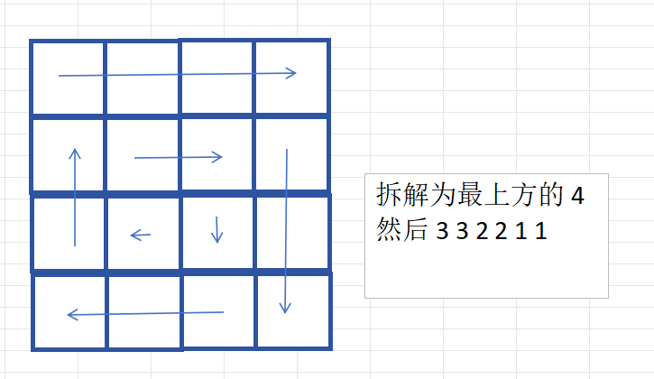

对应的代码如下：

```java
import java.util.Arrays;
import java.util.Scanner;

/**
 * ClassName: solve1
 * Package: PACKAGE_NAME
 * Description:
 *
 * @Author YukinoshitaYukino
 * @Create 2025/1/22 18:03
 * @Version 1.0
 */
public class solve1 {
    public static void main(String[] args) {
        Scanner sc = new Scanner(System.in);

        int n = sc.nextInt();
        int[][] arrs = generateMatrix(n);
        for (int i = 0; i < arrs.length; i++) {
            System.out.println(Arrays.toString(arrs[i]));
        }
    }

    public static int[][] generateMatrix(int n) {
        int[] dx = {0, 1, 0, -1};
        int[] dy = {1, 0, -1, 0};
        int[][] arr = new int[n][n];

        int num = 1;

        //假设是4*4的矩阵
        //先生成最上方的一条边
        for (int i = 0; i < n; i++) {
            arr[0][i] = num++;
        }
        int x = 0, y = n - 1;

        //还需生成3组：3 3 2 2 1 1
        //所以i还要遍历n-1次
        int k = 1;
        for (int i = 1; i < n; i++) {
            //对于每一“组”，有两个for语句（比如3 3……）
            for (int j = 0; j < n - i; j++) {
                x = (x + dx[k % 4]);
                y = (y + dy[k % 4]);
                arr[x][y] = num++;
            }
            k++;
            for (int j = 0; j < n - i; j++) {
                x = (x + dx[k % 4]);
                y = (y + dy[k % 4]);
                arr[x][y] = num++;
            }
            k++;
        }

        return arr;
    }
}

```

### 其他模拟思路

- 一圈一圈地进行，并且都是“左闭右开”式的，特别注意n为奇数时，要补全中间的位置。这个代码实现起来更简单。

  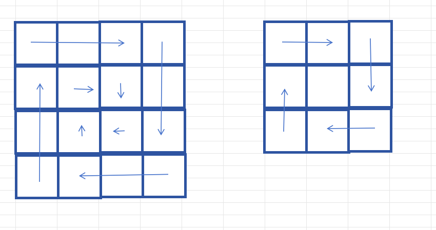

```java
public static int[][] generateMatrix(int n) {
        int[][] arr = new int[n][n];

        int t = n / 2;
        int x = 0, y = 0;
        int num = 1;
        for (int i = 0; i < t; i++) {
            for (int j = 0; j < n - 2 * i - 1; j++) {
                arr[x][y++] = num++;
            }
            for (int j = 0; j < n - 2 * i - 1; j++) {
                arr[x++][y] = num++;
            }
            for (int j = 0; j < n - 2 * i - 1; j++) {
                arr[x][y--] = num++;
            }
            for (int j = 0; j < n - 2 * i - 1; j++) {
                arr[x--][y] = num++;
            }
            //走完“一圈”后，更新为下一圈的“起点”
            x++;
            y++;
        }
        if (n % 2 == 1) {
            arr[n / 2][n / 2] = num;
        }

        return arr;
    }
}
```

# 链表

## [203. 移除链表元素](https://leetcode.cn/problems/remove-linked-list-elements/)

### 利用prev

题目一眼看上去很简单（实际上也确实），不过由于有段时间没接触算法，很多知识都忘完了——这题只要想起来几个关键词，就能做出：

**单链表**，外加一点“经验”，该结构遍历时有一定“局限性”，比如无法知道上一个节点信息。可以加入prev、next（有些题会用到）来进行补足，方便解题，本题只要加入了prev指针，就很简单能解出来了。

图解：

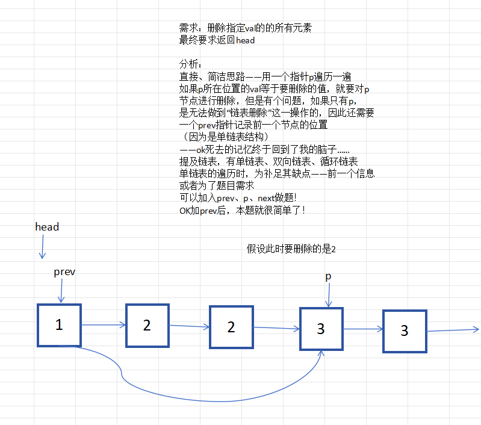

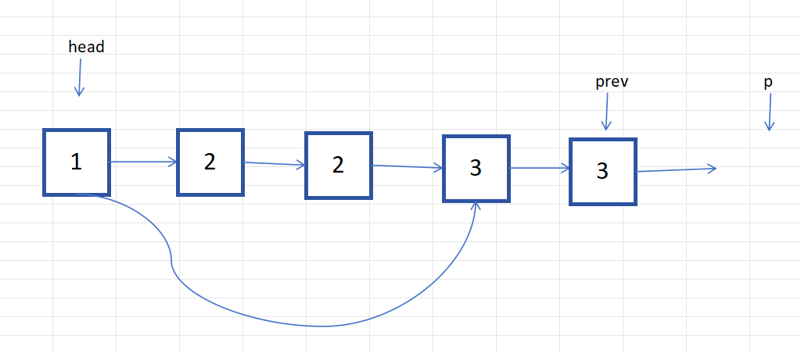

```java
/**
 * Definition for singly-linked list.
 * public class ListNode {
 *     int val;
 *     ListNode next;
 *     ListNode() {}
 *     ListNode(int val) { this.val = val; }
 *     ListNode(int val, ListNode next) { this.val = val; this.next = next; }
 * }
 */
class Solution {
    public ListNode removeElements(ListNode head, int val) {
       while (head != null && head.val == val) {
            head = head.next;
        }

        ListNode prev = head;//涉及单链表的删除操作——记住加入prev节点！
        if(head == null) return null;//特殊：可能已经把所有节点删除完
        ListNode p = head.next;
        while (p != null) {
            if(p.val == val) {
                prev.next = p.next;//删除节点p
            }
            else{
                prev = p;//若不删除，更新prev
            }
            p=p.next;
        }
        return head;
    }
}
```

### 不利用prev

- 也是可以做的，稍微注意一下条件判断，避免出现`NullPointerException`报错

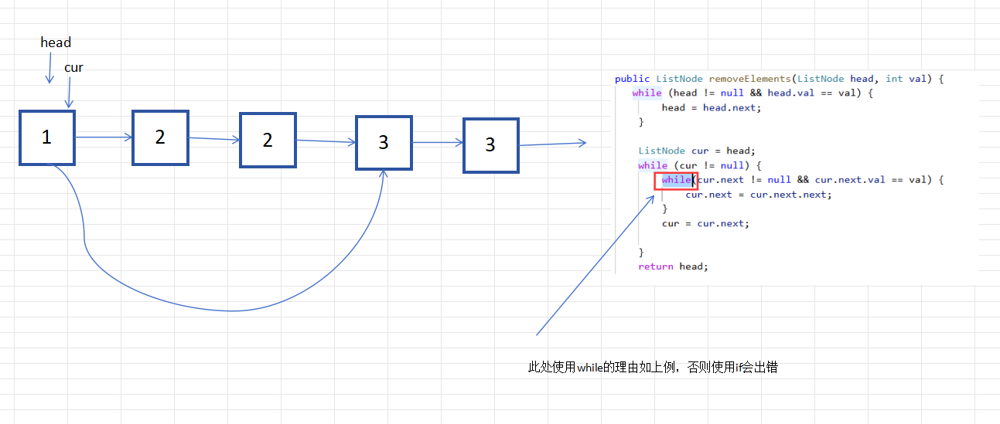

```java
/**
 * Definition for singly-linked list.
 * public class ListNode {
 *     int val;
 *     ListNode next;
 *     ListNode() {}
 *     ListNode(int val) { this.val = val; }
 *     ListNode(int val, ListNode next) { this.val = val; this.next = next; }
 * }
 */
class Solution {
    public ListNode removeElements(ListNode head, int val) {
       while (head != null && head.val == val) {
            head = head.next;
        }

        ListNode cur = head;
        while (cur != null) {
            while(cur.next != null && cur.next.val == val) {
                cur.next = cur.next.next;
            }
            cur = cur.next;
           
        }
        return head;
    }
}
```

## [707. 设计链表](https://leetcode.cn/problems/design-linked-list/)

考虑情况：

1. MyLinkedList的head为空
2. index小于0、index大于等于len、index在正常的值[0,len-1]

编写时注意：

1. 时刻注意“下标越界”问题
2. 时刻注意加减节点时附带len字段的变化

这道有些莫名其妙……照自己理解写能写出来，过不了样例

- [ ] 以下是官方题解，我找时间看一下java的ListNode源码是怎么写的吧

```java
/**
 * ClassName: solve3
 * Package: PACKAGE_NAME
 * Description:
 *
 * @Author YukinoshitaYukino
 * @Create 2025/1/23 19:21
 * @Version 1.0
 */
public class solve3 {
}

class MyLinkedList {
    int size;
    Node head;

    public MyLinkedList() {
        this.size = 0;
        this.head = new Node(0);//头节点是虚拟的节点
    }

    public int get(int index) {
        if (index < 0 || index >= this.size) return -1;
        Node cur = head;
        //有必要解释一下这里为什么要进行index次循环：
        //这和链表的设计有关——因为这里的单链表是从head开始的
        //而head是设定为空的头节点，不计入长度

        //??不是……为什么是小于等于index？？
        //合理解释就是……这个index的范围就是在 [0,size-1]
        //艹（来自对官方题解吐槽）
        for (int i = 0; i <= index; i++) {
            cur = cur.next;
        }
        return cur.val;

    }

    public void addAtHead(int val) {
        addAtIndex(0, val);
    }

    public void addAtTail(int val) {
        addAtIndex(this.size, val);
    }

    public void addAtIndex(int index, int val) {
        if (index > size) {
            return;
        }
        index = Math.max(0, index);
        size++;
        Node pred = head;
        for (int i = 0; i < index; i++) {
            pred = pred.next;
        }
        Node toAdd = new Node(val);
        toAdd.next = pred.next;
        pred.next = toAdd;
    }

    public void deleteAtIndex(int index) {
        if(index < 0 || index >= this.size) return;
        size--;

        Node cur = head;
        for(int i=0;i<index;i++){
            cur = cur.next;
        }
        cur.next = cur.next.next;

    }
}

class Node {
    int val;
    Node next;

    public Node(int val) {
        this.val = val;
    }
}

```

## [206. 反转链表](https://leetcode.cn/problems/reverse-linked-list/)

没什么好说的，很直观的解法：

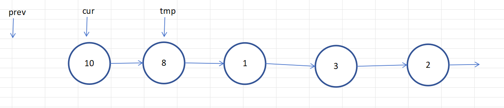

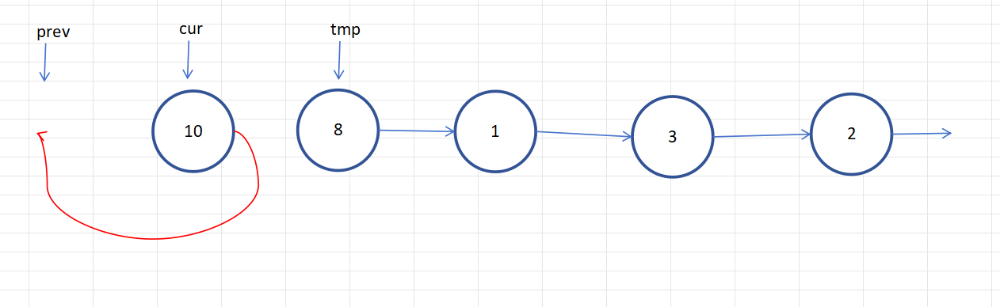

- 一个节点反转后的状态如下，后面以此类推：

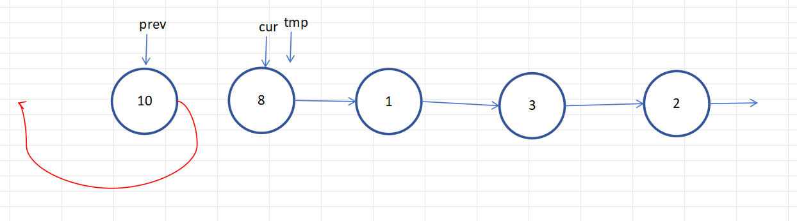

```java
/**
 * Definition for singly-linked list.
 * public class ListNode {
 *     int val;
 *     ListNode next;
 *     ListNode() {}
 *     ListNode(int val) { this.val = val; }
 *     ListNode(int val, ListNode next) { this.val = val; this.next = next; }
 * }
 */
class Solution {
    public ListNode reverseList(ListNode head) {
        ListNode prev = null;
        ListNode cur = head;
        
        ListNode tmp;
        while(cur != null){
            tmp = cur.next;
            cur.next = prev;
            prev = cur;
            cur = tmp;
        }
        return prev;
    }
}
```

- 递归写法：

```java
/**
 * Definition for singly-linked list.
 * public class ListNode {
 * int val;
 * ListNode next;
 * ListNode() {}
 * ListNode(int val) { this.val = val; }
 * ListNode(int val, ListNode next) { this.val = val; this.next = next; }
 * }
 */
class Solution {
    public ListNode reverseList(ListNode head) {
        return reverse(null,head);
    }

    public ListNode reverse(ListNode prev, ListNode cur) {
        if (cur == null) return prev;
        ListNode tmp = cur.next;
        cur.next = prev;
        return reverse(cur,tmp);
    }
}
```

## [19. 删除链表的倒数第 N 个结点](https://leetcode.cn/problems/remove-nth-node-from-end-of-list/)

- 核心思路：**滑动窗口**


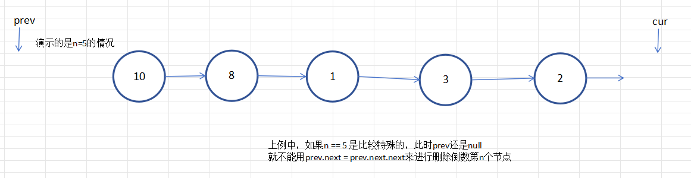

```java
/**
 * Definition for singly-linked list.
 * public class ListNode {
 *     int val;
 *     ListNode next;
 *     ListNode() {}
 *     ListNode(int val) { this.val = val; }
 *     ListNode(int val, ListNode next) { this.val = val; this.next = next; }
 * }
 */
class Solution {
    public ListNode removeNthFromEnd(ListNode head, int n) {
        //题目意思：head不为null（1<=sz<=30）
        int size = 0;
        ListNode cur = head;
        ListNode prev = null;
        while(cur != null){
            size++;
            if(size == n + 1){
                prev = head;
                cur = cur.next;
            }
            else if(size > n + 1){
                prev = prev.next;
                cur = cur.next;
            }
            else{
                cur = cur.next;
            }
        }
        if(prev == null){//说明删除的是头节点
            return head.next;
        }else{
            prev.next = prev.next.next;
            return head;
        }
        
    }
}
```

## [142. 环形链表 II](https://leetcode.cn/problems/linked-list-cycle-ii/)

核心考点：

1. 判断单链表有无环
2. 若有环，找出环的入口节点

### 思路一：利用HashMap记录已访问过的节点

该思路下，每访问一个就记录，然后判断“cur.next”是否已访问过，即可得到是否有环+找出入口节点

```java
public class Solution {
    public ListNode detectCycle(ListNode head) {
        HashMap<ListNode,Integer> visited = new HashMap<>();
        ListNode cur = head;
        while(cur != null){
            if(visited.containsKey(cur.next)){
                return cur.next;
            }
            visited.put(cur,0);
            cur = cur.next;
        }
        return null;
    }
}
```

- 缺点：时间复杂度较高（每过一个节点就要在HashMap中匹配）

### 思路二：快慢指针（Floyd判圈算法）

> 本题的方法还有个更高大上的名字，[Floyd判圈算法](https://zh.wikipedia.org/wiki/Floyd%E5%88%A4%E5%9C%88%E7%AE%97%E6%B3%95#%E5%BA%94%E7%94%A8)，又称龟兔赛跑算法，是一个可以在[有限状态机](https://zh.wikipedia.org/wiki/有限状态机)、[迭代函数](https://zh.wikipedia.org/wiki/迭代函数)或者[链表](https://zh.wikipedia.org/wiki/链表)上判断是否存在[环](https://zh.wikipedia.org/wiki/環_(圖論))，求出该环的起点与长度的算法。

- 形象上来看分为两个过程：

  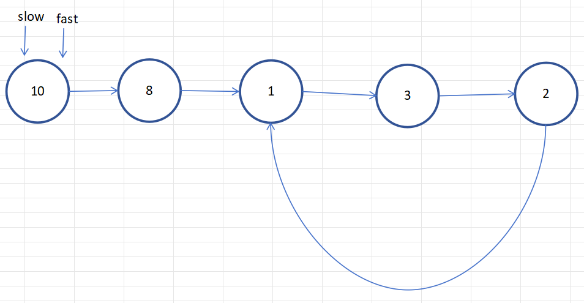

  1. 快指针每次走两步，慢指针每次走一步，直到他们相遇为止（说明有环）

     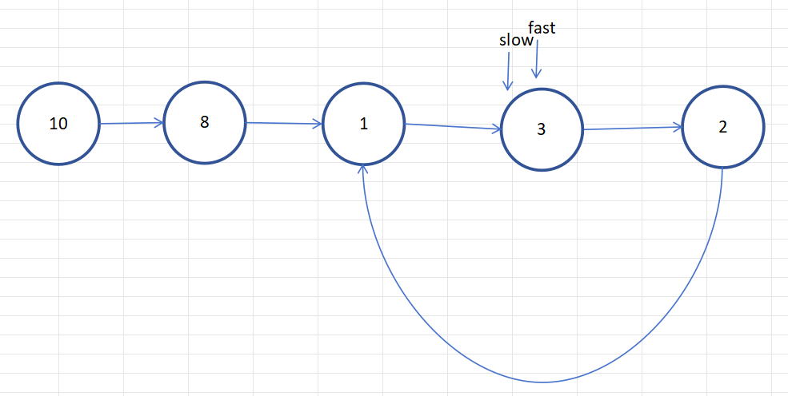

  2. 再定义两个指针分别从head和（fast和slow的）相遇点同时出发，直到相遇。而且相遇点必定是环的入口：

     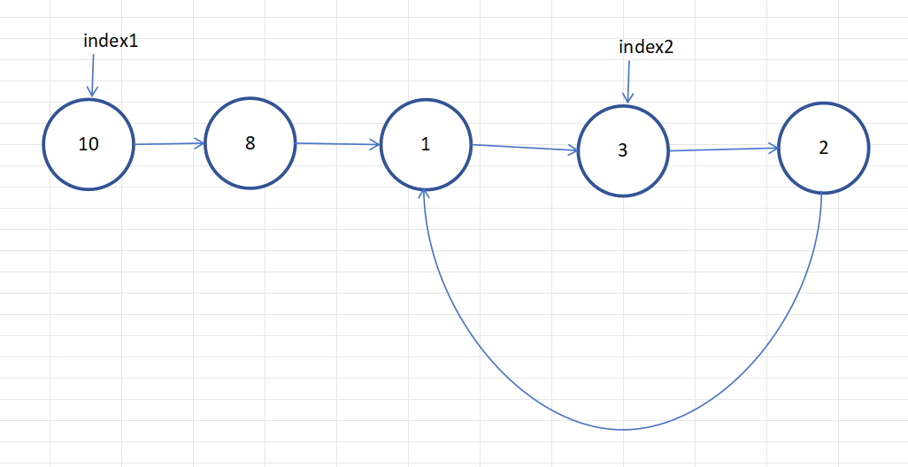

     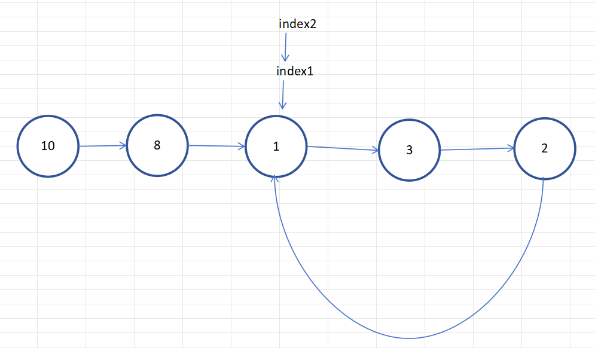

  问题来了——两个关键问题中的“如何判断有环”很好解决（fast和slow是否相遇），但是**为什么index1、index2再相遇的点一定是环的入口呢？**

  严格推导如下：

**快慢指针的基本设定**

    1. 设链表由三部分组成：
     - **起点到环入口的距离**：记为 A。
     - **环入口到快慢指针相遇点的距离**：记为 B。
     - **相遇点到环入口的剩余距离**：记为 C，环的总长度为 L，则 $L=B+C$
    2. 两个指针的移动速度：
     - **慢指针（slow）**：一次走 1 步。
     - **快指针（fast）**：一次走 2 步。
    3. 两指针初始位置为链表头节点，且都朝着链表的下一个节点移动。

**相遇点的性质**

  1. **快慢指针的相遇条件**：
     
     - 假设慢指针走了 x 步，则快指针走了 2x 步。
     
     - 快指针比慢指针多走的步数一定是环的整数倍，满足： 
     
     - $$
       2x - x = n \cdot L \quad (n \geq 1)
       $$
     
     - 即：
     - $$
       x = n \cdot L \quad (n \geq 1)	\qquad (1)
       $$
     
  2. **相遇点的推导**：
     
     - 慢指针走了 x 步，此时 x 包含起点到环入口的距离 A，以及在环内走的距离 B，故$x = A + B \qquad (2)$
     - 因此，由（1）式和（2）式可得：$A + B = n \cdot L \qquad (3)$
     - （3）式可理解为：起点到环入口的距离 A，以及在环内走的距离 B之和，相当于n倍环的长度

**环入口与相遇点的关系**

  要证明为什么从头节点到环入口的距离 A等于从相遇点沿着环走到环入口的距离 C，可以整理公式：

  1. 从（3）式，整理出：

     $A = n \cdot L - B \qquad (4)$

     因为环的长度是 L，在环内 $B + C = L$，所以$C = L - B \qquad (5)$

     假设n是1呢？也就是快指针fast多跑了1圈，那么（4）式和（5）式联立可解得$A = C$

     那么把情况考虑完全，快指针可能不止跑了一圈，那也没关系——想象一下，另设两个指针index1和index2，分别从head和相遇点出发，那么index1起码为了进入圈，要跑A的距离，也就是$n \cdot L - B$，但是index2始终在环内“绕圈圈”。对吧？所以就相当于是$A=L-B$（相当于index2在原地不动，index1在进入环前在跑掉这一圈圈的距离），最后得出的结论不变。

  2. 结论：

     - 从头节点到环入口的距离 A，等于从相遇点继续沿着环走到环入口的距离 C。（稍不严谨，但是上面已经解释清楚了原因）

> 实在不懂的话画画图理解一下还是很好理解的：
>
> 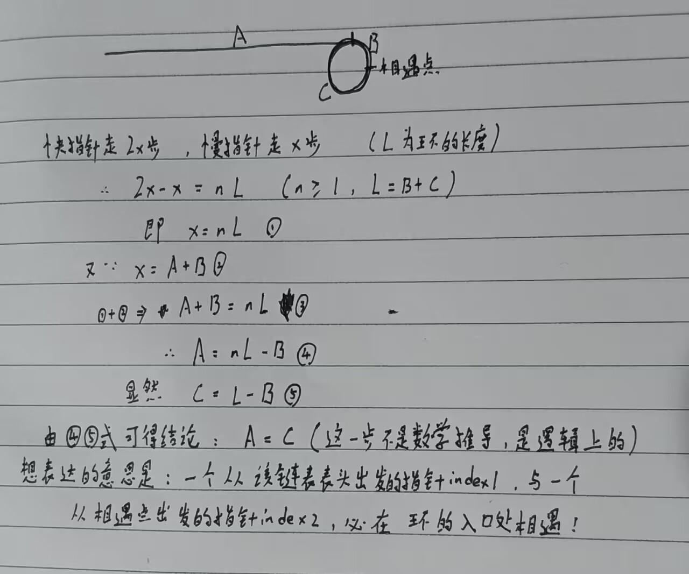

**算法的逻辑**

  利用上述结论，算法通过以下步骤准确找到环的入口：

  1. 两指针（快慢指针）第一次相遇后，将其中一个指针重置到链表头部，另一个指针留在相遇点。
  2. 两指针以相同速度前进（一次走一步）。
  3. 因为一个指针从头节点出发，另一个指针从相遇点出发，两者相遇时会刚好在环入口处。

```java
public class Solution {
    public ListNode detectCycle(ListNode head) {
        ListNode fast = head;
        ListNode slow = head;
        while (fast!= null && fast.next!= null) {
            fast = fast.next.next;
            slow = slow.next;
            if (fast == slow) {
                ListNode index1 = head;
                ListNode index2 = fast;
                while (index1 != index2) {
                    index1 = index1.next;
                    index2 = index2.next;
                }
                return index1;
            }
        }
        return null;
    }
}
```

# 哈希表

## [242. 有效的字母异位词](https://leetcode.cn/problems/valid-anagram/)

### 思路1：利用java容器的HashMap

以Character为key，Integer为value。

记录前一个字符串中每一个字符对应出现次数，再遍历第二个字符串，每遍历一个字符，便在HashMap中寻找，若返回null直接false，或者找到后，对应次数-1，若小于0，也返回false。否则返回true

```java
public boolean isAnagram(String s, String t) {
        int size = s.length();
        if(size != t.length()) return false;
        HashMap<Character,Integer> count = new HashMap<>();
        for(char c :s.toCharArray()){
            if(count.containsKey(c)){
                count.put(c,count.get(c)+1);
            }
            else {
                count.put(c, 1);
            }
        }

        for(char c :t.toCharArray()){
            if(count.get(c) == null) return false;
            count.put(c,count.get(c)-1);
        }
        return true;
    }
```

> 思路就是这样的思路，但是时间性能还能优化

### (best)思路2：自建“哈希表”

哈希表的本质是通过Hash函数，将key映射到数组中对应的存储位置上，所以不妨自己创建一个映射规则：

由于本题目中，字符范围仅仅是小写字母，可以用26个大小的数组来存储，也就是在下标为`'字符'-'a'`的位置存储`'字符'`出现的个数

例如：`arr[c - 'a']++`（c为char类型）

**最优写法**（时间耗费最少）

```java
public boolean isAnagram(String s, String t) {
        int size = s.length();
        if(size != t.length()) return false;
        int[] arr = new int[26];
        for(char c : s.toCharArray()) arr[c - 'a']++;
        for(char c : t.toCharArray()) arr[c - 'a']--;
        for(int i=0;i<arr.length;i++){
            if(arr[i] != 0) return false;
        }
        return true;
    }
```

另一种写法：

```java
public boolean isAnagram(String s, String t) {
    if (s.length() != t.length()) return false;

    // 26 个字母的频次数组
    int[] count = new int[26];

    // 遍历字符串 s 和 t，更新频次
    for (int i = 0; i < s.length(); i++) {
        count[s.charAt(i) - 'a']++;
        count[t.charAt(i) - 'a']--;
    }

    // 检查所有频次是否为 0
    for (int c : count) {
        if (c != 0) return false;
    }

    return true;
}

```


分析：时间复杂度为`O(n)`，空间复杂度为`O(n)`。

### 思路3：

本题还可以先对两个字符串排序后再比较也行

```java
public boolean isAnagram(String s, String t) {
        // 如果字符串长度不同，直接返回 false
        if (s.length() != t.length()) return false;

        // 将字符串转换为字符数组
        char[] charArray = s.toCharArray();
        char[] charArray1 = t.toCharArray();

        // 排序两个字符数组
        Arrays.sort(charArray);
        Arrays.sort(charArray1);

        // 比较排序后的字符数组是否相同
        return Arrays.equals(charArray, charArray1);
}
```

## [349. 两个数组的交集](https://leetcode.cn/problems/intersection-of-two-arrays/)

### 利用HashSet可解

唯一难点是java中容器的使用

```java
class Solution {
    public int[] intersection(int[] nums1, int[] nums2) {
        // 使用 HashSet 存储 nums1 中的唯一元素
        HashSet<Integer> set1 = new HashSet<>();
        for (int num : nums1) {
            set1.add(num);
        }

        // 用另一个 HashSet 存储交集结果
        HashSet<Integer> intersectionSet = new HashSet<>();
        for (int num : nums2) {
            if (set1.contains(num)) {
                intersectionSet.add(num);
            }
        }

        // 将交集结果转换为数组
        int[] resultArray = new int[intersectionSet.size()];
        int index = 0;
        for (int num : intersectionSet) {
            resultArray[index++] = num;
        }

        //  // 或使用迭代器将交集结果转换为数组
        // int[] resultArray = new int[intersectionSet.size()];
        // Iterator<Integer> iterator = intersectionSet.iterator();
        // int index = 0;
        // while (iterator.hasNext()) {
        //     resultArray[index++] = iterator.next();
        // }

        return resultArray;
    }
}
```

## [1. 两数之和](https://leetcode.cn/problems/two-sum/)

- 题目要求找到两个数，相加为target，返回这两个数在nums中的下标。
- 利用HashMap可解，其中map存储的key：value为  值：下标。故每次往map集合中新加入数时，先判断是否已经有以target-nums[i]为key的元素，若有，返回答案即可。

```java
public class Solution {
    public int[] twoSum(int[] nums, int target) {
        int[] res = new int[2];

        HashMap<Integer,Integer> map = new HashMap<>();
        for(int i=0;i<nums.length;i++){
            if(set.get(target-nums[i]) != null){
                res[0] = set.get(target-nums[i]);
                res[1] = i;
                return res;
            }
            set.put(nums[i],i);
        }
        return null;
    }
}
```

## [454. 四数相加 II](https://leetcode.cn/problems/4sum-ii/)

显然，拿到题目，最最直观的想法——暴力法如下：

```java
class Solution {
    public int fourSumCount(int[] nums1, int[] nums2, int[] nums3, int[] nums4) {
        int res = 0;
        
        //暴力法：
        for(int i=0;i<nums1.length;i++){
            int sum = nums1[i];
            for(int j=0;j<nums2.length;j++){
                sum+=nums2[j];
                for(int k=0;k<nums3.length;k++){
                    sum+=nums3[k];
                    for(int l=0;l<nums4.length;l++){
                        sum+=nums4[l];
                        if(sum == 0){
                            res++;
                        }
                        sum -= nums4[l];
                    }
                    sum -= nums3[k];
                }
                sum -=nums2[j];
            }
        }
        return res;
    }
}
```

- 显然这也是行不通的，时间超时了

稍作改进，用四个map进行存储（key：value对应 **值：出现次数**），虽然查找效率变高了，但是还是四重循环，最终还是超时

```java
public class Solution {

    public int fourSumCount(int[] nums1, int[] nums2, int[] nums3, int[] nums4) {
        int res = 0;

        HashMap<Integer, Integer> map1 = new HashMap<>();
        HashMap<Integer, Integer> map2 = new HashMap<>();
        HashMap<Integer, Integer> map3 = new HashMap<>();
        HashMap<Integer, Integer> map4 = new HashMap<>();
        for (int i = 0; i < nums1.length; i++) {
            if (map1.get(nums1[i]) == null) {
                map1.put(nums1[i], 1);
            } else {
                map1.put(nums1[i], map1.get(nums1[i]) + 1);
            }

            if (map2.get(nums2[i]) == null) {
                map2.put(nums2[i], 1);
            } else {
                map2.put(nums2[i], map2.get(nums2[i]) + 1);
            }

            if (map3.get(nums3[i]) == null) {
                map3.put(nums3[i], 1);
            } else {
                map3.put(nums3[i], map3.get(nums3[i]) + 1);
            }

            if (map4.get(nums4[i]) == null) {
                map4.put(nums4[i], 1);
            } else {
                map4.put(nums4[i], map4.get(nums4[i]) + 1);
            }
        }

        int sum;
        Set<Map.Entry<Integer, Integer>> entries1 = map1.entrySet();
        Set<Map.Entry<Integer, Integer>> entries2 = map2.entrySet();
        Set<Map.Entry<Integer, Integer>> entries3 = map3.entrySet();
        Set<Map.Entry<Integer, Integer>> entries4 = map4.entrySet();

        for (Map.Entry<Integer, Integer> entry1 : entries1) {
            sum = entry1.getKey();
            for (Map.Entry<Integer, Integer> entry2 : entries2) {
                sum += entry2.getKey();
                for (Map.Entry<Integer, Integer> entry3 : entries3) {
                    sum += entry3.getKey();
                    for (Map.Entry<Integer, Integer> entry4 : entries4) {
                        sum += entry4.getKey();
                        if (sum == 0) {
                            res += entry1.getValue() * entry2.getValue() * entry3.getValue() * entry4.getValue();
                        }
                        sum -= entry4.getKey();
                    }
                    sum -= entry3.getKey();
                }
                sum -= entry2.getKey();
            }
        }

        return res;
    }
}

```

- 此处需要一点小巧思，那就是map的key和值的设计。考虑一下“两数之和”的写法，只使用了一个map解决，那个map存储的是key（nums1的数值）：value（nums1[i]的下标i）
- 此处可修改为key（**num1[i]+nums2[j]**）：value（**出现次数**）
- 这样一来，我们再对nums3和num4进行一个双重循环：对于每一个nums3[i]和nums4[j]，如果存在有map(-(nums3[i] + nums4[j]) )，说明原本的四个数组相加可以为0，则此时进行res+=map.getValue操作。
- 最终返回res即可

`清晰的代码思路`

```java
public class Solution {

    public int fourSumCount(int[] nums1, int[] nums2, int[] nums3, int[] nums4) {
        int res = 0;

        HashMap<Integer, Integer> map = new HashMap<>();

        for (int num1 : nums1) {
            for(int num2 : nums2){
                if(map.get(num1+num2) == null) map.put(num1+num2,1);
                else map.put(num1+num2,map.get(num1+num2)+1);
            }
        }

        for(int num3 : nums3){
            for(int num4:nums4){
                if(map.get(-(num3+num4)) != null) res+=map.get(-(num3+num4));
            }
        }
        
        return res;
    }
}

```

`优化的代码写法`

- **`map.merge()`**：用来简化 `if` 逻辑，它会尝试将 键`num1 + num2`对应的值与1相加，若不存在该键则插入该键值对（num1+num2:1）。
- **`map.getOrDefault()`**：在第二部分遍历时，使用 `map.getOrDefault()` 避免了 `null` 的检查，若没有找到匹配的值，直接返回 0。

```java
public class Solution {

    public int fourSumCount(int[] nums1, int[] nums2, int[] nums3, int[] nums4) {
        int res = 0;

        // 使用合适的初始容量，减少哈希表扩容的次数
        HashMap<Integer, Integer> map = new HashMap<>(nums1.length * nums2.length);

        // 将 nums1 和 nums2 的所有和存入 HashMap
        for (int num1 : nums1) {
            for (int num2 : nums2) {
                // 使用 merge 方法避免 if 判断，提高可读性
                map.merge(num1 + num2, 1, Integer::sum);
            }
        }

        // 查找 nums3 和 nums4 的和的负数是否存在于 map 中
        for (int num3 : nums3) {
            for (int num4 : nums4) {
                res += map.getOrDefault(-(num3 + num4), 0);
            }
        }

        return res;
    }
}
```

> `map.merge(num1 + num2, 1, Integer::sum)` 这一行代码的作用是将 `num1 + num2` 作为键，`1` 作为值，尝试将该键值对插入到 `map` 中，或者在该键已存在的情况下，更新它的值。具体来说，`merge` 方法的三个参数含义如下：
>
> 1. **key** (`num1 + num2`)：我们希望在 `map` 中使用的键，这里是 `num1 + num2` 的结果。
> 2. **value** (`1`)：要插入的值，若该键还未存在于 `map` 中，直接插入 `1`。
> 3. **remappingFunction** (`Integer::sum`)：当 `map` 中已经存在该键时，会使用这个函数来计算新的值。`Integer::sum` 是一个方法引用，表示两个整数的求和操作，也就是将已有的值和新的 `1` 相加。
>
> **解释流程：**
>
> - **如果 `num1 + num2` 不在 `map` 中**，那么 `merge` 方法会直接将这个键 `num1 + num2` 和对应的值 `1` 插入到 `map` 中。
> - **如果 `num1 + num2` 已经在 `map` 中**，那么 `merge` 方法会调用 `Integer::sum` 函数，将现有值与新的 `1` 相加，更新 `map` 中对应键的值。例如，如果该键的当前值是 `3`，那么更新后会变为 `3 + 1 = 4`。
>
> **例子：**
>
> 假设我们有 `nums1 = [1, 2]` 和 `nums2 = [3, 4]`，那么：
>
> - 第一次遍历时，`num1 = 1` 和 `num2 = 3`，`num1 + num2 = 4`，在 `map` 中没有 4，因此会插入 `(4, 1)`。
> - 下一次，`num1 = 1` 和 `num2 = 4`，`num1 + num2 = 5`，在 `map` 中没有 5，因此会插入 `(5, 1)`。
> - 接着，`num1 = 2` 和 `num2 = 3`，`num1 + num2 = 5`，此时 `map` 中已经有键 5，因此会将原来的值 `1` 与新的 `1` 相加，变为 `(5, 2)`。
> - 最后，`num1 = 2` 和 `num2 = 4`，`num1 + num2 = 6`，在 `map` 中没有 6，因此会插入 `(6, 1)`。

## [15. 三数之和](https://leetcode.cn/problems/3sum/)

### 哈希解法

- 题目要求是三数之和为0，并且有**不得重复**这一条件。

- 如果暂时不考虑**去重**，可以考虑用双重循环的i、j，`nums[i]`是第一个数，`nums[j]`是第二个数，那么就需要判断在nums中是否有第三个数`-(nums[i]+nums[j])`。可以按如下步骤：

  1. 可以使用HashSet来记录。对于nums[i]固定时，j向前遍历。
  2. 若`set.contains(-(nums[i]+nums[j]))`，则将`nums[i]、nums[j]、-(nums[i]+nums[j])`作为一个结果保存到`List<List<Integer>> res`中

- 但是要考虑去重的问题，比如一个数组`nums = {-3,3,0,-3,3,0}`很明显的，按照上面方式，`{-3,3,0}`会被记录两次，所以先对nums数组进行**排序**操作，并在遍历i、j变量时加入去重判断：

  1. `if(i>0 && nums[i] == nums[i-1]) continue;`该语句保证了最小的数`nums[i]`不重复。注意：不能是`if(nums[i]==nums[i+1])`，这样会使情况减少（反例:`nums={-1,-1,2}`，此时i直接跳过第一个-1到了第二个-1，j又是从i+1开始的，所以就少了）
  2. `if(j>i+2 && nums[j]== nums[j-1] && nums[j-1]==nums[j-2]) continue;`。对于第二个数`nums[j]`的去重，只有连续三个相同时才要去重。（见代码思路）

- 图解：

  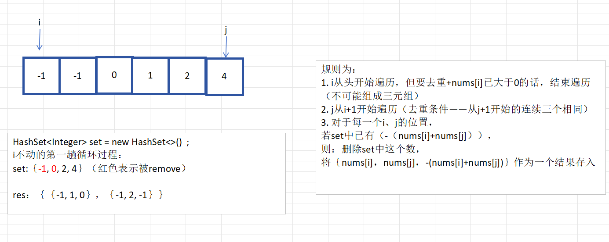

  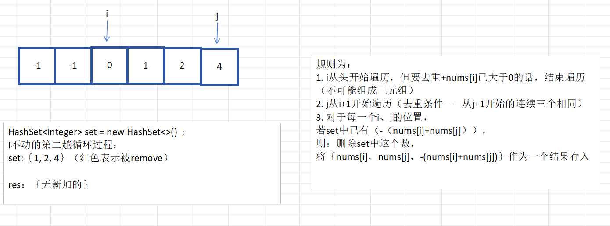

```java
package yu5;

import java.util.*;

/**
 * ClassName: Solution
 * Package: yu5
 * Description:
 *
 * @Author YukinoshitaYukino
 * @Create 2025/2/1 12:41
 * @Version 1.0
 */
public class Solution {
    public static void main(String[] args) {
        int[] nums = {-2,0,1,1,2};
        List<List<Integer>> lists = threeSum(nums);
        for(var list : lists){
            System.out.println(list);
        }
    }

    public static List<List<Integer>> threeSum(int[] nums) {
        List<List<Integer>> res = new ArrayList<>();
        Arrays.sort(nums);

        for(int i=0;i<nums.length;i++){
            if(nums[i] > 0) break;//如果最小的nums[i]都大于0了，说明没有三元组了
            if(i >0 && nums[i] == nums[i-1]) continue;//去重

            HashSet<Integer> set = new HashSet<>();
            for(int j=i+1;j<nums.length;j++){
                //此处的去重条件较特殊（反例：-4 …… 2 2 ）
                if(j>i+2&& nums[j] == nums[j-1] && nums[j-1] ==nums[j-2]) continue;
                if(set.contains(-(nums[i]+nums[j]))){
                    List<Integer> list = new ArrayList<>();
                    list.add(nums[i]);
                    list.add(nums[j]);
                    list.add(-(nums[i]+nums[j]));
                    res.add(list);
                    set.remove(-(nums[i]+nums[j]));
                }else{
                    set.add(nums[j]);
                }
            }
        }
        return res;
    }
}

```

### 指针解法

- 这种思路更简单、直观，代码实现容易，且效率更高，适合本题

- 看一个图就能理解：

  ​	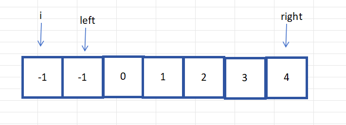

```java
class Solution {
    public List<List<Integer>> threeSum(int[] nums) {
        List<List<Integer>> res = new ArrayList<>();
        Arrays.sort(nums);

        for (int i = 0; i < nums.length - 2; i++) {
            if (nums[i] > 0)
                break;// 如果最小的nums[i]都大于0了，说明没有三元组了
            if (i > 0 && nums[i] == nums[i - 1])
                continue;// 去重
            int left = i + 1, right = nums.length - 1;
            while (left < right) {
                if (nums[i] + nums[left] + nums[right] < 0) {
                    left++;
                } else if (nums[i] + nums[left] + nums[right] > 0) {
                    right--;
                } else {
                    res.add(Arrays.asList(nums[i], nums[left], nums[right]));
                    //找到一个解后，为了找下一个，同时保证解不重复，也就是nums[left]要不一样
                    //既然nums[left]都不一样了，right必定也要换个位置（才能满足三元组）
                    while (left < right && nums[left] == nums[left + 1])
                        left++;
                    while (left < right && nums[right] == nums[right - 1])
                        right--;
                    left++;
                    right--;
                }
            }
        }
        return res;
    }
}
```

