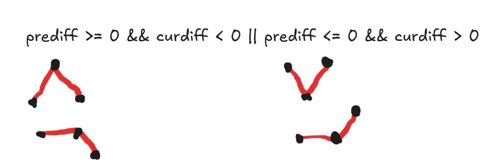
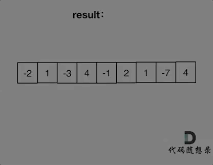
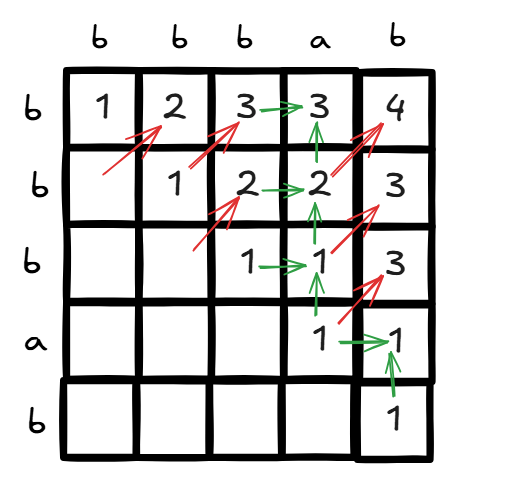
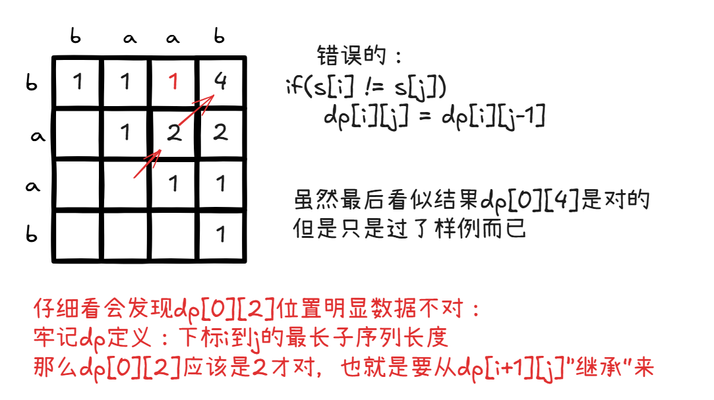

# 前言

基于《代码随想录》的刷题顺序，[项目地址](https://github.com/vltown/leetcode)

# 数组

## [59. 螺旋矩阵 II](https://leetcode.cn/problems/spiral-matrix-ii/)

### 模拟思路1

解题思路在于正确模拟这个过程：

自己一开始的模拟过程（以4*4为例）


对应的代码如下：

```java
import java.util.Arrays;
import java.util.Scanner;

/**
 * ClassName: solve1
 * Package: PACKAGE_NAME
 * Description:
 *
 * @Author YukinoshitaYukino
 * @Create 2025/1/22 18:03
 * @Version 1.0
 */
public class solve1 {
    public static void main(String[] args) {
        Scanner sc = new Scanner(System.in);

        int n = sc.nextInt();
        int[][] arrs = generateMatrix(n);
        for (int i = 0; i < arrs.length; i++) {
            System.out.println(Arrays.toString(arrs[i]));
        }
    }

    public static int[][] generateMatrix(int n) {
        int[] dx = {0, 1, 0, -1};
        int[] dy = {1, 0, -1, 0};
        int[][] arr = new int[n][n];

        int num = 1;

        //假设是4*4的矩阵
        //先生成最上方的一条边
        for (int i = 0; i < n; i++) {
            arr[0][i] = num++;
        }
        int x = 0, y = n - 1;

        //还需生成3组：3 3 2 2 1 1
        //所以i还要遍历n-1次
        int k = 1;
        for (int i = 1; i < n; i++) {
            //对于每一“组”，有两个for语句（比如3 3……）
            for (int j = 0; j < n - i; j++) {
                x = (x + dx[k % 4]);
                y = (y + dy[k % 4]);
                arr[x][y] = num++;
            }
            k++;
            for (int j = 0; j < n - i; j++) {
                x = (x + dx[k % 4]);
                y = (y + dy[k % 4]);
                arr[x][y] = num++;
            }
            k++;
        }

        return arr;
    }
}

```

### 其他模拟思路

- 一圈一圈地进行，并且都是“左闭右开”式的，特别注意n为奇数时，要补全中间的位置。这个代码实现起来更简单。

  

```java
public static int[][] generateMatrix(int n) {
        int[][] arr = new int[n][n];

        int t = n / 2;
        int x = 0, y = 0;
        int num = 1;
        for (int i = 0; i < t; i++) {
            for (int j = 0; j < n - 2 * i - 1; j++) {
                arr[x][y++] = num++;
            }
            for (int j = 0; j < n - 2 * i - 1; j++) {
                arr[x++][y] = num++;
            }
            for (int j = 0; j < n - 2 * i - 1; j++) {
                arr[x][y--] = num++;
            }
            for (int j = 0; j < n - 2 * i - 1; j++) {
                arr[x--][y] = num++;
            }
            //走完“一圈”后，更新为下一圈的“起点”
            x++;
            y++;
        }
        if (n % 2 == 1) {
            arr[n / 2][n / 2] = num;
        }

        return arr;
    }
}
```

# 链表

## [203. 移除链表元素](https://leetcode.cn/problems/remove-linked-list-elements/)

### 利用prev

题目一眼看上去很简单（实际上也确实），不过由于有段时间没接触算法，很多知识都忘完了——这题只要想起来几个关键词，就能做出：

**单链表**，外加一点“经验”，该结构遍历时有一定“局限性”，比如无法知道上一个节点信息。可以加入prev、next（有些题会用到）来进行补足，方便解题，本题只要加入了prev指针，就很简单能解出来了。

图解：


```java
/**
 * Definition for singly-linked list.
 * public class ListNode {
 *     int val;
 *     ListNode next;
 *     ListNode() {}
 *     ListNode(int val) { this.val = val; }
 *     ListNode(int val, ListNode next) { this.val = val; this.next = next; }
 * }
 */
class Solution {
    public ListNode removeElements(ListNode head, int val) {
       while (head != null && head.val == val) {
            head = head.next;
        }

        ListNode prev = head;//涉及单链表的删除操作——记住加入prev节点！
        if(head == null) return null;//特殊：可能已经把所有节点删除完
        ListNode p = head.next;
        while (p != null) {
            if(p.val == val) {
                prev.next = p.next;//删除节点p
            }
            else{
                prev = p;//若不删除，更新prev
            }
            p=p.next;
        }
        return head;
    }
}
```

### 不利用prev

- 也是可以做的，稍微注意一下条件判断，避免出现`NullPointerException`报错


```java
/**
 * Definition for singly-linked list.
 * public class ListNode {
 *     int val;
 *     ListNode next;
 *     ListNode() {}
 *     ListNode(int val) { this.val = val; }
 *     ListNode(int val, ListNode next) { this.val = val; this.next = next; }
 * }
 */
class Solution {
    public ListNode removeElements(ListNode head, int val) {
       while (head != null && head.val == val) {
            head = head.next;
        }

        ListNode cur = head;
        while (cur != null) {
            while(cur.next != null && cur.next.val == val) {
                cur.next = cur.next.next;
            }
            cur = cur.next;
           
        }
        return head;
    }
}
```

## [707. 设计链表](https://leetcode.cn/problems/design-linked-list/)

考虑情况：

1. MyLinkedList的head为空
2. index小于0、index大于等于len、index在正常的值[0,len-1]

编写时注意：

1. 时刻注意“下标越界”问题
2. 时刻注意加减节点时附带len字段的变化

这道有些莫名其妙……照自己理解写能写出来，过不了样例

- [ ] 以下是官方题解，我找时间看一下java的ListNode源码是怎么写的吧

```java
/**
 * ClassName: solve3
 * Package: PACKAGE_NAME
 * Description:
 *
 * @Author YukinoshitaYukino
 * @Create 2025/1/23 19:21
 * @Version 1.0
 */
public class solve3 {
}

class MyLinkedList {
    int size;
    Node head;

    public MyLinkedList() {
        this.size = 0;
        this.head = new Node(0);//头节点是虚拟的节点
    }

    public int get(int index) {
        if (index < 0 || index >= this.size) return -1;
        Node cur = head;
        //有必要解释一下这里为什么要进行index次循环：
        //这和链表的设计有关——因为这里的单链表是从head开始的
        //而head是设定为空的头节点，不计入长度

        //??不是……为什么是小于等于index？？
        //合理解释就是……这个index的范围就是在 [0,size-1]
        //艹（来自对官方题解吐槽）
        for (int i = 0; i <= index; i++) {
            cur = cur.next;
        }
        return cur.val;

    }

    public void addAtHead(int val) {
        addAtIndex(0, val);
    }

    public void addAtTail(int val) {
        addAtIndex(this.size, val);
    }

    public void addAtIndex(int index, int val) {
        if (index > size) {
            return;
        }
        index = Math.max(0, index);
        size++;
        Node pred = head;
        for (int i = 0; i < index; i++) {
            pred = pred.next;
        }
        Node toAdd = new Node(val);
        toAdd.next = pred.next;
        pred.next = toAdd;
    }

    public void deleteAtIndex(int index) {
        if(index < 0 || index >= this.size) return;
        size--;

        Node cur = head;
        for(int i=0;i<index;i++){
            cur = cur.next;
        }
        cur.next = cur.next.next;

    }
}

class Node {
    int val;
    Node next;

    public Node(int val) {
        this.val = val;
    }
}

```

## [206. 反转链表](https://leetcode.cn/problems/reverse-linked-list/)

没什么好说的，很直观的解法：


- 一个节点反转后的状态如下，后面以此类推：


```java
/**
 * Definition for singly-linked list.
 * public class ListNode {
 *     int val;
 *     ListNode next;
 *     ListNode() {}
 *     ListNode(int val) { this.val = val; }
 *     ListNode(int val, ListNode next) { this.val = val; this.next = next; }
 * }
 */
class Solution {
    public ListNode reverseList(ListNode head) {
        ListNode prev = null;
        ListNode cur = head;
        
        ListNode tmp;
        while(cur != null){
            tmp = cur.next;
            cur.next = prev;
            prev = cur;
            cur = tmp;
        }
        return prev;
    }
}
```

- 递归写法：

```java
/**
 * Definition for singly-linked list.
 * public class ListNode {
 * int val;
 * ListNode next;
 * ListNode() {}
 * ListNode(int val) { this.val = val; }
 * ListNode(int val, ListNode next) { this.val = val; this.next = next; }
 * }
 */
class Solution {
    public ListNode reverseList(ListNode head) {
        return reverse(null,head);
    }

    public ListNode reverse(ListNode prev, ListNode cur) {
        if (cur == null) return prev;
        ListNode tmp = cur.next;
        cur.next = prev;
        return reverse(cur,tmp);
    }
}
```

## [19. 删除链表的倒数第 N 个结点](https://leetcode.cn/problems/remove-nth-node-from-end-of-list/)

- 核心思路：**滑动窗口**


```java
/**
 * Definition for singly-linked list.
 * public class ListNode {
 *     int val;
 *     ListNode next;
 *     ListNode() {}
 *     ListNode(int val) { this.val = val; }
 *     ListNode(int val, ListNode next) { this.val = val; this.next = next; }
 * }
 */
class Solution {
    public ListNode removeNthFromEnd(ListNode head, int n) {
        //题目意思：head不为null（1<=sz<=30）
        int size = 0;
        ListNode cur = head;
        ListNode prev = null;
        while(cur != null){
            size++;
            if(size == n + 1){
                prev = head;
                cur = cur.next;
            }
            else if(size > n + 1){
                prev = prev.next;
                cur = cur.next;
            }
            else{
                cur = cur.next;
            }
        }
        if(prev == null){//说明删除的是头节点
            return head.next;
        }else{
            prev.next = prev.next.next;
            return head;
        }
        
    }
}
```

## [142. 环形链表 II](https://leetcode.cn/problems/linked-list-cycle-ii/)

核心考点：

1. 判断单链表有无环
2. 若有环，找出环的入口节点

### 思路一：利用HashMap记录已访问过的节点

该思路下，每访问一个就记录，然后判断“cur.next”是否已访问过，即可得到是否有环+找出入口节点

```java
public class Solution {
    public ListNode detectCycle(ListNode head) {
        HashMap<ListNode,Integer> visited = new HashMap<>();
        ListNode cur = head;
        while(cur != null){
            if(visited.containsKey(cur.next)){
                return cur.next;
            }
            visited.put(cur,0);
            cur = cur.next;
        }
        return null;
    }
}
```

- 缺点：时间复杂度较高（每过一个节点就要在HashMap中匹配）

### 思路二：快慢指针（Floyd判圈算法）

> 本题的方法还有个更高大上的名字，[Floyd判圈算法](https://zh.wikipedia.org/wiki/Floyd%E5%88%A4%E5%9C%88%E7%AE%97%E6%B3%95#%E5%BA%94%E7%94%A8)，又称龟兔赛跑算法，是一个可以在[有限状态机](https://zh.wikipedia.org/wiki/有限状态机)、[迭代函数](https://zh.wikipedia.org/wiki/迭代函数)或者[链表](https://zh.wikipedia.org/wiki/链表)上判断是否存在[环](https://zh.wikipedia.org/wiki/環_(圖論))，求出该环的起点与长度的算法。

- 形象上来看分为两个过程：

  

  1. 快指针每次走两步，慢指针每次走一步，直到他们相遇为止（说明有环）

     

  2. 再定义两个指针分别从head和（fast和slow的）相遇点同时出发，直到相遇。而且相遇点必定是环的入口：

     

     

  问题来了——两个关键问题中的“如何判断有环”很好解决（fast和slow是否相遇），但是**为什么index1、index2再相遇的点一定是环的入口呢？**

  严格推导如下：

**快慢指针的基本设定**

    1. 设链表由三部分组成：
     - **起点到环入口的距离**：记为 A。
     - **环入口到快慢指针相遇点的距离**：记为 B。
     - **相遇点到环入口的剩余距离**：记为 C，环的总长度为 L，则 $L=B+C$
    2. 两个指针的移动速度：
     - **慢指针（slow）**：一次走 1 步。
     - **快指针（fast）**：一次走 2 步。
    3. 两指针初始位置为链表头节点，且都朝着链表的下一个节点移动。

**相遇点的性质**

  1. **快慢指针的相遇条件**：
     
     - 假设慢指针走了 x 步，则快指针走了 2x 步。
     
     - 快指针比慢指针多走的步数一定是环的整数倍，满足： 
     
     - $$
       2x - x = n \cdot L \quad (n \geq 1)
       $$
     
     - 即：
     - $$
       x = n \cdot L \quad (n \geq 1)	\qquad (1)
       $$
     
  2. **相遇点的推导**：
     
     - 慢指针走了 x 步，此时 x 包含起点到环入口的距离 A，以及在环内走的距离 B，故$x = A + B \qquad (2)$
     - 因此，由（1）式和（2）式可得：$A + B = n \cdot L \qquad (3)$
     - （3）式可理解为：起点到环入口的距离 A，以及在环内走的距离 B之和，相当于n倍环的长度

**环入口与相遇点的关系**

  要证明为什么从头节点到环入口的距离 A等于从相遇点沿着环走到环入口的距离 C，可以整理公式：

  1. 从（3）式，整理出：

     $A = n \cdot L - B \qquad (4)$

     因为环的长度是 L，在环内 $B + C = L$，所以$C = L - B \qquad (5)$

     假设n是1呢？也就是快指针fast多跑了1圈，那么（4）式和（5）式联立可解得$A = C$

     那么把情况考虑完全，快指针可能不止跑了一圈，那也没关系——想象一下，另设两个指针index1和index2，分别从head和相遇点出发，那么index1起码为了进入圈，要跑A的距离，也就是$n \cdot L - B$，但是index2始终在环内“绕圈圈”。对吧？所以就相当于是$A=L-B$（相当于index2在原地不动，index1在进入环前在跑掉这一圈圈的距离），最后得出的结论不变。

  2. 结论：

     - 从头节点到环入口的距离 A，等于从相遇点继续沿着环走到环入口的距离 C。（稍不严谨，但是上面已经解释清楚了原因）

> 实在不懂的话画画图理解一下还是很好理解的：
>
> 

**算法的逻辑**

  利用上述结论，算法通过以下步骤准确找到环的入口：

  1. 两指针（快慢指针）第一次相遇后，将其中一个指针重置到链表头部，另一个指针留在相遇点。
  2. 两指针以相同速度前进（一次走一步）。
  3. 因为一个指针从头节点出发，另一个指针从相遇点出发，两者相遇时会刚好在环入口处。

```java
public class Solution {
    public ListNode detectCycle(ListNode head) {
        ListNode fast = head;
        ListNode slow = head;
        while (fast!= null && fast.next!= null) {
            fast = fast.next.next;
            slow = slow.next;
            if (fast == slow) {
                ListNode index1 = head;
                ListNode index2 = fast;
                while (index1 != index2) {
                    index1 = index1.next;
                    index2 = index2.next;
                }
                return index1;
            }
        }
        return null;
    }
}
```

# 哈希表

## [242. 有效的字母异位词](https://leetcode.cn/problems/valid-anagram/)

### 思路1：利用java容器的HashMap

以Character为key，Integer为value。

记录前一个字符串中每一个字符对应出现次数，再遍历第二个字符串，每遍历一个字符，便在HashMap中寻找，若返回null直接false，或者找到后，对应次数-1，若小于0，也返回false。否则返回true

```java
public boolean isAnagram(String s, String t) {
        int size = s.length();
        if(size != t.length()) return false;
        HashMap<Character,Integer> count = new HashMap<>();
        for(char c :s.toCharArray()){
            if(count.containsKey(c)){
                count.put(c,count.get(c)+1);
            }
            else {
                count.put(c, 1);
            }
        }

        for(char c :t.toCharArray()){
            if(count.get(c) == null) return false;
            count.put(c,count.get(c)-1);
        }
        return true;
    }
```

> 思路就是这样的思路，但是时间性能还能优化

### (best)思路2：自建“哈希表”

哈希表的本质是通过Hash函数，将key映射到数组中对应的存储位置上，所以不妨自己创建一个映射规则：

由于本题目中，字符范围仅仅是小写字母，可以用26个大小的数组来存储，也就是在下标为`'字符'-'a'`的位置存储`'字符'`出现的个数

例如：`arr[c - 'a']++`（c为char类型）

**最优写法**（时间耗费最少）

```java
public boolean isAnagram(String s, String t) {
        int size = s.length();
        if(size != t.length()) return false;
        int[] arr = new int[26];
        for(char c : s.toCharArray()) arr[c - 'a']++;
        for(char c : t.toCharArray()) arr[c - 'a']--;
        for(int i=0;i<arr.length;i++){
            if(arr[i] != 0) return false;
        }
        return true;
    }
```

另一种写法：

```java
public boolean isAnagram(String s, String t) {
    if (s.length() != t.length()) return false;

    // 26 个字母的频次数组
    int[] count = new int[26];

    // 遍历字符串 s 和 t，更新频次
    for (int i = 0; i < s.length(); i++) {
        count[s.charAt(i) - 'a']++;
        count[t.charAt(i) - 'a']--;
    }

    // 检查所有频次是否为 0
    for (int c : count) {
        if (c != 0) return false;
    }

    return true;
}

```


分析：时间复杂度为`O(n)`，空间复杂度为`O(n)`。

### 思路3：

本题还可以先对两个字符串排序后再比较也行

```java
public boolean isAnagram(String s, String t) {
        // 如果字符串长度不同，直接返回 false
        if (s.length() != t.length()) return false;

        // 将字符串转换为字符数组
        char[] charArray = s.toCharArray();
        char[] charArray1 = t.toCharArray();

        // 排序两个字符数组
        Arrays.sort(charArray);
        Arrays.sort(charArray1);

        // 比较排序后的字符数组是否相同
        return Arrays.equals(charArray, charArray1);
}
```

## [349. 两个数组的交集](https://leetcode.cn/problems/intersection-of-two-arrays/)

### 利用HashSet可解

唯一难点是java中容器的使用

```java
class Solution {
    public int[] intersection(int[] nums1, int[] nums2) {
        // 使用 HashSet 存储 nums1 中的唯一元素
        HashSet<Integer> set1 = new HashSet<>();
        for (int num : nums1) {
            set1.add(num);
        }

        // 用另一个 HashSet 存储交集结果
        HashSet<Integer> intersectionSet = new HashSet<>();
        for (int num : nums2) {
            if (set1.contains(num)) {
                intersectionSet.add(num);
            }
        }

        // 将交集结果转换为数组
        int[] resultArray = new int[intersectionSet.size()];
        int index = 0;
        for (int num : intersectionSet) {
            resultArray[index++] = num;
        }

        //  // 或使用迭代器将交集结果转换为数组
        // int[] resultArray = new int[intersectionSet.size()];
        // Iterator<Integer> iterator = intersectionSet.iterator();
        // int index = 0;
        // while (iterator.hasNext()) {
        //     resultArray[index++] = iterator.next();
        // }

        return resultArray;
    }
}
```

## [1. 两数之和](https://leetcode.cn/problems/two-sum/)

- 题目要求找到两个数，相加为target，返回这两个数在nums中的下标。
- 利用HashMap可解，其中map存储的key：value为  值：下标。故每次往map集合中新加入数时，先判断是否已经有以target-nums[i]为key的元素，若有，返回答案即可。

```java
public class Solution {
    public int[] twoSum(int[] nums, int target) {
        int[] res = new int[2];

        HashMap<Integer,Integer> map = new HashMap<>();
        for(int i=0;i<nums.length;i++){
            if(set.get(target-nums[i]) != null){
                res[0] = set.get(target-nums[i]);
                res[1] = i;
                return res;
            }
            set.put(nums[i],i);
        }
        return null;
    }
}
```

## [454. 四数相加 II](https://leetcode.cn/problems/4sum-ii/)

显然，拿到题目，最最直观的想法——暴力法如下：

```java
class Solution {
    public int fourSumCount(int[] nums1, int[] nums2, int[] nums3, int[] nums4) {
        int res = 0;
        
        //暴力法：
        for(int i=0;i<nums1.length;i++){
            int sum = nums1[i];
            for(int j=0;j<nums2.length;j++){
                sum+=nums2[j];
                for(int k=0;k<nums3.length;k++){
                    sum+=nums3[k];
                    for(int l=0;l<nums4.length;l++){
                        sum+=nums4[l];
                        if(sum == 0){
                            res++;
                        }
                        sum -= nums4[l];
                    }
                    sum -= nums3[k];
                }
                sum -=nums2[j];
            }
        }
        return res;
    }
}
```

- 显然这也是行不通的，时间超时了

稍作改进，用四个map进行存储（key：value对应 **值：出现次数**），虽然查找效率变高了，但是还是四重循环，最终还是超时

```java
public class Solution {

    public int fourSumCount(int[] nums1, int[] nums2, int[] nums3, int[] nums4) {
        int res = 0;

        HashMap<Integer, Integer> map1 = new HashMap<>();
        HashMap<Integer, Integer> map2 = new HashMap<>();
        HashMap<Integer, Integer> map3 = new HashMap<>();
        HashMap<Integer, Integer> map4 = new HashMap<>();
        for (int i = 0; i < nums1.length; i++) {
            if (map1.get(nums1[i]) == null) {
                map1.put(nums1[i], 1);
            } else {
                map1.put(nums1[i], map1.get(nums1[i]) + 1);
            }

            if (map2.get(nums2[i]) == null) {
                map2.put(nums2[i], 1);
            } else {
                map2.put(nums2[i], map2.get(nums2[i]) + 1);
            }

            if (map3.get(nums3[i]) == null) {
                map3.put(nums3[i], 1);
            } else {
                map3.put(nums3[i], map3.get(nums3[i]) + 1);
            }

            if (map4.get(nums4[i]) == null) {
                map4.put(nums4[i], 1);
            } else {
                map4.put(nums4[i], map4.get(nums4[i]) + 1);
            }
        }

        int sum;
        Set<Map.Entry<Integer, Integer>> entries1 = map1.entrySet();
        Set<Map.Entry<Integer, Integer>> entries2 = map2.entrySet();
        Set<Map.Entry<Integer, Integer>> entries3 = map3.entrySet();
        Set<Map.Entry<Integer, Integer>> entries4 = map4.entrySet();

        for (Map.Entry<Integer, Integer> entry1 : entries1) {
            sum = entry1.getKey();
            for (Map.Entry<Integer, Integer> entry2 : entries2) {
                sum += entry2.getKey();
                for (Map.Entry<Integer, Integer> entry3 : entries3) {
                    sum += entry3.getKey();
                    for (Map.Entry<Integer, Integer> entry4 : entries4) {
                        sum += entry4.getKey();
                        if (sum == 0) {
                            res += entry1.getValue() * entry2.getValue() * entry3.getValue() * entry4.getValue();
                        }
                        sum -= entry4.getKey();
                    }
                    sum -= entry3.getKey();
                }
                sum -= entry2.getKey();
            }
        }

        return res;
    }
}

```

- 此处需要一点小巧思，那就是map的key和值的设计。考虑一下“两数之和”的写法，只使用了一个map解决，那个map存储的是key（nums1的数值）：value（nums1[i]的下标i）
- 此处可修改为key（**num1[i]+nums2[j]**）：value（**出现次数**）
- 这样一来，我们再对nums3和num4进行一个双重循环：对于每一个nums3[i]和nums4[j]，如果存在有map(-(nums3[i] + nums4[j]) )，说明原本的四个数组相加可以为0，则此时进行res+=map.getValue操作。
- 最终返回res即可

`清晰的代码思路`

```java
public class Solution {

    public int fourSumCount(int[] nums1, int[] nums2, int[] nums3, int[] nums4) {
        int res = 0;

        HashMap<Integer, Integer> map = new HashMap<>();

        for (int num1 : nums1) {
            for(int num2 : nums2){
                if(map.get(num1+num2) == null) map.put(num1+num2,1);
                else map.put(num1+num2,map.get(num1+num2)+1);
            }
        }

        for(int num3 : nums3){
            for(int num4:nums4){
                if(map.get(-(num3+num4)) != null) res+=map.get(-(num3+num4));
            }
        }
        
        return res;
    }
}

```

`优化的代码写法`

- **`map.merge()`**：用来简化 `if` 逻辑，它会尝试将 键`num1 + num2`对应的值与1相加，若不存在该键则插入该键值对（num1+num2:1）。
- **`map.getOrDefault()`**：在第二部分遍历时，使用 `map.getOrDefault()` 避免了 `null` 的检查，若没有找到匹配的值，直接返回 0。

```java
public class Solution {

    public int fourSumCount(int[] nums1, int[] nums2, int[] nums3, int[] nums4) {
        int res = 0;

        // 使用合适的初始容量，减少哈希表扩容的次数
        HashMap<Integer, Integer> map = new HashMap<>(nums1.length * nums2.length);

        // 将 nums1 和 nums2 的所有和存入 HashMap
        for (int num1 : nums1) {
            for (int num2 : nums2) {
                // 使用 merge 方法避免 if 判断，提高可读性
                map.merge(num1 + num2, 1, Integer::sum);
            }
        }

        // 查找 nums3 和 nums4 的和的负数是否存在于 map 中
        for (int num3 : nums3) {
            for (int num4 : nums4) {
                res += map.getOrDefault(-(num3 + num4), 0);
            }
        }

        return res;
    }
}
```

> `map.merge(num1 + num2, 1, Integer::sum)` 这一行代码的作用是将 `num1 + num2` 作为键，`1` 作为值，尝试将该键值对插入到 `map` 中，或者在该键已存在的情况下，更新它的值。具体来说，`merge` 方法的三个参数含义如下：
>
> 1. **key** (`num1 + num2`)：我们希望在 `map` 中使用的键，这里是 `num1 + num2` 的结果。
> 2. **value** (`1`)：要插入的值，若该键还未存在于 `map` 中，直接插入 `1`。
> 3. **remappingFunction** (`Integer::sum`)：当 `map` 中已经存在该键时，会使用这个函数来计算新的值。`Integer::sum` 是一个方法引用，表示两个整数的求和操作，也就是将已有的值和新的 `1` 相加。
>
> **解释流程：**
>
> - **如果 `num1 + num2` 不在 `map` 中**，那么 `merge` 方法会直接将这个键 `num1 + num2` 和对应的值 `1` 插入到 `map` 中。
> - **如果 `num1 + num2` 已经在 `map` 中**，那么 `merge` 方法会调用 `Integer::sum` 函数，将现有值与新的 `1` 相加，更新 `map` 中对应键的值。例如，如果该键的当前值是 `3`，那么更新后会变为 `3 + 1 = 4`。
>
> **例子：**
>
> 假设我们有 `nums1 = [1, 2]` 和 `nums2 = [3, 4]`，那么：
>
> - 第一次遍历时，`num1 = 1` 和 `num2 = 3`，`num1 + num2 = 4`，在 `map` 中没有 4，因此会插入 `(4, 1)`。
> - 下一次，`num1 = 1` 和 `num2 = 4`，`num1 + num2 = 5`，在 `map` 中没有 5，因此会插入 `(5, 1)`。
> - 接着，`num1 = 2` 和 `num2 = 3`，`num1 + num2 = 5`，此时 `map` 中已经有键 5，因此会将原来的值 `1` 与新的 `1` 相加，变为 `(5, 2)`。
> - 最后，`num1 = 2` 和 `num2 = 4`，`num1 + num2 = 6`，在 `map` 中没有 6，因此会插入 `(6, 1)`。

## [15. 三数之和](https://leetcode.cn/problems/3sum/)

### 哈希解法

- 题目要求是三数之和为0，并且有**不得重复**这一条件。

- 如果暂时不考虑**去重**，可以考虑用双重循环的i、j，`nums[i]`是第一个数，`nums[j]`是第二个数，那么就需要判断在nums中是否有第三个数`-(nums[i]+nums[j])`。可以按如下步骤：

  1. 可以使用HashSet来记录。对于nums[i]固定时，j向前遍历。
  2. 若`set.contains(-(nums[i]+nums[j]))`，则将`nums[i]、nums[j]、-(nums[i]+nums[j])`作为一个结果保存到`List<List<Integer>> res`中

- 但是要考虑去重的问题，比如一个数组`nums = {-3,3,0,-3,3,0}`很明显的，按照上面方式，`{-3,3,0}`会被记录两次，所以先对nums数组进行**排序**操作，并在遍历i、j变量时加入去重判断：

  1. `if(i>0 && nums[i] == nums[i-1]) continue;`该语句保证了最小的数`nums[i]`不重复。注意：不能是`if(nums[i]==nums[i+1])`，这样会使情况减少（反例:`nums={-1,-1,2}`，此时i直接跳过第一个-1到了第二个-1，j又是从i+1开始的，所以就少了）
  2. `if(j>i+2 && nums[j]== nums[j-1] && nums[j-1]==nums[j-2]) continue;`。对于第二个数`nums[j]`的去重，只有连续三个相同时才要去重。（见代码思路）

- 图解：

  

  

```java
package yu5;

import java.util.*;

/**
 * ClassName: Solution
 * Package: yu5
 * Description:
 *
 * @Author YukinoshitaYukino
 * @Create 2025/2/1 12:41
 * @Version 1.0
 */
public class Solution {
    public static void main(String[] args) {
        int[] nums = {-2,0,1,1,2};
        List<List<Integer>> lists = threeSum(nums);
        for(var list : lists){
            System.out.println(list);
        }
    }

    public static List<List<Integer>> threeSum(int[] nums) {
        List<List<Integer>> res = new ArrayList<>();
        Arrays.sort(nums);

        for(int i=0;i<nums.length;i++){
            if(nums[i] > 0) break;//如果最小的nums[i]都大于0了，说明没有三元组了
            if(i >0 && nums[i] == nums[i-1]) continue;//去重

            HashSet<Integer> set = new HashSet<>();
            for(int j=i+1;j<nums.length;j++){
                //此处的去重条件较特殊（反例：-4 …… 2 2 ）
                if(j>i+2&& nums[j] == nums[j-1] && nums[j-1] ==nums[j-2]) continue;
                if(set.contains(-(nums[i]+nums[j]))){
                    List<Integer> list = new ArrayList<>();
                    list.add(nums[i]);
                    list.add(nums[j]);
                    list.add(-(nums[i]+nums[j]));
                    res.add(list);
                    set.remove(-(nums[i]+nums[j]));
                }else{
                    set.add(nums[j]);
                }
            }
        }
        return res;
    }
}

```

### 指针解法

- 这种思路更简单、直观，代码实现容易，且效率更高，适合本题

- 看一个图就能理解：

  ​	

```java
class Solution {
    public List<List<Integer>> threeSum(int[] nums) {
        List<List<Integer>> res = new ArrayList<>();
        Arrays.sort(nums);

        for (int i = 0; i < nums.length - 2; i++) {
            if (nums[i] > 0)
                break;// 如果最小的nums[i]都大于0了，说明没有三元组了
            if (i > 0 && nums[i] == nums[i - 1])
                continue;// 去重
            int left = i + 1, right = nums.length - 1;
            while (left < right) {
                if (nums[i] + nums[left] + nums[right] < 0) {
                    left++;
                } else if (nums[i] + nums[left] + nums[right] > 0) {
                    right--;
                } else {
                    res.add(Arrays.asList(nums[i], nums[left], nums[right]));
                    //找到一个解后，为了找下一个，同时保证解不重复，也就是nums[left]要不一样
                    //既然nums[left]都不一样了，right必定也要换个位置（才能满足三元组）
                    while (left < right && nums[left] == nums[left + 1])
                        left++;
                    while (left < right && nums[right] == nums[right - 1])
                        right--;
                    left++;
                    right--;
                }
            }
        }
        return res;
    }
}
```

## [18. 四数之和](https://leetcode.cn/problems/4sum/)

### 哈希解法

- 核心思路：四数（`nums[i]、nums[j]、nums[k]、target-(nums[i]+nums[j]+nums[k])`）之和为`target`
- 先固定`nums[i]`和`nums[j]`，然后对于每一个k，判断set中是否contains(target-nums[i]-nums[j]-nums[k])
  - 若contains，则remove，set中已有的这个值，然后往res中添加这个四元组
  - 若不contains，则往set中add这个nums[k]
- （详见代码）

> 样例1：`nums =[1,-2,-5,-4,-3,3,3,5]`，`target=-11`
>
> 预期：`[[-5,-4,-3,1]]`
>
> 样例2：`nums=[-2,-1,-1,1,1,2,2]`，`target=0`
>
> 预期：`[[-2,-1,1,2],[-1,-1,1,1]]`
>
> 样例3：`nums=[1000000000,1000000000,1000000000,1000000000]`，`target=-294967296`
>
> 预期：`[]`
>
> 样例4：`nums=[-1000000000,-1000000000,1000000000,-1000000000,-1000000000]`，`target=294967296`
>
> 预期：`[]`

- 哈希解法显然时间复杂度较高，为`O(n^3)`

  

```java
package yu6;

import java.util.ArrayList;
import java.util.Arrays;
import java.util.HashSet;
import java.util.List;

/**
 * ClassName: Solution
 * Package: yu6
 * Description:
 *
 * @Author YukinoshitaYukino
 * @Create 2025/2/3 16:12
 * @Version 1.0
 */
public class Solution {
    public static void main(String[] args) {
        List res = fourSum(new int[]{-1000000000,-1000000000,1000000000,-1000000000,-1000000000}, 294967296);
        System.out.println(res);
    }

    public static List<List<Integer>> fourSum(int[] nums, int target) {
        // nums[i]、nums[j]、nums[k]、target-(nums[i]+nums[j]+nums[k])
        List<List<Integer>> res = new ArrayList<>();

        Arrays.sort(nums);// 排序后可方便解题
        for (int i = 0; i < nums.length; i++) {
            // 若第一个便大于target，说明不存在这种四元组
            // 注：只有nums[i]大于等于零，且nums[i]若大于0则说明可结束循环
            if (nums[i] >= 0 && nums[i] > target)
                break;
            // 去重，保证nums[i]不重复
            if (i > 0 && nums[i] == nums[i - 1])
                continue;


            for (int j = i + 1; j < nums.length; j++) {
                // 去重，保证nums[j]不重复
                if (j > i + 1 && nums[j] == nums[j - 1])
                    continue;
                HashSet<Integer> set = new HashSet<>();
                for (int k = j + 1; k < nums.length; k++) {
                    if (k > j + 2 && nums[k] == nums[k - 1] && nums[k - 1] == nums[k - 2])
                        continue;
                    long sumThree = (long) nums[i] + (long) nums[j] + (long) nums[k];
                    long required = (long) target - sumThree;
                    if (required < Integer.MIN_VALUE || required > Integer.MAX_VALUE) {
                        continue;
                    }
                    int requiredInt = (int) required;
                    if (set.contains(requiredInt)) {
                        res.add(Arrays.asList(nums[i], nums[j], requiredInt, nums[k]));
                        set.remove(requiredInt);
                    } else {
                        set.add(nums[k]);
                    }
                }
            }
        }
        return res;
    }
}

```

### 指针解法（better）

- 显然更推荐这种解法：

  

  

```java
class Solution {
    public List<List<Integer>> fourSum(int[] nums, int target) {
        // nums[i]、nums[j]、nums[k]、target-(nums[i]+nums[j]+nums[k])
        List<List<Integer>> res = new ArrayList<>();

        Arrays.sort(nums);// 排序后可方便解题
        for (int i = 0; i < nums.length - 3; i++) {
            // 若第一个便大于target，说明不存在这种四元组
            // 注：只有nums[i]大于等于零，且nums[i]若大于0则说明可结束循环
            if (nums[i] >= 0 && nums[i] > target)
                break;
            // 去重，保证nums[i]不重复
            if (i > 0 && nums[i] == nums[i - 1])
                continue;


            for (int j = i + 1; j < nums.length - 2; j++) {
                // 去重，保证nums[j]不重复
                if (j > i + 1 && nums[j] == nums[j - 1])
                    continue;
                int left = j + 1, right = nums.length - 1;
                while (left < right) {
                    long sum = (long) nums[i] + nums[j] + nums[left] + nums[right];
                    if (sum > target) {
                        right--;
                    }else if(sum < target){
                        left++;
                    }else{
                        res.add(Arrays.asList(nums[i], nums[j], nums[left], nums[right]));
                        while(left<right && nums[left]==nums[left+1]){//去重
                            left++;
                        }
                        while(left < right && nums[right]==nums[right-1]){//去重
                            right--;
                        }
                        //真正对left和right同时做移动，以找下一个四元组：
                        left++;
                        right--;
                    }
                }
            }
        }
        return res;
    }
}
```

# 字符串

## [344. 反转字符串](https://leetcode.cn/problems/reverse-string/)

- 两个指针，一头一尾，向中逼近，依次交换，即可反转。

```java
class Solution {
    public void reverseString(char[] s) {
        int i=0,j=s.length-1;
        char temp;
        while(i<j){
            temp = s[i];
            s[i]=s[j];
            s[j]=temp;
            i++;
            j--;
        }
    }
}
```

## [541. 反转字符串 II](https://leetcode.cn/problems/reverse-string-ii/)

- 要求是对特定段的字符串进行反转，那就让指针“跳跃式”前进

```java
class Solution {
    public String reverseStr(String s, int k) {
        int i, j;
        char[] charArray = s.toCharArray();
        for (i = 0, j = k - 1; j < s.length(); i += 2 * k, j += 2 * k) {
            for (int left = i, right = j; left < right; left++, right--) {
                char tmp = charArray[left];
                charArray[left] = charArray[right];
                charArray[right] = tmp;
            }
        }
        if(i < s.length()){
            j = s.length()-1;
            while(i<j){
                char tmp = charArray[i];
                charArray[i] = charArray[j];
                charArray[j] = tmp;
                i++;
                j--;
            }
        }
        s = new String(charArray);
        return s;
    }
}
```

`简化：`

```java
class Solution {
    public String reverseStr(String s, int k) {
        char[] charArray = s.toCharArray();
        for (int i = 0; i < charArray.length; i += 2 * k) {
            int left = i;
            int right = Math.min(i + k - 1, charArray.length - 1);
            while (left < right) {
                char tmp = charArray[left];
                charArray[left] = charArray[right];
                charArray[right] = tmp;
                left++;
                right--;
            }
        }
        return new String(charArray);
    }
}
```

## [151. 反转字符串中的单词](https://leetcode.cn/problems/reverse-words-in-a-string/)

### 思路一

- 思路：先把原`String s`转换为`char[] charArray`
- 将这个charArray分解成一个个单词，以`String[] words`形式存储
- 最后将words反向拼接起来。

```java
class Solution {
    public String reverseWords(String s) {
        char[] charArray = s.toCharArray();

        String[] words = new String[charArray.length];
        int index = 0;

        int i = 0;
        StringBuilder word = new StringBuilder();
        while (i < charArray.length) {
            if (charArray[i] == ' ' && word.isEmpty()) {//跳过所有空格
                i++;
            } else if (charArray[i] == ' ' && !word.isEmpty()) {//说明已存在一个单词
                words[index++] = word.toString();
                i++;
                word = new StringBuilder();
            } else {
                word.append(charArray[i]);
                i++;
            }
        }

        if(!word.isEmpty()) {
            words[index++] = word.toString();
        }

        StringBuilder strBuilder = new StringBuilder();
        for (int j = index - 1; j > 0; j--) {
            strBuilder.append(words[j]);
            strBuilder.append(" ");
        }
        strBuilder.append(words[0]);

        String res = strBuilder.toString();
        return res;
    }
}
```

- 相同思路下的简洁写法（但是时间性能差一些）
- 略有不同，直接调用库函数的trim去除前后空格+split分割，但是split分割后的words有一定问题（因为没有事先对String s的中间空格作处理）

```JAVA
class Solution {
    public String reverseWords(String s) {
        String[] words = s.trim().split(" ");

        StringBuilder strBuilder = new StringBuilder();
        for (int j = words.length - 1; j > 0; j--) {
            if(words[j].equals("")){
                continue;
            }
            strBuilder.append(words[j]);
            strBuilder.append(" ");
        }
        strBuilder.append(words[0]);

        return strBuilder.toString();
    }
}
```

### 思路二

- 删除原字符串前后空格
- 对字符串中间空格删除到只剩一个
- 反转整个字符串
- 再对每个单词分别反转

> 可以实现一个函数——对指定字符串进行反转，且可以指定begin和end的index
>
> ps：性能略快一筹

```java
class Solution {
    public String reverseWords(String s) {
        char[] charArray = s.toCharArray();

        //1. 处理字符串开头、中间、结尾处的空格：
        StringBuilder sb = new StringBuilder();
        int i=0;
        boolean flag = false;//表示是否新加了一个单词
        while(i<charArray.length){
            if(charArray[i]==' ' && sb.isEmpty()){//处理开头空格
                i++;
                continue;
            }else if(charArray[i]!=' '){
                sb.append(charArray[i]);
                flag = true;
            }else if(charArray[i]==' ' && flag){
                sb.append(' ');
                flag = false;
            }
            i++;
        }
        if(sb.lastIndexOf(" ")==sb.length()-1){
            sb.deleteCharAt(sb.length()-1);//删除最后结尾的空格
        }
        charArray = sb.toString().toCharArray();//此时的charArray已处理完空格
        //处理后的charArray格式必定为：一个单词一个空格，且开头结尾无空格
        //2. 反转字符串
        reverseCharArray(charArray,0,charArray.length-1);
        //3. 再反转每个单词
        for(int begin=0;begin<charArray.length;){
            int end = begin+1;
            while(end<charArray.length && charArray[end]!=' '){
                end++;
            }
            reverseCharArray(charArray,begin,end-1);
            begin=end+1;
        }
        s = new String(charArray);
        return s;
    }
    /**
     * 反转闭区间[begin,end]内的字符
     * @param charArray
     * @param begin
     * @param end
     */
    public void reverseCharArray(char[] charArray,int begin,int end){
        for(int left = begin,right = end;left<right;left++,right--){
            char temp = charArray[left];
            charArray[left] = charArray[right];
            charArray[right] = temp;
        }
    }
}
```

## [28. 找出字符串中第一个匹配项的下标](https://leetcode.cn/problems/find-the-index-of-the-first-occurrence-in-a-string/)

kmp算法经典步骤：

1. 求得next数组（可以是部分匹配表，也可以是部分匹配表整体减一）
2. 基于next数组进行kmp匹配

**构造next数组**

- 方法为`int[] getNext(String pattern)`，传入参数为`String pattern`模式串，返回结果为`int[] next`next数组（或称部分匹配表【以下java代码实现中——next数组 == 部分匹配表】）

```java
public int[] getNext(String pattern){
    int[] next = new int[pattern.length()];
    next[0] = 0;
    for(int i=1,j=0;i<pattern.length();i++){
        while(j>0 && pattern.charAt(i)!=pattern.charAt(j)){
            j = next[j-1];
        }
        if(pattern.charAt(i) == pattern.charAt(j)){
            j++;
        }
        next[i] = j;
    }
    return next;
}
```

**基于next数组进行kmp字符串匹配**

- 方法为`int kmp(String str,String pattern)`，传入参数为`String str`原字符串、`String pattern`模式串，返回结果为匹配成功时模式串在原字符串中首次出现的位置（若无返回-1）

```java
public int kmp(String str,String pattern){
    int[] next = getNext(pattern);
    for(int i=0,j=0;i<str.length();i++){
        while(j>0 && str.charAt(i) != pattern.charAt(j)){
			j = next[j-1];
        }
        if(str.charAt(i) == pattern.charAt(j)){
            j++;
        }
        if(j == pattern.length()){
            return i-j+1;
        }
    }
    return -1;
}
```

### 本题解题代码

```java
class Solution {
    public int strStr(String haystack, String needle) {
        int[] next = getNext(needle);
        for (int i = 0, j = 0; i < haystack.length(); i++) {
            while (j > 0 && haystack.charAt(i) != needle.charAt(j)) {
                j = next[j - 1];
            }
            if (haystack.charAt(i) == needle.charAt(j)) {
                j++;
            }
            if (j == needle.length()) {
                return i - j + 1;
            }
        }
        return -1;
    }

    public int[] getNext(String str) {
        int[] next = new int[str.length()];
        next[0] = 0;
        for (int i = 1, j = 0; i < next.length; i++) {
            while (j > 0 && str.charAt(i) != str.charAt(j)) {
                j = next[j - 1];
            }
            if (str.charAt(i) == str.charAt(j)) {
                j++;
            }
            next[i] = j;
        }
        return next;
    }
}
```

## [459. 重复的子字符串](https://leetcode.cn/problems/repeated-substring-pattern/)

- 记字符串长度为`len`，`next`为其部分匹配表，如果满足`len % (len - next[len-1]) == 0`说明该字符串为重复的（当然实际条件要写成：`next[s.length()-1] == 0 ? false :s.length()% (s.length()-next[s.length()-1]) == 0`.if）

> 假设整个字符串都是有重复的子字符串构成，那么构造成的next数组的最后一位的数值，一定是整个字符串s的长度 减去 “最短公共重复子串的长度”
>
> 举个例子：abcdefabcdefabcdef是由abcdef不断重复组成的，且重复了3次。整个字符串长度为18，“最短公共重复子串的长度”为6（abcdef长度），我们（肉眼看出）next[len-1] = 12。（对吧！），然后代入上述公式是不是就能检验呢？
>
> > 当然上述公式 实际判断形式要稍微细心一些（排除`next[len-1] == 0`的情况）

```java
class Solution {
    public boolean repeatedSubstringPattern(String s) {
        int[] next = getNext(s);
        //如果next[s.length()-1] == 0说明没形成重复字符串
        return next[s.length()-1] == 0 ? false :s.length()% (s.length()-next[s.length()-1]) == 0;
    }

    public int[] getNext(String s){
        int[] next = new int[s.length()];
        int j = 0;
        for(int i=1;i<s.length();i++){
            while(j>0 && s.charAt(i)!=s.charAt(j)){
                j = next[j-1];
            }
            if(s.charAt(i)==s.charAt(j)){
                j++;
            }
            next[i] = j;
        }
        return next;
    }   
}
```

# 栈与队列

## [232. 用栈实现队列](https://leetcode.cn/problems/implement-queue-using-stacks/)

略……

题目本身不重要，

**原理**：重要的是了解栈、队列数据结构的底层实现原理

**应用**：懂了原理后，掌握对应语言的的栈、队列的实现以及如何调用

**关于本题原意**：使用两个栈来**模拟**队列——

1. 我们人为给两个栈分为“输入栈”和“输出栈”
2. 当要求模拟队列“push”时，往“输入栈”存入元素即可
3. 当要求模拟队列“pop”时
   - 先把所有“输入栈”的元素逐个弹出，按弹出顺序压入“输出栈”
   - 若“输出栈”此时不为空，则弹出“输出栈”中一个元素（这就模拟了队列最前的元素的“出队”操作）
   - 最后把“输出栈”中元素依次弹出，存回“输入栈”中即可

4. “判断是否为空”，直接对“输入栈”判断即可（其实上述第三步的“判断操作”也可以略作修改）

> 代码实现略

## [225. 用队列实现栈](https://leetcode.cn/problems/implement-stack-using-queues/)

- 同上、重要的是**原理** + **应用**
- 关于本题：

1. 由于两个队列来回“倒腾”元素最后顺序还是不变（队列的性质），所以其中一个队列只是用来临时存储的
2. 毕竟队列是先进先出，那么遇到栈的出栈操作时，我们需要取到队列的“最后一个元素”
3. 此时就需要将前面元素全部暂存到另一个栈，等输出了最后一个元素后，再把元素存回去即可

## [20. 有效的括号](https://leetcode.cn/problems/valid-parentheses/)

经典的栈的应用，想清楚了很简单，我这里给出高度提炼性的总结（能悟到就觉得“括号匹配”就该用栈解决）

括号匹配的特点：

1. **就近匹配**（也就是判断栈顶）
2. **成对出现**（也就是出栈条件）
3. **完美匹配**（栈为空则？）
4. **不能嵌套**（不能是`([)]`）

> emmm思路是简单的，但是实际写代码小错误还是很多的（每次看到有新的样例错了……再加上一点条件判断，最后变成了下面一坨代码）
>
> （可能可以优化吧）

### 丑陋的判断条件版

```java
class Solution {
    public boolean isValid(String s) {
        if(s!=null && (s.charAt(0) == ')' || s.charAt(0) == ']' || s.charAt(0) == '}'))
            return false;

        Deque<Character> stack = new ArrayDeque<>();
        char[] charList = s.toCharArray();
        for(int i=0;i<charList.length;i++){
            if(charList[i] == '(' || charList[i] == '[' || charList[i] == '{'){
                stack.offerLast(charList[i]);
            }else if(!stack.isEmpty()){
                if(charList[i] == ')'){
                    if(stack.getLast() == '('){
                        stack.removeLast();
                    }else {
                        return false;
                    }
                    
                }
                else if(charList[i] == ']'){
                    if(stack.getLast() == '['){
                        stack.removeLast();
                    }else{
                        return false;
                    }
                    
                }else if(charList[i] == '}'){
                    if(stack.getLast() == '{'){
                        stack.removeLast();
                    }else{
                        return false;
                    }
                }
            }else{
                stack.offerLast(charList[i]);
            }
        }    
        return stack.isEmpty();
    }

}
```

### 优化版

当“左括号需要入栈”时，可以用他对应的右括号入栈来代替，这样的好处是——当遇到右括号需要判断时，只需判断它与栈顶是否相同即可（简化了代码写法、清晰）

```java
class Solution {
    public boolean isValid(String s) {
        Deque<Character> stack = new ArrayDeque<>();
        char[] charList = s.toCharArray();
        for (int i = 0; i < charList.length; i++) {
            // 左括号想要入栈时，我们实际存他对应的右括号
            if (charList[i] == '(')
                stack.offerLast(')');
            else if (charList[i] == '[')
                stack.offerLast(']');
            else if (charList[i] == '{')
                stack.offerLast('}');
            else {
                // 这样的话，当遇到右括号时，只需判断是否与栈顶相同即可
                if (stack.isEmpty() || stack.getLast() != charList[i]) {
                    return false;
                } else {
                    // 栈不为空 且 匹配成功的情况：
                    stack.removeLast();
                }
            }
        }
        return stack.isEmpty();
    }
}
```

## [150. 逆波兰表达式求值](https://leetcode.cn/problems/evaluate-reverse-polish-notation/)

经典的关于栈的运用，核心套路就这样：

1. 遇到数就入栈
2. 遇到符号就从栈中取出两个做运算

```java
class Solution {
    public int evalRPN(String[] tokens) {
        Deque<String> stack = new ArrayDeque<>();
        for(String s : tokens){
            if(s.equals("+")){
                String[] tks = getTokens(stack);
                Integer num2  = Integer.parseInt(tks[0]);
                Integer num1  = Integer.parseInt(tks[1]);
                stack.offerLast(Integer.toString(num1+num2));
            }else if(s.equals("-")){
                String[] tks = getTokens(stack);
                Integer num2  = Integer.parseInt(tks[0]);
                Integer num1  = Integer.parseInt(tks[1]);
                stack.offerLast(Integer.toString(num1-num2));
            }else if(s.equals("*")){
                String[] tks = getTokens(stack);
                Integer num2  = Integer.parseInt(tks[0]);
                Integer num1  = Integer.parseInt(tks[1]);
                stack.offerLast(Integer.toString(num1*num2));
            }else if(s.equals("/")){
                String[] tks = getTokens(stack);
                Integer num2  = Integer.parseInt(tks[0]);
                Integer num1  = Integer.parseInt(tks[1]);
                stack.offerLast(Integer.toString(num1/num2));
            }else{
                stack.offerLast(s);
            }
        }
        return Integer.parseInt(stack.removeLast());
    }

    public String[] getTokens(Deque<String> stack){
        String[] tokens = new String[2];
        tokens[0] = stack.removeLast();
        tokens[1] = stack.removeLast();
        return tokens;
    }
}
```


## [239. 滑动窗口最大值](https://leetcode.cn/problems/sliding-window-maximum/)

- 核心思路：

  1. 使用队列来模拟这个“滑动窗口”

  2. 每次滑动窗口时，需要弹出一个已有元素，并加入一个新的元素

     > 但是这样的想法很简单、不能满足题目需求，比如nums = [1,3,-1,-3,5,3,6,7], k = 3
     >
     > 初始滑动窗口为[1,3,-1]时，最大值为3（这一点可以做到）
     >
     > 后续开始“滑动”，当3要被弹出时，这时候更新最大值就成了问题，因为我们此时的队列中存储的k个数据与nums数组中的数据完全无异，还是要从k个元素中再次找最大值
     >

  3. 其实我们没必要维护窗口中所有元素，我们只关心最大的那个元素；在维护时，我们只需要维护**有可能成为窗口中最大值的元素**即可

- 先解释一下什么叫“有可能成为窗口中最大值的元素”：

  

  

  

- 那么这是怎么做到的呢？

- 需要自己设计一个队列，规则如下：

  - push时，（ps：先判断dui'lie）每次新加入的值如果比 入口元素（即队尾） 大，则不断将 入口元素（即队尾） 弹出，直到小于等于入口元素，再入队。
  -  pop时，要求队列非空 且 窗口移除的元素 等于 出口元素时，弹出出口元素（即队首），否则不进行任何操作。

- 特别注意！MyQueue 类中 pop 方法里用 `==` 比较 Integer 对象，导致大数值比较出错。在 Java 中，使用 `==` 比较 Integer 时，对于范围在 [-128,127] 之外的数值可能得不到正确结果（因为它们不是同一对象），所以需要使用 `.equals()`方法进行数值比较。

```java
public void pop(Integer num){
    //这里判断条件一定要写.equals() !!!
    if(!queue.isEmpty() && queue.getFirst().equals(num)){
        queue.removeFirst();
    }
}

```

`完整代码解答`

```java
class Solution {
    public int[] maxSlidingWindow(int[] nums, int k) {
        int[] ans = new int[nums.length - k + 1];

        MyQueue queue = new MyQueue();

        for (int i = 0; i < k; i++) {
            queue.push(nums[i]);
        }
        ans[0] = queue.front();

        // 2. 不断向后滑动，直到最后一个元素入队
        for (int i = k; i < nums.length; i++) {
            queue.pop(nums[i - k]);
            queue.push(nums[i]);
            ans[i - k + 1] = queue.front();
        }
        return ans;
    }
}

class MyQueue {
    // 自己维护一个队列
    // 规则：
    // 1. push时，每次新加入的值如果比 入口元素（即队尾） 大
    // （非空）则不断将 入口元素（即队尾） 弹出，直到小于等于，入队
    // 2. pop时，要求队列非空 且 窗口移除的元素 等于 出口元素时，弹出出口元素（即队首）
    Deque<Integer> queue = new ArrayDeque<>();

    public void push(Integer num) {
        while (!queue.isEmpty() && num > queue.getLast()) {
            queue.removeLast();
        }
        queue.offerLast(num);
    }

    public void pop(Integer num) {
        if (!queue.isEmpty() && queue.getFirst().equals(num)) {
            queue.removeFirst();
        }
    }

    public Integer front() {
        return queue.getFirst();
    }
}
```

## [347. 前 K 个高频元素](https://leetcode.cn/problems/top-k-frequent-elements/)

1. 用HashMap记录每个值及其出现次数
2. 用PriorityQueue，且自定义排序规则，来作为优先队列——保证出现次数少的数排在前面
3. 若priorityQueue中元素个数大于k，则需要弹出最前元素（因为是已排序+弹出最小的）
4. 最后输出这k个元素的key值。

> `PriorityQueue<Map.Entry<Integer,Integer>> prioriyQueue = new PriorityQueue<>();`
>
> 注意！如果没有import java.util.Map.Entry，是不能直接写Entry类的！！（包括后续用Entry遍历Map也是一样，要写Map.Entry）

```java
import java.util.*;

class Solution {
    /**
     * 求数组中出现频率最高的 K 个元素
     *
     * @param nums 给定的整数数组
     * @param k 需要找出的高频元素个数
     * @return 出现频率最高的 K 个元素
     */
    public int[] topKFrequent(int[] nums, int k) {
        // 1. 统计每个数字的出现次数
        Map<Integer, Integer> frequencyMap = new HashMap<>();
        for (int num : nums) {
            frequencyMap.put(num, frequencyMap.getOrDefault(num, 0) + 1);
        }

        // 2. 维护一个小顶堆，按出现次数排序（最小的在堆顶）
        PriorityQueue<Map.Entry<Integer, Integer>> minHeap =
            new PriorityQueue<>(Comparator.comparingInt(Map.Entry::getValue));

        // 3. 遍历频率映射表，将元素加入堆中
        for (Map.Entry<Integer, Integer> entry : frequencyMap.entrySet()) {
            minHeap.offer(entry);
            if (minHeap.size() > k) {
                minHeap.poll(); // 保持堆的大小为 K
            }
        }

        // 4. 取出堆中的 K 个元素
        int[] result = new int[k];
        for (int i = k - 1; i >= 0; i--) {
            result[i] = minHeap.poll().getKey();
        }

        return result;
    }
}

```

## [42. 接雨水](https://leetcode.cn/problems/trapping-rain-water/)

### 最直观——双指针法

时间复杂度：$O(n^2)$

采用了“以列来接雨水”思路：

对于每一列，分别向左右各自寻找最高的柱子，则当前柱子能存的雨水量为`当前柱子的左边最高柱子以及右边最高柱子的较矮的柱子高度 - 当前柱子高度`，看图直观理解：

- 假设有以下柱子列

  

  

```java
class Solution {
    public int trap(int[] height) {
        //确定接水的“起始点”、“终止点”（两个边缘点）
        //算是小优化吧……
        int start = 0;
        while(start+1 < height.length && height[start] <= height[start+1]){
            start++;
        }
        int end = height.length-1;
        while(end-1 > 0 && height[end] <= height[end-1]){
            end--;
        }
        if(start == height.length-1 || end == 0) return 0;

        int rain = 0;
        //对于每一个柱子i，用双指针寻找 它左边最高的柱子、右边最高的柱子
        for(int i=start+1;i<end;i++){
            int leftHeight = height[i];
            int rightHeight = height[i];
            for(int l = i-1;l>=start;l--){
                if(height[l] > leftHeight) leftHeight = height[l];
            }
            for(int r = i+1;r<=end;r++){
                if(height[r] > rightHeight) rightHeight = height[r];
            }
            rain += Integer.min(leftHeight,rightHeight) - height[i];
        }
        return rain;
    }
}
```

### 动态规划解法

时间复杂度：$O(n)$

- 在上述的双指针解法中，时间复杂度为$O(n^2)$的原因——对于每一个柱子，我们都要向左、向右再次找“最高柱”，导致了时间复杂度较高

- 其实在求“左边最高柱”、“右边最高柱”时，存在重复计算，可以被优化：

- 用两个数组maxLeft、maxRight分别记录第i号柱子的左、右最高柱信息

  > maxLeft[i]表示从左数起，到第i号柱子的最高柱子高度
  >
  > maxRight[i]表示从右数起，到第i号柱子的最高柱子高度
  >
  
- `maxLeft[i] = max(maxLeft[i-1],height[i]);`
- `maxRight[i] = max(maxRight[i+1],height[i]);`

```java
class Solution {
    public int trap(int[] height) {
        int[] maxLeft = new int[height.length];
        int[] maxRight = new int[height.length];

        maxLeft[0] = height[0];
        for (int i = 1; i < height.length; i++) {
            maxLeft[i] = Integer.max(maxLeft[i - 1], height[i]);
        }

        maxRight[height.length - 1] = height[height.length - 1];
        for (int i = height.length - 2; i >= 0; i--) {
            maxRight[i] = Integer.max(maxRight[i + 1], height[i]);
        }

        int rain = 0;
        // 第一格和最后一格不接水
        for (int i = 1; i < height.length - 1; i++) {
            rain += Integer.min(maxLeft[i], maxRight[i]) - height[i];
        }

        return rain;
    }
}
```

### 单调栈解法

思路见代码部分

- 下图所用测试样例：

```java
{2,3,2,1,1,0,1,0,4,0,3}
//预期结果
16
```


```java
class Solution {
    public int trap(int[] height) {
        //思路：“横向”接
        //计算公式为：长 × 宽，其中长为柱子高度，
        //      长 = 具体为min(左柱子，右柱子)
        //      宽  =当前下标 i - 栈顶的下一个元素
        // 采用单调栈解法，其中存储的为柱子的下标。（保持单调递增【栈顶到栈底】）
        int rain = 0;
        MyStack stack = new MyStack(height);
        for(int i=0;i<height.length;i++){
            rain += stack.push(i);
        }
        return rain;
    }
}

class MyStack{
    Deque<Integer> stack = new ArrayDeque<>();
    int[] height;

    MyStack(int[] height){
        this.height = height;
    }

    public Integer push(int i){
        
        if(stack.isEmpty()){
            stack.offerLast(i);
            return 0;
        }
        int rain = 0;
        //若新入栈的柱子高度递减，则直接入栈
        if(height[i] < height[stack.getLast()]) stack.offerLast(i);
        else if(height[i] == height[stack.getLast()]) {
            stack.removeLast();
            stack.offerLast(i);
        }else{
            //若新加入的柱子高度高于栈顶
            //说明出现“凹槽”
            //执行下列步骤：
            
            while(!stack.isEmpty() && height[i] > height[stack.getLast()]){
                //  1. 弹出栈顶元素(下标)
                int mid = stack.removeLast();
                if(!stack.isEmpty()){
                    //  2. 若栈还不为空，则可计算这个凹槽雨水量：
                    // (“两边高柱子”中短的柱子高度 - 低点高度) * 宽度（即:右边下标 - 左边下标 - 1）
                    rain += (Integer.min(height[stack.getLast()] , height[i]) - height[mid]) * (i - stack.getLast()-1);
                }
            }
            // 3. 最后将右边柱子入栈
            stack.offerLast(i);
        }
        return rain;
    }

    public Boolean isEmpty(){
        return stack.isEmpty();
    }
}
```


# 二叉树

- 注意：二叉树的前序、中序、后续、层次遍历，都有2种形式的实现——递归、迭代
- 换个角度思考的话，就是遍历方式有**四种**；实现形式有**两种**。

## [144. 二叉树的前序遍历](https://leetcode.cn/problems/binary-tree-preorder-traversal/)

```java
/**
 * Definition for a binary tree node.
 * public class TreeNode {
 *     int val;
 *     TreeNode left;
 *     TreeNode right;
 *     TreeNode() {}
 *     TreeNode(int val) { this.val = val; }
 *     TreeNode(int val, TreeNode left, TreeNode right) {
 *         this.val = val;
 *         this.left = left;
 *         this.right = right;
 *     }
 * }
 */
class Solution {
    public List<Integer> preorderTraversal(TreeNode root) {
        List<Integer> res = new LinkedList<>();
        preOrder(res,root);
        return res;
    }

    public void preOrder(List<Integer> list,TreeNode node){
        if(node == null) return;
        list.add(node.val);
        preOrder(list,node.left);
        preOrder(list,node.right);
    }
}
```

## [94. 二叉树的中序遍历](https://leetcode.cn/problems/binary-tree-inorder-traversal)

```java
/**
 * Definition for a binary tree node.
 * public class TreeNode {
 *     int val;
 *     TreeNode left;
 *     TreeNode right;
 *     TreeNode() {}
 *     TreeNode(int val) { this.val = val; }
 *     TreeNode(int val, TreeNode left, TreeNode right) {
 *         this.val = val;
 *         this.left = left;
 *         this.right = right;
 *     }
 * }
 */
class Solution {
    public List<Integer> inorderTraversal(TreeNode root) {
        List<Integer> res = new LinkedList<>();
        inOrder(res,root);
        return res;
    }

    public void inOrder(List<Integer> list,TreeNode node){
        if(node == null) return;
        inOrder(list,node.left);
        list.add(node.val);
        inOrder(list,node.right);
    }
}
```

## [145. 二叉树的后序遍历](https://leetcode.cn/problems/binary-tree-postorder-traversal/)

```java
/**
 * Definition for a binary tree node.
 * public class TreeNode {
 * int val;
 * TreeNode left;
 * TreeNode right;
 * TreeNode() {}
 * TreeNode(int val) { this.val = val; }
 * TreeNode(int val, TreeNode left, TreeNode right) {
 * this.val = val;
 * this.left = left;
 * this.right = right;
 * }
 * }
 */
class Solution {
    public List<Integer> postorderTraversal(TreeNode root) {
        List<Integer> res = new LinkedList<>();
        postOrder(res, root);
        return res;
    }

    public void postOrder(List<Integer> list, TreeNode node) {
        if (node == null)  return;
        postOrder(list, node.left);
        postOrder(list, node.right);
        list.add(node.val);
    }
}
```


## [102. 二叉树的层序遍历](https://leetcode.cn/problems/binary-tree-level-order-traversal/)

- 题目思路是很简单的：看见层次遍历，立马想到用队列
- 在遍历当前层的同时，往队列中增加下一层元素（(#`O′)……我的代码好像可以改进）
- 下面第一版代码是我下意识想到的写法，然后出乎意料的在某处报错了，特地保留这个报错来加深这个知识点的印象
- 改进版代码简洁许多（因为压根用不到两个方法）


> 可见Java的基础知识不扎实——在这里就成了我的报错原因

### 第一反应代码

```java
/**
 * Definition for a binary tree node.
 * public class TreeNode {
 * int val;
 * TreeNode left;
 * TreeNode right;
 * TreeNode() {}
 * TreeNode(int val) { this.val = val; }
 * TreeNode(int val, TreeNode left, TreeNode right) {
 * this.val = val;
 * this.left = left;
 * this.right = right;
 * }
 * }
 */
class Solution {
    public List<List<Integer>> levelOrder(TreeNode root) {
        List<List<Integer>> res = new LinkedList<>();
        Deque<TreeNode> deque = new ArrayDeque<>();
        if (root != null) {
            deque.offerLast(root);// 根节点入队列
        }
        while (!deque.isEmpty()) {
            bfs(res, deque);
        }

        return res;
    }

    public void bfs(List<List<Integer>> res, Deque<TreeNode> deque) {
        List<Integer> list = new LinkedList<>();//用于存放本层遍历的数值
        Deque<TreeNode> newDeque = new ArrayDeque<>();//用于记录下一层的node

        while (!deque.isEmpty()) {
            TreeNode node = deque.removeFirst();
            list.add(node.val);
            if (node.left != null)
                newDeque.offerLast(node.left);
            if (node.right != null)
                newDeque.offerLast(node.right);
        }
        deque.addAll(newDeque);//注意这里不能写deque = newDeque!!
        //原因是：Java中，方法的参数都是——按值传递的！
        //虽然传递的deque是个引用数据类型，但这个参数本身（deque）是-
        //（levelOrder中deque的）副本
        //因此在方法bfs中即使修改了deque的指向，也只是将这个“副本”的指向更改
        //并不会影响到外部原来deque的指向！！！
        //因此要调用方法.addAll方法！（地址.方法-->>正确修改）
        res.add(list);
    }
}
```

### 优化版

```java
class Solution {
    public List<List<Integer>> levelOrder(TreeNode root) {
        List<List<Integer>> res = new LinkedList<>();
        Deque<TreeNode> deque = new ArrayDeque<>();
        if (root != null) {
            deque.offerLast(root);// 根节点入队列
        }
        while (!deque.isEmpty()) {
            int num = deque.size();//获取本层的元素个数
            List<Integer> list = new LinkedList<>();//用于存放本层遍历的数值
            while(num-- > 0){
                TreeNode node = deque.removeFirst();
                list.add(node.val);
                if (node.left != null)  deque.offerLast(node.left);
                if (node.right != null)  deque.offerLast(node.right);
            }
            res.add(list);//本层元素加入
        }
        return res;
    }
}
```

## [226. 翻转二叉树](https://leetcode.cn/problems/invert-binary-tree/)

- 统一思路：对于每个节点，反转其左右；
- 题虽简，其法繁

> 作为一个典型例子，介绍解二叉树的题目的常见方法

### 递归法

- 明确自己使用的是前序、中序、后序遍历的其中一种

```java
class Solution {
    public TreeNode invertTree(TreeNode root) {
        reverse(root);
        return root;
    }
    public void reverse(TreeNode node){
        if(node == null) return;
        TreeNode tmp = node.left;
        node.left = node.right;
        node.right = tmp;

        reverse(node.left);
        reverse(node.right);
    }
}
```

### 迭代法

- 用栈来模拟递归调用

```java
class Solution {
    public TreeNode invertTree(TreeNode root) {
        Deque<TreeNode> stack = new ArrayDeque<>();//迭代法（用栈）

        if(root != null) stack.addLast(root);
        while(!stack.isEmpty()){
            //弹出栈顶元素
            TreeNode node = stack.removeLast();
            //翻转该元素的左、右子树
            TreeNode tmp = node.left;
            node.left = node.right;
            node.right = tmp;
            //将该元素的左、右子树入栈
            if(node.left != null) stack.addLast(node.left);
            if(node.right != null) stack.addLast(node.right);
        }
        return root;
    }
}
```


### 层次遍历法

- 本题可以用“逐层翻转其左右子树”的思路来解题

```java
class Solution {
    public TreeNode invertTree(TreeNode root) {
        Deque<TreeNode> deque = new ArrayDeque<>();
        if(root != null) deque.addLast(root);
        while(!deque.isEmpty()){
            int num = deque.size();
            for(int i=0;i<num;i++){
                TreeNode node = deque.removeFirst();
                
                TreeNode tmp = node.left;
                node.left = node.right;
                node.right = tmp;
                if(node.left != null) deque.addLast(node.left);
                if(node.right != null) deque.addLast(node.right);
            }
        }
        return root;
    }
}
```


## [101. 对称二叉树](https://leetcode.cn/problems/symmetric-tree/)

### 递归

设计一个递归函数`boolean isSymmetric(TreeNode leftNode,TreeNode rightNode)`

1. 确定参数、返回值——左、右节点作为参数；boolean作为返回值
2. 确定终止条件——
   - 左、右同时为null，返回true（对称）
   - 左或右一个null，返回false（不对称）
   - 左、右值不等，返回false
   - 左、右值相等——向下判断：左节点的左与右节点的右，左节点的右与右节点的左

```java
class Solution {
    public boolean isSymmetric(TreeNode root) {
        // 递归：
        if (root == null)
            return true;
        // 若为"前序"遍历：
        // 2 3 4（右递归）（当前节点、左子节点、右子节点）
        // 2 3 4（左递归）（当前节点、右子节点、左子节点）
        return isSymmetric(root.left, root.right);
    }

    public boolean isSymmetric(TreeNode leftNode, TreeNode rightNode) {
        // 递归参数：左、右节点
        if (leftNode == null && rightNode == null)
            return true;
        else if (leftNode == null || rightNode == null)
            return false;
        else if (leftNode.val != rightNode.val)
            return false;
        return isSymmetric(leftNode.left, rightNode.right)
                && isSymmetric(leftNode.right, rightNode.left);
    }
}
```

### 迭代

- `ArrayDeque`不允许存入null！！！

  

- 但是Deque的另一个实现类`LinkedList`可以存入任何值（include null）

  

```java
class Solution {
    public boolean isSymmetric(TreeNode root) {
        // 迭代：
        if (root == null)
            return true;
        // 若为"前序"遍历：
        // 2 3 4（右递归）（当前节点、左子节点、右子节点）
        // 2 3 4（左递归）（当前节点、右子节点、左子节点）
        // Deque<TreeNode> leftStack = new ArrayDeque<>();  //ArrayDeque不允许存入null！
        // Deque<TreeNode> rightStack = new ArrayDeque<>();
        Deque<TreeNode> leftStack = new LinkedList<>();
        Deque<TreeNode> rightStack = new LinkedList<>();
        leftStack.addLast(root.left);
        rightStack.addLast(root.right);

        while (!leftStack.isEmpty() && !rightStack.isEmpty()) {
            TreeNode leftNode = leftStack.removeLast();
            TreeNode rightNode = rightStack.removeLast();
            if (leftNode == null && rightNode == null)
                continue;
            else if (leftNode == null || rightNode == null
                    || leftNode.val != rightNode.val) {
                return false;
            }

            leftStack.addLast(leftNode.left);
            leftStack.addLast(leftNode.right);
            rightStack.addLast(rightNode.right);
            rightStack.addLast(rightNode.left);
            
        }
        return true;
    }

}
```

## [104. 二叉树的最大深度](https://leetcode.cn/problems/maximum-depth-of-binary-tree/)

```java
class Solution {
    public int maxDepth(TreeNode root) {
        if (root == null)
            return 0;
        return getDepth(root);// 确保了root不为null
    }

    public int getDepth(TreeNode node) {
        if(node == null) return 0;
        // 1. 确定递归参数、返回值
        // 2. 确定终止条件——遇到下一层为null值
        // 3. 确定单层递归的逻辑——将已有的深度 与 向左、右子树的较大者相加
        return Math.max(getDepth(node.left), getDepth(node.right)) + 1;
    }
}
```


## [111. 二叉树的最小深度](https://leetcode.cn/problems/minimum-depth-of-binary-tree/)

### 方式Ⅰ——设置终止条件为“遇到叶子节点”

```JAVA
class Solution {
    public int minDepth(TreeNode root) {
        if(root == null) return 0;
        return getMinDepth(root);
    }
    public int getMinDepth(TreeNode node){
        if(node.left == null && node.right == null){//当前节点为叶子节点
            return 1;
        }
        int leftDepth = Integer.MAX_VALUE;
        int rightDepth = Integer.MAX_VALUE;
        if(node.left != null){
            leftDepth = minDepth(node.left);//不断向左递归，直到遇到叶子节点
        }
        if(node.right != null){
            rightDepth = minDepth(node.right);//不断向右递归，直到遇到叶子节点
        }
        int minDe = Math.min(leftDepth, rightDepth) + 1;//选择从当前节点到叶子节点的节点个数少的作为minDe
        return minDe;
    }
}
```

### 方式Ⅱ——设置终止条件为遇到null值（但是返回深度时处理注意细节）

```java
class Solution {
    public int minDepth(TreeNode root) {
        if(root == null) return 0;
        int leftDepth = minDepth(root.left);	//左
        int rightDepth = minDepth(root.right);	//右
        										//中
        //始终注意：“最小深度”要遇到叶子节点		
        //若左子树为空，右子树不为空，那么计算“最小深度”，应该来自于右子树
        if(root.left == null && root.right != null){
            return rightDepth+1;
        }
        //若右子树为空，左子树不为空，那么计算“最小深度”，应该来自于左子树
        if(root.right == null && root.left != null){
            return leftDepth+1;
        }
        return Math.min(leftDepth,rightDepth)+1;
        
    }
}
```

## [110. 平衡二叉树](https://leetcode.cn/problems/balanced-binary-tree/)

### 方式1

```java
class Solution {
    public boolean isBalanced(TreeNode root) {
        if(root == null) return true;
        //左、右、中
        //左右子树都平衡、左右子树深度之差不超过1
        return isBalanced(root.left) && isBalanced(root.right) 
        && Math.abs(getDepth(root.left) - getDepth(root.right))<=1;
    }
    public int getDepth(TreeNode node){
        if(node == null) return 0;
        return Math.max(getDepth(node.left),getDepth(node.right))+1;
    }
}
```

### 方式2（优化）

```java
class Solution {
    public boolean isBalanced(TreeNode root) {
        if(root == null) return true;
        //左、右、中
        return getDepth(root) != -1;
    }
    public int getDepth(TreeNode node){
        if(node == null) return 0;
        //返回-1则表示已经不平衡
        int leftDepth = getDepth(node.left);
        if(leftDepth == -1) return -1;
        int rightDepth = getDepth(node.right);
        if(rightDepth == -1) return -1;
        //若左右高度之差小于1，则正常返回值（当前节点高度），否则返回-1（表示不平衡）
        return (Math.abs(leftDepth - rightDepth) <= 1) ? Math.max(leftDepth,rightDepth)+1 : -1;
    }
}
```


## [257. 二叉树的所有路径](https://leetcode.cn/problems/binary-tree-paths/)

### 回溯

```java
class Solution {
    List<String> res = new ArrayList<>();
    public List<String> binaryTreePaths(TreeNode root) {
        StringBuilder sb = new StringBuilder();
        sb.append(root.val);
        treePaths(root,sb);
        return res;
    }
    public void treePaths(TreeNode root,StringBuilder sb){
        if(root.left == null && root.right == null){
            res.add(sb.toString());
        }
        if(root.left!=null) {
            treePaths(root.left,sb.append("->"+root.left.val));
            int len = new String("->"+root.left.val).length();
            sb.setLength(sb.length()-len);//回溯，删除最后添加进的字符
        }
        if(root.right!=null) {
            treePaths(root.right,sb.append("->"+root.right.val));
            int len = new String("->"+root.right.val).length();
            sb.setLength(sb.length()-len);//回溯，删除最后添加进的字符
        }
    }
}
```

### 回溯法优化

```java
class Solution {
    public List<String> binaryTreePaths(TreeNode root) {
        List<String> res = new ArrayList<>();
        treePaths(root,new StringBuilder(),res);
        return res;
    }
    public void treePaths(TreeNode root,StringBuilder path,List<String> res){
        path.append(root.val);
        int len = path.length();//记录到达该层的路径长度（开始前记录状态）
        

        //叶子节点，记录到结果集
        if(root.left == null && root.right == null){
            res.add(path.toString());
        }
        
        if(root.left!=null) {
            treePaths(root.left,path.append("->"),res);
            path.setLength(len);//回溯
        }
        if(root.right!=null) {
            treePaths(root.right,path.append("->"),res);
            path.setLength(len);//回溯
        }
    }
}
```

## [112. 路径总和](https://leetcode.cn/problems/path-sum/)

> 再次败给**Java的参数传递方式**——**按值传递**
>
> 下方第14行代码向左递归时，传递的参数count只是一个数值的副本，回溯后，当前层的count不受影响！
>

### 方式1

```java
class Solution {
    public boolean hasPathSum(TreeNode root, int targetSum) {
        if (root == null) {
            return false;
        }
        return pathSum(root, targetSum, 0);
    }

    public boolean pathSum(TreeNode node, int targetSum, int count) {
        count += node.val;
        if (count == targetSum && node.left == null && node.right == null)
            return true;
        if (node.left != null) {
            boolean tag = pathSum(node.left, targetSum, count);//特别注意
            if (tag)
                return true;
            //无需在此加上：count -= node.left.val;
        }
        if (node.right != null) {
            boolean tag = pathSum(node.right, targetSum, count);
            if (tag)
                return true;
        }
        return false;
    }
}
```

### 优化版写法

- 可以考虑将`boolean pathSum(TreeNode node, int targetSum, int count)`
- 修改为`boolean pathSum(TreeNode node, int count)`
- **tips**：初始传入count = targetNum，每到一层就减去node.val，这样当`count == 0`时，说明总和为targetNum

```java
class Solution {
    public boolean hasPathSum(TreeNode root, int targetSum) {
        if (root == null) {
            return false;
        }
        return pathSum(root, targetSum);
    }

    public boolean pathSum(TreeNode node, int count) {
        count -= node.val;
        //遇到叶子节点 且 路径和为targetNum
        if (node.left == null && node.right == null && count == 0)
            return true;
        if (node.left != null) {
            //写法简化
            if(pathSum(node.left,count)) return true;
        }
        if (node.right != null) {
            if(pathSum(node.right,count)) return true;
        }
        return false;
    }
}
```

## [113. 路径总和 II](https://leetcode.cn/problems/path-sum-ii/)

- 特别注意java中的引用类型数据的特点（理解第14行新new一个对象的意义）

```java
class Solution {
    public List<List<Integer>> pathSum(TreeNode root, int targetSum) {
        List<List<Integer>> res = new ArrayList<>();
        if(root == null) return res;
        pSum(res,new ArrayList<Integer>(),root,targetSum);
        return res;
    }
    public void pSum(List<List<Integer>> res,ArrayList<Integer> list,TreeNode node,int count){
        count -= node.val;
        list.add(node.val);
        if(node.left == null && node.right == null && count == 0){
            //这里必须新new一块空间
            //不然的话，参数list始终只指向一块空间，后续对list的修改都会影响
            ArrayList<Integer> newList = new ArrayList<Integer>();
            newList.addAll(list);
            res.add(newList);
        }
        if(node.left != null) pSum(res,list,node.left,count);
        if(node.right != null) pSum(res,list,node.right,count);

        list.remove(list.size()-1);//回溯（但是count不用回溯，是值传递的）

    }
}
```

## [106. 从中序与后序遍历序列构造二叉树](https://leetcode.cn/problems/construct-binary-tree-from-inorder-and-postorder-traversal/)

- 思路：后序遍历的特点是，最后一个遍历的值，为这棵树的根节点的值

基于这一特性，首先取出后续数组的最后一个值，作为`rootVal`，意为根节点的值，并以该值构造当前的“**根节点**”。

既然目前已经知道了根节点的值，那么就要将中序遍历数组分成两部分——左中序遍历部分、右中序遍历部分，分割的方法是——在中序遍历数组中寻找值为`rootVal`的下标位置，记为`i`。

- 注意：要始终确定自己设定的区间是“左闭右闭”还是“左闭右开”或是其他什么类型的，这会影响到如何为下一次递归调用传递参数。——我这里始终保持**左闭右闭**间，下面代码中的体现就是——下标为inStart、inEnd、postStart、postEnd的值都能被遍历到。

找到`i`后，不难将中序数组分割为`[inStart,i-1]`和`[i+1,inEnd]`两部分

之后同样将后序数组分割为左右两部分，由于中序遍历和后序遍历的是同一颗树，所以下一次的左子树和右子树分别节点个数一致，则右子树可以分割为`[postStart,postStart+长度-1]`和`[postStart+长度,postEnd-1]`两部分（注意！最后是`postEnd-1`！因为在当前层的postEnd的值已经作为根节点了！）

代码上即为：`[postStart,postStart+i-1-inStart]`和`[postStart+i-inStart,postEnd-1]`

最后返回当前`root`节点即可

还不好理解？看图：


- 大致过一遍图，再看代码就十分清晰了

```java
class Solution {
    public TreeNode buildTree(int[] inorder, int[] postorder) {
        //左闭右闭区间
        return buildTree(inorder,0,inorder.length-1,postorder,0,postorder.length-1);
    }

    public TreeNode buildTree(int[] inorder, int inStart, int inEnd ,int[] postorder, int postStart,int postEnd) {
        if(postStart == postEnd) return new TreeNode(postorder[postStart]);//或者写inStart == inEnd也一样
        if(inStart > inEnd || postStart > postEnd) return null;//说明没有左或右区间可以遍历
        int rootVal = postorder[postEnd];
        TreeNode root = new TreeNode(rootVal);
        int i;
        for(i=inStart;i<=inEnd;i++){
            if(inorder[i] == rootVal) break;
        }
        //找到中序数组的位置后，后续数组的区间返回可以通过长度来计算：
        root.left = buildTree(inorder,inStart,i-1,postorder,postStart,postStart+i-1-inStart);
        root.right = buildTree(inorder,i+1,inEnd,postorder,postStart+i-inStart,postEnd-1);
        return root;
    }
}
```


## [105. 从前序与中序遍历序列构造二叉树](https://leetcode.cn/problems/construct-binary-tree-from-preorder-and-inorder-traversal/)

- 顺手的事（如果做了上一题）

```java
class Solution {
    public TreeNode buildTree(int[] preorder, int[] inorder) {
        return buildTree(preorder,0,preorder.length-1,inorder,0,inorder.length-1);
    }

    public TreeNode buildTree(int[] preorder, int preStart, int preEnd, int[] inorder, int inStart, int inEnd){
        if(preStart == preEnd ) return new TreeNode(preorder[preStart]);
        if(preStart > preEnd || inStart > inEnd) return null;
        int rootVal = preorder[preStart];
        TreeNode root = new TreeNode(rootVal);

        int i;
        for(i=inStart;i<=inEnd;i++){
            if(inorder[i] == rootVal) break;
        }
        
        root.left = buildTree(preorder,preStart+1,preStart+i-inStart,inorder,inStart,i-1);
        root.right = buildTree(preorder,preStart+i+1-inStart,preEnd,inorder,i+1,inEnd);

        return root;
    }
}
```

## [617. 合并二叉树](https://leetcode.cn/problems/merge-two-binary-trees/)

### 真-合并（直观）

```java
class Solution {
    public TreeNode mergeTrees(TreeNode root1, TreeNode root2) {
        return merge(root1,root2);
    }

    public TreeNode merge(TreeNode node1,TreeNode node2){
        if(node1 == null && node2 == null) return null;
        TreeNode root = new TreeNode();
        boolean tag1 = (node1 != null);
        boolean tag2 = (node2 != null);
        if(tag1) root.val += node1.val;
        if(tag2) root.val += node2.val;
        root.left = merge(tag1?node1.left:null,tag2?node2.left:null);
        root.right = merge(tag1?node1.right:null,tag2?node2.right:null);
        return root;
    }
}
```

### 优化版（将其中一颗合到另一颗）

```java
class Solution {
	public TreeNode mergeTrees(TreeNode t1, TreeNode t2) {
		if(t1==null || t2==null) {
			return t1==null? t2 : t1;
		}
		return dfs(t1,t2);
	}
	
	TreeNode dfs(TreeNode r1, TreeNode r2) {
		// 如果 r1和r2中，只要有一个是null，函数就直接返回
		if(r1==null || r2==null) {
			return r1==null? r2 : r1;
		}
		//让r1的值 等于  r1和r2的值累加，再递归的计算两颗树的左节点、右节点
		r1.val += r2.val;
		r1.left = dfs(r1.left,r2.left);
		r1.right = dfs(r1.right,r2.right);
		return r1;
	}
}
```


## [700. 二叉搜索树中的搜索](https://leetcode.cn/problems/search-in-a-binary-search-tree/)

```java
class Solution {
    public TreeNode searchBST(TreeNode root, int val) {
        if(root == null) return null;
        if(root.val == val) return root;
        else if(root.val > val) return searchBST(root.left,val); 
        else return searchBST(root.right,val);
    }
}
```

## [98. 验证二叉搜索树](https://leetcode.cn/problems/validate-binary-search-tree/)

- 样例1


- 样例2


- 并不能简单的思考为“当前节点的左节点比当前节点小”、“左子树也符合条件”、“右子树也符合条件”。这样子判断是否为一棵二叉搜索树，只是满足了**局部**的性质
- 带入上述反例很快就发现问题所在
- 二叉搜索树真正的性质在于：**中序遍历二叉搜索树，值从小到大排序**

### 错误版代码（犯了好几次错了……我佛了）

```java
class Solution {
    public boolean isValidBST(TreeNode root) {
        //二叉排序树有一个特点：中序遍历时，是从小到大排序的
        if(root == null) return true;
        return isValid(root,null);
    }

    public boolean isValid(TreeNode root,Integer lastVal){
        //左
        if(root.left != null) {
            boolean tag = isValid(root.left,lastVal);
            if(!tag) return false;
        }

        //中
        if(lastVal != null && root.val <= lastVal) return false;
        lastVal = root.val;

        //右
        if(root.right != null) {
            boolean tag = isValid(root.right,lastVal);
            if(!tag) return false;
        }
        return true;
    }
}
```

> 原因：isValid中的Integer lastVal参数是按值传参！递归回溯后不影响原来的值！

### 正解

```java
class Solution {
    private TreeNode prev = null; // 记录前一个遍历的节点

    public boolean isValidBST(TreeNode root) {
        return inOrder(root);
    }

    private boolean inOrder(TreeNode root) {
        if (root == null) return true;

        // 递归检查左子树
        if (!inOrder(root.left)) return false;

        // 访问当前节点，检查是否满足 BST 性质
        if (prev != null && root.val <= prev.val) return false;
        prev = root; // 更新前驱节点

        // 递归检查右子树
        return inOrder(root.right);
    }
}

```

## [530. 二叉搜索树的最小绝对差](https://leetcode.cn/problems/minimum-absolute-difference-in-bst/)

```java
class Solution {
    private TreeNode prev;
    private int minVal = Integer.MAX_VALUE;
    public int getMinimumDifference(TreeNode root) {
        if(root.left != null) getMinimumDifference(root.left);
        if(prev != null) minVal = Math.min(minVal,Math.abs(root.val - prev.val));
        prev = root;
        if(root.right != null) getMinimumDifference(root.right);
        return minVal;
    }
}
```

## [501. 二叉搜索树中的众数](https://leetcode.cn/problems/find-mode-in-binary-search-tree/)

### 思路清晰的解答过程

```java
class Solution {
    TreeNode prev;
    int cnt = 1;
    int maxCnt = 0;
    List<Integer> list = new ArrayList<Integer>();

    public int[] findMode(TreeNode root) {
        inorder(root);
        
        //检查最后一次出现的结果
        if (cnt > maxCnt) {
            maxCnt = cnt;
            list.clear();
            list.add(prev.val);
        } else if (cnt == maxCnt) {
            list.add(prev.val);
        }

        int[] result = new int[list.size()];
        int k = 0;
        for (Integer i : list) {
            result[k++] = i;
        }
        return result;
    }

    public void inorder(TreeNode node) {
        if (node.left != null)
            inorder(node.left);

        // 输出node
        if (prev != null && prev.val == node.val) {
            cnt++;
        } else if (prev != null && prev.val != node.val) {
            // 若上一个节点值和当前节点值不同
            if (cnt > maxCnt) {
                // 若上一个节点值出现次数 大于 最高出现次数
                maxCnt = cnt;
                list.clear();
                list.add(prev.val);
            } else if (cnt == maxCnt) {
                // 若上一个节点值出现次数 等于 最高出现次数
                list.add(prev.val);
            }
            cnt = 1;// 表示当前节点的值出现次数为1
        }
        // 更新prev节点
        prev = node;

        if (node.right != null)
            inorder(node.right);
    }
}
```

### 对上述代码的性能优化版

```java
class Solution {
    private TreeNode prev;
    private int cnt = 0;
    private int maxCnt = 0;
    private List<Integer> modes = new ArrayList<>();

    public int[] findMode(TreeNode root) {
        if (root == null) {
            return new int[0];
        }
        inorder(root);
        // 处理最后一组数据（即最右侧节点）
        if (cnt > maxCnt) {
            modes.clear();
            modes.add(prev.val);
        } else if (cnt == maxCnt) {
            modes.add(prev.val);
        }
        int[] res = new int[modes.size()];
        for (int i = 0; i < modes.size(); i++) {
            res[i] = modes.get(i);
        }
        return res;
    }

    private void inorder(TreeNode node) {
        if (node == null) {
            return;
        }
        inorder(node.left);

        // 当前节点与前一个节点进行比较
        if (prev != null && prev.val == node.val) {
            cnt++;
        } else {
            // 对前一个节点的计数进行判断
            if (prev != null) {
                if (cnt > maxCnt) {
                    maxCnt = cnt;
                    modes.clear();
                    modes.add(prev.val);
                } else if (cnt == maxCnt) {
                    modes.add(prev.val);
                }
            }
            cnt = 1; // 重置计数，新节点第一次出现
        }
        prev = node; // 更新前一个节点
        inorder(node.right);
    }
}

```


## [236. 二叉树的最近公共祖先](https://leetcode.cn/problems/lowest-common-ancestor-of-a-binary-tree/)

### 思路1

- 目前写这类二叉树的题目总算是有点感觉了——第一步应该思考的就是——“**要使用怎么样的遍历方式？**”
  - 具体分为前序、中序、后序、层次遍历三种
- 然后结合题目，考虑哪种遍历方式可能方便于解题（这种直觉会随着做题数量的增加而愈发准确起来）
- 比如本题，既然是找最近公共祖先，那么要找的这个节点要尽可能深，所以我选择用**后序遍历**
- 整体思路采用**后续遍历 + 回溯**
- 就看看回溯上来时后“**是否已经遇到两个节点**”，来选出公共祖先
- 思路图解：

- 
- 后续遍历的方式不再赘述
- 
- 
- 
- 

```java
class Solution {
    TreeNode ancestor;
    public TreeNode lowestCommonAncestor(TreeNode root, TreeNode p, TreeNode q) {
        commonAncestor(root,p,q);
        return ancestor;
    }

    //整体思路采用后续遍历 + 回溯
    //看回溯上来时后“是否已经遇到两个节点”，来选出公共祖先
    public int commonAncestor(TreeNode root, TreeNode p, TreeNode q){
        if(root == null) return 0;
        int cnt = 0;
        cnt += commonAncestor(root.left,p,q);
        //从左子树回溯上来
        if(cnt == 2){
            ancestor = root;
            cnt = 0;//清零，因为最近公共祖先只记录一次
            return cnt;
        }
        cnt += commonAncestor(root.right,p,q);
        //从右子树回溯上来
        if(cnt == 2){
            ancestor = root;
            cnt = 0;//清零
            return cnt;
        }
        
        if(root == p) cnt++;
        if(root == q) cnt++;
        //将当前节点加入计数后，判断是否达到2个
        if(cnt == 2){
            ancestor = root;
            cnt = 0;//清零
            return cnt;
        }
        return cnt;
    }
}
```

### 思路2

- 稍微修改判断逻辑、返回值类型【修改为TreeNode】
- 但整体还是后序+回溯

> 相比上述时间性能似乎差了一丝（虽然简洁了不少）

- 

```java
class Solution {
    public TreeNode lowestCommonAncestor(TreeNode root, TreeNode p, TreeNode q) {
        if(root == null) return null;
        TreeNode left = lowestCommonAncestor(root.left,p,q);
        TreeNode right = lowestCommonAncestor(root.right,p,q);
        if(root == p || root == q) return root;
        if(left != null && right != null) return root;
        if(left == null) return right;
        return left;
    }
}
```

## [235. 二叉搜索树的最近公共祖先](https://leetcode.cn/problems/lowest-common-ancestor-of-a-binary-search-tree/)

- 思路：由于是二叉搜索树，值的大小都是有序的，所以采用前序遍历方式进行搜索即可

```java
class Solution {
    public TreeNode lowestCommonAncestor(TreeNode root, TreeNode p, TreeNode q) {
        //保证p.val <= q.val
        if(p.val > q.val){
            TreeNode tmp = p;
            p = q;
            q = tmp;
        }
        return commonAncestor(root,p,q);
    }
    
    //采用前序遍历顺序
    public TreeNode commonAncestor(TreeNode root,TreeNode p,TreeNode q){
        if(root == null) return null;
        if(root.val < p.val){
            return commonAncestor(root.right,p,q);
        }
        else if(root.val > q.val){
            return commonAncestor(root.left,p,q);
        }
        else return root;
    }
}
```

## [701. 二叉搜索树中的插入操作](https://leetcode.cn/problems/insert-into-a-binary-search-tree/)

```java
class Solution {
    public TreeNode insertIntoBST(TreeNode root, int val) {
        if(root == null) return new TreeNode(val);
        if(val > root.val){
            if(root.right == null) root.right = new TreeNode(val);
            else insertIntoBST(root.right,val);
        }
        else{
            if(root.left == null) root.left = new TreeNode(val);
            else insertIntoBST(root.left,val);
        }
        return root;
    }
}
```

## [450. 删除二叉搜索树中的节点](https://leetcode.cn/problems/delete-node-in-a-bst/)

- 若当前节点为空，则返回null
- 当前节点的值 等于 key
  - 若（当前节点的）左右节点均为空，返回null
  - 若（当前节点的）左节点为空、右节点不为空，返回右节点
  - 若（当前节点的）左节点不为空、右节点为空，返回左节点
  - 若（当前节点的）左右节点均不为空：找到将左子树放到右子树的最左节点的left
- 若`root.val > key，root.left = deleteNode(root.left,key);`
- 若`root.val < key，root.right = deleteNode(root.right,key);`

> 由二叉搜索树的性质决定的

```java
class Solution {
    public TreeNode deleteNode(TreeNode root, int key) {
        if(root == null) return null;
        else if(root.val > key) root.left = deleteNode(root.left,key);
        else if(root.val < key) root.right = deleteNode(root.right,key);
        else{
            if(root.left == null && root.right == null) return null;
            else if(root.left == null && root.right != null){
                return root.right;
            }
            else if(root.left != null && root.right == null){
                return root.left;
            }
            else{
                TreeNode tmp = root.right;
                while(tmp.left != null) tmp = tmp.left;
                tmp.left = root.left;
                return root.right;
            }
        }
        return root;
    }
}
```


## [669. 修剪二叉搜索树](https://leetcode.cn/problems/trim-a-binary-search-tree/)

**思路：**

- 若当前节点为null，返回null
- 若`root.val in [low,high]`，则分别对其左右子节点**递归更新**，并最终返回当前节点
  - `root.left = trimBST(root.left,low,high)`
  - `root.right = trimBST(root.right,low,high)`
  - `return root`
- 若`root.val < low`，**返回右递归结果**（这一步很喵）
- 若`root.val > hig`，返回左递归结果
- 

```java
class Solution {
    //总体为前序
    public TreeNode trimBST(TreeNode root, int low, int high) {
        if(root == null) return null;
        else if(root.val < low) return trimBST(root.right,low,high);
        else if(root.val > high) return trimBST(root.left,low,high);
        root.left = trimBST(root.left,low,high);
        root.right = trimBST(root.right,low,high);
        return root;
    }
}
```

## [108. 将有序数组转换为二叉搜索树](https://leetcode.cn/problems/convert-sorted-array-to-binary-search-tree/)

- 注意，这道题目是从**有序数组**构造成**平衡二叉搜索树**，跟构造AVL树不一样！
- 构造AVL树时，用到的方法是——每新加入一个节点，就判断左子树和右子树高度差，以左子树的高度比右子树高度大于1为例，需要**左旋**，再对左子树的右子树 和 左子树的左子树进行高度判断，若**左子树的右子树的高度**比**左子树的左子树的高度**大1，则还需**对左子树的右子节点**进行一次**右旋转**——也就是所谓的**双旋转**。（整体右旋转以及他的双旋转同理）
- 但是注意，本题已经给了条件——**有序数组**，所以上述方法就是增加不必要的复杂度，直接从数组中间开始构造根节点，递归地向左、向右构造即可！

```java
class Solution {
    public TreeNode sortedArrayToBST(int[] nums) {
        return buildBST(nums,0,nums.length-1);
    }
    private TreeNode buildBST(int[] nums,int left,int right){
        if(left > right) return null;

        int mid = left + (right - left) / 2;
        TreeNode root = new TreeNode(nums[mid]);
        root.left = buildBST(nums,left,mid-1);
        root.right = buildBST(nums,mid+1,right);
        return root;
    }
}
```

# 回溯

## [77. 组合](https://leetcode.cn/problems/combinations/)

```java
class Solution {
    public List<List<Integer>> combine(int n, int k) {
        backtracking(n,k,1);
        return result;
    }

    private List<List<Integer>> result = new ArrayList<>();
    private List<Integer> path = new ArrayList<>();
    void backtracking(int n,int k,int startIndex){
        if(path.size() == k){
            result.add(new ArrayList<>(path));
            return;
        }
        // for(int i=startIndex;i<=n;i++){
        //     path.add(i);
        //     backtracking(n,k,i+1);
        //     path.removeLast();
        // }
        // 优化如下：因为每次从剩余要取 k-size个元素、那么n-i+1>=k-size，整理得下式
        for(int i=startIndex;i<=n+1-k+path.size();i++){
            path.add(i);
            backtracking(n,k,i+1);
            path.remove(path.size()-1);
        }
    }
}
```

## [216. 组合总和 III](https://leetcode.cn/problems/combination-sum-iii/)

```java
class Solution {
    public List<List<Integer>> combinationSum3(int k, int n) {
        backtracking(k,n,1,0);
        return lists;
    }
    List<List<Integer>> lists = new ArrayList<>();
    List<Integer> list = new ArrayList<>();
    void backtracking(int k,int n,int start,int sum){
        if(list.size() == k){
            if(sum == n) lists.add(new ArrayList<>(list));
            return;
        }
        for(int i=start;i<=9;i++){
            list.add(i);
            if(sum+i <= n) backtracking(k,n,i+1,sum+i);
            list.remove(list.size()-1);
        }
    }
}
```

## [17. 电话号码的字母组合](https://leetcode.cn/problems/letter-combinations-of-a-phone-number/)

```java
class Solution {
    List<String> list = new ArrayList<>();

    public List<String> letterCombinations(String digits) {
        if(digits == null || digits.length() == 0){
            return list;
        }
        String[] numString = {"", "", "abc", "def", "ghi", "jkl", "mno", "pqrs", "tuv", "wxyz"};
        backTracking(digits,numString,0);
        return list;
    }

    StringBuilder sb = new StringBuilder();
    public void backTracking(String digits,String[] numString,int dep){
        if(dep == digits.length()){
            list.add(sb.toString());
            return;
        }

        String str = numString[digits.charAt(dep) - '0'];
        for(int i=0;i<str.length();i++){
            sb.append(str.charAt(i));
            backTracking(digits,numString,dep+1);
            sb.deleteCharAt(sb.length()-1);
        }
    }
}
```

## [39. 组合总和](https://leetcode.cn/problems/combination-sum/)

```
class Solution {
    List<List<Integer>> lists = new ArrayList<>();
    List<Integer> list = new ArrayList<>();
    public List<List<Integer>> combinationSum(int[] candidates, int target) {
        Arrays.sort(candidates);
        backtracking(candidates,target,0);
        return lists;
    }
    void backtracking(int[] candidates,int target,int startIndex){
        // if(target < 0) return;
        if(target == 0) {
            lists.add(new ArrayList<>(list));
            return;
        }
        for(int i=startIndex;i<candidates.length;i++){
            int num = candidates[i];
            if(num > target) break;//优化版写法
            list.add(num);
            backtracking(candidates,target-num,i);
            list.removeLast();
        }
    }
}
```

## [40. 组合总和 II](https://leetcode.cn/problems/combination-sum-ii/)

```java
class Solution {
    public List<List<Integer>> combinationSum2(int[] candidates, int target) {
        Arrays.sort(candidates);
        List<List<Integer>> res = new ArrayList<>();
        List<Integer> subRes = new ArrayList<>();
        find(res,subRes,candidates,target,0);
        return res;
    }
    public void find(List<List<Integer>> res,List<Integer> subRes,int[] candidates,int target,int startIndex){
        if(target == 0) {
            res.add(new ArrayList<>(subRes));
            return;
        }
        //记录本层已使用的：
        boolean[] vis = new boolean[51];
        for(int i=startIndex;i<candidates.length;i++){
            if(candidates[i] > target) return;
            if(vis[candidates[i]]) continue;
            subRes.add(candidates[i]);
            vis[candidates[i]] = true;
            find(res,subRes,candidates,target-candidates[i],i+1);
            subRes.removeLast();
        }
    }
}
```

```java
class Solution {
    public List<List<Integer>> combinationSum2(int[] candidates, int target) {
        Arrays.sort(candidates);
        List<List<Integer>> res = new ArrayList<>();
        List<Integer> subRes = new ArrayList<>();
        find(res,subRes,candidates,target,0,new boolean[51]);
        return res;
    }
    public void find(List<List<Integer>> res,List<Integer> subRes,int[] candidates,int target,int startIndex,boolean[] vis){
        if(target == 0) {
            res.add(new ArrayList<>(subRes));
            return;
        }
        for(int i=startIndex;i<candidates.length;i++){
            if(candidates[i] > target) return;
            //同一树层去重（vis[i-1] == false）
            // 注意：同一树枝去重是vis[i-1] == true
            if(i>0 && candidates[i] == candidates[i-1] && vis[candidates[i]] == false) continue;
            subRes.add(candidates[i]);
            vis[candidates[i]] = true;
            find(res,subRes,candidates,target-candidates[i],i+1,vis);
            vis[candidates[i]] = false;
            subRes.removeLast();
        }
    }
}
```

```java
class Solution {
    public List<List<Integer>> combinationSum2(int[] candidates, int target) {
        Arrays.sort(candidates);
        List<List<Integer>> res = new ArrayList<>();
        List<Integer> subRes = new ArrayList<>();
        find(res,subRes,candidates,target,0);
        return res;
    }
    public void find(List<List<Integer>> res,List<Integer> subRes,int[] candidates,int target,int startIndex){
        if(target == 0) {
            res.add(new ArrayList<>(subRes));
            return;
        }
        for(int i=startIndex;i<candidates.length;i++){
            if(candidates[i] > target) return;
            //直接利用startIndex进行树层去重（不能写i>0）：
            if(i>startIndex && candidates[i] == candidates[i-1]) continue;
            subRes.add(candidates[i]);
            find(res,subRes,candidates,target-candidates[i],i+1);
            subRes.removeLast();
        }
    }
}
```

## [131. 分割回文串](https://leetcode.cn/problems/palindrome-partitioning/)

> 下面backtracking方法中的end参数可以不加（都用`s.length()`），但貌似加上后性能略高……
>
> 注意`String.substring()`方法是**左闭右开**的！

```java
class Solution {
    public List<List<String>> partition(String s) {
        List<List<String>> res = new ArrayList<>();
        List<String> subRes = new ArrayList<>();
        backtracking(res,subRes,s,0,s.length());
        return res;
    }

    void backtracking(List<List<String>> res,List<String> subRes,String s,int begin,int end){
        if(begin>=end){
            res.add(new ArrayList<>(subRes));
            return;
        }
        //分割策略：每次分割时，必须保证前半字符串是回文
        for(int i=begin+1;i<=end;i++){
            String subStr = s.substring(begin,i);
            if(isPalindrome(subStr)){
                subRes.add(subStr);
                backtracking(res,subRes,s,i,end);
                subRes.removeLast();
            }
        } 
    }

    public boolean isPalindrome(String str){
        if(str == null) return false;
        for(int l=0,r=str.length()-1;l<=r;l++,r--){
            if(str.charAt(l) != str.charAt(r)) return false;
        }
        return true;
    }
}
```

## [93. 复原 IP 地址](https://leetcode.cn/problems/restore-ip-addresses/)

```java
class Solution {
    public List<String> restoreIpAddresses(String s) {
        List<String> res = new ArrayList<>();
        if(s.length() > 12) return res;
        backtracking(res,s,0,0);
        return res;
    }

    public void backtracking(List<String> res,String s,int startIndex,int pointNum){
        if(pointNum == 3){
            if(isValid(s,startIndex,s.length()-1)){ // 检查最后一段是否合法
                res.add(s);
                return;
            }
        }
        for(int i=startIndex;i<s.length();i++){
            if(isValid(s,startIndex,i)){
                s = s.substring(0,i+1) + "." + s.substring(i+1);
                backtracking(res,s,i+2,pointNum+1);
                s = s.substring(0,i+1) + s.substring(i+2); // 回溯删掉“.”
            }
        }
    }

    public boolean isValid(String s,int start,int end){
        if(start > end) return false;
        if(s.charAt(start) == '0' && start != end) return false;//开头数字不为0
        int num = 0;
        for(int i=start;i<=end;i++){
            num = num * 10 + s.charAt(i) - '0';
        }
        if(num > 255) return false;
        return true;
    }
}
```

```java
class Solution {
    public List<String> restoreIpAddresses(String s) {
        List<String> res = new ArrayList<>();
        if(s.length() > 12) return res;
        backtracking(res,new StringBuilder(s),0,0);
        return res;
    }

    public void backtracking(List<String> res,StringBuilder sb,int startIndex,int pointNum){
        if(pointNum == 3){
            if(isValid(sb,startIndex,sb.length()-1)){ // 检查最后一段是否合法
                res.add(sb.toString());
                return;
            }
        }
        for(int i=startIndex;i<sb.length();i++){
            if(isValid(sb,startIndex,i)){
                sb.insert(i+1,".");
                backtracking(res,sb,i+2,pointNum+1);
                sb.deleteCharAt(i+1);// 回溯删掉“.”
            }else{
                break;
            }
        }
    }

    public boolean isValid(StringBuilder sb,int start,int end){
        if(start > end) return false;
        if(sb.charAt(start) == '0' && start != end) return false;//开头数字不为0
        int num = 0;
        for(int i=start;i<=end;i++){
            num = num * 10 + sb.charAt(i) - '0';
        }
        if(num > 255) return false;
        return true;
    }
}
```

## [78. 子集](https://leetcode.cn/problems/subsets/)

```java
class Solution {
    public List<List<Integer>> subsets(int[] nums) {
        List<List<Integer>> res = new ArrayList<>();
        List<Integer> subRes = new ArrayList<>();
        backtracking(res,subRes,nums,0);
        res.add(new ArrayList<>());//增加空集
        return res;
    }

    public void backtracking(List<List<Integer>> res,List<Integer> subRes,int[] nums,int startIndex){
        if(startIndex == nums.length){
            return;
        }
        for(int i=startIndex;i<nums.length;i++){
            subRes.add(nums[i]);
            res.add(new ArrayList<>(subRes));
            backtracking(res,subRes,nums,i+1);
            subRes.removeLast();
        }
    }
}
```

## [90. 子集 II](https://leetcode.cn/problems/subsets-ii/)

相比上一题多了个**排序+树层去重**而已

> 排序+树层去重： `if(i> startIndex && nums[i] == nums[i-1]) continue;`

```java
class Solution {
    public List<List<Integer>> subsetsWithDup(int[] nums) {
        Arrays.sort(nums);
        List<List<Integer>> res = new ArrayList<>();
        List<Integer> subRes = new ArrayList<>();
        backtracking(res,subRes,nums,0);
        res.add(new ArrayList<>());
        return res;
    }
    public void backtracking(List<List<Integer>> res,List<Integer> subRes,int[] nums,int startIndex){
        if(startIndex == nums.length) return;
        for(int i=startIndex;i<nums.length;i++){
            //树层去重
            if(i> startIndex && nums[i] == nums[i-1]) continue;
            subRes.add(nums[i]);
            res.add(new ArrayList<>(subRes));
            backtracking(res,subRes,nums,i+1);
            subRes.removeLast();
        }
    }
}
```

## [491. 非递减子序列](https://leetcode.cn/problems/non-decreasing-subsequences/)

注意：需要对每一层的**相同父节点的相同元素**进行去重，比如父节点都是4，如果这一层之间加入过7，就不能再次加入7。利用`HashSet`进行树层去重操作（`contains()`方法、`add()`方法）

```java
class Solution {
    public List<List<Integer>> findSubsequences(int[] nums) {
        List<List<Integer>> res = new ArrayList<>();
        List<Integer> subRes = new ArrayList<>();
        backtracking(res,subRes,nums,0);
        return res;
    }
    public void backtracking(List<List<Integer>> res,List<Integer> subRes,int[] nums,int startIndex){
        HashSet<Integer> hs = new HashSet<>();
        for(int i=startIndex;i<nums.length;i++){
            // if(i!= startIndex && nums[i] == nums[i-1]) continue;//树层去重（错误）
            
            if(hs.contains(nums[i])) continue;//本层去重
            if(subRes.isEmpty()){
                subRes.add(nums[i]);
                hs.add(nums[i]);
                backtracking(res,subRes,nums,i+1);
                subRes.removeLast();
            }
            else if(!subRes.isEmpty() && subRes.get(subRes.size()-1) <= nums[i]){
                subRes.add(nums[i]);
                res.add(new ArrayList<>(subRes));
                hs.add(nums[i]);
                backtracking(res,subRes,nums,i+1);
                subRes.removeLast();
            } 
        }
    }
}
```

## [46. 全排列](https://leetcode.cn/problems/permutations/)

```java
class Solution {
    public List<List<Integer>> permute(int[] nums) {
        List<List<Integer>> res = new ArrayList<>();
        LinkedList<Integer> path = new LinkedList<>();
        permutation(res,path,nums,new boolean[25]);
        return res;
    }
    public void permutation(List<List<Integer>> res,LinkedList<Integer> path,int[] nums,boolean[] used){
        if(path.size() == nums.length){
            res.add(new LinkedList<>(path));
            return;
        }
        for(int i=0;i<nums.length;i++){
            if(used[nums[i]+10]) continue;
            used[nums[i]+10] = true;
            path.add(nums[i]);
            permutation(res,path,nums,used);
            path.removeLast();
            used[nums[i]+10] = false;
        }
    }
}
```

## [47. 全排列 II](https://leetcode.cn/problems/permutations-ii/)

```java
class Solution {
    public List<List<Integer>> permuteUnique(int[] nums) {
        List<List<Integer>> res = new ArrayList<>();
        LinkedList<Integer> path = new LinkedList<>();
        permuteHelper(res,path,nums,new boolean[8]);
        return res;
    }
    public void permuteHelper(List<List<Integer>> res,LinkedList<Integer> path,int[] nums,boolean[] used){
        if(path.size() == nums.length){
            res.add(new ArrayList<>(path));
            return;
        }
        HashSet<Integer> hs = new HashSet<>();
        for(int i=0;i<nums.length;i++){
            //全排列
            if(used[i]) continue;
            //树层去重（同一父节点下不能加入已有子节点）（浪费一定空间、但不会出错的简单写法）
            if(hs.contains(nums[i])) continue;
            used[i] = true;
            hs.add(nums[i]);
            path.add(nums[i]);
            permuteHelper(res,path,nums,used);
            path.removeLast();
            used[i] = false;
        }
    }
}
```


```java
class Solution {
    public List<List<Integer>> permuteUnique(int[] nums) {
        Arrays.sort(nums);
        List<List<Integer>> res = new ArrayList<>();
        LinkedList<Integer> path = new LinkedList<>();
        permuteHelper(res,path,nums,new boolean[8]);
        return res;
    }
    public void permuteHelper(List<List<Integer>> res,LinkedList<Integer> path,int[] nums,boolean[] used){
        if(path.size() == nums.length){
            res.add(new ArrayList<>(path));
            return;
        }
        for(int i=0;i<nums.length;i++){
            //全排列
            if(used[i]) continue;
            // used[i - 1] == true，说明同⼀树⽀nums[i - 1]使⽤过
            // used[i - 1] == false，说明同⼀树层nums[i - 1]使⽤过
            // 如果同⼀树层nums[i - 1]使⽤过则直接跳过
            if(i!=0 && nums[i] == nums[i-1] && used[i-1] == false) continue;
            used[i] = true;
            path.add(nums[i]);
            permuteHelper(res,path,nums,used);
            path.removeLast();
            used[i] = false;
        }
    }
}
```

## [332. 重新安排行程](https://leetcode.cn/problems/reconstruct-itinerary/)

> 暴力回溯，超时了！（虽然第一次找到的必定是最优解），但是每次搜索都要遍历300张tickets，超时了

```java
class Solution {
    private LinkedList<String> res;
    private LinkedList<String> path = new LinkedList<>();

    public List<String> findItinerary(List<List<String>> tickets) {
        Collections.sort(tickets, (a, b) -> a.get(1).compareTo(b.get(1)));
        path.add("JFK");
        boolean[] used = new boolean[tickets.size()];
        backTracking((ArrayList) tickets, used);
        return res;
    }

    public boolean backTracking(ArrayList<List<String>> tickets, boolean[] used) {
        if (path.size() == tickets.size() + 1) {
            res = new LinkedList(path);
            return true;
        }

        for (int i = 0; i < tickets.size(); i++) {
            if (!used[i] && tickets.get(i).get(0).equals(path.getLast())) {
                path.add(tickets.get(i).get(1));
                used[i] = true;

                if (backTracking(tickets, used)) {
                    return true;
                }

                used[i] = false;
                path.removeLast();
            }
        }
        return false;
    }
}
```

正解（使用了PriorityQueue，使得每次查询字典最小的时间复杂度为$O(1)$）

```java
class Solution {
    Map<String,PriorityQueue<String>> map = new HashMap<String,PriorityQueue<String>>();
    List<String> res = new LinkedList<>();

    public List<String> findItinerary(List<List<String>> tickets) {
        for(List<String> t : tickets){
            String src = t.get(0) , dst = t.get(1);
            if(!map.containsKey(src)){
                map.put(src,new PriorityQueue<String>());
            }
            map.get(src).add(dst);
        }
        dfs("JFK");
        Collections.reverse(res);
        return res;
    }

    public void dfs(String src){
        while(map.containsKey(src) && map.get(src).size()>0){
            String dst = map.get(src).poll();
            dfs(dst);
        }
        res.add(src);
    }
}
```

## [51. N 皇后](https://leetcode.cn/problems/n-queens/)

看见N皇后就是一个`r+c、r-c、c`这样三个used数组+`dfs`

```java
class Solution {
    List<Integer> subRes = new ArrayList<>();
    List<List<String>> res = new LinkedList<>();
    List<String> tempAns = new ArrayList<>();
    public List<List<String>> solveNQueens(int n) {
        StringBuilder sb = new StringBuilder();
        for(int i=0;i<n;i++){
            sb.append(".");
        }
        for(int i=0;i<n;i++){
            sb.replace(i,i+1,"Q");
            tempAns.add(sb.toString());
            sb.replace(i,i+1,".");
        }
        dfs(n,0,new boolean[2*n],new boolean[2*n],new boolean[n]);
        return res;
    }
    public void dfs(int n,int r,boolean[] used1,boolean[] used2,boolean[] used3){
        if(subRes.size() == n){
            List<String> ans = new ArrayList<String>();
            for(Integer num : subRes){
                ans.add(tempAns.get(num));
            }
            res.add(ans);
            return;
        }
        
        //used1为r+c、used2为r-c+n、used3为c
        for(int c=0;c<n;c++){
            if(!used1[r+c] && !used2[r-c+n] && !used3[c]){
                subRes.add(c);
                used1[r+c] = true;
                used2[r-c+n] = true;
                used3[c] = true;
                dfs(n,r+1,used1,used2,used3);
                used3[c] = false;
                used2[r-c+n] = false;
                used1[r+c] = false;
                subRes.remove(subRes.size()-1);
            }
        }
    }
}
```

## [37. 解数独](https://leetcode.cn/problems/sudoku-solver/)

```java
class Solution {
    char[] nums = {'1','2','3','4','5','6','7','8','9'};
    public void solveSudoku(char[][] board) {
       dfs(board);
    }

    public boolean dfs(char[][] board){
        for(int i =0;i<9;i++){
            for(int j=0;j<9;j++){
                if(board[i][j] != '.') continue;
                for(int k=0;k<9;k++){
                    if(isValid(board,i,j,nums[k])){
                        board[i][j] = nums[k];
                        if(dfs(board)) return true;;
                        board[i][j] = '.';
                    }
                }
                return false;
            }
        }
        return true;
    }

    public boolean isValid(char[][] board,int r,int c,char num){
        //检查行
        for(int i=0;i<9;i++){
            if(board[r][i] == num) return false;
        }
        //检查列
        for(int i=0;i<9;i++){
            if(board[i][c] == num) return false;
        }
        //检查所在的九宫格
        for(int i=r/3*3;i<=r/3*3+2;i++){
            for(int j=c/3*3;j<=c/3*3+2;j++){
                if(board[i][j] == num) return false;
            }
        }
        return true;
    }
}
```

# 贪心

## [455. 分发饼干](https://leetcode.cn/problems/assign-cookies/)

```java
class Solution {
    public int findContentChildren(int[] g, int[] s) {
        //1. 对孩子、饼干排序
        //2. 优先将最大饼干分配给胃口最大的孩子
        Arrays.sort(g);
        Arrays.sort(s);
        int cnt = 0;
        for(int i=g.length-1,j=s.length-1;i>=0 && j>=0;){
            if(s[j] >= g[i]){
                cnt++;
                j--;
            }
            i--;
        }
        return cnt;
    }
}
```

## [376. 摆动序列](https://leetcode.cn/problems/wiggle-subsequence/)

### 法1：贪心

令`prediff`表示**前一次的数组起伏情况**、`curdiff`表示**当前的数组起伏情况**

只有在`prediff >= 0 && curdiff < 0 || prediff <= 0 && curdiff > 0`时，才对记录的数量+1

图形化表示就是：

```java
class Solution {
    public int wiggleMaxLength(int[] nums) {
        int res = 1;
        int prediff = 0;
        int curdiff = 0;
        if(nums.length == 1) return res;
        for(int i=0;i<nums.length-1;i++){
            curdiff = nums[i+1] - nums[i];
            if(prediff >= 0 && curdiff < 0 || prediff <= 0 && curdiff > 0){
                res++;
                prediff = curdiff;
            }
        }
        return res;
    }
}
```

### 法2：动态规划

> 出自[链接](https://programmercarl.com/0376.%E6%91%86%E5%8A%A8%E5%BA%8F%E5%88%97.html#%E6%80%9D%E8%B7%AF)

- 设 dp 状态`dp[i][0]`，表示考虑前 i 个数，第 i 个数作为山峰的摆动子序列的最长长度
- 设 dp 状态`dp[i][1]`，表示考虑前 i 个数，第 i 个数作为山谷的摆动子序列的最长长度

则转移方程为：

- `dp[i][0] = max(dp[i][0], dp[j][1] + 1)`，其中`0 < j < i`且`nums[j] < nums[i]`，表示将 nums[i]接到前面某个山谷后面，作为山峰。
- `dp[i][1] = max(dp[i][1], dp[j][0] + 1)`，其中`0 < j < i`且`nums[j] > nums[i]`，表示将 nums[i]接到前面某个山峰后面，作为山谷。

初始状态：

由于一个数可以接到前面的某个数后面，也可以以自身为子序列的起点，所以初始状态为：`dp[0][0] = dp[0][1] = 1`

```java
// 易错、且不高效（本题），但是动态规划要会写
class Solution {
    public int wiggleMaxLength(int[] nums) {
        int[][] dp = new int[nums.length][2];
        
        dp[0][0] = dp[0][1] = 1;
        for(int i=1;i<nums.length;i++){
            dp[i][0] = dp[i][1] = 1;
            for(int j=0;j<i;j++){
                if(nums[i] > nums[j]){
                    dp[i][0] = Integer.max(dp[i][0],dp[j][1] + 1);
                }
                if(nums[i] < nums[j]){
                    dp[i][1] = Integer.max(dp[i][1],dp[j][0] + 1);
                }
            }
        }
        return Integer.max(dp[nums.length-1][0],dp[nums.length-1][1]);
    }
}
```

## [53. 最大子数组和](https://leetcode.cn/problems/maximum-subarray/)

### 法1：贪心



```java
class Solution {
    public int maxSubArray(int[] nums) {
        int res = Integer.MIN_VALUE;
        int cnt = 0;
        for(int i=0;i<nums.length;i++){
            cnt += nums[i];
            if(cnt > res) res = cnt;
            if(cnt < 0 ) cnt = 0;//重置cnt开始计数的位置
        }        
        return res;
    }
}

```

## 法2：动态规划

```java
class Solution {
    public int maxSubArray(int[] nums) {
        int res = Integer.MIN_VALUE;
        int[] dp = new int[nums.length];
        dp[0] = nums[0];
        res = dp[0];
        //dp[i]表示“到i为止的最大连续序列和”
        for(int i=1;i<nums.length;i++){
            dp[i] = Integer.max(nums[i],dp[i-1]+nums[i]);
            res = Integer.max(res,dp[i]);
        }
        return res;
    }
}
```

## [122. 买卖股票的最佳时机 II](https://leetcode.cn/problems/best-time-to-buy-and-sell-stock-ii/)

### 法1：贪心

```java
class Solution {
    public int maxProfit(int[] prices) {
        //贪心策略：把“折线”的所有“上升段相加”
        int earn = 0;
        for(int i=1;i<prices.length;i++){
            if(prices[i] - prices[i-1] > 0) earn += prices[i] - prices[i-1];
        }
        return earn;
    }
}
```

### 法2：动态规划

```java
class Solution {
    public int maxProfit(int[] prices) {
        int[][] dp = new int[prices.length][2];
        //dp[i][0]第i天不持有股票的最大金额
        //dp[i][1]第i天持有股票的最大金额
        dp[0][1] -= prices[0];
        for(int i=1;i<prices.length;i++){
            //今天不持股 来自于 昨天不持股 or 昨天持股今天卖
            dp[i][0] = Integer.max(dp[i-1][0],dp[i-1][1] + prices[i]);
            //今天持股 来自于 昨天持股 or 昨天不持股今天买
            dp[i][1] = Integer.max(dp[i-1][1],dp[i-1][0] - prices[i]);
        }
        return dp[prices.length-1][0];
    }
}
```

## [55. 跳跃游戏](https://leetcode.cn/problems/jump-game/)

贪心：每次取到最大跳跃距离

```java
class Solution {
    public boolean canJump(int[] nums) {
        int coverRange = 0;//最大覆盖距离
        for(int i=0;i<=coverRange;i++){
            if(coverRange < i + nums[i]) coverRange = i + nums[i];
            if(coverRange >= nums.length - 1) break;
        }
        return coverRange >= nums.length - 1;
    }
}
```

## [45. 跳跃游戏 II](https://leetcode.cn/problems/jump-game-ii/)

```java
class Solution {
    public int jump(int[] nums) {
        int[] jumpCnt = new int[nums.length];
        Arrays.fill(jumpCnt,Integer.MAX_VALUE);
        jumpCnt[0] = 0;
        int coverRange = 0;
        for(int i=0;i<=coverRange && i< nums.length;i++){
            //更新最小跳跃次数（优化，直接从当前coverRange之外开始更新）
            for(int j=coverRange+1;j<=i+nums[i] && j<nums.length;j++){
                jumpCnt[j] = Integer.min(jumpCnt[j],jumpCnt[i]+1);
            }

            //更新最大覆盖距离
            if(coverRange < i+nums[i]){
                coverRange = i + nums[i];
            }
        }
        return jumpCnt[nums.length-1];
    }
}
```

```java
class Solution {
    public int jump(int[] nums) {
        if(nums == null || nums.length == 0 || nums.length == 1) return 0;
        int maxCoverRange = 0;
        int curCoverRange = 0;
        int count = 0;
        for(int i=0;i<=maxCoverRange;i++){
            maxCoverRange = Math.max(maxCoverRange,i+nums[i]);
            
            //说明下一步就能跳到最大位置
            if(maxCoverRange >= nums.length -1){
                count++;
                break;
            }

            //如果跳到了当前最大可覆盖距离
            if(i == curCoverRange){
                curCoverRange = maxCoverRange;
                count++;
            }
        }
        return count;
    }
}
```

```java
class Solution {
    public int jump(int[] nums) {
        if(nums == null || nums.length == 0 || nums.length == 1) return 0;
        int count = 0;
        int end = 0;
        int temp = 0;
        //注意此处条件i<nums.length-1
        for(int i=0;i<=end && i<nums.length-1;i++){
            temp = Math.max(temp,i+nums[i]);
            //可达位置的改变次数就是最小跳跃次数
            if(i == end){
                end = temp;
                count++;
            }
        }
        return count;
    }
}
```

## [1005. K 次取反后最大化的数组和](https://leetcode.cn/problems/maximize-sum-of-array-after-k-negations/)

### 法1：贪心

```java
class Solution {
    public int largestSumAfterKNegations(int[] nums, int k) {
        //先处理一遍负数、或把k用完
        Arrays.sort(nums);
        for(int i=0;i<nums.length;i++){
            if(k == 0) break;
            if(nums[i]<0){
                k--;
                nums[i] = -nums[i];
            }
        }
        Arrays.sort(nums);//再次排序得到最小正数或最小负数
        nums[0] = (k%2 == 0) ? nums[0] : -nums[0];
        int count = 0;
        for(int num : nums){
            count += num;
        }
        return count;
    }
}
```


### 法2：桶排序

```java
class Solution {
    public int largestSumAfterKNegations(int[] nums, int k) {
        //注意到：-100 <= nums[i] <= 100
        //干脆用桶排记录数字出现次数
        int[] arr = new int[205];
        for(int i=0;i<nums.length;i++){
            arr[nums[i]+100]++;
        }
        
        //1. 将负数尽可能转为正数
        for(int i=0;i<100;i++){
            if(k == 0) break;
            if(arr[i] == 0) continue;
            if(arr[i] <= k){
                //全部转为正数
                k -= arr[i];
                arr[200-i] += arr[i];
                arr[i] = 0;
            }else{
                //k不够了，部分转为正数
                arr[i] -= k;
                arr[200-i] += k;
                k = 0;
            }
        }
        //2. 若k有剩余，说明负数全部变为正数，此时看k的奇偶，
        // 为奇，那就是把最小正数的一个变为负数
        // 为偶，相当于全部正数相加
        int count = 0;
        boolean isOdd = (k % 2 != 0);
        for(int i=0;i<arr.length;i++){
            if(arr[i] == 0) continue;
            if(isOdd){
                count -= (i-100);
                isOdd = false;
                arr[i] -= 1;//有一个被转变
            }
            count += arr[i] * (i-100);
        }
        return count;
    }
}
```

## [134. 加油站](https://leetcode.cn/problems/gas-station/)

### 法1(巧妙)

```java
class Solution {
    public int canCompleteCircuit(int[] gas, int[] cost) {
        int sum = 0;
        int minGas = Integer.MAX_VALUE;//从0开始行动、最小的剩余油量
        for(int i=0;i<gas.length;i++){
            sum += (gas[i] - cost[i]);
            minGas = Math.min(minGas,sum);
        }
        if(sum < 0) return -1;
        if(minGas >= 0) return 0;//说明从0开始就可以环一圈
        //从尾向前遍历！意思就是从后开始选取出发点
        // 然后逐渐累加剩余油量，如果这个剩余油量大于minGas了，说明从此处开始可以环一圈
        for(int i=gas.length-1;i>0;i--){
            minGas += (gas[i] - cost[i]);
            if(minGas >= 0) return i;
        }
        return -1;
    }
}
```

### 法2：贪心

假设从index出发，然后计算`[index,i]`区间的剩余油量`curSum`，一旦`curSum<0`，说明从index出发会导致剩余油量不足、无法到达下一个站，所以`index`要更新为`i+1`，然后`curSum`要清零重新计算。

局部最优：选取使得`curSum>0`的出发点`index`

全局最优：最后剩余的index就是全局最优

```java
class Solution {
    public int canCompleteCircuit(int[] gas, int[] cost) {
        int index = 0;//起点
        int sum = 0;//总剩余
        int curSum = 0;//从index出发后、当前剩余油量
        for(int i=0;i<gas.length;i++){
            sum += gas[i] - cost[i];
            curSum += gas[i]  -cost[i];
            
            if(curSum < 0){
                //从index出发会导致剩余油量cunSum小于0
                //故要从i+1出发、重新计算
                index = (i+1) % gas.length;
                curSum = 0;
            }
        }
        if(sum < 0) return -1;
        return index;
    }
}
```

## [135. 分发糖果](https://leetcode.cn/problems/candy/)

> 思考问题时，可以画“折线”来反映测试数据的高低起伏变化（比如上坡平坡下坡，连续上坡，连续下坡，连续平坡。把所有情况考虑完全。）

两次贪心：

1. 正序遍历：判断当前孩子分数是否比前一个孩子高，如果高，则他的糖果要比之前孩子多起码1个；如果没比之前孩子高，只给1个（失去了“糖果数叠加”的机会、这也是贪心节省总糖果的地方）。

> 正序遍历完后，会存在问题：会发现部分孩子分数明明比后一个高，但是糖果不比后一个多，因此需要：

2. 逆序遍历（还使用正序遍历会出错）：判断当前孩子分数是否比后一个孩子高 且 糖果数小于等于后一个孩子，则他的糖果数变为比后一个孩子多1

```java
class Solution {
    public int candy(int[] ratings) {
        int[] candies = new int[ratings.length];
        candies[0] = 1;
        //正序更新
        for(int i=1;i<ratings.length;i++){
            if(ratings[i] > ratings[i-1]){
                candies[i] = candies[i-1] + 1;
            }else{
                candies[i] = 1;
            }
        }
        //倒序更新
        for(int i=ratings.length-2;i>=0;i--){
            if(ratings[i] > ratings[i+1] && candies[i] <= candies[i+1]){
                candies[i] = candies[i+1] + 1;
            }
        }
        int count = 0;
        for(int i=0;i<candies.length;i++){
            count += candies[i];
        }
        return count;
    }
}
```

## [860. 柠檬水找零](https://leetcode.cn/problems/lemonade-change/)

```java
class Solution {
    public boolean lemonadeChange(int[] bills) {
        int[] rest = new int[3];//5、10、20
        boolean ok = true;
        for(int i=0;i<bills.length;i++){
            if(bills[i] == 5){
                rest[0]++;
            }else if(bills[i] == 10){
                if(rest[0] == 0){
                    ok = false;
                    break;
                }
                rest[1]++;
                rest[0]--;
            }else{
                //贪心：优先找零10+5美元
                if(rest[1]>=1 && rest[0]>=1){
                    rest[1]--;
                    rest[0]--;
                }else if(rest[0] >=3){
                    rest[0]-=3;
                }else{
                    ok = false;
                    break;
                }
            }
        }
        return ok;
    }
}
```

## [406. 根据身高重建队列](https://leetcode.cn/problems/queue-reconstruction-by-height/)

> 在自定义sort的排序规则时——
>
> 口诀：升序前减后，降序后减前。
>
> > 使用Integer内置方法`compare`，确保相减时不会溢出！（本题测试用例不卡）

```java
class Solution {
    public int[][] reconstructQueue(int[][] people) {
        Arrays.sort(people,(a,b)->a[0] == b[0] ? a[1] - b[1] : b[0] - a[0]);
        for(int i=0;i<people.length;i++){
            if(people[i][1] != i){
                int[] tmp = people[i];
                for(int j=i;j>tmp[1];j--){
                    people[j] = people[j-1];
                }
                people[tmp[1]] = tmp;
            }
        }
        return people;
    }
}
```

```java
class Solution {
    public int[][] reconstructQueue(int[][] people) {
        // 身高从大到小排（身高相同k小的站前面）
        Arrays.sort(people, (a, b) -> {
            if (a[0] == b[0]) return a[1] - b[1];   // a - b 是升序排列，故在a[0] == b[0]的狀況下，會根據k值升序排列
            return b[0] - a[0];   //b - a 是降序排列，在a[0] != b[0]，的狀況會根據h值降序排列
        });

        LinkedList<int[]> que = new LinkedList<>();

        for (int[] p : people) {
            que.add(p[1],p);   //Linkedlist.add(index, value)，會將value插入到指定index裡。
        }

        return que.toArray(new int[people.length][]);
    }
}
```

## [452. 用最少数量的箭引爆气球](https://leetcode.cn/problems/minimum-number-of-arrows-to-burst-balloons/)

我的想法是转化为“计算最少连续区间的个数”问题去解决

> 使用Integer内置方法`compare`，确保相减时不会溢出！
>
> 不然遇到测试用例：`points =[[-2147483646,-2147483645],[2147483646,2147483647]]`时会溢出（所以上一题排序写法也是可以改进的）

```java
class Solution {
    public int findMinArrowShots(int[][] points) {
        // 可以转化为“计算连续区间的个数”
        // Arrays.sort(points,(a,b)->a[0] == b[0] ? Integer.compare(a[1],b[1]) : Integer.compare(a[0],b[0]));
        Arrays.sort(points,(a,b)->Integer.compare(a[0],b[0]));
        int count = 1;
        int cover = points[0][1];
        for(int i=1;i<points.length;i++){
            //能被前一支箭射到
            if(points[i][0] <= cover){
                cover = Math.min(cover,points[i][1]);//更新这支箭能射到的范围
            }else{
                count++;
                cover = points[i][1];
            }
        }
        return count;
    }
}
```

## [435. 无重叠区间](https://leetcode.cn/problems/non-overlapping-intervals/)

### 初见：

> 我的写法中，对左右区间一起进行了排序，但是后续更新lstR比较简单

```java
class Solution {
    public int eraseOverlapIntervals(int[][] intervals) {
        //根据r升、l降的规则（right、left）
        //即，优先右区间升序、左区间降序
        Arrays.sort(intervals,(a,b)->a[1] == b[1] ? Integer.compare(b[0],a[0]) : Integer.compare(a[1],b[1]));
        int count = 0;
        int lstR = intervals[0][1];
        for(int i=1;i<intervals.length;i++){
            if(lstR > intervals[i][0]){
                count++;
            }else{
                lstR = intervals[i][1];
            }
        }
        return count;
    }
}
```

### 其他的做法：

> 其实只对右区间，或只对左区间排序就能把这道题做出来

> 详见代码（略有细节增加）

1. 对右区间排序

   ```java
   class Solution {
       public int eraseOverlapIntervals(int[][] intervals) {
           Arrays.sort(intervals, (a,b)-> {
               return Integer.compare(a[1],b[1]);
           });
           int count = 1;//注意开始记录数是1（记录的是不重叠区间数量）
           int lstR = intervals[0][1];
           for(int i = 1; i < intervals.length; i++) {
               if(lstR <= intervals[i][0]) {
                   count++;
                   lstR = intervals[i][1];
               }
           }
           return intervals.length - count;
       }
   }
   ```

2. 对左区间排序

   ```java
   class Solution {
       public int eraseOverlapIntervals(int[][] intervals) {
           Arrays.sort(intervals, (a,b)-> {
               return Integer.compare(a[0],b[0]);
           });
           int remove = 0;//开始记录数是0（记录的是应该被删除的区间数量）
           int pre = intervals[0][1];
           for(int i = 1; i < intervals.length; i++) {
               if(pre > intervals[i][0]) {
                   remove++;
                   pre = Math.min(pre, intervals[i][1]);
               }
               else pre = intervals[i][1];
           }
           return remove;
       }
   }
   ```

## [763. 划分字母区间](https://leetcode.cn/problems/partition-labels/)

### 自写

```java
class Solution {
    public List<Integer> partitionLabels(String s) {
        List<Integer> res = new LinkedList<>();

        //1. 遍历一遍，记录每个字母的末尾位置
        int[] lstIndex = new int[26];
        for(int i=0;i<s.length();i++){
            lstIndex[s.charAt(i) - 'a'] = i;
        }
        //2. 用set记录当前区间遇到的字符、直到遇见其末尾位置时删除
        //当set为空时，说明形成了一个区间
        HashSet<Integer> set = new HashSet<>();
        int boundLength = 0;
        for(int i=0;i<s.length();i++){
            set.add(s.charAt(i) - 'a');
            boundLength++;
            if(i == lstIndex[s.charAt(i) - 'a']){
                set.remove(s.charAt(i)-'a');
            }
            if(set.isEmpty()){
                res.add(boundLength);
                boundLength = 0;
            }
        }
        return res;
    }
}
```

### 其他思路

> 删去了 自写 方法里面的HashSet，用了更简单的写法

```java
class Solution {
    public List<Integer> partitionLabels(String s) {
        List<Integer> res = new LinkedList<>();

        //1. 遍历一遍，记录每个字母的末尾位置
        int[] lstIndex = new int[26];
        for(int i=0;i<s.length();i++){
            lstIndex[s.charAt(i) - 'a'] = i;
        }
        //2. 用inx表示当前区间的最远区间位置
        int index = 0;
        int start = -1;//当i遇到index时，计算i-start就是区间长度
        for(int i=0;i<s.length();i++){
            index = Math.max(index,lstIndex[s.charAt(i)-'a']);
            if(i == index){
                res.add(i - start);
                start = i;
            }
        }
        return res;
    }
}
```


> 补充：还可以先把每个字母对应的区间范围求出来（相当于问题的转化、变成了区间相关问题）

```java
class Solution{
    public  int[][] findPartitions(String s) {
        List<Integer> temp = new ArrayList<>();
        int[][] hash = new int[26][2];//26个字母2列 表示该字母对应的区间

        for (int i = 0; i < s.length(); i++) {
            //更新字符c对应的位置i
            char c = s.charAt(i);
            if (hash[c - 'a'][0] == 0) hash[c - 'a'][0] = i;

            hash[c - 'a'][1] = i;

            //第一个元素区别对待一下
            hash[s.charAt(0) - 'a'][0] = 0;
        }


        List<List<Integer>> h = new LinkedList<>();
        //组装区间
        for (int i = 0; i < 26; i++) {
            //if (hash[i][0] != hash[i][1]) {
            temp.clear();
            temp.add(hash[i][0]);
            temp.add(hash[i][1]);
            //System.out.println(temp);
            h.add(new ArrayList<>(temp));
            // }
        }
        // System.out.println(h);
        // System.out.println(h.size());
        int[][] res = new int[h.size()][2];
        for (int i = 0; i < h.size(); i++) {
            List<Integer> list = h.get(i);
            res[i][0] =  list.get(0);
            res[i][1] =  list.get(1);
        }

        return res;

    }

    public  List<Integer> partitionLabels(String s) {
        int[][] partitions = findPartitions(s);
        List<Integer> res = new ArrayList<>();
        Arrays.sort(partitions, (o1, o2) -> Integer.compare(o1[0], o2[0]));
        int right = partitions[0][1];
        int left = 0;
        for (int i = 0; i < partitions.length; i++) {
            if (partitions[i][0] > right) {
                //左边界大于右边界即可纪委一次分割
                res.add(right - left + 1);
                left = partitions[i][0];
            }
            right = Math.max(right, partitions[i][1]);

        }
        //最右端
        res.add(right - left + 1);
        return res;

    }
}
```

## [56. 合并区间](https://leetcode.cn/problems/merge-intervals/)

```java
class Solution {
    public int[][] merge(int[][] intervals) {
        //使用左区间升序排序（右区间应该也行——没尝试过）
        Arrays.sort(intervals,(a,b)->Integer.compare(a[0],b[0]));
        LinkedList<LinkedList<Integer>> res = new LinkedList<>();
        LinkedList<Integer> newInterval = new LinkedList<>();
        newInterval.addFirst(intervals[0][0]);//左区间
        newInterval.addLast(intervals[0][1]);//右区间
        for(int i=1;i<intervals.length;i++){
            //如果有重叠
            if(newInterval.getLast() >= intervals[i][0]){
                if(newInterval.getLast() < intervals[i][1]){
                    newInterval.removeLast();
                    newInterval.addLast(intervals[i][1]);//更新右区间
                }
            }else{
                res.add(newInterval);
                newInterval = new LinkedList<>();
                newInterval.add(intervals[i][0]);//左区间
                newInterval.add(intervals[i][1]);//右区间
            }
        }
        res.add(newInterval);//将最后的区间加入

        int[][] arr = new int[res.size()][]; // 创建二维数组
        for (int i = 0; i < res.size(); i++) {
            LinkedList<Integer> row = res.get(i);
            arr[i] = new int[row.size()]; // 创建当前行数组
            for (int j = 0; j < row.size(); j++) {
                arr[i][j] = row.get(j);
            }
        }
        return arr;
    }
}
```

优雅一点的写法：

```java
/**
时间复杂度 ： O(NlogN) 排序需要O(NlogN)
空间复杂度 ： O(logN)  java 的内置排序是快速排序 需要 O(logN)空间

*/
class Solution {
    public int[][] merge(int[][] intervals) {
        List<int[]> res = new LinkedList<>();
        //按照左边界排序
        Arrays.sort(intervals, (x, y) -> Integer.compare(x[0], y[0]));
        //initial start 是最小左边界
        int start = intervals[0][0];
        int rightmostRightBound = intervals[0][1];
        for (int i = 1; i < intervals.length; i++) {
            //如果左边界大于最大右边界
            if (intervals[i][0] > rightmostRightBound) {
                //加入区间 并且更新start
                res.add(new int[]{start, rightmostRightBound});
                start = intervals[i][0];
                rightmostRightBound = intervals[i][1];
            } else {
                //更新最大右边界
                rightmostRightBound = Math.max(rightmostRightBound, intervals[i][1]);
            }
        }
        res.add(new int[]{start, rightmostRightBound});
        return res.toArray(new int[res.size()][]);
    }
}

```

## [738. 单调递增的数字](https://leetcode.cn/problems/monotone-increasing-digits/)

```java
class Solution {
    public int monotoneIncreasingDigits(int n) {
        String s = String.valueOf(n);
        char[] chars = s.toCharArray();
        int start = chars.length;
        for(int i=chars.length-2;i>=0;i--){
            if(chars[i] > chars[i+1]){
                chars[i]--;
                start = i+1;
            }
        }
        for(int i=start;i<chars.length;i++){
            chars[i] = '9';
        }
        return Integer.parseInt(String.valueOf(chars));
    }
}
```

## [968. 监控二叉树](https://leetcode.cn/problems/binary-tree-cameras/)

```java
/**
 * Definition for a binary tree node.
 * public class TreeNode {
 *     int val;
 *     TreeNode left;
 *     TreeNode right;
 *     TreeNode() {}
 *     TreeNode(int val) { this.val = val; }
 *     TreeNode(int val, TreeNode left, TreeNode right) {
 *         this.val = val;
 *         this.left = left;
 *         this.right = right;
 *     }
 * }
 */
class Solution {
    int camera = 0;
    public int minCameraCover(TreeNode root) {
        if(minCame(root) == 0){
            camera++;
        }
        
        return camera;
    }

    /**
     节点的状态值：
       0 表示无覆盖
       1 表示 有摄像头
       2 表示有覆盖
    后序遍历，根据左右节点的情况,来判读 自己的状态
     */
    public int minCame(TreeNode node){
        if(node == null) return 2;//空节点时，判定为有覆盖状态
        
        int left = minCame(node.left);
        int right = minCame(node.right);
        //00 01 02 10 20
        if(left == 0 || right == 0){
            camera++;
            return 1;
        }
        else if(left == 1 || right == 1){
            return 2;
        }
        else{
            // if(left == 2 && right == 2)
            // 如果这个节点的左右节点都有覆盖，本节点就不需要放摄像头（返回状态0）
            return 0;
        }
    }
}
```

# 动态规划

## [509. 斐波那契数](https://leetcode.cn/problems/fibonacci-number/)

```java
class Solution {
    //1. 确定dp下标以及dp[i]的含义
    //2. 确定递归公式
    //3. 初始化
    //4. 确定遍历顺序
    //5. 举例推导dp数组
    public int fib(int n) {
        if(n == 0) return 0;
        if(n == 1) return 1;
        int[] dp = new int[n+1];
        dp[0] = 0;
        dp[1] = 1;
        for(int i=2;i<=n;i++){
            dp[i] = dp[i-1] + dp[i-2];
        }
        return dp[n];
    }
}
```

## [70. 爬楼梯](https://leetcode.cn/problems/climbing-stairs/)

```java
class Solution {
    public int climbStairs(int n) {
        //1. dp[i]爬到第i级楼梯的方案数
        //2. 递推公式：dp[i] = dp[i-1] + dp[i-2]
        //3. 初始化：dp[0] = 1,dp[1] = 1
        //4. 遍历顺序：i从2到n
        //5. 举例推导
        if(n == 1) return 1;
        int[] dp = new int[n+1];
        dp[0] = dp[1] = 1;
        for(int i=2;i<=n;i++){
            dp[i] = dp[i-1] + dp[i-2];
        }
        return dp[n];
    }
}
```

## [746. 使用最小花费爬楼梯](https://leetcode.cn/problems/min-cost-climbing-stairs/)

```java
class Solution {
    public int minCostClimbingStairs(int[] cost) {
        //1. dp[i]爬到第i级台阶所需的最少花费
        //2. 递推公式：dp[i] = Math.min(dp[i-1],dp[i-2])+cost[i]
        //3. 初始化：dp[0] = cost[0],dp[1] = cost[1]
        //4. 遍历顺序：i从2到n
        //5. 举例推导dp数组
        if(cost.length == 2) return Math.min(cost[0],cost[1]);
        int[] dp = new int[cost.length];
        dp[0] = cost[0];
        dp[1] = cost[1];
        for(int i = 2;i<cost.length;i++){
            dp[i] = Math.min(dp[i-1],dp[i-2])+cost[i];
        }
        return Math.min(dp[cost.length-1],dp[cost.length-2]);
    }
}
```

```java
//其实严格按dp[i]的定义、应该以下面方式来写，不过上面方式也一样能过
class Solution {
    public int minCostClimbingStairs(int[] cost) {
        if(cost.length == 2) return Math.min(cost[0],cost[1]);
        int[] dp = new int[cost.length];
        dp[0] = 0;
        dp[1] = 0;
        for(int i = 2;i<cost.length;i++){
            dp[i] = Math.min(dp[i-1]+cost[i-1],dp[i-2]+cost[i-2]);
        }
        return Math.min(dp[cost.length-1]+cost[cost.length-1],dp[cost.length-2]+cost[cost.length-2]);
    }
}
```

```java
//状态压缩（用三个变量）
class Solution {
    public int minCostClimbingStairs(int[] cost) {
        int beforeOntCost = 0;
        int beforeTwoCost = 0;
        int curCost = 0;
        if(cost.length == 2) return Math.min(cost[0],cost[1]);
        for(int i = 2;i<cost.length;i++){
            curCost = Math.min(beforeOntCost+cost[i-1],beforeTwoCost+cost[i-2]);
            //为下一次更新状态：
            beforeTwoCost = beforeOntCost;
            beforeOntCost = curCost;
        }
        return Math.min(beforeOntCost+cost[cost.length-1],beforeTwoCost+cost[cost.length-2]);
    }
}
```

## [62. 不同路径](https://leetcode.cn/problems/unique-paths/)

```java
//二维压缩成1维、顺序遍历
class Solution {
    public int uniquePaths(int m, int n) {
        //1. dp[j]表示运行到第j列时的路径时
        //2. dp[j] = dp[j] + dp[j-1]
        //3. dp[1] = 1，其余dp[i]为0
        //4. 循环m次：j从1到n
        //5. 举例推导dp数组
        int[] dp = new int[n+1];
        dp[1] = 1;
        for(int i=0;i<m;i++){
            for(int j=1;j<=n;j++){
                dp[j] = dp[j] + dp[j-1];
            }
        }
        return dp[n];
    }
}
```

## [63. 不同路径 II](https://leetcode.cn/problems/unique-paths-ii/)

```java
class Solution {

    public int uniquePathsWithObstacles(int[][] obstacleGrid) {
        int[][] dp = new int[obstacleGrid.length][obstacleGrid[0].length];
        
        // 初始化第一列
        if (obstacleGrid[0][0] == 0) {//为了解决某个特例……
                dp[0][0] = 1;
        }
        for (int i = 1; i < obstacleGrid.length; i++) {
            if (obstacleGrid[i][0] == 1) {
                continue;
            } else {
                dp[i][0] = dp[i-1][0];
            }
        }
        // 初始化第一行
        for (int j = 1; j < obstacleGrid[0].length; j++) {
            if (obstacleGrid[0][j] == 1) {
                continue;
            } else {
                dp[0][j] = dp[0][j-1];
            }
        }

        for (int i = 1; i < obstacleGrid.length; i++) {
            for (int j = 1; j < obstacleGrid[i].length; j++) {

                if (obstacleGrid[i][j] == 1) {
                    continue;
                } else {
                    dp[i][j] = dp[i - 1][j] + dp[i][j - 1];
                }

            }
        }
        return dp[obstacleGrid.length - 1][obstacleGrid[0].length - 1];
    }

}
```

```java
//状态压缩
class Solution {

    public int uniquePathsWithObstacles(int[][] obstacleGrid) {
        int[] dp = new int[obstacleGrid[0].length];
        
        dp[0] = 1;
        for (int i = 0; i < obstacleGrid.length; i++) {
            for (int j = 0; j < obstacleGrid[i].length; j++) {

                if (obstacleGrid[i][j] == 1) {
                    dp[j] = 0;
                } else {
                    dp[j] = dp[j] + (j > 0 ? dp[j - 1] : 0);
                }
            }
        }
        return dp[obstacleGrid[0].length - 1];
    }

}
```

```java
//状态压缩 - v2
class Solution {
    public int uniquePathsWithObstacles(int[][] obstacleGrid) {
        int m = obstacleGrid.length;
        int n = obstacleGrid[0].length;
        int[] dp = new int[n];

        for (int j = 0; j < n && obstacleGrid[0][j] == 0; j++) {
            dp[j] = 1;
        }

        for (int i = 1; i < m; i++) {
            for (int j = 0; j < n; j++) {
                if (obstacleGrid[i][j] == 1) {
                    dp[j] = 0;
                } else if (j != 0) {
                    dp[j] += dp[j - 1];
                }
            }
        }
        return dp[n - 1];
    }
}
```

## [343. 整数拆分](https://leetcode.cn/problems/integer-break/)

### 初见

```java
class Solution {
    public int integerBreak(int n) {
        //1. dp[i]为数字i拆成k个数后的最大乘积
        //2. dp[i] = max(dp[i],dp[i-j]*j)
        //3. dp[1] = 1、dp[2]=1、dp[3]=2、dp[4]=3、dp[5]=6、dp[6]=9
        //4. 顺序，i从7开始符合递推公式，j从2到i
        //5. 举例推导
        if(n == 2) return 1;
        if(n == 3) return 2;
        if(n == 4) return 4;
        if(n == 5) return 6;
        if(n == 6) return 9;
        int[] dp = new int[n+1];
        dp[1] = 1;
        dp[2] = 1;
        dp[3] = 2;
        dp[4] = 4;
        dp[5] = 6;
        dp[6] = 9;
        for(int i=7;i<=n;i++){
            for(int j=2;j<=i;j++){
                dp[i] = Math.max(dp[i],dp[i-j]*j);
            }
        }
        return dp[n];
    }
}
```

### 优雅的写法

```java
class Solution {
    public int integerBreak(int n) {
        //1. dp[i]为拆分数字i得到的最大乘积
        //2. dp[i] = max(dp[i], (i-j)*j, dp[i-j]*j)
        //3. dp[2] = 1
        //4. 顺序，i从3到n，j从2到i/2（数学定理： “拆分一个数n 使之乘积最大，那么一定是拆分成m个近似相同的子数相乘才是最大的” ）
        //5. 举例推导
        if(n == 2) return 1;
        int[] dp = new int[n+1];
        dp[2] = 1;
        for(int i=3;i<=n;i++){
            for(int j=1;j<=i/2;j++){
                dp[i] = Math.max(dp[i],Math.max((i-j)*j,dp[i-j]*j));
            }
        }
        return dp[n];
    }
}
```

### 贪心+数学原理

数学原理：拆出更多的3乘积越大

```java
class Solution {
    public int integerBreak(int n) {
        // with 贪心
        // 通过数学原理拆出更多的3乘积越大，则
        /**
         @Param: an int, the integer we need to break.
         @Return: an int, the maximum integer after breaking
         @Method: Using math principle to solve this problem
         @Time complexity: O(1)
        **/
        if(n == 2) return 1;
        if(n == 3) return 2;
        int result = 1;
        while(n > 4) {
            n-=3;
            result *=3;
        }
        return result*n;
    }
}
```

## [96. 不同的二叉搜索树](https://leetcode.cn/problems/unique-binary-search-trees/)

> [96.不同的二叉树思路 by D](https://programmercarl.com/0096.%E4%B8%8D%E5%90%8C%E7%9A%84%E4%BA%8C%E5%8F%89%E6%90%9C%E7%B4%A2%E6%A0%91.html#%E6%80%9D%E8%B7%AF)

```java
class Solution {
    public int numTrees(int n) {
        //1. dp[i]表示i个节点时，二叉搜索树的种数
        //2. dp[i] += dp[j] * dp[i-1-j], j:[0,i-1]
        //3. dp[1] = 1,dp[2] = 2
        //4. 顺序执行
        //5. 举例推导：dp[4] = 14
        if(n == 1) return 1;
        int[] dp = new int[n+1];
        dp[0] = dp[1] = 1;
        for(int i=2;i<=n;i++){
            for(int j=0;j<=i-1;j++){
                dp[i] += dp[j] * dp[i-1-j];
            }
        }
        return dp[n];
    }
}
```

## [416. 分割等和子集](https://leetcode.cn/problems/partition-equal-subset-sum/)

### 法1：

题目可以转化为0-1背包问题！分析：

题意让我们分成两个等和子集，也就是分成`sum/2`的两个子集，显然`if(sum % 2 != 0) return false;`。那么对于其中一个子集而言，nums中的所有“物品”要么拿要不不拿，最终要填满`sum/2`这个容量。可以用如下方式：

- 明确每个物品的weight、value都是nums[i]

  > 不过我觉得这种定义有点麻烦了……

- 最终判定dp[sum/2]是否等于sum/2（正好填满）

五部曲：

1. 明确dp[j]及下标定义：dp[j]表示容量为j时、能放入背包的最大价值
2. dp[j] = max(dp[j],dp[j-w]+v)
3. 初始化dp[0] = 0
4. 0-1逆序
5. 举例推导

```java
class Solution {
    public boolean canPartition(int[] nums) {
        //本题可以转化为0-1背包问题，但是必须明确：
        //1. 第i个物品的weight和value都是nums[i]（但是why？为什么不能是一个boolean[]然后，对其进行更新呢？）
        //2. 既然要分割成等和数组，也就是要刚好填充满sum/2的背包容量
        int sum = 0;
        for(int i=0;i<nums.length;i++) sum += nums[i];
        if(sum % 2 != 0) return false;
        int[] dp = new int[sum/2+1];
        for(int i=0;i<nums.length;i++){
            for(int j=dp.length-1;j>=0;j--){
                if(j-nums[i] >= 0){
                    dp[j] = Math.max(dp[j],dp[j-nums[i]] + nums[i]);
                }
            }
        }
        if(dp[sum/2] == sum/2) return true;
        return false;
    }
}
```

### 法2：用0-1背包解决“可以填充到的数”问题

1. 直接定义`boolean[] dp`，`dp[j]`就是表示容量j能不能被填充到

2. 递推公式：dp[j] = dp[j-w] == 1 || dp[j] == 1

   ```java
   //准确的意思是：
   // 当前的物品int w = nums[i]
   // 意思是：j容量可以在j-w容量的基础上填充到（因为j-w为true）
   if(dp[j] == false && j-w >= 0 && dp[j-w] == true){
       dp[j] = true;
   }
   ```

3. 初始化`dp[0] = true`

4. 0-1逆序

5. 举例说明

```java
class Solution {
    public boolean canPartition(int[] nums) {
        int sum = 0;
        for(int i=0;i<nums.length;i++) sum += nums[i];
        if(sum % 2 != 0) return false;
        boolean[] dp = new boolean[sum/2+1];
        dp[0] = true;
        for(int i=0;i<nums.length;i++){
            for(int j=dp.length-1;j>=0;j--){
                if(dp[j] == false && j-nums[i] >= 0 && dp[j-nums[i]] == true){
                    dp[j] = true;
                }
            }
        }
        return dp[sum/2];
    }
}
```

## [1049. 最后一块石头的重量 II](https://leetcode.cn/problems/last-stone-weight-ii/)

> 本质和上一题一样，但是要能读出来……

```java
class Solution {
    public int lastStoneWeightII(int[] stones) {
        //将问题转化为——将石头分成两堆，且两堆的重量要尽可能的接近
        //最后的差值就是剩余石头的最小重量
        //那么如何进行分堆？自然是尽可能接近sum/2，可以用0-1背包判断那些值可以得到
        int sum = 0;
        for(int i=0;i<stones.length;i++) sum += stones[i];
        boolean[] dp = new boolean[sum/2+2];
        dp[0] = true;
        for(int i=0;i<stones.length;i++){
            for(int j=dp.length-1;j>=0;j--){
                if(j-stones[i] >= 0 && dp[j-stones[i]]){
                    dp[j] = true;
                }
            }
        }
        int weight = sum/2;
        while(!dp[weight]){
            weight--;
        }
        //两堆之差：(sum - weight) - weight
        return sum - 2*weight;
    }
}
```


## [494. 目标和](https://leetcode.cn/problems/target-sum/)

```java
class Solution {
    public int findTargetSumWays(int[] nums, int target) {
        int sum = 0;
        for(int i=0;i<nums.length;i++) sum += nums[i];
        if((sum-target) %2 != 0 || sum < target) return 0;
        //1. dp[j]表示target为j时的 方案数
        //2. dp[j] += dp[j-w]
        //3. dp[0] = 1，表示target为0时的方案数为1
        //4. 0-1逆序
        //5. 举例推导
        int[] dp = new int[(sum - target) / 2 + 1];
        dp[0] = 1;
        for(int i=0;i<nums.length;i++){
            for(int j = (sum - target) / 2;j>=0;j--){
                if(j - nums[i] >= 0){
                    dp[j] += dp[j-nums[i]];
                }
            }
        }
        return dp[(sum-target)/2];
    }
}
```

## [474. 一和零](https://leetcode.cn/problems/ones-and-zeroes/)

> 只是二维0-1背包罢了

```java
class Solution {
    public int findMaxForm(String[] strs, int m, int n) {
        //1. dp[i][j]表示i个0、j个1时的最长子集长度
        //2. dp[i][j] = max(dp[i][j],dp[i-w1][j-w2] + 1)
        //3. 初始化dp[i][0] = dp[0][j] = 0
        //4. 遍历k个字符串、0-1逆序（对于i、j都是）
        //5. 举例推导
        ArrayList<ArrayList<Integer>> nums = new ArrayList<>();
        for(int i=0;i<strs.length;i++){
            int zeroCnt = 0;
            char[] chars = strs[i].toCharArray();
            for(int j=0;j<chars.length;j++){
                if(chars[j] == '0') zeroCnt++;
            }
            ArrayList<Integer> tmp = new ArrayList<>();
            tmp.add(zeroCnt);
            tmp.add(chars.length-zeroCnt);
            nums.add(tmp);
        }
        int[][] dp = new int[m+1][n+1];
        for(int k=0;k<nums.size();k++){
            int w1 = nums.get(k).get(0);
            int w2 = nums.get(k).get(1);
            for(int i=m;i>=0;i--){
                for(int j=n;j>=0;j--){
                    if(i-w1 >= 0 && j-w2 >= 0){
                        dp[i][j] = Math.max(dp[i][j],dp[i-w1][j-w2]+1);
                    }
                }
            }
        }
        return dp[m][n];
    }
}
```

优雅一点的写法（用`int[][]`对`ArrayList`进行替换）：

```java
class Solution {
    public int findMaxForm(String[] strs, int m, int n) {
        //1. dp[i][j]表示i个0、j个1时的最长子集长度
        //2. dp[i][j] = max(dp[i][j],dp[i-w1][j-w2] + 1)
        //3. 初始化dp[i][0] = dp[0][j] = 0
        //4. 遍历k个字符串、0-1逆序（对于i、j都是）
        //5. 举例推导
        int[][] nums = new int[strs.length][2];
        for(int i=0;i<strs.length;i++){
            int zeroCnt = 0;
            char[] chars = strs[i].toCharArray();
            for(int j=0;j<chars.length;j++){
                if(chars[j] == '0') zeroCnt++;
            }
            nums[i][0] = zeroCnt;
            nums[i][1] = chars.length - zeroCnt;
        }
        int[][] dp = new int[m+1][n+1];
        for(int k=0;k<nums.length;k++){
            int w1 = nums[k][0];
            int w2 = nums[k][1];
            for(int i=m;i>=0;i--){
                for(int j=n;j>=0;j--){
                    if(i-w1 >= 0 && j-w2 >= 0){
                        dp[i][j] = Math.max(dp[i][j],dp[i-w1][j-w2]+1);
                    }
                }
            }
        }
        return dp[m][n];
    }
}
```

## [518. 零钱兑换 II](https://leetcode.cn/problems/coin-change-ii/)

```java
class Solution {
    public int change(int amount, int[] coins) {
        //1. 确定dp[j]及下标含义：dp[j]表示组成金额j时的方案数
        //2. 递推公式：dp[j] += dp[j-w]
        //3. 初始化：dp[0] = 1
        //4. 顺序遍历
        //5. 举例推导
        int[] dp = new int[amount+1];
        dp[0] = 1;
        for(int i=0;i<coins.length;i++){
            for(int j=0;j<=amount;j++){
                if(j-coins[i]>=0){
                    dp[j] += dp[j-coins[i]];
                }
            }
        }
        return dp[amount];
    }
}
```

## [377. 组合总和 Ⅳ](https://leetcode.cn/problems/combination-sum-iv/)

这道题有点反直觉的一个点，在于我明明看完解析觉得非常非常有道理：完全背包模式下、使用公式`dp[j] += dp[j-object[i]]`，外for物品内for背包容量是求**组合数**；使用公式`dp[i] += dp[i-object[j]]`，外for背包容量内for物品是求**排列数**。但是我不理解的在于，为什么我纸上模拟推导求排列数总是不成功呢？

> 虽然代码是过了……

```java
class Solution {
    public int combinationSum4(int[] nums, int target) {
        int[] dp = new int[target+1];
        dp[0] = 1;
        //排列问题！
        for(int i=0;i<=target;i++){ // 遍历背包
            for(int j=0;j<nums.length;j++){ // 遍历物品
                if(i - nums[j] >= 0){
                    dp[i] += dp[i-nums[j]];
                }
            }   
        }
        return dp[target];
    }
}
```

## [322. 零钱兑换](https://leetcode.cn/problems/coin-change/)

初见就注意到的几个点：

1. 是个完全背包（显然）
2. 求的是“最少”，要求min
3. 初始化时不可盲目取Integer.MAX_VALUE，看了一眼数据会溢出，所以只能取一个较大的数

```java
class Solution {
    public int coinChange(int[] coins, int amount) {
        //1. dp[j]表示组成面额j所需的最少硬币个数
        //2. dp[j] = min(dp[j],dp[j-w]+1)
        //3. dp[0] = 0，dp[n] = 123456
        //4. 完全背包-顺序遍历
        //5. 推导
        int[] dp = new int[amount+1];
        Arrays.fill(dp,123456);
        dp[0] = 0;
        for(int i=0;i<coins.length;i++){
            for(int j=0;j<=amount;j++){
                if(j - coins[i] >= 0){
                    dp[j] = Math.min(dp[j],dp[j-coins[i]]+1);
                }
            }
        }
        return dp[amount] == 123456 ? -1 : dp[amount];
    }
}
```

```java
//略作改动，取最大数也行：
class Solution {
    public int coinChange(int[] coins, int amount) {
        int[] dp = new int[amount+1];
        Arrays.fill(dp,Integer.MAX_VALUE);
        dp[0] = 0;
        for(int i=0;i<coins.length;i++){
            for(int j=0;j<=amount;j++){
                if(j - coins[i] >= 0 && dp[j-coins[i]] != Integer.MAX_VALUE){
                    dp[j] = Math.min(dp[j],dp[j-coins[i]]+1);
                }
            }
        }
        return dp[amount] == Integer.MAX_VALUE ? -1 : dp[amount];
    }
}
```

```java
//再略作优化——j直接从coins[i]开始遍历（就不用担心溢出了）
class Solution {
    public int coinChange(int[] coins, int amount) {
        int max = Integer.MAX_VALUE;
        int[] dp = new int[amount + 1];
        //初始化dp数组为最大值
        for (int j = 0; j < dp.length; j++) {
            dp[j] = max;
        }
        //当金额为0时需要的硬币数目为0
        dp[0] = 0;
        for (int i = 0; i < coins.length; i++) {
            //正序遍历：完全背包每个硬币可以选择多次
            for (int j = coins[i]; j <= amount; j++) {
                //只有dp[j-coins[i]]不是初始最大值时，该位才有选择的必要
                if (dp[j - coins[i]] != max) {
                    //选择硬币数目最小的情况
                    dp[j] = Math.min(dp[j], dp[j - coins[i]] + 1);
                }
            }
        }
        return dp[amount] == max ? -1 : dp[amount];
    }
}
```

## [279. 完全平方数](https://leetcode.cn/problems/perfect-squares/)

### 法1：疑似写得有点太蠢了

```java
class Solution {
    public int numSquares(int n) {
        //测试了贪心做法，不能通过
        
        LinkedList<Integer> tmp = new LinkedList<>();
        int k = 1;
        while(k*k <= 10000){
            tmp.add(k*k);
            k++;
        }

        while(tmp.getLast() > n){
            tmp.removeLast();
        }
        int[] nums = new int[tmp.size()];
        for(int i=0;i<nums.length;i++){
            nums[i] = tmp.getFirst();
            tmp.removeFirst();
        }

        //1. dp[j]表示使得和为j时的最少平方数的数目
        //2. dp[j] = min(dp[j],dp[j-w]+1)
        //3. dp[0] = 0, dp[n] = MAX_VALUE
        //4. 完全背包-顺序遍历
        int[] dp = new int[n+1];
        Arrays.fill(dp,Integer.MAX_VALUE);
        dp[0] = 0;
        for(int i=0;i<nums.length;i++){
            for(int j=0;j<=n;j++){
                if(j-nums[i] >= 0 && dp[j-nums[i]] != Integer.MAX_VALUE){
                    dp[j] = Math.min(dp[j],dp[j-nums[i]]+1);
                }
            }
        }
        
        return dp[n];
    }
}
```

### 法2

```java
class Solution {
    public int numSquares(int n) {
        //1. dp[j]表示使得和为j时的最少平方数的数目
        //2. dp[j] = min(dp[j],dp[j-w]+1) , w就是i*i（平方数）
        //3. dp[0] = 0, dp[n] = MAX_VALUE
        //4. 完全背包-顺序遍历
        int[] dp = new int[n+1];
        Arrays.fill(dp,Integer.MAX_VALUE);
        dp[0] = 0;
        //这里用i*i充当了平方数
        for(int i=1;i*i<=n;i++){	//遍历物品
            for(int j=0;j<=n;j++){	//遍历背包
                if(j-i*i >= 0){
                    dp[j] = Math.min(dp[j],dp[j-i*i]+1);
                }
            }
        }
        return dp[n];
    }
}
```

```java
class Solution {
    public int numSquares(int n) {
        //1. dp[i]表示使得和为i时的最少平方数的数目
        //2. dp[i] = min(dp[i],dp[i-j*j]+1)
        //3. dp[0] = 0, dp[n] = MAX_VALUE
        //4. 完全背包-顺序遍历
        int[] dp = new int[n+1];
        Arrays.fill(dp,Integer.MAX_VALUE);
        dp[0] = 0;

        for(int i=1;i<=n;i++){	//遍历背包容量
            for(int j=0;j*j<=i;j++){	//遍历物品
                if(dp[i-j*j] != Integer.MAX_VALUE)
                    dp[i] = Math.min(dp[i],dp[i-j*j]+1);
            }
        }
        return dp[n];
    }
}
```


## [139. 单词拆分](https://leetcode.cn/problems/word-break/)

> 这题思路上（难转化……）、写法上（集合框架的API不熟）都有点困难

1. **dp[i] : 字符串长度为i的话，dp[i]为true，表示可以拆分为一个或多个在字典中出现的单词**。
2. if([j, i] 这个区间的子串出现在字典里 && dp[j]是true) 那么 dp[i] = true。
3. dp[0]=true
4. **如果求组合数就是外层for循环遍历物品，内层for遍历背包**。**如果求排列数就是外层for遍历背包，内层for循环遍历物品**。本题是求排列数，因为要使用`apple`和`pen`组成`applepenapple`，如果外层遍历物品，只能得到`apple,apple,pen`或`pen,apple,apple`，无法得到`apple,pen,apple`的顺序，所以外层遍历背包（字符串长度）、内层遍历物品（单词）。
5. 举例推导……

```java
class Solution {
    public boolean wordBreak(String s, List<String> wordDict) {
        HashSet<String> set = new HashSet<>(wordDict);
        boolean[] valid = new boolean[s.length()+1];
        valid[0] = true;
        for(int i=1;i<=s.length();i++){
            for(int j=0;j<i;j++){
                if(set.contains(s.substring(j,i)) && valid[j]){
                    valid[i] = true;
                }
            }
        }
        return valid[s.length()];
    }
}
```

```java
// 另一种思路的背包算法
class Solution {
    public boolean wordBreak(String s, List<String> wordDict) {
        boolean[] dp = new boolean[s.length() + 1];
        dp[0] = true;

        for (int i = 1; i <= s.length(); i++) {
            for (String word : wordDict) {
                int len = word.length();
                if (i >= len && dp[i - len] && word.equals(s.substring(i - len, i))) {
                    dp[i] = true;
                    break;
                }
            }
        }

        return dp[s.length()];
    }
}
```

## 多重背包【非题目】

也就是每件物品数量不一、那就拆成每个一件，可以使用**二进制拆分**进行优化。

比如某个物品数量是10，那么可以拆分为`1，2，4，3`，前面的1，2，4就是二进制拆分。原理也很简单，我们想要获取0-10个这样的物品，就是对1，2，4，3做0-1背包。比如想取到数量6？那就只能拿2和4，其余不拿。

```java
import java.util.Scanner;
class multi_pack{
    public static void main(String [] args) {
        Scanner sc = new Scanner(System.in);

        /**
         * bagWeight:背包容量
         * n:物品种类
         */
        int bagWeight, n;
        
        //获取用户输入数据，中间用空格隔开，回车键换行
        bagWeight = sc.nextInt();
        n = sc.nextInt();
        int[] weight = new int[n];
        int[] value = new int[n];
        int[] nums = new int[n];
        for (int i = 0; i < n; i++) weight[i] = sc.nextInt();
        for (int i = 0; i < n; i++) value[i] = sc.nextInt();
        for (int i = 0; i < n; i++) nums[i] = sc.nextInt();

        int[] dp = new int[bagWeight + 1];

        //先遍历物品再遍历背包，作为01背包处理
        for (int i = 0; i < n; i++) {
            for (int j = bagWeight; j >= weight[i]; j--) {
                //遍历每种物品的个数
                for (int k = 1; k <= nums[i] && (j - k * weight[i]) >= 0; k++) {
                    dp[j] = Math.max(dp[j], dp[j - k * weight[i]] + k * value[i]);
                }
            }
        }
        System.out.println(dp[bagWeight]);
    }
}
```

二进制拆分优化版（也可以不提前拆好，在循环里拆）：

```java
import java.util.*;

class MultiPack {
    public static void main(String[] args) {
        Scanner sc = new Scanner(System.in);

        int bagWeight = sc.nextInt(); // 背包容量
        int n = sc.nextInt();         // 物品种类

        int[] weight = new int[n];
        int[] value = new int[n];
        int[] nums = new int[n];

        for (int i = 0; i < n; i++) weight[i] = sc.nextInt();
        for (int i = 0; i < n; i++) value[i] = sc.nextInt();
        for (int i = 0; i < n; i++) nums[i] = sc.nextInt();

        int[] dp = new int[bagWeight + 1];

        // 二进制拆分 + 01背包
        List<int[]> newItems = new ArrayList<>(); // 拆分后的物品 (weight, value)

        for (int i = 0; i < n; i++) {
            int num = nums[i];
            int k = 1;
            while (num > 0) {
                int cnt = Math.min(k, num); // 当前拆分块的数量
                newItems.add(new int[]{weight[i] * cnt, value[i] * cnt});
                num -= cnt;
                k <<= 1; // k翻倍
            }
        }

        // 01背包处理拆分后的物品
        for (int[] item : newItems) {
            int w = item[0], v = item[1];
            for (int j = bagWeight; j >= w; j--) {
                dp[j] = Math.max(dp[j], dp[j - w] + v);
            }
        }

        System.out.println(dp[bagWeight]);
    }
}

```

## [198. 打家劫舍](https://leetcode.cn/problems/house-robber/)

```java
class Solution {
    public int rob(int[] nums) {
        //dp[i][0]表示到第i间不偷得到的最大金额、dp[i][1]表示偷第i间得到的最大金额
        //dp[i][0] = Math.max(dp[i-1][1],dp[i-1][0]),dp[i][1] = dp[i-1][0]+nums[i]
        //dp[0][0] = 0 , dp[0][1] = nums[0] ,其余MIN_VALUE 
        //顺序
        int[][] dp = new int[nums.length][2];
        dp[0][0] = 0;
        dp[0][1] = nums[0];
        for(int i=1;i<nums.length;i++){
            dp[i][0] = dp[i][1] = Integer.MIN_VALUE;
        }

        for(int i=1;i<nums.length;i++){
            dp[i][0] = Math.max(dp[i-1][1],dp[i-1][0]);
            dp[i][1] = dp[i-1][0]+nums[i];
        }
        return Math.max(dp[nums.length-1][0],dp[nums.length-1][1]);
    }
}
```

```java
//状态压缩
class Solution {
    public int rob(int[] nums) {
        int lstNot = 0;
        int lstYes = nums[0];
        int curNot = Integer.MIN_VALUE;
        int curYes = Integer.MIN_VALUE;
        for(int i=1;i<nums.length;i++){
            curNot = Math.max(lstNot,lstYes);
            curYes = lstNot+nums[i];
            lstNot = curNot;
            lstYes = curYes;
        }
        return Math.max(lstNot,lstYes);
    }
}
```

## [213. 打家劫舍 II](https://leetcode.cn/problems/house-robber-ii/)

因为是**环形**，第`0`间和第`nums.length-1`间是不能同时偷的，这点非常麻烦。

可以考虑将问题分解成两个子问题：

偷[0,length-2]、偷[1,length-1]，比较哪个方案偷得多。

这样的话，就可以复用上一题的逻辑。

```java
//状态压缩
class Solution {
    public int rob(int[] nums) {
        if(nums.length == 1) return nums[0];
        return Math.max(rob(nums,0,nums.length-2),rob(nums,1,nums.length-1));
    }

    private int rob(int[] nums,int start,int end){
        if(start == end) return nums[start];
        int lstNot = 0;
        int lstYes = nums[start];
        int curNot = Integer.MIN_VALUE;
        int curYes = Integer.MIN_VALUE;
        for(int i=start+1;i<=end;i++){
            curNot = Math.max(lstNot,lstYes);
            curYes = lstNot+nums[i];
            lstNot = curNot;
            lstYes = curYes;
        }
        return Math.max(lstNot,lstYes);
    }
}
```

## [337. 打家劫舍 III](https://leetcode.cn/problems/house-robber-iii/)

看见二叉树就喜欢，无非选择前中后序的一种，这里选择了后序遍历（选对了就好做了）。

> 正解：对于树的话，首先就要想到遍历方式，前中后序（深度优先搜索）还是层序遍历（广度优先搜索）。

思路如下：

因为是后序遍历，所以从叶子节点开始的，所以到本节点时，应该知道如下变量——若偷左节点能得到的最大值、若不偷左节点能得到的最大值、若偷右节点能得到的最大值、若不偷右节点能得到的最大值。

那么偷当前节点的值，就是左右都不偷+偷当前；不偷当前节点，就是左边节点偷或不偷（择大）、右边节点偷或不偷（择大）。

最后返回当前节点的情况。

> 具体见代码细节——挺有意思的一道题（自己做出来挺有成就感的）

```java
/**
 * Definition for a binary tree node.
 * public class TreeNode {
 *     int val;
 *     TreeNode left;
 *     TreeNode right;
 *     TreeNode() {}
 *     TreeNode(int val) { this.val = val; }
 *     TreeNode(int val, TreeNode left, TreeNode right) {
 *         this.val = val;
 *         this.left = left;
 *         this.right = right;
 *     }
 * }
 */
class Solution {
    public int rob(TreeNode root) {
        int[] cur = robHouse(root);
        return Math.max(cur[0],cur[1]);
    }

    //后序遍历(从叶子开始)
    private int[] robHouse(TreeNode node){
        //返回int[],curNo = [0],curYes = [1]
        //curNo = max(leftYes,leftNo) + max(rightYes,rightNo)
        //curYes = leftNo + rightNo + node.val
        if(node == null) return new int[2];
        int[] left = robHouse(node.left);
        int[] right = robHouse(node.right);
        int[] cur = new int[2];
        cur[0] = Math.max(left[0],left[1]) + Math.max(right[0],right[1]);
        cur[1] = left[0] + right[0] + node.val;
        return cur;
    }
}
```

## [121. 买卖股票的最佳时机](https://leetcode.cn/problems/best-time-to-buy-and-sell-stock/)

如果不是在DP这个专题里，都不会往动态归纳方面去考虑，因为自动状态压缩了……

用了一个min变量记录到目前为止出现过的最低价格……

这个“到目前为止”翻译一下就是：`dp[i]`表示到第i天出现过的最小价格……哦或者定义成“第i天的最大盈利”（代码用了earn）

（跳过思考的部分：`dp[i] = min(dp[i-1],nums[i])`）

```java
class Solution {
    public int maxProfit(int[] prices) {
        int min = Integer.MAX_VALUE;
        int earn = 0;
        for(int price : prices){
            if(price < min) min = price;
            if(price - min > earn) earn = price - min;
        }
        return earn;
    }
}
```


## [122. 买卖股票的最佳时机 II](https://leetcode.cn/problems/best-time-to-buy-and-sell-stock-ii/)

做过，这次用状态压缩

```java
class Solution {
    public int maxProfit(int[] prices) {
        int[] dp = new int[2];//状态压缩
        dp[1] -= prices[0];
        for(int i=1;i<prices.length;i++){
            int notHave = Math.max(dp[0],dp[1] + prices[i]);
            int have = Math.max(dp[1],dp[0] - prices[i]);
            dp[0] = notHave;
            dp[1] = have;
        }
        return dp[0];
    }
}
```

## [123. 买卖股票的最佳时机 III](https://leetcode.cn/problems/best-time-to-buy-and-sell-stock-iii/)

```java
class Solution {
    public int maxProfit(int[] prices) {
        //定义5种状态：0,没有操作；1,第一次买入；2,第一次卖出；3,第二次买入；4,第二次卖出
        //dp[i][j]表示第i天状态j时的最大利润
        //dp[i][0] = dp[i-1][0]
        //dp[i][1] = max(dp[i-1][1],dp[i-1][0]-prices[i])
        //dp[i][2] = max(dp[i-1][2],dp[i-1][1]+prices[i])
        //dp[i][3] = max(dp[i-1][3],dp[i-1][2]-prices[i])
        //dp[i][4] = max(dp[i-1][4],dp[i-1][3]+prices[i])
        //如果要状态压缩，要从4到3到2到1到0！（语义上要保持正确、虽然从0-4的题解也对【但不好】）
        //初始化：dp[0][1] = -prices[0]、dp[0][3] = -prices[0]，其余为0
        //i顺序、若非滚动数组则对j无要求
        int[][] dp = new int[prices.length][5];
        dp[0][1] = -prices[0];
        dp[0][3] = -prices[0];
        for(int i=1;i<prices.length;i++){
            dp[i][1] = Math.max(dp[i-1][1],dp[i-1][0]-prices[i]);
            dp[i][2] = Math.max(dp[i-1][2],dp[i-1][1]+prices[i]);
            dp[i][3] = Math.max(dp[i-1][3],dp[i-1][2]-prices[i]);
            dp[i][4] = Math.max(dp[i-1][4],dp[i-1][3]+prices[i]);
        }
        return dp[prices.length-1][4];
    }
}
```

修改版，能适配任意种状态（万一不止“交易两次”呢？）

```java
class Solution {
    public int maxProfit(int[] prices) {
        int[][] dp = new int[prices.length][5];
        dp[0][1] = -prices[0];
        dp[0][3] = -prices[0];
        for(int i=1;i<prices.length;i++){
            //j=0不用管
            for(int j=1;j<=4;j++){
                if(j % 2 == 1){ //这样写的话，无论多少个状态都能适配
                    dp[i][j] = Math.max(dp[i-1][j],dp[i-1][j-1]-prices[i]);
                }else{
                    dp[i][j] = Math.max(dp[i-1][j],dp[i-1][j-1]+prices[i]);
                }
            }
        }
        return dp[prices.length-1][4];
    }
}
```

再进一步，（上面两种）对应的滚动数组版

```java
class Solution {
    public int maxProfit(int[] prices) {
        //定义5种状态：0,没有操作；1,第一次买入；2,第一次卖出；3,第二次买入；4,第二次卖出
        int[] dp = new int[5];
        dp[1] = -prices[0];
        dp[3] = -prices[0];
        for(int i=1;i<prices.length;i++){
            dp[4] = Math.max(dp[4],dp[3]+prices[i]);
            dp[3] = Math.max(dp[3],dp[2]-prices[i]);
            dp[2] = Math.max(dp[2],dp[1]+prices[i]);
            dp[1] = Math.max(dp[1],dp[0]-prices[i]);
        }
        return dp[4];
    }
}
```

```java
class Solution {
    public int maxProfit(int[] prices) {
        //定义5种状态：0,没有操作；1,第一次买入；2,第一次卖出；3,第二次买入；4,第二次卖出
        int[] dp = new int[5];
        dp[1] = -prices[0];
        dp[3] = -prices[0];
        for(int i=1;i<prices.length;i++){
            for(int j=4;j>=1;j--){
                if(j % 2 == 0){
                    dp[j] = Math.max(dp[j],dp[j-1]+prices[i]);
                }else{
                    dp[j] = Math.max(dp[j],dp[j-1]-prices[i]);
                }
            }
        }
        return dp[4];
    }
}
```

## [188. 买卖股票的最佳时机 IV](https://leetcode.cn/problems/best-time-to-buy-and-sell-stock-iv/)

> 把上一题搞懂了，这题自然会做，无非状态增加了（况且我没做这题时就想到了：以后可以变成任意次数的交易）

做到这题，启发到我了：我开始做买卖股票Ⅲ时，因为新增了“**交易次数**”的限制，我非常惯性的思考——那么原先我用一个dp[0]表示持股、dp[1]表示不持股，这是一个维度的，现在新增一个维度，那么我加个下标不就好了？也就是`dp[j][k]`，j表示交易次数、k表示是否持股，使用这种dp的定义我没觉得有什么问题，而且很自信能做出来。（ps：自动忽略天数这个额度，使用i遍历）

结果就是写的无比坎坷，且没写出来，最终看了题解才幡然醒悟——虽然是两个维度——交易次数+是否持股，看似要二维dp数组记录，实际上用一维就够了，无非一维的长度变成了**交易次数*是否持股**，这不就完成了和二维记录同样数量的状态了吗？真是天才的想法，大大降低了编写难度。

```java
class Solution {
    public int maxProfit(int k, int[] prices) {
        //k次交易，则有2*k+1种状态，分别是：不操作、第1次买入、第1次卖出……第k次买入、第k次卖出。用dp[2*k+1]来记录，表示对应状态的最大盈利
        int[] dp = new int[2*k+1];
        for(int i=1;i<dp.length;i+=2){
            dp[i] -= prices[0];
        }
        for(int i=1;i<prices.length;i++){
            for(int j=2*k;j>=1;j--){
                if(j % 2 == 0){
                    dp[j] = Math.max(dp[j],dp[j-1]+prices[i]);
                }else{
                    dp[j] = Math.max(dp[j],dp[j-1]-prices[i]);
                }
            }
        }
        return dp[2*k];
    }
}
```

## [309. 买卖股票的最佳时机含冷冻期](https://leetcode.cn/problems/best-time-to-buy-and-sell-stock-with-cooldown/)

```java
class Solution {
    public int maxProfit(int[] prices) {
        //本题状态数：不持股非冷冻、持股、不持股冷冻，使用dp记录：
        int[] dp = new int[3];
        //dp[i][0] = max(dp[i-1][0],dp[i-1][2])
        //dp[i][1] = max(dp[i-1][0]-prices[i],dp[i-1][1])
        //dp[i][2] = dp[i-1][1]+prices[i]
        dp[1] = -prices[0];
        int[] tmp = new int[3];
        for(int i=1;i<prices.length;i++){
            tmp[0] = Math.max(dp[0],dp[2]);
            tmp[1] = Math.max(dp[0]-prices[i],dp[1]);
            tmp[2] = dp[1]+prices[i];
            dp[0] = tmp[0];
            dp[1] = tmp[1];
            dp[2] = tmp[2];
        }
        return Math.max(dp[0],dp[2]);
    }
}
```

## [714. 买卖股票的最佳时机含手续费](https://leetcode.cn/problems/best-time-to-buy-and-sell-stock-with-transaction-fee/)

```java
class Solution {
    public int maxProfit(int[] prices, int fee) {
        int[] dp = new int[2];
        dp[1] = -prices[0];
        for(int i=1;i<prices.length;i++){
            dp[0] = Math.max(dp[0],dp[1]+prices[i]-fee);
            dp[1] = Math.max(dp[1],dp[0]-prices[i]);
        }
        return Math.max(dp[0],dp[1]);
    }
}
```

## [300. 最长递增子序列](https://leetcode.cn/problems/longest-increasing-subsequence/)

### 法1：动态规划

时间复杂度：$O(n^2)$

```java
class Solution {
    public int lengthOfLIS(int[] nums) {
        //dp[i]表示以i结尾的最长严格递增子序列的长度O(n^2)
        int res = 1;
        int[] dp = new int[nums.length];
        Arrays.fill(dp,1);
        for(int i=1;i<nums.length;i++){
            for(int j=0;j<i;j++){
                if(nums[i] > nums[j]) dp[i] = Math.max(dp[i],dp[j]+1);
            }
            res = Math.max(res,dp[i]);
        }
        return res;
    }
}
```

### 法2：贪心+二分查找

时间复杂度：$O(n \log n)$

> 哎……可恶，连二分都写不好了

```java
class Solution {
    public int lengthOfLIS(int[] nums) {
        int len = 0;
        int[] d = new int[nums.length];
        d[0] = nums[0];
        for (int i = 1; i < nums.length; i++) {
            if (nums[i] > d[len]) {
                d[++len] = nums[i];
            } else {
                int l = 0, r = len, pos = len; // 默认放在最后
                while (l <= r) {
                    int mid = (l + r) / 2;
                    // 目的是找到d数组中第一个大于等于nums[i]的，然后替换
                    if (d[mid] >= nums[i]) { 
                        pos = mid;   // 记录候选位置
                        r = mid - 1; // 继续往左找
                    } else {
                        l = mid + 1;
                    }
                }
                d[pos] = nums[i];
            }
        }
        return len + 1;
    }
}

```

## [674. 最长连续递增序列](https://leetcode.cn/problems/longest-continuous-increasing-subsequence/)

### 法1：贪心

```java
class Solution {
    public int findLengthOfLCIS(int[] nums) {
        int res = 1;
        int l=0,r=1;
        while(r<nums.length){
            if(nums[r-1] >= nums[r]){
                res = Math.max(res,r-l);
                l = r;
            }
            r++;
        }
        return Math.max(res,r-l);
    }
}
```

### 法2：动态规划

1. 定义`dp[i]`为以i下标结尾的连续递增子序列的最大长度；
2. 递推公式：`dp[i] = dp[i-1] + 1, if nums[i] > nums[i-1]`
3. dp数组初始化均为1

4. 顺序遍历（最后取dp中最大值）

```java
class Solution {
    public int findLengthOfLCIS(int[] nums) {
        int res = 1;
        int[] dp = new int[nums.length];
        Arrays.fill(dp,1);
        for(int i=1;i<nums.length;i++){
            if(nums[i-1] < nums[i]){
                dp[i] = dp[i-1] + 1;
                res = Math.max(res,dp[i]);
            }
        }
        return res+1;
    }
}
```

```java
//对上优化
class Solution {
    public int findLengthOfLCIS(int[] nums) {
        int res = 1;
        // int[] dp = new int[nums.length];
        int dp = 1;
        // Arrays.fill(dp,1);
        for(int i=1;i<nums.length;i++){
            if(nums[i-1] < nums[i]){
                dp++;
                res = Math.max(res,dp);
            }else{
                dp = 1;
            }
        }
        return res;
    }
}
```

## [718. 最长重复子数组](https://leetcode.cn/problems/maximum-length-of-repeated-subarray/)

```java
class Solution {
    public int findLength(int[] nums1, int[] nums2) {
        //此处dp[i][j]定义为“当nums1以i-1结尾、nums2以j-1结尾时的最长公共序列”
        int[][] dp = new int[nums1.length+1][nums2.length+1];
        int res = 0;
        for(int i=1;i<=nums1.length;i++){
            for(int j=1;j<=nums2.length;j++){
                if(nums1[i-1] == nums2[j-1]){
                    dp[i][j] = dp[i-1][j-1] + 1;
                    res = Math.max(res,dp[i][j]);
                }
            }
        }
        return res;
    }
}
```

## [1143. 最长公共子序列](https://leetcode.cn/problems/longest-common-subsequence/)

这题的递归公式是最难想的……dp的定义能想好

```java
class Solution {
    public int longestCommonSubsequence(String text1, String text2) {
        char[] chars1 = text1.toCharArray();
        char[] chars2 = text2.toCharArray();
        //dp[i][j]表示“以chars1[i-1]结尾、chars[j-1]结尾时的最长公共子序列的长度”
        int[][] dp = new int[chars1.length+1][chars2.length+1];
        //dp[i][j] = dp[i-1][j-1]+1,if chars[i-1] == chars[j-1]
        //dp[i][j] = max(dp[i-1][j],dp[i][j-1]),if chars[i-1] != chars[j-1]
        for(int i=1;i<=chars1.length;i++){
            for(int j=1;j<=chars2.length;j++){
                if(chars1[i-1] == chars2[j-1]){
                    dp[i][j] = dp[i-1][j-1] + 1;
                }else{
                    dp[i][j] = Math.max(dp[i-1][j],dp[i][j-1]);
                }
            }
        }
        return dp[chars1.length][chars2.length];
    }
}
```

## [1035. 不相交的线](https://leetcode.cn/problems/uncrossed-lines/)

与上一题换汤不换药

```java
class Solution {
    public int maxUncrossedLines(int[] nums1, int[] nums2) {
        //dp[i][j]表示nums1到i-1为止、nums到j-1为止时的最大直线数
        //if nums[i-1] == nums[j-1] , dp[i][j] = dp[i-1][j-1] + 1
        //else dp[i][j] = max(dp[i-1][j],dp[i][j-1])
        //初始化都为0
        //顺序遍历
        int[][] dp = new int[nums1.length+1][nums2.length+1];
        for(int i=1;i<=nums1.length;i++){
            for(int j=1;j<=nums2.length;j++){
                if(nums1[i-1] == nums2[j-1]) dp[i][j] = dp[i-1][j-1]+1;
                else dp[i][j] = Math.max(dp[i-1][j],dp[i][j-1]);
            }
        }
        return dp[nums1.length][nums2.length];
    }

}
```

## [53. 最大子数组和](https://leetcode.cn/problems/maximum-subarray/)

此题在之前亦有记录

```java
class Solution {
    public int maxSubArray(int[] nums) {
        int[] dp = new int[nums.length];
        dp[0] = nums[0];
        int res = dp[0];
        //dp[i]表示“到i为止的最大连续序列和”
        for(int i=1;i<nums.length;i++){
           dp[i] = Math.max(dp[i-1]+nums[i],nums[i]);
           res = Math.max(res,dp[i]);
        }
        return res;
    }
}

```

回顾贪心大法：

如果cnt计数为非负则继续计数，否则（小于零）就清零（相当于重新开始计数）

```java
class Solution {
    public int maxSubArray(int[] nums) {
        int res = Integer.MIN_VALUE;
        int cnt = 0;
        for(int i=0;i<nums.length;i++){
            cnt+=nums[i];
            if(cnt > res) res = cnt;
            if(cnt < 0) cnt = 0;
        }
        return res;
    }
}

```

## [392. 判断子序列](https://leetcode.cn/problems/is-subsequence/)

## 法1：双指针

```java
class Solution {
    public boolean isSubsequence(String s, String t) {
        if(s.length() > t.length()) return false;
        int l = 0,r = 0;
        while(l<s.length() && r<t.length()){
            if(s.charAt(l) == t.charAt(r)){
                l++;
            }
            r++;
        }
        return l == s.length();
    }
}
```

## 法2：动态规划

```java
class Solution {
    public boolean isSubsequence(String s, String t) {
        if(s.length() > t.length()) return false;
        //dp[i][j] 表示以下标i-1为结尾的字符串s，和以下标j-1为结尾的字符串t，相同子序列的长度为dp[i][j]。
        int[][] dp = new int[s.length()+1][t.length()+1];
        for(int i=1;i<=s.length();i++){
            for(int j=1;j<=t.length();j++){
                if(s.charAt(i-1) == t.charAt(j-1)){
                    dp[i][j] = dp[i-1][j-1] + 1;
                }else{
                    dp[i][j] = Math.max(dp[i-1][j],dp[i][j-1]);
                }
            }
        }
        return dp[s.length()][t.length()] == s.length();
    }
}
```

## [115. 不同的子序列](https://leetcode.cn/problems/distinct-subsequences/)

定义`dp[i][j]`为当字符串s以i-1结尾时的子序列在字符串t以j-1结尾时的相等的个数

考虑两种情况：

`s[i-1] == t[j-1]`和`s[i-1] != t[j-1]`

第一种情况：应该是`dp[i][j] = dp[i-1][j-1] + dp[i-1][j]`，解释：第一个`dp[i-1][j-1]`表示了s和t（相比现在）同时长度减1时的个数，也就是“s以i-2结尾、t以j-2结尾”。第二个`dp[i-1][j]`表示s长度减1，t长度不变时的匹配数（这个很关键……）,那为什么不是“`dp[i][j-1]`”呢？题意呀，题目说是“s的子序列在t的匹配”，重点是**s的子序列**，也就是s是可以任意“删”的。

第二种情况：`dp[i][j] = dp[i-1][j]`。重复：题意呀，题目说是“s的子序列在t的匹配”，重点是**s的子序列**，也就是s是可以任意“删”的。

初始化同样非常关键……`dp[i][0]`都初始化化为1！`dp[0][j]`除了`dp[0][0]`初始化为1……为了和我们定义的递推公式匹配……（实际一推就知道了……这样就是很抽象……）

```java
class Solution {
    public int numDistinct(String s, String t) {
        int[][] dp = new int[s.length()+1][t.length()+1];
        for(int i=0;i<=s.length();i++) dp[i][0] = 1;
        // for(int j=1;j<=t.length();j++) dp[0][j] = 0;//这个可略
        
        for(int i=1;i<=s.length();i++){
            for(int j=1;j<=t.length();j++){
                if(s.charAt(i-1) == t.charAt(j-1)) 
                    dp[i][j] = dp[i-1][j-1] + dp[i-1][j];
                else dp[i][j] = dp[i-1][j];
            }
        }
        return dp[s.length()][t.length()];
    }
}
```

## [583. 两个字符串的删除操作](https://leetcode.cn/problems/delete-operation-for-two-strings/)

### 法1：动态规划1

> 自己想到的

首先是题意的转换，要求最少的删除操作数量，不就是在求**两个字符串的子序列的最长公共长度**吗？

然后做了这几题下来，有一个非常明确的感觉：凡是提到“某某字符串或某某数组的**子序列**”，尤其是子序列这三个字一旦出现，脑子里就想到“可删”。

> 这个“可删”说的有点抽抽象了，具体例子：当比较当前位置时，比如`if(word1.charAt(i-1) == word2.charAt(j-1))`，在比较时，这个word1和word2都是“子序列”，所以这个i-1位置和j-1位置都是可以删去不算的。也就是说一旦匹配不成功，那就要在这两个值中找一个大的作为`dp[i][j]`的值。
>
> > 重点和上一题分开！上一题是前一个序列的子序列，但是后一个序列不是子序列！（所以说上一题转移方程难写……）

```java
class Solution {
    public int minDistance(String word1, String word2) {
        // 此处dp[i][j]定义为word1到i-1为止、word2到j-1为止两者的子序列的最长匹配长度
        int[][] dp = new int[word1.length()+1][word2.length()+1];
        for(int i=1;i<=word1.length();i++){
            for(int j=1;j<=word2.length();j++){
                if(word1.charAt(i-1) == word2.charAt(j-1))
                    dp[i][j] = dp[i-1][j-1] + 1;
                else dp[i][j] = Math.max(dp[i-1][j],dp[i][j-1]);
            }
        }
        return word1.length() + word2.length() - 2 * dp[word1.length()][word2.length()];
    }
}
```

### 法2：动态规划2

> （另一种dp定义也能做）

1. 下面的`dp[i][j]`定义为word1以i-1结尾、word2以j-1结尾时，需要删除操作的最少数

2. 转移方程：
   1. 当`word1[i-1] == word2[j-1]`时，`dp[i][j] = dp[i-1][j-1]`
   2. 当`word1[i-1] != word2[j-1]`时，有三种方案——一是删除`word1[i-1]`，二是删除`word2[j-1]`，三是同时删除`word1[i-1]`和`word2[j-1]`，所以总结一下就是——`dp[i][j] = min(dp[i-1][j]+1,dp[i][j-1]+1,dp[i-1][j-1]+2)`
3. 初始化（不要想当然……要根据定义思考一下、或者推导一下看看有没有wen'ti）：`dp[0][0] = 0`，意思是两个字符串都为空，则删除操作为0；那么根据dp定义可知——`dp[i][0] = i、dp[0][j] = j`
4. 从上到下、从左到右
5. 举例推导略

```java
class Solution {
    public int minDistance(String word1, String word2) {
        int[][] dp = new int[word1.length()+1][word2.length()+1];
        for(int i=1;i<=word1.length();i++) dp[i][0] = i;
        for(int j=1;j<=word2.length();j++) dp[0][j] = j;
        for(int i=1;i<=word1.length();i++){
            for(int j=1;j<=word2.length();j++){
                if(word1.charAt(i-1) == word2.charAt(j-1))
                    dp[i][j] = dp[i-1][j-1];
                else dp[i][j] = Math.min(dp[i-1][j-1]+2,Math.min(dp[i-1][j]+1,dp[i][j-1]+1));
            }
        }
        return dp[word1.length()][word2.length()];
    }
}
```

## [72. 编辑距离](https://leetcode.cn/problems/edit-distance/)

这道题由于有删、增、改，题目看上去很复杂（确实把我唬住了），但还是按照步骤来，发现还是很清晰的：

1. `dp[i][j]`表示`word1`以`i-1`结尾，`word2`以`j-1`结尾时所需的最少编辑次数

2. 递推公式

   1. 首先有这样一个框架：

   2. ```java
      if(word1[i-1] == word2[j-1])
          1️⃣不操作
      else
          2️⃣删(word1)
          3️⃣增(word1)
          4️⃣改(word1)
      ```

   3. 上述框架进行分析：

      1. 不操作时，`dp[i][j] = dp[i-1][j-1]`，意思就是当前的word1[i-1]和word2[j-1]既然都相同了，那么`dp[i][j]`（最少编辑次数）不就是上一个`dp[i-1][j-1]`（最少编辑次数）嘛
      2. 删时，`dp[i][j] = dp[i-1][j] + 1`，也就是说当前下标为i-1的word1要被删除，然后操作数+1
      3. 增呢？这里很有意思，word1的增，其实就是word2的删。比如`word1="a",word2="ab"`，当比较word1的'a'与word2的'b'不相等时，当然可以在word1中新增一个b，但是也可以是word2中把b删去。所以递推公式可以是——`dp[i][j] = dp[i][j-1] + 1`
      4. 改呢？也就是没有删，把word1的i-1位置改了个元素，那么就是`dp[i][j] = dp[i-1][j-1] + 1`
      5. 最后在删、增、改中取个min就是word1 != word2时的递推公式

   4. 总结：`dp[i][j] = Math.min(dp[i-1][j-1],Math.min(dp[i-1][j],dp[i][j-1]))+1;`

3. 从递推公式看，新`dp[i][j]`的推导，都依赖于左、上、左上，所以遍历顺序是从上到下从左到右

4. 初始化时，`dp[i][0]`表示word1以i-1结尾，word2是空字符串，那么操作次数就是i（删除i个），`dp[0][j]`同理

5. 举例推导（纸上）

```java
class Solution {
    public int minDistance(String word1, String word2) {
        int[][] dp = new int[word1.length()+1][word2.length()+1];
        for(int i=1;i<=word1.length();i++) dp[i][0] = i;
        for(int j=1;j<=word2.length();j++) dp[0][j] = j;
        for(int i=1;i<=word1.length();i++){
            for(int j=1;j<=word2.length();j++){
                if(word1.charAt(i-1) == word2.charAt(j-1)){
                    dp[i][j] = dp[i-1][j-1];
                }else{
                    dp[i][j] = Math.min(dp[i-1][j-1],Math.min(dp[i-1][j],dp[i][j-1]))+1;
                }
            }
        }
        return dp[word1.length()][word2.length()];
    }
}
```

## [647. 回文子串](https://leetcode.cn/problems/palindromic-substrings/)

### 法1：动态规划

1. `dp[i][j]`表示字符串`s[i,j]`左闭右闭区间是否是回文串（boolean类型）

2. 如果s[i]与s[j]不相等，`dp[i][j]`自然是false；如果s[i]与s[j]相等，要分情况——若i与j下标相等，则`dp[i][j]`为true；若i与j下标相差1，则也为true；若i与j下标差值大于1，则要判断`dp[i+1][j-1]`是否为true（比如目前判断的字符串是"xabax"，两个x相等了，那么要判断"aba"是否为回文串，也就是`dp[i+1][j-1]`），若是，则`dp[i][j] = true`

   > 注意，由于dp的定义，遍历时严格确保`i<=j`

3. 初始化时，全为false

4. 观察递推公式发现`dp[i][j]`依赖于`dp[i+1][j-1]`，所以是从下到上、从左到右顺序

5. 举例推导略

```java
class Solution {
    public int countSubstrings(String s) {
        int n = s.length();
        boolean[][] dp = new boolean[n][n];
        int res = 0;
        for(int i=n-1;i>=0;i--){
            for(int j=i;j<n;j++){
                if(s.charAt(i) == s.charAt(j)){
                    if(j-i <= 1) {
                        res++;
                        dp[i][j] = true;
                    }
                    else if(dp[i+1][j-1]) {
                        res++;
                        dp[i][j] = true;
                    }
                }
            }
        }
        return res;
    }
}
```

### 法2：双指针法

核心思想是“以i作为中心点、向两边扩展、判断是否相等、若相等则说明回文数+1”

那么这个“以i作为中心点”，可以是1个元素作为中心点，也可以是两个元素作为中心点

```java
class Solution {
    public int countSubstrings(String s) {
        int res = 0;
        char[] chars = s.toCharArray();
        for(int i=0;i<chars.length;i++){
            res += expend(chars,i,i);
            res += expend(chars,i,i+1);
        }
        return res;
    }
    private int expend(char[] chars,int l,int r){
        int res = 0;
        while(l>=0 && r<=chars.length-1){
            if(chars[l--] == chars[r++]) res++;
            else break;
        }
        return res;
    }
}
```

## [516. 最长回文子序列](https://leetcode.cn/problems/longest-palindromic-subsequence/)

> 初见杀
>
> 我觉得下面这些图片才是最有价值的地方……（展现思考过程）



当然一开始也有犯浑的地方（错误演示）：



```java
class Solution {
    public int longestPalindromeSubseq(String s) {
        //dp[i][j]表示区间[i,j]的字符串s的最长回文子序列的长度
        //s[i] == s[j]，若i与j相等，dp[i][j] = 1，若i!=j，则dp[i][j] = dp[i-1][j-1] + 2
        //s[i] != s[j],dp[i][j] = Math.max(dp[i][j-1],dp[i+1][j])
        //初始化0，从下到上、从左往右
        int[][] dp = new int[s.length()][s.length()];
        for(int i=s.length()-1;i>=0;i--){
            for(int j=i;j<s.length();j++){
                if(s.charAt(i) == s.charAt(j)){
                    if(i == j) dp[i][j] = 1;
                    else dp[i][j] = dp[i+1][j-1] + 2;

                }else{
                    dp[i][j] = Math.max(dp[i][j-1],dp[i+1][j]);
                }
            }
        }
        return dp[0][s.length()-1];
    }
}
```

# 单调栈

## [739. 每日温度](https://leetcode.cn/problems/daily-temperatures/)

> 以下摘抄自代码随想录：

"我怎么能想到用单调栈呢？ 什么时候用单调栈呢？

**通常是一维数组，要寻找任一个元素的右边或者左边第一个比自己大或者小的元素的位置，此时我们就要想到可以用单调栈了**。时间复杂度为O(n)。"

还有一句——单调栈**通常存储的是下标**

考虑是否入栈也分成三种情况来——小于、等于、大于

另外我思考栈的顺序习惯**从栈底到栈顶**，我自己的话总结就是——

求“下一个更大元素”，那就是单调递减栈（从栈底到栈顶）；求“下一个更小元素”，就是单调递增栈（从栈底到栈顶）。

下面代码是我初见时写，用了两个栈分别记录数据和下标……其实有一些些多余了，只需要一个栈记录下标就行，毕竟数据可以通过下标$O(1)$访问到。

哎！……是不是以后遇到一种场景——数据不能通过下标$O(1)$访问到（比如说链表），那么我是不是用两个栈——空间换时间了？

```java
class Solution {
    public int[] dailyTemperatures(int[] temperatures) {
        //stack1：温度单调递降
        //stack2：存放在stack1中温度对应的实际下标
        int[] ans = new int[temperatures.length];
        LinkedList<Integer> stack1 = new LinkedList<>();
        LinkedList<Integer> stack2 = new LinkedList<>();
        for(int i=0;i<temperatures.length;i++){
            while(!stack1.isEmpty() && temperatures[i] > stack1.getLast()){
                ans[stack2.getLast()] = i - stack2.getLast();
                stack1.removeLast();
                stack2.removeLast();
            }
            stack1.addLast(temperatures[i]);
            stack2.addLast(i);
        }
        return ans;
    }
}
```

```java
//本题的优化
class Solution {
    public int[] dailyTemperatures(int[] temperatures) {
        //stack：存储的是下标
        int[] ans = new int[temperatures.length];
        LinkedList<Integer> stack = new LinkedList<>();
        for(int i=0;i<temperatures.length;i++){
            while(!stack.isEmpty() && temperatures[i] > temperatures[stack.getLast()]){
                ans[stack.getLast()] = i - stack.getLast();
                stack.removeLast();
            }
            stack.addLast(i);
        }
        return ans;
    }
}
```

## [496. 下一个更大元素 I](https://leetcode.cn/problems/next-greater-element-i/)

由于题目中说了要设计一种$O(num1.length + num2.length)$的算法，所以就设计啦：

显然只能对两个数组各自遍历一遍。“下一个更大元素”，求这个最适合用单调栈（空间换时间）

可以用单调栈把nums2过一遍，则可以得到，并用HashMap记录映射关系（key,value = 值,下一个更大值）（题目说了nums1、nums2数据没有重复的）

想到用HashMap主要是利用其$O(1)$查找的性质，不然我下一次遍历nums1还得去找对应的数……

```java
class Solution {
    public int[] nextGreaterElement(int[] nums1, int[] nums2) {
        HashMap<Integer,Integer> map = new HashMap<>();
        LinkedList<Integer> st = new LinkedList<>();
        for(int i=0;i<nums2.length;i++){
            while(!st.isEmpty() && nums2[st.getLast()] < nums2[i]){
                map.put(nums2[st.getLast()],nums2[i]);
                st.removeLast();
            }
            st.addLast(i);
        }
        int[] ans = new int[nums1.length];
        for(int i=0;i<nums1.length;i++){
            if(!map.containsKey(nums1[i])) ans[i] = -1;
            else ans[i] = map.get(nums1[i]);
        }
        return ans;
    }
}
```

## [503. 下一个更大元素 II](https://leetcode.cn/problems/next-greater-element-ii/)

```java
class Solution {
    public int[] nextGreaterElements(int[] nums) {
        //循环数组、遍历两次即可
        int[] ans = new int[nums.length];
        LinkedList<Integer> st = new LinkedList<>();
        for(int i=0;i<nums.length;i++){
            while(!st.isEmpty() && nums[st.getLast()] < nums[i]){
                ans[st.getLast()] = nums[i];
                st.removeLast();
            }
            st.addLast(i);
        }
        //第二轮遍历时，要找“大”
        for(int i=0;i<nums.length;i++){
            if(nums[i] <= nums[st.getLast()]) continue;//如果小的话直接跳过（第一轮加过了）
            while(!st.isEmpty() && nums[st.getLast()] < nums[i]){
                ans[st.getLast()] = nums[i];
                st.removeLast();
            }
        }
        //最后栈中剩余元素都给-1（没有比它更大的）
        while(!st.isEmpty()){
            ans[st.getLast()] = -1;
            st.removeLast();
        }
        return ans;
    }
}
```

另一种写法（不过性能没上面我自己写的高嘿嘿）主要是多了取模操作、`Arrays.fill`操作（上面是没有的）

```java
class Solution {
    public int[] nextGreaterElements(int[] nums) {
        //边界判断
        if(nums == null || nums.length <= 1) {
            return new int[]{-1};
        }
        int size = nums.length;
        int[] result = new int[size];//存放结果
        Arrays.fill(result,-1);//默认全部初始化为-1
        Stack<Integer> st= new Stack<>();//栈中存放的是nums中的元素下标
        for(int i = 0; i < 2*size; i++) {
            while(!st.empty() && nums[i % size] > nums[st.peek()]) {
                result[st.peek()] = nums[i % size];//更新result
                st.pop();//弹出栈顶
            }
            st.push(i % size);
        }
        return result;
    }
}
```

## [42. 接雨水](https://leetcode.cn/problems/trapping-rain-water/)

### 法1：暴力解法（超时）

**竖向接雨水**

对于当前列，寻找左边最高的、右边最高的，然后通过两者中小的 - 当前列高度，若结果大于零则说明接到雨水。

```java
class Solution {
    public int trap(int[] height) {
        int rain = 0;
        //最开始和最后的柱子不接雨水
        for(int i=1;i<height.length-1;i++){
            int l = i-1,r = i+1;
            int left = 0;
            while(l >= 0){
                left = Math.max(left,height[l--]);
            }
            int right = 0;
            while(r <= height.length-1){
                right = Math.max(right,height[r++]);
            }
            int tmp = Math.min(left,right) - height[i];
            rain += tmp > 0 ? tmp : 0;
        }
        return rain;
    }
}
```

### 法1优化：

**还是竖向接雨水**

每次从i开始都要计算左边最高的、右边最高的，其中是有重复计算的，可以优化一下：

用`leftMax[i]`表示i下标左边最高、用`rightMax[i]`表示i下标右边最高。

迭代方法为：`leftMax[i] = leftCurMax`，然后与当前值比较，若当前值大于`leftCurMax`，则更新`leftCurMax`，即`leftCurMax = max(leftCurMax,height[i])`，遍历顺序为从左到右。

`rightMax[i] = rightCurMax`，同理`rightCurMax = max(rightCurMax,height[i])`，遍历顺序为从右到左。

```java
class Solution {
    public int trap(int[] height) {
        int res = 0;
        int[] leftMax = new int[height.length];
        int[] rightMax = new int[height.length];

        int curMax = 0;
        for(int i=0;i<height.length;i++){
            leftMax[i] = curMax;
            curMax = Math.max(curMax,height[i]);
        }
        curMax = 0;
        for(int i=height.length-1;i>=0;i--){
            rightMax[i] = curMax;
            curMax = Math.max(curMax,height[i]);
        }

        //最开始和最后的柱子不接雨水
        for(int i=1;i<height.length-1;i++){
            int l = i-1,r = i+1;
            int left = 0;
            int tmp = Math.min(leftMax[i],rightMax[i]) - height[i];
            res += tmp > 0 ? tmp : 0;
        }
        return res;
    }
}
```

### 法2：单调栈接雨水

1. 保持单调递减栈（从栈底到栈顶）。还有单调栈中存放**下标**

2. 当前元素和栈顶元素大小关系以及对应处理：

   1. curHeight < topHeight，入栈

   2. curHeight == topHeight，将栈顶元素出栈（更新为当前的下标）

   3. curHeight > topHeight，第一次出栈 as midHeight，则现在的栈顶元素就是左边的高度。形成了三个元素——栈顶元素（左边高度）、midHeight（中间高度）、curHeight（右边高度），可以通过`min(curHeight,leftHeight) - midHeight`计算出**雨水高度**，仅仅是雨水高度！还要通过`curIndex - leftIndex - 1`得到雨水宽度！两者相乘才是这次接到的雨水量。

      > 为什么呢？举个例子——6，1，1，1，6。中间三个1吧，但是在入栈时我们只保留了最后一个1的下标，栈保存的值为[0,3]，这个“0”就是高度6，这个“3”就是高度1，现在将要入栈元素是“4”（高度6），总不能min(6,6)-1直接算作雨水量吧？只是个高度，还要乘以宽 = 4 - 0 - 1 = 3。也就是——高 * 宽 = 5 * 3 = 15，这回对了。

```java
class Solution {
    public int trap(int[] height) {
        int res = 0;
        LinkedList<Integer> st = new LinkedList<>();
        for(int i=0;i<height.length;i++){
            while(!st.isEmpty()){
                //1.当前元素小于栈顶元素
                if(height[i] < height[st.getLast()]) break;
                //2.当前元素与栈顶元素大小相同
                else if(height[i] == height[st.getLast()]) st.removeLast();
                //3.当前元素大于栈顶（接雨水）
                else{
                    int mid = st.getLast();
                    st.removeLast();
                    if(st.isEmpty()) break;
                    //中间的雨水高度
                    int h = Math.min(height[st.getLast()],height[i]) - height[mid];
                    int w = i - st.getLast() - 1;
                    res += h * w;
                }
            }
            st.addLast(i);
        }
        return res;
    }
}
```

## [84. 柱状图中最大的矩形](https://leetcode.cn/problems/largest-rectangle-in-histogram/)

### 法1：双指针解法（优化后的）

- 用`minLeftIndex[i]`表示在i柱子左边第1个比i柱子矮的柱子的**下标**；用`minRightIndex[i]`表示在i柱子右边第1个比i柱子矮的柱子的**下标**。

- 则矩形面积就是`height[i] * (minRightIndex[i] - minLeftIndex[i] - 1)`。

  - 不过为什么是上面的公式呢？
  - 首先明确，题目所要求的的矩形的高度，一定是`height[i]`，也就是所有单个柱子中高度的其中1个，那么我们就是要i从0遍历到height.length-1的。问题来了，这个**相连最大矩形的长度**怎么办呢？由于我们已经确定下来了高度，高度就是定死了！定死了！定死了！还想让矩形面积最大，那就要让他的长度最长，也就是往左直到遇到第一个高度比他矮的（左指针移动）、往右直到遇到第一个高度比他矮的（右指针移动），然后就有个leftIndex、rightIndex，这个定义不就是事先得到的`minLeftIndex[i]`和`minRightIndex[i]`吗？（也就是我们**对于双指针解法的优化**）

- minLeftIndex数组和minRightIndex数组的求法（这一步是卡住的点——没思考到）：

  - ```java
    // 记录左边第一个小于该柱子的下标
    minLeftIndex[0] = -1 ;
    for (int i = 1; i < length; i++) {
        int t = i - 1;
        // 这里不是用if，而是不断向右寻找的过程
        while (t >= 0 && heights[t] >= heights[i]) t = minLeftIndex[t];
        minLeftIndex[i] = t;
    }
    // 记录每个柱子右边第一个小于该柱子的下标
    minRightIndex[length - 1] = length;
    for (int i = length - 2; i >= 0; i--) {
        int t = i + 1;
        while(t < length && heights[t] >= heights[i]) t = minRightIndex[t];
        minRightIndex[i] = t;
    }
    ```

- ok那就好解了：

```java
class Solution {
    public int largestRectangleArea(int[] heights) {
        int[] minLeftIndex = new int[heights.length];
        int[] minRightIndex = new int[heights.length];
        minLeftIndex[0] = -1;
        for(int i=1;i<heights.length;i++){
            int t = i-1;
            while(t >= 0 && heights[t] >= heights[i]) t = minLeftIndex[t];
            minLeftIndex[i] = t;
        }
        minRightIndex[heights.length-1] = heights.length;
        for(int j=heights.length-2;j>=0;j--){
            int t = j+1;
            while(t <= heights.length-1 && heights[t] >= heights[j]) t = minRightIndex[t];
            minRightIndex[j] = t;
        }
        int res = 0;
        for(int i=0;i<heights.length;i++){
            int area = heights[i] * (minRightIndex[i] - minLeftIndex[i] - 1);
            res = Math.max(res,area);
        }
        return res;
    }
}
```

### 法2：单调栈

```java
class Solution {
    public int largestRectangleArea(int[] heights) {
        // 数组扩容，在头和尾各加入一个元素（重要）
        int [] newHeights = new int[heights.length + 2];
        newHeights[0] = 0;
        newHeights[newHeights.length - 1] = 0;
        for (int index = 0; index < heights.length; index++){
            newHeights[index + 1] = heights[index];
        }
        heights = newHeights;

        int res = 0;
        LinkedList<Integer> st = new LinkedList<>();
        st.add(0);
        for(int i=0;i<heights.length;i++){
            if(heights[i] > heights[st.getLast()]) st.addLast(i);
            else if(heights[i] == heights[st.getLast()]){
                st.removeLast();
                st.addLast(i);
            }
            else{
                while(heights[i] < heights[st.getLast()]){
                    int h = heights[st.getLast()];
                    st.removeLast();
                    int w = i - st.getLast() - 1;
                    res = Math.max(res,h*w);
                }
                st.addLast(i);
            }    
        }
        return res;
    }
}
```

