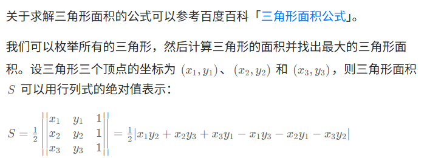

# 力扣每日一题打卡

- [ ] 812.最大三角形面积的高级解法？（数学）

# 困难

## [2197. 替换数组中的非互质数](https://leetcode.cn/problems/replace-non-coprime-numbers-in-array/)

维护一个栈，若栈为空则将当前数入栈，若不为空，判断与栈顶元素是否互质，若不互质则改为最大公约数，直到互质为止（再入栈）。最终答案是栈遍历顺序的逆序。

```java
class Solution {
    public List<Integer> replaceNonCoprimes(int[] nums) {
        LinkedList<Integer> res = new LinkedList<>();
        int gcdNum = 1;
        for(int i=0;i<nums.length;i++){
            int curNum = nums[i];
            while(!res.isEmpty()){
                gcdNum = gcd(res.getLast(),curNum);
                if(gcdNum == 1){
                    break;
                }else{
                    curNum = curNum / gcdNum * res.getLast();
                    res.removeLast();
                }
            }
            res.addLast(curNum);
        }
        return res;
    }

    private int gcd(int a,int b){
        if(a < b) return gcd(b,a);
        int c = a % b;
        while(c != 0){
            a = b;
            b = c;
            c = a % b;
        }
        return b;
    }
}
```


## [1912. 设计电影租借系统](https://leetcode.cn/problems/design-movie-rental-system/)

可从以下代码学习的点！

> 可以不会从零写……可以尝试删去方法的实现、看着数据结构来写方法
>
> 再进一步就是过段时间、shu'ju

- 有时候灵活一点，Map的key可能是通过两个来查找，比如本题的rent、drop方法需要通过shop、movie两个值来作为key查找！不要想着“那我就让shop”作为key好了，之后通过比较movie是否相等再确定……那时间复杂度就不是$O(1)$了，使用Map的意义何在？

- 而且上述用（shop，movie）作为key还有种巧妙的写法：

  ```java
  //由于shop和price都是int类型的，所以干脆用long来存这两个数据！也就是shop存在高32位、movie存在低32位
  //显然这个shopMovieToPrice的类型被设计为了——private final Map<Long, Integer>
  //这Long类型就非常设计得很好……
  shopMovieToPrice.put((long) shop << 32 | movie, price);
  ```

- 还有一些写法就是我不熟练的（包括数据结构的定义、API的使用、命名的规范xxxToxxx），都值得学习：
- `TreeSet`使我不常用的……有序集合

```java
// (shop, movie) -> price
    private final Map<Long, Integer> shopMovieToPrice = new HashMap<>();
// movie -> {(price, shop)}
    private final Map<Integer, TreeSet<int[]>> unrentedMovieToPriceShop = new HashMap<>();
// {(price, shop, movie)}
    private final TreeSet<int[]> rentedMovies = new TreeSet<>((a, b) -> {
        if (a[0] != b[0]) {
            return a[0] - b[0];
        }
        if (a[1] != b[1]) {
            return a[1] - b[1];
        }
        return a[2] - b[2];
    });
```


```java
class MovieRentingSystem {
    // (shop, movie) -> price
    private final Map<Long, Integer> shopMovieToPrice = new HashMap<>();

    // movie -> {(price, shop)}
    private final Map<Integer, TreeSet<int[]>> unrentedMovieToPriceShop = new HashMap<>();

    // {(price, shop, movie)}
    private final TreeSet<int[]> rentedMovies = new TreeSet<>((a, b) -> {
        if (a[0] != b[0]) {
            return a[0] - b[0];
        }
        if (a[1] != b[1]) {
            return a[1] - b[1];
        }
        return a[2] - b[2];
    });

    public MovieRentingSystem(int n, int[][] entries) {
        for (int[] e : entries) {
            int shop = e[0], movie = e[1], price = e[2];
            // 把 shop 和 movie 存储到一个 long 中，方便作为 HashMap 的 key
            shopMovieToPrice.put((long) shop << 32 | movie, price);
            unrentedMovieToPriceShop
                .computeIfAbsent(movie, key -> new TreeSet<>((a, b) -> a[0] != b[0] ? a[0] - b[0] : a[1] - b[1]))
                .add(new int[]{price, shop});
        }
    }

    // 获取 unrentedMovieToPriceShop[movie] 的前 5 个 shop
    public List<Integer> search(int movie) {
        if (!unrentedMovieToPriceShop.containsKey(movie)) {
            return List.of();
        }
        List<Integer> ans = new ArrayList<>(5); // 预分配空间
        for (int[] ps : unrentedMovieToPriceShop.get(movie)) {
            ans.add(ps[1]);
            if (ans.size() == 5) {
                break;
            }
        }
        return ans;
    }

    // 借电影
    public void rent(int shop, int movie) {
        int price = shopMovieToPrice.get((long) shop << 32 | movie);
        // 从 unrentedMovieToPriceShop 移到 rentedMovies
        unrentedMovieToPriceShop.get(movie).remove(new int[]{price, shop});
        rentedMovies.add(new int[]{price, shop, movie});
    }

    // 还电影
    public void drop(int shop, int movie) {
        int price = shopMovieToPrice.get((long) shop << 32 | movie);
        // 从 rentedMovies 移到 unrentedMovieToPriceShop
        rentedMovies.remove(new int[]{price, shop, movie});
        unrentedMovieToPriceShop.get(movie).add(new int[]{price, shop});
    }

    // 获取 rentedMovies 的前 5 个 shop 和 movie
    public List<List<Integer>> report() {
        List<List<Integer>> ans = new ArrayList<>(5); // 预分配空间
        for (int[] e : rentedMovies) {
            ans.add(List.of(e[1], e[2]));
            if (ans.size() == 5) {
                break;
            }
        }
        return ans;
    }
}

```

## [3003. 执行操作后的最大分割数量](https://leetcode.cn/problems/maximize-the-number-of-partitions-after-operations/)

```java
class Solution {
    public int maxPartitionsAfterOperations(String s, int k) {
        Map<Long,Integer> memo  = new HashMap<>();
        return dfs(0,0,0,memo,s.toCharArray(),k);
    }

    private int dfs(int i,int mask,int changed,Map<Long,Integer> memo,char[] s,int k){
        if(i == s.length){
            return 1;
        }

        //把参数压缩到一个long中，方便作为哈希表的key
        long args = (long) i<<32 | mask << 1 | changed;
        if(memo.containsKey(args)){
            return memo.get(args);
        }

        int res;
        //不改s[i]
        int bit = 1 << (s[i] - 'a');
        int newMask = mask | bit;
        if(Integer.bitCount(newMask) > k){
            //分割出一个子串，这个子串的最后一个字母在i-1
            //s[i]作为下一段的第一个字母，也就是bit作为下一段的mask的初始值
            res = dfs(i+1,bit,changed,memo,s,k)+1;
        }else{ //不分割
            res = dfs(i+1,newMask,changed,memo,s,k);
        }

        if(changed == 0){
            //枚举把s[i] 改成a,b,c...z
            for(int j=0;j<26;j++){
                newMask = mask | (1 << j);
                if(Integer.bitCount(newMask) > k){
                    res = Math.max(res,dfs(i+1,1<<j,1,memo,s,k)+1);
                }else{
                    res = Math.max(res,dfs(i+1,newMask,1,memo,s,k));
                }
            }
        }

        memo.put(args,res);
        return res;
    }
}
```

## [1526. 形成目标数组的子数组最少增加次数](https://leetcode.cn/problems/minimum-number-of-increments-on-subarrays-to-form-a-target-array/)

```java
class Solution {
    public int minNumberOperations(int[] target) {
        //题意解读：
        //需要 对区间同时加一个数
        //相当于差分数组，前+k，后-k
        //于是问题就转换为（全0的差分数组也全是0）将全0的差分数组转换为target数组的差分数组
        //又因为题目target[i]都>0，故最终得到的diff数组之和必定大于零
        //最终答案就是diff数组的正数之和
        int cnt = 0;
        cnt += target[0];
        int diff;
        for(int i=1;i<target.length;i++){
            diff = target[i] - target[i-1];
            if(diff > 0) cnt += diff;
        }
        return cnt;
    }
}
```

## [3321. 计算子数组的 x-sum II](https://leetcode.cn/problems/find-x-sum-of-all-k-long-subarrays-ii/)

> 通过这题，要掌握**对顶堆**

```java
class Solution {
    private final TreeSet<int[]> L = new TreeSet<>((a,b)->a[0] != b[0] ? a[0] - b[0] : a[1] - b[1]);
    private final TreeSet<int[]> R = new TreeSet<>(L.comparator());
    private final Map<Integer,Integer> cnt = new HashMap<>();
    private long sumL = 0;
    public long[] findXSum(int[] nums, int k, int x) {
        long[] ans = new long[nums.length - k + 1];
        for(int r = 0;r<nums.length;r++){
            //添加in
            int in = nums[r];
            del(in);
            cnt.merge(in,1,Integer::sum);
            add(in);

            int l = r + 1 - k;
            if(l < 0){
                continue;
            }

            //维护大小
            while(!R.isEmpty() && L.size() < x){
                r2l();
            }
            while(L.size() > x){
                l2r();
            }
            ans[l] = sumL;

            //移除out
            int out = nums[l];
            del(out);
            cnt.merge(out,-1,Integer::sum);
            add(out);
        }
        return ans;
    }

    //添加元素
    private void add(int val){
        int c = cnt.get(val);
        if(c == 0){
            return;
        }
        int[] p  = new int[]{c,val};
        if(!L.isEmpty() && L.comparator().compare(p,L.first()) > 0){
            sumL += (long) p[0] * p[1];
            L.add(p);
        }else{
            R.add(p);
        }
    }

    //删除元素
    private void del(int val){
        int c = cnt.getOrDefault(val,0);
        if(c == 0){
            return;
        }
        int[] p = new int[]{c,val};
        if(L.contains(p)){
            sumL -= (long) p[0] * p[1];
            L.remove(p);
        }else{
            R.remove(p);
        }
    }

    //从L移动一个元素到R
    private void l2r(){
        int[] p = L.pollFirst();
        sumL -= (long) p[0] * p[1];
        R.add(p);
    }

    //从R移动一个元素到L
    private void r2l(){
        int[] p = R.pollLast();
        sumL += (long) p[0] * p[1];
        L.add(p);
    }

}
```


# 中等

## [63. 不同路径 II](https://leetcode.cn/problems/unique-paths-ii/)

```java
class Solution {

    public int uniquePathsWithObstacles(int[][] obstacleGrid) {
        int[][] dp = new int[obstacleGrid.length][obstacleGrid[0].length];
        
        // 初始化第一列
        if (obstacleGrid[0][0] == 0) {//为了解决某个特例……
                dp[0][0] = 1;
        }
        for (int i = 1; i < obstacleGrid.length; i++) {
            if (obstacleGrid[i][0] == 1) {
                continue;
            } else {
                dp[i][0] = dp[i-1][0];
            }
        }
        // 初始化第一行
        for (int j = 1; j < obstacleGrid[0].length; j++) {
            if (obstacleGrid[0][j] == 1) {
                continue;
            } else {
                dp[0][j] = dp[0][j-1];
            }
        }

        for (int i = 1; i < obstacleGrid.length; i++) {
            for (int j = 1; j < obstacleGrid[i].length; j++) {

                if (obstacleGrid[i][j] == 1) {
                    continue;
                } else {
                    dp[i][j] = dp[i - 1][j] + dp[i][j - 1];
                }

            }
        }
        return dp[obstacleGrid.length - 1][obstacleGrid[0].length - 1];
    }

}
```

## [80. 删除有序数组中的重复项 II](https://leetcode.cn/problems/remove-duplicates-from-sorted-array-ii/)

- 思路：双指针……想到是很快，但是实际条件判断非常多，常常会出现“意外”的运行情况……然后发现按照自己的代码没有按照自己的想法在跑……或者说情况没考虑完全。
- 说明：我这里的i始终处在一个“随时准备被覆盖”的位置上，也就是执行`nums[i] = nums[j]`语句前世满足的。

```java
class Solution {
    public int removeDuplicates(int[] nums) {
        int cnt = 0;
        int i = 0, j = 0;// i是慢指针、j是快指针
        // 使用“滑动窗口”，j比i快
        while (j < nums.length) {
            int last_num = nums[j];
            int cnt_tmp = 0;
            // [1,1,1,2,2,3]
            // [0,0,1,1,1,1,2,3,3]
            // 直到找到不相同的
            // 要重新开始cnt_tmp的计数（从0开始）
            while (j < nums.length && nums[j] == last_num) {
                if (cnt_tmp < 2) {
                    nums[i] = nums[j];// 移动nums[j]的数到nums[i]上
                    i++;
                }
                cnt_tmp++;
                j++;
            }
            if (cnt_tmp > 2) {
                cnt += 2;
            } else {
                cnt += cnt_tmp;
            }

        }
        return cnt;
    }
}
```

## [2349. 设计数字容器系统](https://leetcode.cn/problems/design-a-number-container-system/)

法一：优先队列+惰性删除

> 强烈建议学习这种写法

```java
public class NumberContainers {
    private Map<Integer, Integer> nums = new HashMap<>();
    private Map<Integer, PriorityQueue<Integer>> heaps = new HashMap<>();

    public NumberContainers() {
    }

    public void change(int index, int number) {
        nums.put(index,number);
        heaps.computeIfAbsent(number,k->new PriorityQueue<>()).add(index);
    }

    public int find(int number) {
        PriorityQueue<Integer> heap = heaps.get(number);
        if(heap == null) return -1;
        while(!heap.isEmpty() && !nums.get(heap.peek()).equals(number)){
            heap.poll();
        }
        return heap.isEmpty()?-1:heap.peek();
    }
}


```


法二：哈希表+ 哈希表和有序集合

```java
public class NumberContainers {
    private Map<Integer, Integer> nums;
    private Map<Integer, TreeSet<Integer>> us;

    public NumberContainers() {
        nums = new HashMap<>();
        us = new HashMap<>();
    }

    public void change(int index, int number) {
        int prev = nums.getOrDefault(index, 0);
        if (prev != 0) {
            TreeSet<Integer> set = us.get(prev);
            if (set != null) {
                set.remove(index);
            }
        }
        us.computeIfAbsent(number, k -> new TreeSet<>()).add(index);
        nums.put(index, number);
    }

    public int find(int number) {
        TreeSet<Integer> set = us.get(number);
        if (set == null || set.isEmpty()) {
            return -1;
        }
        return set.first();
    }
}


```

## [3408. 设计任务管理器](https://leetcode.cn/problems/design-task-manager/)

思路：HashMap（key值为taskId）+PriorityQueue（根据priority降序、taskId降序）惰性删除

惰性删除代码见`execTop()`方法、`edit()`方法

在`edit()`中，只更新HashMap中的数据，这里为真实数据，对于PriorityQueue中的数据不修改、只新增

在`execTop()`中，得到最高优先级任务后，判断是否为真实数据，若是则返回，否则继续查找（没有则返回-1）

```java
class TaskManager {
    PriorityQueue<List<Integer>> pq;
    HashMap<Integer,List<Integer>> missions;
    public TaskManager(List<List<Integer>> tasks) {
        pq = new PriorityQueue<>((a,b)->{
            return a.get(2).equals(b.get(2)) ? Integer.compare(b.get(1),a.get(1)) : Integer.compare(b.get(2),a.get(2));
        });
        missions = new HashMap<>();
        for(List<Integer> task : tasks){
            List<Integer> tmp = new LinkedList<>();
            tmp.add(task.get(0));
            tmp.add(task.get(2));
            missions.put(task.get(1),tmp);
            tmp = new LinkedList<>();
            tmp.add(task.get(0));tmp.add(task.get(1));tmp.add(task.get(2));
            pq.add(tmp);
        }
    }
    
    public void add(int userId, int taskId, int priority) {
        LinkedList<Integer> tmp = new LinkedList<>();
        tmp.add(userId);
        tmp.add(priority);
        missions.put(taskId,tmp);
        tmp = new LinkedList<>();
        tmp.add(userId);tmp.add(taskId);tmp.add(priority);
        pq.add(tmp);
    }
    
    public void edit(int taskId, int newPriority) {
        List<Integer> mission = missions.get(taskId);
        mission.set(1,newPriority);
        List<Integer> tmp = new LinkedList<>();
        tmp.add(mission.get(0));
        tmp.add(taskId);
        tmp.add(newPriority);
        pq.add(tmp);
    }
    
    public void rmv(int taskId) {
        missions.remove(taskId);
    }
    
    public int execTop() {
        if(pq.isEmpty()) return -1;
        while(!pq.isEmpty()){
            List<Integer> task = pq.poll();
            if(missions.containsKey(task.get(1))){
                List<Integer> mission = missions.get(task.get(1));
                if(mission.get(0).equals(task.get(0)) && mission.get(1).equals(task.get(2))){
                    missions.remove(task.get(1));
                    return mission.get(0);
                }
            }
        }
        return -1;
    }
}

/**
 * Your TaskManager object will be instantiated and called as such:
 * TaskManager obj = new TaskManager(tasks);
 * obj.add(userId,taskId,priority);
 * obj.edit(taskId,newPriority);
 * obj.rmv(taskId);
 * int param_4 = obj.execTop();
 */
```

## [3484. 设计电子表格](https://leetcode.cn/problems/design-spreadsheet/)

> 这种写法只是为了帮助我熟悉一下ArrayList的API使用

```java
class Spreadsheet {
    ArrayList<ArrayList<Integer>> sheet;
    public Spreadsheet(int rows) {
        sheet = new ArrayList<>(rows);
        for (int i = 0; i < rows; i++) {
        ArrayList<Integer> row = new ArrayList<>(26);
        for (int j = 0; j < 26; j++) {
            row.add(0); // 初始化每个格子为0
        }
        sheet.add(row);
    }
    }
    
    public void setCell(String cell, int value) {
        int c = cell.charAt(0) - 'A';
        int r = 0;
        for(int i = 1;i<cell.length();i++){
            r = r*10 + cell.charAt(i)-'0';
        }
        sheet.get(r-1).set(c,value);
    }
    
    public void resetCell(String cell) {
        setCell(cell,0);
    }
    
    public int getValue(String formula) {
        int idx = formula.indexOf("+");
        String s1 = formula.substring(1,idx);
        String s2 = formula.substring(idx+1);
        int num1 = getNum(s1);
        int num2 = getNum(s2);
        return num1+num2;
    }

    private int getNum(String s){
        int num = 0;
        if(s.charAt(0) >= 'A' && s.charAt(0) <= 'Z'){
            int c = s.charAt(0) - 'A';
            int r = 0;
            for(int i = 1;i<s.length();i++){
                r = r*10 + s.charAt(i)-'0';
            }
            num = sheet.get(r-1).get(c);
        }else{
            for(int i = 0;i<s.length();i++){
                num = num*10 + s.charAt(i)-'0';
            }
        }
        return num;
    }
}

/**
 * Your Spreadsheet object will be instantiated and called as such:
 * Spreadsheet obj = new Spreadsheet(rows);
 * obj.setCell(cell,value);
 * obj.resetCell(cell);
 * int param_3 = obj.getValue(formula);
 */
```

真要提高性能直接空间换时间使用`int[][]`……额实测好像性能也差不多，那还是用ArrayList吧

```java
class Spreadsheet {
    int[][] sheet = new int[1010][26];
    public Spreadsheet(int rows) {
    }
    
    public void setCell(String cell, int value) {
        int c = cell.charAt(0) - 'A';
        int r = 0;
        for(int i = 1;i<cell.length();i++){
            r = r*10 + cell.charAt(i)-'0';
        }
        sheet[r-1][c] = value;
    }
    
    public void resetCell(String cell) {
        setCell(cell,0);
    }
    
    public int getValue(String formula) {
        int idx = formula.indexOf("+");
        String s1 = formula.substring(1,idx);
        String s2 = formula.substring(idx+1);
        int num1 = getNum(s1);
        int num2 = getNum(s2);
        return num1+num2;
    }

    private int getNum(String s){
        int num = 0;
        if(s.charAt(0) >= 'A' && s.charAt(0) <= 'Z'){
            int c = s.charAt(0) - 'A';
            int r = 0;
            for(int i = 1;i<s.length();i++){
                r = r*10 + s.charAt(i)-'0';
            }
            num = sheet[r-1][c];
        }else{
            for(int i = 0;i<s.length();i++){
                num = num*10 + s.charAt(i)-'0';
            }
        }
        return num;
    }
}

/**
 * Your Spreadsheet object will be instantiated and called as such:
 * Spreadsheet obj = new Spreadsheet(rows);
 * obj.setCell(cell,value);
 * obj.resetCell(cell);
 * int param_3 = obj.getValue(formula);
 */
```

## [3508. 设计路由器](https://leetcode.cn/problems/implement-router/)

> 好难的题……初见这种难度的

```java
class Router {
    private record Packet(int source, int destination, int timestamp) {
    }

    private record Pair(List<Integer> timestamps, int head) {
    }

    private final int memoryLimit;
    private final Queue<Packet> packetQ = new ArrayDeque<>(); // Packet 队列
    private final Set<Packet> packetSet = new HashSet<>(); // Packet 集合
    private final Map<Integer, Pair> destToTimestamps = new HashMap<>(); // destination -> ([timestamp], head)

    public Router(int memoryLimit) {
        this.memoryLimit = memoryLimit;
    }

    public boolean addPacket(int source, int destination, int timestamp) {
        Packet packet = new Packet(source, destination, timestamp);
        if (!packetSet.add(packet)) { // packet 在 packetSet 中
            return false;
        }
        if (packetQ.size() == memoryLimit) { // 太多了
            forwardPacket();
        }
        packetQ.add(packet); // 入队
        destToTimestamps.computeIfAbsent(destination, k -> new Pair(new ArrayList<>(), 0)).timestamps.add(timestamp);
        return true;
    }

    public int[] forwardPacket() {
        if (packetQ.isEmpty()) {
            return new int[]{};
        }
        Packet packet = packetQ.poll(); // 出队
        packetSet.remove(packet);
        destToTimestamps.compute(packet.destination, (k, p) -> new Pair(p.timestamps, p.head + 1)); // 队首下标加一，模拟出队
        return new int[]{packet.source, packet.destination, packet.timestamp};
    }

    public int getCount(int destination, int startTime, int endTime) {
        Pair p = destToTimestamps.get(destination);
        if (p == null) {
            return 0;
        }
        int left = lowerBound(p.timestamps, startTime, p.head - 1);
        int right = lowerBound(p.timestamps, endTime + 1, p.head - 1);
        return right - left;
    }

    // https://www.bilibili.com/video/BV1AP41137w7/
    // 二分查找
    private int lowerBound(List<Integer> nums, int target, int left) {
        int right = nums.size();
        while (left + 1 < right) {
            int mid = left + (right - left) / 2;
            if (nums.get(mid) >= target) {
                right = mid;
            } else {
                left = mid;
            }
        }
        return right;
    }
}
```

## [165. 比较版本号](https://leetcode.cn/problems/compare-version-numbers/)

```java
class Solution {
    public int compareVersion(String version1, String version2) {
        int[] v1 = toIntArrayVersion(version1);
        int[] v2 = toIntArrayVersion(version2);
        int idx1 = 0,idx2 = 0;
        while(idx1 < v1.length && idx2 < v2.length){
            if(v1[idx1] != v2[idx2]) return Integer.compare(v1[idx1],v2[idx2]);
            idx1++;
            idx2++;
        }
        while(idx1 < v1.length){
            if(v1[idx1] != 0) return 1;
            idx1++;
        }
        while(idx2 < v2.length){
            if(v2[idx2] != 0) return -1;
            idx2++;
        }l
        return 0;
    }

    private int[] toIntArrayVersion(String version){
        char[] v = version.toCharArray();
        int idx = 0;
        int num = 0;
        List<Integer> res = new LinkedList<>();
        while(idx < v.length){
            while(idx < v.length && v[idx] == '0') idx++;
            num = 0;
            while(idx < v.length && v[idx] != '.'){
                num = num*10 + v[idx]-'0';
                idx++;
            }
            res.add(num);
            idx++;
        }
        return res.stream().mapToInt(i -> i).toArray();
    }
}
```

库函数写法

`str.split()`、`Integer.parseInt()`

```java
class Solution {
    public int compareVersion(String version1, String version2) {
        String[] a = version1.split("\\.");
        String[] b = version2.split("\\.");
        int n = a.length;
        int m = b.length;
        for (int i = 0; i < n || i < m; i++) {
            int ver1 = i < n ? Integer.parseInt(a[i]) : 0;
            int ver2 = i < m ? Integer.parseInt(b[i]) : 0;
            if (ver1 != ver2) {
                return ver1 < ver2 ? -1 : 1;
            }
        }
        return 0;
    }
}

```

## [166. 分数到小数](https://leetcode.cn/problems/fraction-to-recurring-decimal/)

### 自己写的糟糕代码

```java
class Solution {
    public String fractionToDecimal(int numerator, int denominator) {
        List<Long> ans = new ArrayList<>();
        boolean negative = false;//最终结果为负
        if((numerator < 0 || denominator < 0) && !(numerator < 0 && denominator < 0)) {
            negative =true;
        }
        long dividend = Math.abs((long)numerator);
        long divisor = Math.abs((long)denominator);
        
        HashMap<Long,Integer> remains = new HashMap<>();//记录出现过的(余数,位置)
        boolean isLoop = false;
        int loopIndex = -1;
        for(int index = 0;;index++){
            ans.add(dividend / divisor);//商
            dividend %= divisor;//余数
            if(dividend == 0) break;
            if(remains.containsKey(dividend)) {
                isLoop = true;
                loopIndex = remains.get(dividend);
                break;
            }
            remains.put(dividend,index);
            dividend *= 10;
        }
        StringBuilder sb = new StringBuilder();
        sb.append(ans.get(0));
        if(ans.size() == 1) {
            if(negative && ans.get(0) != 0) sb.insert(0,"-");
            return sb.toString();
        }
        sb.append(".");
        for(int i=1;i<ans.size();i++){
            sb.append(ans.get(i));
        }
        if(isLoop){
            int dotIndex = sb.indexOf(".");
            sb.insert(dotIndex+1+loopIndex,"(");
            sb.append(")");
        }
        if(negative) sb.insert(0,"-");
        return sb.toString();
    }
}
```

### 优化版：长除法

```java
class Solution {
    public String fractionToDecimal(int numerator, int denominator) {
        if(numerator == 0) return "0";
        StringBuilder sb = new StringBuilder();
        if((numerator < 0) ^ (denominator < 0)) sb.append("-");
        long dividend = Math.abs((long)numerator);
        long divisor = Math.abs((long) denominator);

        //整数
        sb.append(dividend / divisor);
        long remainder = dividend % divisor;
        if(remainder == 0) return sb.toString();

        
        sb.append('.');
        //小数部分
        Map<Long,Integer> map = new HashMap<>();
        while(remainder != 0){
            if(map.containsKey(remainder)){
                sb.insert(map.get(remainder),"(");
                sb.append(")");
                break;
            }
            map.put(remainder,sb.length());
            remainder *= 10;
            sb.append(remainder / divisor);
            remainder %= divisor;
        }
        return sb.toString();
    }
}
```

## [120. 三角形最小路径和](https://leetcode.cn/problems/triangle/)

```java
class Solution {
    public int minimumTotal(List<List<Integer>> triangle) {
        int[] dp = new int[triangle.size()];
        for(int i=0;i<triangle.size();i++){
            for(int j=triangle.get(i).size()-1;j>=0;j--){
                if(j == 0) dp[j] += triangle.get(i).get(j);
                else if(j == triangle.get(i).size()-1) dp[j] = dp[j-1] + triangle.get(i).get(j);
                else dp[j] = Math.min(dp[j],dp[j-1]) + triangle.get(i).get(j);
            }
        }
        int res = Integer.MAX_VALUE;
        for(int i=0;i<triangle.size();i++) res = Math.min(res,dp[i]);
        return res;
    }
}
```

## [611. 有效三角形的个数](https://leetcode.cn/problems/valid-triangle-number/)

### 三重循环暴力搜索

```java
class Solution {
    public int triangleNumber(int[] nums) {
        Arrays.sort(nums);
        int n = nums.length;
        int ans = 0;
        for(int i=0;i<n-2;i++){
            for(int j=i+1;j<n-1;j++){
                for(int k=j+1;k<n;k++){
                    if(nums[i] + nums[j] > nums[k]) ans++;
                    else break;
                }
            }
        }
        return ans;
    }
}
```

### 枚举最长边+相向双指针

```java
class Solution {
    public int triangleNumber(int[] nums) {
        Arrays.sort(nums);
        int n = nums.length;
        int ans = 0;
        for(int k=2;k<n;k++){
            int c = nums[k];
            int i = 0;
            int j = k-1;
            while(i<j){
                if(nums[i] + nums[j] > c){
                    ans += j-i;//i从i到j-1个都可以满足
                    j--;
                }else{
                    i++;
                }
            }
        }
        return ans;
    }
}
```

### 对上述的优化

> 见灵神题解

```java
class Solution {
    public int triangleNumber(int[] nums) {
        Arrays.sort(nums);
        int ans = 0;
        //改为倒序遍历k
        for (int k = nums.length - 1; k > 1; k--) {
            int c = nums[k];
            if (nums[0] + nums[1] > c) { // 优化一
                ans += (k + 1) * k * (k - 1) / 6;
                break;
            }
            if (nums[k - 2] + nums[k - 1] <= c) { // 优化二
                continue;
            }
            int i = 0; // a=nums[i]
            int j = k - 1; // b=nums[j]
            while (i < j) {
                if (nums[i] + nums[j] > c) {
                    ans += j - i;
                    j--;
                } else {
                    i++;
                }
            }
        }
        return ans;
    }
}
```

## [1039. 多边形三角剖分的最低得分](https://leetcode.cn/problems/minimum-score-triangulation-of-polygon/)

### 法1：记忆化搜索

```java
class Solution {
    public int minScoreTriangulation(int[] values) {
        int n = values.length;
        int[][] memo = new int[n][n];
        for(int[] row : memo){
            Arrays.fill(row,-1);//-1表示没计算过
        }
        return dfs(0,n-1,values,memo);
    }
    private int dfs(int i,int j,int[] v,int[][] memo){
        if(i+1 == j) return 0;
        if(memo[i][j] != -1) return memo[i][j];
        int res = Integer.MAX_VALUE;
        for(int k=i+1;k<j;k++){
            int subRes = dfs(i,k,v,memo) + dfs(k,j,v,memo) + v[i] * v[j] * v[k];
            res = Math.min(res,subRes);
        }
        return memo[i][j] = res;//记忆化
    }
}
```

### 法2：递推

```java
class Solution {
    public int minScoreTriangulation(int[] v) {
        int n = v.length;
        int[][] f = new int[n][n];
        for (int i = n - 3; i >= 0; i--) {
            for (int j = i + 2; j < n; j++) {
                f[i][j] = Integer.MAX_VALUE;
                for (int k = i + 1; k < j; k++) {
                    f[i][j] = Math.min(f[i][j], f[i][k] + f[k][j] + v[i] * v[j] * v[k]);
                }
            }
        }
        return f[0][n - 1];
    }
}
```

## [2221. 数组的三角和](https://leetcode.cn/problems/find-triangular-sum-of-an-array/)

```java
class Solution {
    public int triangularSum(int[] nums) {
        int n = nums.length;
        for(int t=n-1;t>0;t--){
            for(int i=0;i<t;i++){
                nums[i] = (nums[i] + nums[i+1])%10;
            }
        }
        return nums[0];
    }
}
```

## [3494. 酿造药水需要的最少总时间](https://leetcode.cn/problems/find-the-minimum-amount-of-time-to-brew-potions/)

```java
class Solution {
    public long minTime(int[] skill, int[] mana) {
        int n = skill.length;
        long[] lastFinish = new long[n];
        for(int m : mana){
            long sumT = 0;
            for(int i=0;i<n;i++){
                sumT = Math.max(sumT,lastFinish[i]) + skill[i]*m;
            }
            lastFinish[n-1] = sumT;
            for(int i=n-2;i>=0;i--){
                lastFinish[i] = lastFinish[i+1] - skill[i+1] * m;
            }
        }
        return lastFinish[n-1];
    }
}
```

## [3147. 从魔法师身上吸取的最大能量](https://leetcode.cn/problems/taking-maximum-energy-from-the-mystic-dungeon/)

```java
class Solution {
    public int maximumEnergy(int[] energy, int k) {
        int res = Integer.MIN_VALUE;
        int n = energy.length;
        int[] sum = new int[k];
        for(int i=n-1,j=-1;i>=0;i--){
            j = (j+1) % k;
            sum[j] = sum[j] + energy[i];
            res = Math.max(res,sum[j]);
        }
        return res;
    }
}
```

## [3186. 施咒的最大总伤害](https://leetcode.cn/problems/maximum-total-damage-with-spell-casting/)

```java
class Solution {
    public long maximumTotalDamage(int[] power) {
        Map<Integer, Integer> cnt = new HashMap<>();
        for (int x : power) {
            cnt.merge(x, 1, Integer::sum);
        }

        int n = cnt.size();
        int[] a = new int[n];
        int k = 0;
        for (int x : cnt.keySet()) {
            a[k++] = x;
        }
        Arrays.sort(a);

        long[] memo = new long[n];
        Arrays.fill(memo, -1);
        return dfs(a,cnt,memo,n-1);
    }

    private long dfs(int[] a, Map<Integer, Integer> cnt, long[] memo, int i) {
        if (i < 0) {
            return 0;
        }
        if (memo[i] != -1) {
            return memo[i];
        }
        int x = a[i];
        int j = i;
        while (j > 0 && a[j - 1] >= x - 2) {
            j--;
        }
        return memo[i] = Math.max(dfs(a, cnt, memo, i - 1), dfs(a, cnt, memo, j - 1) + (long) x * cnt.get(x));
    }
}
```

## [3350. 检测相邻递增子数组 II](https://leetcode.cn/problems/adjacent-increasing-subarrays-detection-ii/)

```java
class Solution {
    public int maxIncreasingSubarrays(List<Integer> nums) {
        int ans = 0;
        int preCnt = 0;
        int cnt = 0;
        for(int i=0;i<nums.size();i++){
            cnt++;
            //nums[i]是严格递增段的末尾
            if(i == nums.size()-1 || nums.get(i) >= nums.get(i+1)){
                ans = Math.max(ans,Math.max(cnt / 2,Math.min(cnt,preCnt)));
                preCnt = cnt;
                cnt = 0;
            }
        }
        return ans;
    }
}
```

## [3397. 执行操作后不同元素的最大数量](https://leetcode.cn/problems/maximum-number-of-distinct-elements-after-operations/)

```java
class Solution {
    public int maxDistinctElements(int[] nums, int k) {
        int n = nums.length;
        if (k * 2 + 1 >= n) {
            return n;
        }

        Arrays.sort(nums);
        int ans = 0;
        int pre = Integer.MIN_VALUE;
        for (int x : nums) {
            x = Math.min(Math.max(x - k, pre + 1), x + k);
            if (x > pre) {
                ans++;
                pre = x;
            }
        }
        return ans;
    }
}
```

## [2125. 银行中的激光束数量](https://leetcode.cn/problems/number-of-laser-beams-in-a-bank/)

```java
class Solution {
    public int numberOfBeams(String[] bank) {
        int ans = 0;

        int pre = 0;
        for(String s : bank){
            int n = s.length();
            int cur = 0;
            for(int i=0;i<n;i++){
                if(s.charAt(i) == '1') cur++;
            }
            ans += pre * cur;
            if(cur != 0) pre = cur;
        }
        return ans;
    }
}
```

## [3217. 从链表中移除在数组中存在的节点](https://leetcode.cn/problems/delete-nodes-from-linked-list-present-in-array/)

```java
class Solution {
    public ListNode modifiedList(int[] nums, ListNode head) {
        Set<Integer> set = new HashSet<>();
        for(int num : nums){
            set.add(num);
        }
        ListNode dummy = new ListNode();
        ListNode prev = dummy;
        ListNode cur = head;
        while(cur != null){
            if(set.contains(cur.val)){
                prev.next = cur.next;
            }else{
                prev.next = cur;
                prev = cur;
            }
            cur = cur.next;
        }
        return dummy.next;
    }
}
```

## [2257. 统计网格图中没有被保卫的格子数](https://leetcode.cn/problems/count-unguarded-cells-in-the-grid/)

```java
class Solution {
    public int countUnguarded(int m, int n, int[][] guards, int[][] walls) {
        int res = m * n;
        int[][] map = new int[m][n];
        for(int[] wall : walls){
            map[wall[0]][wall[1]] = 1;//初始化墙
            res--;
        }
        int[][] dt = new int[][]{{0,1},{0,-1},{1,0},{-1,0}};
        for(int[] guard : guards){
            map[guard[0]][guard[1]] = 2;//初始化守卫
            res--;
        }
        for(int[] guard : guards){
            int x = guard[0];
            int y = guard[1];
            for(int i=0;i<4;i++){
                int nx = x + dt[i][0];
                int ny = y + dt[i][1];
                while(nx >= 0 && nx < m && ny >= 0 && ny < n){
                    //视野被挡
                    if(map[nx][ny] == 1 || map[nx][ny] == 2) break;
                    else if(map[nx][ny] == 0){
                        res--;
                        map[nx][ny] = 3;//新增守卫区
                    }
                    nx += dt[i][0];
                    ny += dt[i][1];
                }
            }
        }
        return res;
    }
}
```

## [1578. 使绳子变成彩色的最短时间](https://leetcode.cn/problems/minimum-time-to-make-rope-colorful/)

```java
class Solution {
    public int maxProfit(int[] prices) {
        int minPrice = Integer.MAX_VALUE;
        int ans = 0;
        for(int price : prices){
            minPrice = Math.min(minPrice,price);
            ans = Math.max(ans,price - minPrice);
        }
        return ans;
    }
}
```


# 简单

## [3110. 字符串的分数](https://leetcode.cn/problems/score-of-a-string/)

```java
class Solution {
    public int scoreOfString(String s) {
        int res = 0;
        for(int i=0;i<s.length()-1;i++){
            res += Math.abs((int)(s.charAt(i)-s.charAt(i+1)));
        }
        return res;
    }
}
```

## [2255. 统计是给定字符串前缀的字符串数目](https://leetcode.cn/problems/count-prefixes-of-a-given-string/)

```java
class Solution {
    public int countPrefixes(String[] words, String s) {
        int cnt = 0;
        for(String word : words){
            if(s.startsWith(word)) cnt++;
        }
        return cnt;
    }
}
```

## [1935. 可以输入的最大单词数](https://leetcode.cn/problems/maximum-number-of-words-you-can-type/)

```java
class Solution {
    public int canBeTypedWords(String text, String brokenLetters) {
        // O(N^2)
        int res = 0;
        boolean canBeType = true;
        for(int i=0;i<text.length();i++){
            if(text.charAt(i) == ' '){
                if(canBeType) res++;
                else canBeType = true;
            }

            for(int j=0;j<brokenLetters.length();j++){
                if(text.charAt(i) == brokenLetters.charAt(j)){
                    canBeType = false;
                }
            }
        }
        return canBeType ? res+1 : res;
    }
}
```

```java
//哈希优化
class Solution {
    public int canBeTypedWords(String text, String brokenLetters) {
        Set<Character> broken = new HashSet<>();
        for(char ch : brokenLetters.toCharArray()){
            broken.add(ch);
        }

        int res = 0;
        boolean canBeType = true;
        for(char ch : text.toCharArray()){
            if(ch == ' '){
                if(canBeType) ++res;
                canBeType = true;
            }
            if(broken.contains(ch)) canBeType = false;
        }
        return canBeType ? res+1 : res;
    }
}
```

```java
//数组哈希
class Solution {
    public int canBeTypedWords(String text, String brokenLetters) {
        boolean[] broken = new boolean[26];
        for(char ch : brokenLetters.toCharArray()){
            broken[ch-'a'] = true;
        }

        int res = 0;
        boolean flag = true;
        for(char ch : text.toCharArray()){
            if(ch == ' '){
                if(flag) ++res;
                flag = true;
            }
            else if(broken[ch-'a']) flag = false;
        }
        return flag ? res+1 : res;
    }
}
```

## [3005. 最大频率元素计数](https://leetcode.cn/problems/count-elements-with-maximum-frequency/)

```java
class Solution {
    public int maxFrequencyElements(int[] nums) {
        int maxFrequency = 0;
        int sum = 0;
        HashMap<Integer,Integer> numToFrequency = new HashMap<>();
        for(int num : nums){
            numToFrequency.merge(num,1,Integer::sum);
            if(numToFrequency.get(num) > maxFrequency){
                maxFrequency = numToFrequency.get(num);
                sum = 1;
            }else if(numToFrequency.get(num) == maxFrequency){
                sum++;
            }
        }
        return sum*maxFrequency;
    }
}
```

## [812. 最大三角形面积](https://leetcode.cn/problems/largest-triangle-area/)

### 法1：枚举



```java
class Solution {
    public double largestTriangleArea(int[][] points) {
        double ans = 0;
        int n = points.length;
        for(int i=0;i<n;i++){
            for(int j=i+1;j<n;j++){
                for(int k=j+1;k<n;k++){
                    double square = 0.5 * Math.abs(points[i][0]*points[j][1] + points[j][0]*points[k][1] + points[k][0]*points[i][1] - points[i][0]*points[k][1] - points[j][0]*points[i][1] - points[k][0]*points[j][1]);
                    ans = Math.max(ans,square);
                }
            }
        }
        return ans;
    }
}
```

### 法2：凸包+旋转卡壳（难……见灵神题解……暂时看不懂）

## [976. 三角形的最大周长](https://leetcode.cn/problems/largest-perimeter-triangle/)

```java
class Solution {
    public int largestPerimeter(int[] nums) {
        //排序+枚举最长边（贪心）
        Arrays.sort(nums);
        int n = nums.length;
        for(int i=n-1;i>=2;i--){
            if(nums[i-2]+nums[i-1]>nums[i]) return nums[i-2]+nums[i-1]+nums[i];
        }
        return 0;
    }
}
```

## [2273. 移除字母异位词后的结果数组](https://leetcode.cn/problems/find-resultant-array-after-removing-anagrams/)

```java
class Solution {
    public List<String> removeAnagrams(String[] words) {
        List<String> res = new LinkedList<>();
        int[] cnt = new int[26];
        char[] w = words[0].toCharArray();
        for(int i=0;i<w.length;i++){
            cnt[w[i] - 'a']++;
        }
        res.add(new String(w));
        for(String word : words){
            w = word.toCharArray();
            int[] curCnt = new int[26];
            boolean isSimilar = true;
            for(int i=0;i<w.length;i++){
                int idx = w[i] - 'a';
                curCnt[idx]++;
            }
            for(int i=0;i<26;i++){
                if(curCnt[i] != cnt[i]){
                    isSimilar = false;
                    break;
                }
            }
            if(!isSimilar){
                cnt = curCnt;
                res.add(word);
            }
        }
        return res;
    }
}
```

## [2011. 执行操作后的变量值](https://leetcode.cn/problems/final-value-of-variable-after-performing-operations/)

```java
class Solution {
    public int finalValueAfterOperations(String[] operations) {
        int x = 0;
        for(String op : operations){
            if(op.charAt(1) == '+'){
                x++;
            }else{
                x--;
            }
        }
        return x;
    }
}
```

## [3354. 使数组元素等于零](https://leetcode.cn/problems/make-array-elements-equal-to-zero/)

```java
class Solution {
    public int countValidSelections(int[] nums) {
        int res = 0;
        int n = nums.length;
        int[] pre = new int[n + 1];
        for (int i = 0; i < n; i++)
            pre[i + 1] = pre[i] + nums[i];
        int sum = pre[n];//奇数或偶数（偶数每次+2、奇数+1）
        for (int i = 0; i < n; i++) {
            if (pre[i + 1] > sum / 2 + 1)
                break;
            if (nums[i] == 0) {
                if (sum % 2 == 0 && pre[i + 1] == sum / 2)
                    res += 2;
                else if (sum % 2 == 1 && (pre[i + 1] == sum / 2 || pre[i + 1] == sum / 2 + 1))
                    res += 1;
            }
        }
        return res;
    }
}
```

## [3289. 数字小镇中的捣蛋鬼](https://leetcode.cn/problems/the-two-sneaky-numbers-of-digitville/)

```java
class Solution {
    public int[] getSneakyNumbers(int[] nums) {
        int n = nums.length - 2;
        boolean[] d = new boolean[n+1];
        int[] res = new int[2];
        int k = 0;
        for(int num : nums){
            if(d[num]) res[k++] = num;
            d[num] = true;
        }
        return res;
    }
}
```

## [3318. 计算子数组的 x-sum I](https://leetcode.cn/problems/find-x-sum-of-all-k-long-subarrays-i/)

> 对顶堆（这题其实很难……）

```java
class Solution {
    private final TreeSet<int[]> L = new TreeSet<>((a,b)->a[0] != b[0] ? a[0] - b[0] : a[1] - b[1]);
    private final TreeSet<int[]> R = new TreeSet<>(L.comparator());
    private final Map<Integer,Integer> cnt = new HashMap<>();
    private int sumL = 0;
    public int[] findXSum(int[] nums, int k, int x) {
        int[] ans = new int[nums.length - k + 1];
        for(int r = 0;r<nums.length;r++){
            //加入右边元素in
            int in = nums[r];
            del(in);
            cnt.merge(in,1,Integer::sum);
            add(in);

            int l = r + 1 - k;
            if(l<0) continue;

            //维护大小
            while(!R.isEmpty() && L.size() < x){
                r2l();
            }
            while(L.size() > x){
                l2r();
            }
            ans[l] = sumL;

            //删除左边元素out
            int out = nums[l];
            del(out);
            cnt.merge(out,-1,Integer::sum);
            add(out);
        }
        return ans;
    }

    //添加元素
    private void add(int val){
        int c = cnt.get(val);
        if(c == 0) return;
        int[] p = new int[]{c,val};
        if(!L.isEmpty() && L.comparator().compare(p,L.first()) > 0){
            sumL += p[0] * p[1];
            L.add(p);
        }else{
            R.add(p);
        }
    }

    //删除元素
    private void del(int val){
        int c = cnt.getOrDefault(val,0);
        if(c == 0) return;
        int[] p = new int[]{c,val};
        if(L.contains(p)){
            sumL -= p[0] * p[1];
            L.remove(p);
        }else{
            R.remove(p);
        }
    }

    private void l2r(){
        int[] p = L.pollFirst();
        sumL -= p[0] * p[1];
        R.add(p);
    }

    private void r2l(){
        int[] p = R.pollLast();
        sumL += p[0] * p[1];
        L.add(p);
    }
}
```

